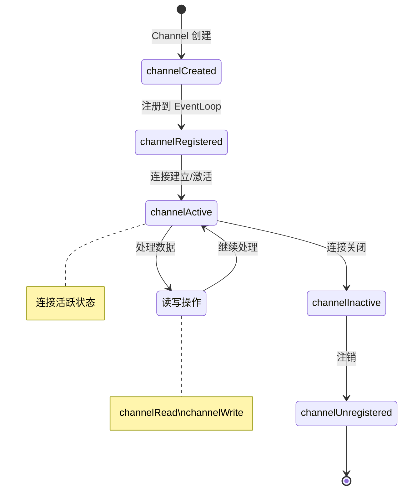
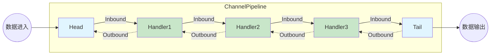

# 核心组件详解

## Channel

Channel 是 Netty 的核心抽象，代表到实体的逻辑连接。

### Channel 的生命周期



> [!NOTE]
> **生命周期说明:**
>
> - `channelRegistered` - Channel 与 EventLoop 绑定
> - `channelActive` - 连接建立,可以开始读写
> - `channelInactive` - 连接断开,不再处理数据
> - `channelUnregistered` - 从 EventLoop 注销

### 常用 Channel 类型

| Channel 类型 | 说明 |
|-------------|------|
| **NioServerSocketChannel** | 服务器 ServerSocket 通道 |
| **NioSocketChannel** | 客户端 Socket 通道 |
| **NioDatagramChannel** | UDP 数据报通道 |
| **NioSctpServerChannel** | SCTP 服务器通道 |
| **NioSctpChannel** | SCTP 通道 |
| **OioServerSocketChannel** | 阻塞 I/O 服务器通道 |

### Channel 操作示例

```java
// 写入数据
ChannelFuture future = ctx.writeAndFlush(msg);
future.addListener(f -> {
    if (f.isSuccess()) {
        System.out.println("数据写入成功");
    }
});

// 关闭 Channel
ctx.close();

// 获取 Channel 属性
Channel channel = ctx.channel();
InetSocketAddress remote = (InetSocketAddress) channel.remoteAddress();
InetSocketAddress local = (InetSocketAddress) channel.localAddress();
System.out.println("Local: " + local + ", Remote: " + remote);

// 检查 Channel 状态
if (channel.isActive()) {
    System.out.println("Channel 活跃");
}
if (channel.isOpen()) {
    System.out.println("Channel 开放");
}
if (channel.isWritable()) {
    System.out.println("Channel 可写");
}

// 保存自定义数据
channel.attr(AttributeKey.valueOf("userId")).set(12345);
Integer userId = (Integer) channel.attr(AttributeKey.valueOf("userId")).get();
```

## EventLoop

EventLoop 是单线程化的 I/O 处理线程，负责处理连接的所有 I/O 操作。

### EventLoopGroup

```java
// NIO 事件循环组
EventLoopGroup bossGroup = new NioEventLoopGroup(1);
EventLoopGroup workerGroup = new NioEventLoopGroup();

// OIO 事件循环组（不推荐）
EventLoopGroup group = new OioEventLoopGroup();

// 优雅关闭
bossGroup.shutdownGracefully();
workerGroup.shutdownGracefully();
```

### EventLoop 的职责

```
EventLoop 线程循环执行：
1. 轮询注册的 Channel（使用 Selector）
2. 处理选中 Channel 的 I/O 事件
3. 执行 EventLoop 上的任务队列中的任务
4. 如果没有 I/O 和任务，则等待下一个轮询
```

### 提交任务到 EventLoop

```java
public class MyHandler extends ChannelInboundHandlerAdapter {
    @Override
    public void channelRead(ChannelHandlerContext ctx, Object msg) {
        // 方式1：提交到 Handler 关联的 EventLoop
        ctx.executor().execute(() -> {
            System.out.println("在 EventLoop 中执行");
        });

        // 方式2：提交带延迟的任务
        ctx.executor().schedule(() -> {
            System.out.println("延迟 1 秒后执行");
        }, 1, TimeUnit.SECONDS);

        // 方式3：提交周期任务
        ctx.executor().scheduleAtFixedRate(() -> {
            System.out.println("每 1 秒执行一次");
        }, 1, 1, TimeUnit.SECONDS);

        // 方式4：提交到 Channel 的 EventLoop（推荐）
        ctx.channel().eventLoop().execute(() -> {
            System.out.println("在 Channel 的 EventLoop 中执行");
        });
    }
}
```

### EventLoop 最佳实践

```java
// ✓ 正确：快速操作在 EventLoop 中执行
@Override
public void channelRead(ChannelHandlerContext ctx, Object msg) {
    // 这是正确的 - 快速操作
    ctx.write(msg);
}

// ✗ 错误：阻塞操作在 EventLoop 中执行
@Override
public void channelRead(ChannelHandlerContext ctx, Object msg) {
    // 这是错误的 - 阻塞操作会导致 EventLoop 卡住
    try {
        Thread.sleep(1000);
    } catch (InterruptedException e) {
        e.printStackTrace();
    }
    ctx.write(msg);
}

// ✓ 正确：阻塞操作在独立线程中执行
private ExecutorService executor = Executors.newFixedThreadPool(10);

@Override
public void channelRead(ChannelHandlerContext ctx, Object msg) {
    executor.execute(() -> {
        try {
            // 阻塞操作在独立线程中执行
            Thread.sleep(1000);
            ctx.writeAndFlush(msg);
        } catch (InterruptedException e) {
            Thread.currentThread().interrupt();
        }
    });
}
```

## ChannelPipeline

Pipeline 是一个 Handler 的容器和处理链，负责管理 Handler 的执行。

### Pipeline 结构



> [!TIP]
> **Pipeline 数据流向:**
>
> - **Inbound** (实线箭头): 读取数据,从 Head → Tail
> - **Outbound** (虚线箭头): 写入数据,从 Tail → Head
> - Head 和 Tail 是Netty自动添加的特殊Handler

### Handler 的两个方向

```java
public class MyHandler extends ChannelDuplexHandler {
    // ========== Inbound 事件（读取数据）==========
    @Override
    public void channelRead(ChannelHandlerContext ctx, Object msg) {
        System.out.println("接收到数据");
        // 传递给下一个 Handler
        ctx.fireChannelRead(msg);
    }

    @Override
    public void channelReadComplete(ChannelHandlerContext ctx) {
        System.out.println("读取完成");
        ctx.fireChannelReadComplete();
    }

    // ========== Outbound 事件（写入数据）==========
    @Override
    public void write(ChannelHandlerContext ctx, Object msg, 
                      ChannelPromise promise) {
        System.out.println("写入数据");
        // 传递给下一个 Handler
        ctx.write(msg, promise);
    }

    @Override
    public void flush(ChannelHandlerContext ctx) {
        System.out.println("刷新缓冲区");
        ctx.flush();
    }

    @Override
    public void exceptionCaught(ChannelHandlerContext ctx, 
                                Throwable cause) {
        cause.printStackTrace();
        ctx.close();
    }
}
```

### 添加和移除 Handler

```java
public class DynamicHandlerExample extends ChannelInboundHandlerAdapter {
    @Override
    public void channelRead(ChannelHandlerContext ctx, Object msg) {
        // 添加 Handler
        ctx.pipeline().addLast("myHandler", new MyHandler());

        // 移除 Handler
        ctx.pipeline().remove("oldHandler");

        // 替换 Handler
        ctx.pipeline().replace("oldHandler", "newHandler", new NewHandler());

        // 获取 Handler
        MyHandler handler = ctx.pipeline().get(MyHandler.class);

        // 按名称获取
        ChannelHandler handler2 = ctx.pipeline().get("myHandler");
    }
}
```

### Pipeline 初始化

```java
ServerBootstrap bootstrap = new ServerBootstrap();
bootstrap.childHandler(new ChannelInitializer<SocketChannel>() {
    @Override
    protected void initChannel(SocketChannel ch) {
        ChannelPipeline pipeline = ch.pipeline();
        
        // 添加多个 Handler，按顺序处理
        pipeline.addLast("frameDecoder", new FrameDecoder());
        pipeline.addLast("stringDecoder", new StringDecoder(CharsetUtil.UTF_8));
        pipeline.addLast("logHandler", new LoggingHandler(LogLevel.DEBUG));
        pipeline.addLast("businessHandler", new MyBusinessHandler());
    }
});
```

## ChannelHandlerContext

Context 是 Handler 与其他 Handler 之间的通信工具。

### 获取 Context

```java
public class MyHandler extends ChannelInboundHandlerAdapter {
    @Override
    public void channelActive(ChannelHandlerContext ctx) {
        // 获取关联的 Channel
        Channel channel = ctx.channel();

        // 获取关联的 EventLoop
        EventLoop eventLoop = ctx.eventLoop();

        // 获取 Handler 名称
        String name = ctx.name();

        // 获取 Pipeline
        ChannelPipeline pipeline = ctx.pipeline();

        // 获取属性 Attributes
        Attribute<String> attr = ctx.attr(AttributeKey.valueOf("key"));
        attr.set("value");
    }
}
```

### 事件传播

```java
public class Handler1 extends ChannelInboundHandlerAdapter {
    @Override
    public void channelRead(ChannelHandlerContext ctx, Object msg) {
        System.out.println("Handler1 处理");
        // 传播给下一个 Handler
        ctx.fireChannelRead(msg);
        // 或者直接调用下一个 Handler 的方法
        ctx.fireChannelReadComplete();
    }
}

public class Handler2 extends ChannelInboundHandlerAdapter {
    @Override
    public void channelRead(ChannelHandlerContext ctx, Object msg) {
        System.out.println("Handler2 处理");
        // 必须继续传播，否则数据就会停留在这里
        ctx.fireChannelRead(msg);
    }
}
```

## 总结表格

| 组件 | 职责 | 关键方法 |
|------|------|---------|
| **Channel** | 网络连接的抽象 | write、flush、close |
| **EventLoop** | I/O 事件处理线程 | execute、schedule |
| **EventLoopGroup** | EventLoop 的容器和管理器 | next、shutdown |
| **Pipeline** | Handler 的处理链 | addLast、remove、write |
| **Handler** | 业务逻辑处理 | channelRead、write |
| **Context** | Handler 之间的通信 | fireChannelRead、write |

---
[下一章：ByteBuf 详解](./bytebuf)
