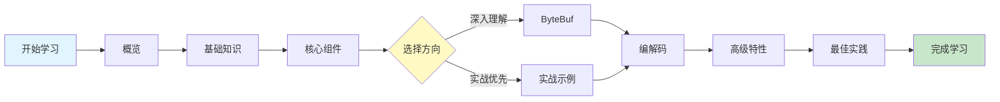

# Netty 网络编程

欢迎来到 Netty 学习指南！本章节提供了从入门到精通的完整学习路径。

> [!TIP]
> 如果你是第一次学习 Netty，建议先阅读 [概览](/docs/netty/overview) 了解框架的核心优势，然后按照下方的学习路径逐步深入。

## 📚 文档导航

### 基础入门

- **[概览](/docs/netty/overview)** - Netty 是什么？为什么选择 Netty？
- **[基础知识](/docs/netty/basics)** - NIO、事件驱动模型、异步编程
- **[核心组件](/docs/netty/core-components)** - Channel、EventLoop、Pipeline、Handler

### 深入理解

- **[ByteBuf](/docs/netty/bytebuf)** - 高性能字节缓冲区的使用与优化
- **[编解码](/docs/netty/codec)** - 协议设计与编解码器实现

### 实战进阶

- **[实战示例](/docs/netty/practical-examples)** - Echo、聊天室、HTTP服务器
- **[高级特性](/docs/netty/advanced)** - 性能优化、内存管理、安全通信、监控方案
- **[最佳实践](/docs/netty/best-practices)** - Spring Boot 集成、设计模式、版本升级指南

### 工具参考

- **[快速参考](/docs/netty/quick-reference)** - API 速查、配置模板
- **[故障排除](/docs/netty/troubleshooting)** - 常见问题诊断与解决

## 🎯 学习路径

### 分阶段学习建议

#### 🔰 第一阶段：入门（1-2天）

1. 阅读 [概览](/docs/netty/overview)，理解 Netty 的核心价值
2. 学习 [基础知识](/docs/netty/basics)，掌握 NIO 和事件驱动
3. 运行第一个 Echo 服务器示例

#### 🎓 第二阶段：核心（3-5天）

1. 深入学习 [核心组件](/docs/netty/core-components)
2. 理解 [ByteBuf](/docs/netty/bytebuf) 的内存管理
3. 掌握 [编解码](/docs/netty/codec) 的协议设计

#### 🚀 第三阶段：实战（1-2周）

1. 完成 [实战示例](/docs/netty/practical-examples) 中的所有案例
2. 学习 [高级特性](/docs/netty/advanced) 的性能优化和安全通信
3. 尝试构建自己的网络应用

#### 💡 第四阶段：精通（2-3周）

1. 学习 [最佳实践](/docs/netty/best-practices)，掌握工程规范和设计模式
2. 参考 [快速参考](/docs/netty/quick-reference) 编写高质量代码
3. 使用 [故障排除](/docs/netty/troubleshooting) 解决实际问题
4. 尝试 Spring Boot 集成和项目实战

## 📖 相关资源

### 官方资源

- [Netty 官方网站](https://netty.io/)
- [Netty GitHub 仓库](https://github.com/netty/netty)
- [Netty API 文档](https://netty.io/4.1/api/)

### 推荐书籍

- 《Netty in Action》- Norman Maurer
- 《Netty 权威指南》- 李林峰

### 相关技术

- [Java NIO 编程基础](../java-design-patterns/overview)
- [Reactor 模式详解](../java-design-patterns/overview)

---

**准备好了吗？** 开始你的 Netty 学习之旅 → [Netty 概览](/docs/netty/overview)
