# Netty 网络编程

欢迎来到 Netty 学习指南！本章节提供了从入门到精通的完整学习路径。

> [!TIP]
> 如果你是第一次学习 Netty，建议先阅读 [概览](./overview.md) 了解框架的核心优势，然后按照下方的学习路径逐步深入。

## 📚 文档导航

### 基础入门

- **[概览](./overview.md)** - Netty 是什么？为什么选择 Netty？
- **[基础知识](./basics.md)** - NIO、事件驱动模型、异步编程
- **[核心组件](./core-components.md)** - Channel、EventLoop、Pipeline、Handler

### 深入理解

- **[ByteBuf](./bytebuf.md)** - 高性能字节缓冲区的使用与优化
- **[编解码](./codec.md)** - 协议设计与编解码器实现

### 实战进阶

- **[实战示例](./practical-examples.md)** - Echo、聊天室、HTTP服务器
- **[高级特性](./advanced.md)** - 性能调优、内存管理、监控方案

### 工具参考

- **[快速参考](./quick-reference.md)** - API 速查、配置模板
- **[故障排除](./troubleshooting.md)** - 常见问题诊断与解决

## 🎯 学习路径

```mermaid
graph LR
    A[开始学习] --> B[概览]
    B --> C[基础知识]
    C --> D[核心组件]
    D --> E{选择方向}
    E -->|深入理解| F[ByteBuf]
    E -->|实战优先| G[实战示例]
    F --> H[编解码]
    G --> H
    H --> I[高级特性]
    I --> J[完成学习]
    
    style A fill:#e1f5ff
    style J fill:#c8e6c9
    style E fill:#fff9c4
```

### 分阶段学习建议

#### 🔰 第一阶段：入门（1-2天）

1. 阅读 [概览](./overview.md)，理解 Netty 的核心价值
2. 学习 [基础知识](./basics.md)，掌握 NIO 和事件驱动
3. 运行第一个 Echo 服务器示例

#### 🎓 第二阶段：核心（3-5天）

1. 深入学习 [核心组件](./core-components.md)
2. 理解 [ByteBuf](./bytebuf.md) 的内存管理
3. 掌握 [编解码](./codec.md) 的协议设计

#### 🚀 第三阶段：实战（1-2周）

1. 完成 [实战示例](./practical-examples.md) 中的所有案例
2. 学习 [高级特性](./advanced.md) 的性能优化
3. 尝试构建自己的网络应用

#### 💡 第四阶段：精通

1. 参考 [快速参考](./quick-reference.md) 编写高质量代码
2. 使用 [故障排除](./troubleshooting.md) 解决实际问题
3. 阅读 Netty 源码，理解设计思想

## 📖 相关资源

### 官方资源

- [Netty 官方网站](https://netty.io/)
- [Netty GitHub 仓库](https://github.com/netty/netty)
- [Netty API 文档](https://netty.io/4.1/api/)

### 推荐书籍

- 《Netty in Action》- Norman Maurer
- 《Netty 权威指南》- 李林峰

### 相关技术

- [Java NIO 编程基础](../java-design-patterns/overview.md)
- [Reactor 模式详解](../java-design-patterns/overview.md)

---

**准备好了吗？** 开始你的 Netty 学习之旅 → [Netty 概览](./overview.md)
