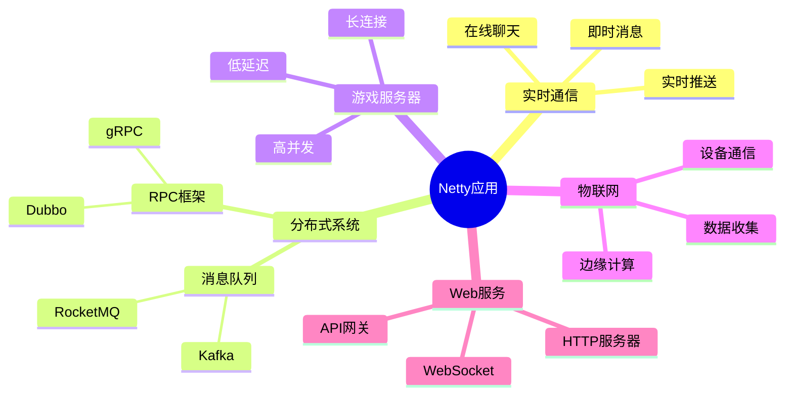
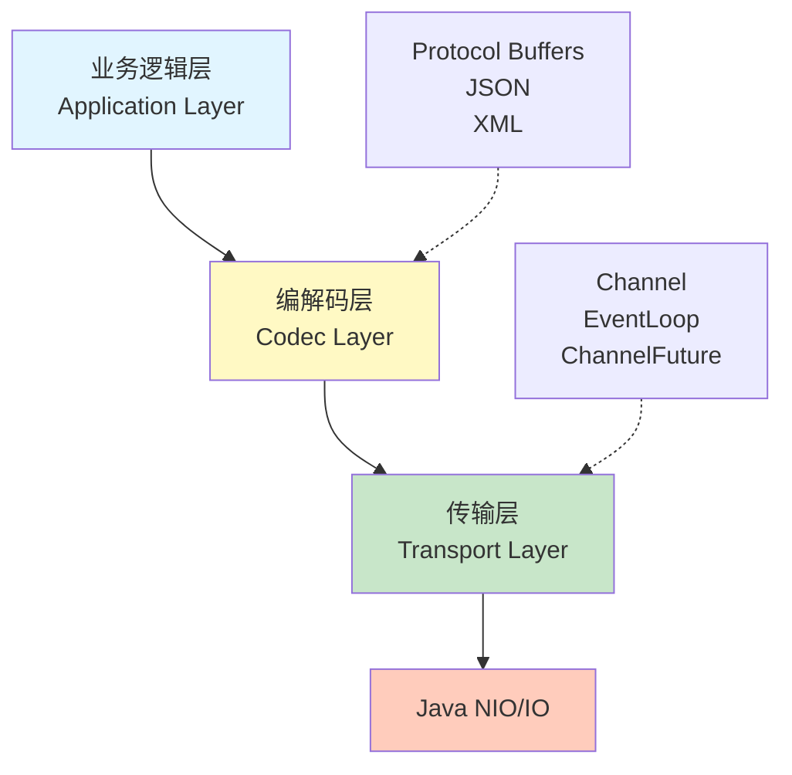
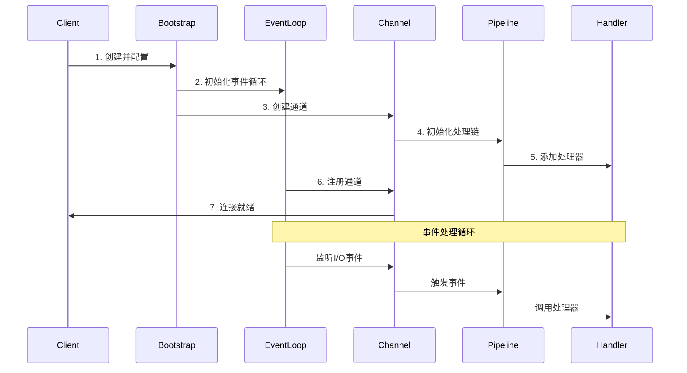

# Netty 框架概览

## 什么是 Netty？

Netty 是一个高性能、异步事件驱动的网络应用框架，用于开发可维护的、高性能的网络应用程序。它提供了一套开箱即用的工具，可以快速、简单地开发网络应用。

> [!IMPORTANT]
> Netty 被广泛应用于阿里巴巴、Apple、Google、Facebook、Twitter 等公司的核心基础设施中，支撑着数百万级的并发连接。

### Netty 的核心优势

- **高性能** - 采用异步、非阻塞 I/O 模型，充分利用 CPU 多核特性
- **易用性** - 简化了网络编程复杂性，隐藏了 NIO 的底层细节
- **灵活性** - 高度可定制的事件处理模型和协议支持
- **可靠性** - 完善的异常处理和内存管理机制
- **生产就绪** - 被众多互联网公司使用，经过充分验证

### Netty 应用场景



**典型应用场景：**

1. **实时通信** - 即时消息、在线聊天、实时通知
2. **游戏服务器** - 高并发、低延迟的游戏后端
3. **物联网** - 设备通信、数据收集
4. **RPC 框架** - Dubbo、gRPC 等底层实现
5. **WebSocket** - 实时 Web 应用
6. **文件服务** - FTP、SFTP 服务器
7. **HTTP 服务器** - 高性能 Web 服务

## Netty 架构设计

### 分层架构



### 核心组件交互



## 快速开始

### 基本依赖

```xml
<dependency>
    <groupId>io.netty</groupId>
    <artifactId>netty-all</artifactId>
    <version>4.1.100.Final</version>
</dependency>
```

> [!TIP]
> 推荐使用 `netty-all` 依赖，它包含了所有 Netty 模块。对于生产环境，也可以按需引入特定模块以减小包体积。

### 最简单的 Echo 服务器

下面是一个完整的 Echo 服务器示例，演示了 Netty 的基本用法：

```java
public class EchoServer {
    private int port;

    public EchoServer(int port) {
        this.port = port;
    }

    public static void main(String[] args) throws InterruptedException {
        new EchoServer(8080).start();
    }

    public void start() throws InterruptedException {
        // Boss EventLoop 处理连接
        EventLoopGroup bossGroup = new NioEventLoopGroup(1);
        // Worker EventLoop 处理读写
        EventLoopGroup workerGroup = new NioEventLoopGroup();
        
        try {
            ServerBootstrap bootstrap = new ServerBootstrap();
            bootstrap.group(bossGroup, workerGroup)
                .channel(NioServerSocketChannel.class)
                .childHandler(new ChannelInitializer<SocketChannel>() {
                    @Override
                    protected void initChannel(SocketChannel ch) {
                        ch.pipeline().addLast(new EchoServerHandler());
                    }
                });

            // 绑定端口并等待
            ChannelFuture future = bootstrap.bind(port).sync();
            System.out.println("Server started on port " + port);
            
            // 等待服务器关闭
            future.channel().closeFuture().sync();
        } finally {
            // 优雅关闭
            bossGroup.shutdownGracefully();
            workerGroup.shutdownGracefully();
        }
    }
}

/**
 * Echo 服务器处理器
 * 接收客户端消息并原样返回
 */
public class EchoServerHandler extends ChannelInboundHandlerAdapter {
    @Override
    public void channelRead(ChannelHandlerContext ctx, Object msg) {
        ByteBuf buf = (ByteBuf) msg;
        System.out.println("Server received: " + buf.toString(CharsetUtil.UTF_8));
        
        // 将接收到的消息写回客户端
        ctx.write(msg);
    }

    @Override
    public void channelReadComplete(ChannelHandlerContext ctx) {
        // 批量刷新缓冲区
        ctx.flush();
    }

    @Override
    public void exceptionCaught(ChannelHandlerContext ctx, Throwable cause) {
        // 异常处理
        cause.printStackTrace();
        ctx.close();
    }
}
```

> [!NOTE]
> **代码说明：**
>
> - `bossGroup` 专门处理客户端连接请求
> - `workerGroup` 处理已建立连接的读写操作
> - `ChannelInitializer` 用于配置新连接的 Pipeline
> - `channelRead` 接收数据，`channelReadComplete` 刷新缓冲区

## 文档结构

本文档按以下结构组织：

### 📚 学习模块

1. **[基础概念](/docs/netty/basics)** - NIO、事件驱动模型、Netty 架构
2. **[核心组件](/docs/netty/core-components)** - Channel、EventLoop、Pipeline、Handler
3. **编码与协议** - [ByteBuf](/docs/netty/bytebuf)、[编解码](/docs/netty/codec)、Protocol Buffer
4. **[高级特性](/docs/netty/advanced)** - 线程池配置、性能优化、内存管理
5. **[实战应用](/docs/netty/practical-examples)** - WebSocket、RPC、聊天系统

## 学习路径建议

### 初级开发者 🔰

1. 学习 NIO 基础和异步编程概念
2. 理解 Netty 的核心组件
3. 实现简单的 Echo 客户端和服务器

### 中级开发者 🎓

1. 深入学习 Pipeline 和 Handler 机制
2. 学习自定义编码解码器
3. 实现实际的网络协议

### 高级开发者 🚀

1. 性能调优和监控
2. 分布式系统设计
3. 高级特性应用

## 推荐资源

### 官方文档

- [Netty 官方文档](https://netty.io/wiki/index.html)
- [Netty GitHub](https://github.com/netty/netty)
- [Netty API 文档](https://netty.io/4.1/api/)

### 书籍推荐

- 📖 《Netty in Action》- Norman Maurer & Marvin Allen Wolfthal
- 📖 《Netty 权威指南》- 李林峰

### 在线资源

- [Netty 用户指南](https://netty.io/wiki/user-guide-for-4.x.html)
- [Netty 示例代码](https://github.com/netty/netty/tree/4.1/example)

## 注意事项

> [!WARNING]
> **版本兼容性：**
>
> - Netty 4.1.x 要求 Java 6 或更高版本
> - 推荐使用 Java 8 或更高版本以获得更好的性能
> - Netty 5.x 仍在开发中，生产环境请使用 4.1.x 稳定版

### 环境要求

- ✅ Java 版本 >= 8（推荐 11 或 17）
- ✅ Netty 4.1.x（最新稳定版）
- ✅ Maven 或 Gradle 构建工具

---

**准备好了吗？** 继续学习 → [基础概念](/docs/netty/basics)
