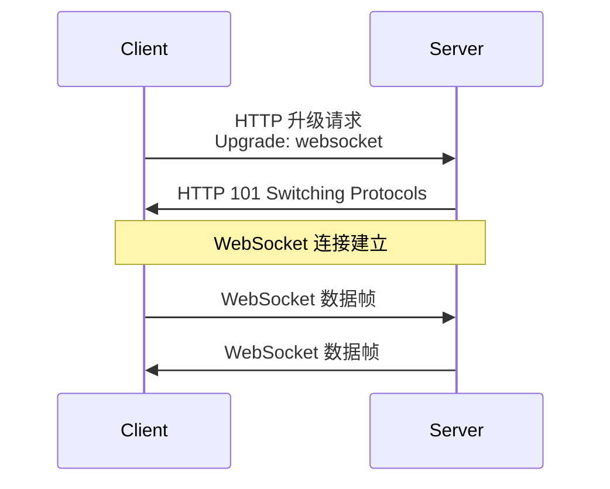

# WebSocket 服务器开发

> [!TIP]
> WebSocket 是一种在单个 TCP 连接上进行全双工通信的协议，非常适合实时通信场景。Netty 提供了完整的 WebSocket 支持，本章将介绍如何使用 Netty 构建 WebSocket 服务器。

## WebSocket 协议简介

### 什么是 WebSocket？

WebSocket 是 HTML5 提供的一种在单个 TCP 连接上进行全双工通信的协议。

**与 HTTP 的对比：**

| 特性     | HTTP      | WebSocket |
| -------- | --------- | --------- |
| 连接类型 | 短连接    | 长连接    |
| 通信模式 | 请求-响应 | 全双工    |
| 实时性   | 需要轮询  | 实时推送  |
| 头部开销 | 大        | 小        |

**适用场景：**

- 即时通讯（聊天室）
- 实时数据推送（股票行情、体育比分）
- 在线游戏
- 协作编辑
- IoT 设备通信

### WebSocket 握手过程



## Netty WebSocket 支持

### 核心组件

Netty 提供了以下 WebSocket 相关的组件：

| 组件                             | 说明                    |
| -------------------------------- | ----------------------- |
| `WebSocketServerProtocolHandler` | 处理 WebSocket 握手和帧 |
| `TextWebSocketFrame`             | 文本帧                  |
| `BinaryWebSocketFrame`           | 二进制帧                |
| `PingWebSocketFrame`             | Ping 帧                 |
| `PongWebSocketFrame`             | Pong 帧                 |
| `CloseWebSocketFrame`            | 关闭帧                  |

## WebSocket 服务器实现

### 完整示例

```java
import io.netty.bootstrap.ServerBootstrap;
import io.netty.channel.*;
import io.netty.channel.nio.NioEventLoopGroup;
import io.netty.channel.socket.SocketChannel;
import io.netty.channel.socket.nio.NioServerSocketChannel;
import io.netty.handler.codec.http.HttpObjectAggregator;
import io.netty.handler.codec.http.HttpServerCodec;
import io.netty.handler.codec.http.websocketx.WebSocketServerProtocolHandler;
import io.netty.handler.codec.http.websocketx.TextWebSocketFrame;
import io.netty.handler.stream.ChunkedWriteHandler;

public class WebSocketServer {
    private int port;

    public WebSocketServer(int port) {
        this.port = port;
    }

    public void start() throws InterruptedException {
        EventLoopGroup bossGroup = new NioEventLoopGroup(1);
        EventLoopGroup workerGroup = new NioEventLoopGroup();

        try {
            ServerBootstrap bootstrap = new ServerBootstrap();
            bootstrap.group(bossGroup, workerGroup)
                .channel(NioServerSocketChannel.class)
                .childHandler(new ChannelInitializer<SocketChannel>() {
                    @Override
                    protected void initChannel(SocketChannel ch) {
                        ChannelPipeline pipeline = ch.pipeline();

                        // HTTP 编解码器
                        pipeline.addLast(new HttpServerCodec());

                        // 大数据流支持
                        pipeline.addLast(new ChunkedWriteHandler());

                        // HTTP 内容聚合器
                        pipeline.addLast(new HttpObjectAggregator(64 * 1024));

                        // WebSocket 协议处理器
                        pipeline.addLast(new WebSocketServerProtocolHandler("/ws"));

                        // 业务处理器
                        pipeline.addLast(new WebSocketFrameHandler());
                    }
                });

            ChannelFuture future = bootstrap.bind(port).sync();
            System.out.println("WebSocket Server started on port " + port);
            System.out.println("WebSocket URL: ws://localhost:" + port + "/ws");
            future.channel().closeFuture().sync();
        } finally {
            bossGroup.shutdownGracefully();
            workerGroup.shutdownGracefully();
        }
    }

    public static void main(String[] args) throws InterruptedException {
        new WebSocketServer(8080).start();
    }
}
```

### WebSocket 帧处理器

```java
import io.netty.channel.ChannelHandlerContext;
import io.netty.channel.SimpleChannelInboundHandler;
import io.netty.handler.codec.http.websocketx.TextWebSocketFrame;

public class WebSocketFrameHandler extends SimpleChannelInboundHandler<TextWebSocketFrame> {

    @Override
    public void channelActive(ChannelHandlerContext ctx) {
        System.out.println("客户端连接: " + ctx.channel().remoteAddress());
    }

    @Override
    protected void channelRead0(ChannelHandlerContext ctx, TextWebSocketFrame frame) {
        String text = frame.text();
        System.out.println("收到消息: " + text);

        // 回复消息
        String response = "服务器收到: " + text + " [" +
                         java.time.LocalDateTime.now() + "]";
        ctx.channel().writeAndFlush(new TextWebSocketFrame(response));
    }

    @Override
    public void channelInactive(ChannelHandlerContext ctx) {
        System.out.println("客户端断开: " + ctx.channel().remoteAddress());
    }

    @Override
    public void exceptionCaught(ChannelHandlerContext ctx, Throwable cause) {
        cause.printStackTrace();
        ctx.close();
    }
}
```

## 广播聊天室实现

### 连接管理器

```java
import io.netty.channel.Channel;
import io.netty.channel.group.ChannelGroup;
import io.netty.channel.group.DefaultChannelGroup;
import io.netty.handler.codec.http.websocketx.TextWebSocketFrame;
import io.netty.util.concurrent.GlobalEventExecutor;

public class ChannelManager {
    // 存储所有连接的客户端
    private static ChannelGroup channels =
        new DefaultChannelGroup(GlobalEventExecutor.INSTANCE);

    public static void addChannel(Channel channel) {
        channels.add(channel);
    }

    public static void removeChannel(Channel channel) {
        channels.remove(channel);
    }

    // 广播消息给所有客户端
    public static void broadcast(String message) {
        channels.writeAndFlush(new TextWebSocketFrame(message));
    }

    // 广播消息给除了指定客户端外的所有客户端
    public static void broadcastExcept(Channel excludeChannel, String message) {
        channels.stream()
            .filter(ch -> ch != excludeChannel)
            .forEach(ch -> ch.writeAndFlush(new TextWebSocketFrame(message)));
    }

    public static int getOnlineCount() {
        return channels.size();
    }
}
```

### 聊天室处理器

```java
public class ChatRoomHandler extends SimpleChannelInboundHandler<TextWebSocketFrame> {

    @Override
    public void channelActive(ChannelHandlerContext ctx) {
        Channel channel = ctx.channel();
        ChannelManager.addChannel(channel);

        // 通知其他用户
        ChannelManager.broadcastExcept(channel,
            "[系统消息] 用户 " + channel.remoteAddress() + " 加入聊天室");

        // 欢迎新用户
        ctx.writeAndFlush(new TextWebSocketFrame(
            "[系统消息] 欢迎加入聊天室，当前在线人数: " +
            ChannelManager.getOnlineCount()));
    }

    @Override
    protected void channelRead0(ChannelHandlerContext ctx, TextWebSocketFrame frame) {
        String text = frame.text();
        Channel sender = ctx.channel();

        // 广播消息
        String message = "[" + sender.remoteAddress() + "]: " + text;
        ChannelManager.broadcast(message);
    }

    @Override
    public void channelInactive(ChannelHandlerContext ctx) {
        Channel channel = ctx.channel();
        ChannelManager.removeChannel(channel);

        // 通知其他用户
        ChannelManager.broadcast(
            "[系统消息] 用户 " + channel.remoteAddress() + " 离开聊天室");
    }

    @Override
    public void exceptionCaught(ChannelHandlerContext ctx, Throwable cause) {
        cause.printStackTrace();
        ctx.close();
    }
}
```

## 心跳与连接保活

### 配置空闲检测

```java
import io.netty.handler.timeout.IdleStateHandler;
import io.netty.handler.timeout.IdleStateEvent;

// 在 Pipeline 中添加
pipeline.addLast(new IdleStateHandler(60, 0, 0, TimeUnit.SECONDS));
pipeline.addLast(new HeartbeatHandler());

// 心跳处理器
public class HeartbeatHandler extends ChannelInboundHandlerAdapter {
    @Override
    public void userEventTriggered(ChannelHandlerContext ctx, Object evt) {
        if (evt instanceof IdleStateEvent) {
            IdleStateEvent event = (IdleStateEvent) evt;
            if (event.state() == IdleState.READER_IDLE) {
                System.out.println("读空闲超时，关闭连接");
                ctx.close();
            }
        }
    }
}
```

### 客户端 Ping/Pong

```java
// 处理 Ping 帧，自动回复 Pong
// WebSocketServerProtocolHandler 会自动处理 Ping/Pong

// 如需自定义处理：
public class PingPongHandler extends SimpleChannelInboundHandler<WebSocketFrame> {
    @Override
    protected void channelRead0(ChannelHandlerContext ctx, WebSocketFrame frame) {
        if (frame instanceof PingWebSocketFrame) {
            ctx.writeAndFlush(new PongWebSocketFrame(frame.content().retain()));
        } else if (frame instanceof PongWebSocketFrame) {
            System.out.println("收到 Pong");
        } else {
            ctx.fireChannelRead(frame.retain());
        }
    }
}
```

## 前端测试页面

```html
<!DOCTYPE html>
<html>
  <head>
    <title>WebSocket 测试</title>
    <style>
      #messages {
        height: 300px;
        overflow-y: scroll;
        border: 1px solid #ccc;
        padding: 10px;
        margin-bottom: 10px;
      }
      .message {
        margin: 5px 0;
      }
      .system {
        color: #888;
      }
      .sent {
        color: blue;
      }
      .received {
        color: green;
      }
    </style>
  </head>
  <body>
    <h1>WebSocket 聊天室</h1>
    <div id="messages"></div>
    <input type="text" id="input" placeholder="输入消息..." />
    <button onclick="sendMessage()">发送</button>
    <button onclick="disconnect()">断开</button>

    <script>
      let ws;

      function connect() {
        ws = new WebSocket("ws://localhost:8080/ws");

        ws.onopen = function () {
          addMessage("系统", "连接成功", "system");
        };

        ws.onmessage = function (event) {
          addMessage("收到", event.data, "received");
        };

        ws.onclose = function () {
          addMessage("系统", "连接已断开", "system");
        };

        ws.onerror = function (error) {
          addMessage("错误", error.message, "system");
        };
      }

      function sendMessage() {
        const input = document.getElementById("input");
        const message = input.value;
        if (message && ws.readyState === WebSocket.OPEN) {
          ws.send(message);
          addMessage("发送", message, "sent");
          input.value = "";
        }
      }

      function disconnect() {
        if (ws) {
          ws.close();
        }
      }

      function addMessage(type, text, className) {
        const div = document.getElementById("messages");
        const msg = document.createElement("div");
        msg.className = "message " + className;
        msg.textContent = "[" + type + "] " + text;
        div.appendChild(msg);
        div.scrollTop = div.scrollHeight;
      }

      // 页面加载时自动连接
      connect();

      // 回车发送
      document
        .getElementById("input")
        .addEventListener("keypress", function (e) {
          if (e.key === "Enter") {
            sendMessage();
          }
        });
    </script>
  </body>
</html>
```

## 最佳实践

### 1. 消息大小限制

```java
// 限制帧大小，防止攻击
pipeline.addLast(new WebSocketServerProtocolHandler("/ws", null, true, 65536));
```

### 2. 子协议支持

```java
// 支持自定义子协议
pipeline.addLast(new WebSocketServerProtocolHandler(
    "/ws",
    "chat, notification", // 支持的子协议
    true,
    65536
));
```

### 3. 安全 WebSocket (WSS)

```java
// 添加 SSL/TLS 支持
SslContext sslCtx = SslContextBuilder.forServer(certFile, keyFile).build();
pipeline.addFirst(sslCtx.newHandler(ch.alloc()));
```

### 4. 性能优化

```java
// 使用池化分配器
bootstrap.childOption(ChannelOption.ALLOCATOR, PooledByteBufAllocator.DEFAULT);

// 关闭 Nagle 算法
bootstrap.childOption(ChannelOption.TCP_NODELAY, true);
```

## 常见问题

### 握手失败

**原因：** HTTP 请求头不完整或协议版本不匹配

**解决：** 确保 `HttpObjectAggregator` 在 `WebSocketServerProtocolHandler` 之前

### 消息发送失败

**原因：** Channel 已关闭或写入队列满

**解决：** 检查 `channel.isActive()` 和 `channel.isWritable()`

### 连接频繁断开

**原因：** 没有心跳机制或超时配置不合理

**解决：** 添加 `IdleStateHandler` 并实现心跳

---

**相关链接：**

- [实战案例](/docs/netty/practical-examples)
- [核心组件](/docs/netty/core-components)
- [编解码](/docs/netty/codec)
