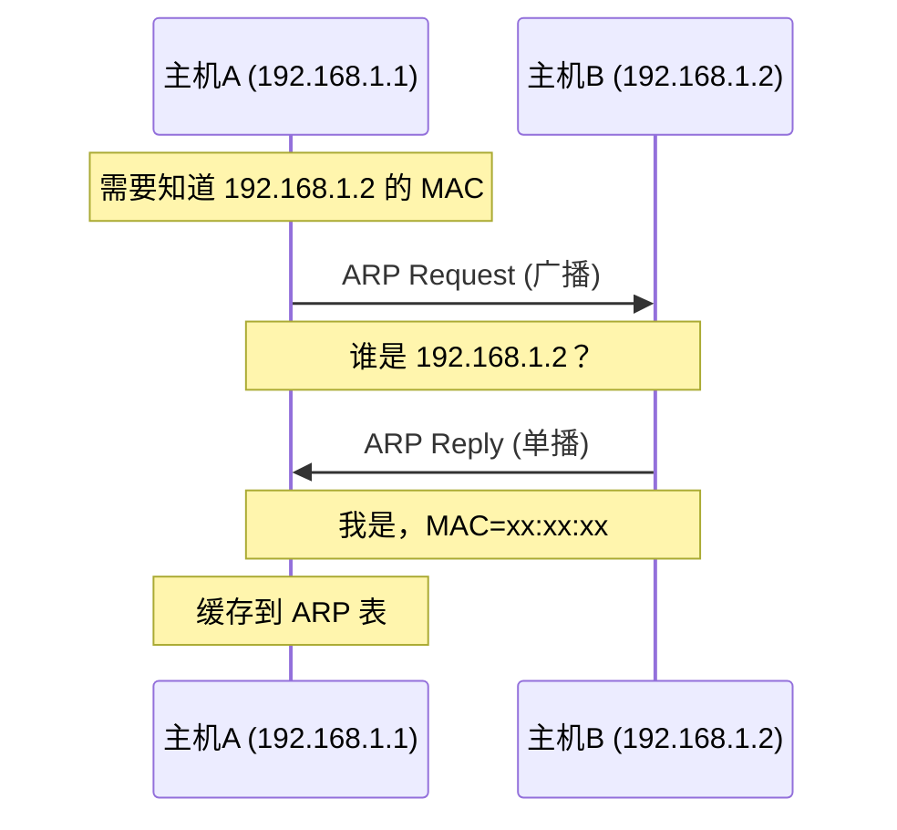

# 数据链路层

数据链路层（Data Link Layer）是 OSI 模型的第二层，负责在相邻节点之间可靠地传输数据帧。

## 核心功能

- **成帧**：将网络层数据封装成帧
- **物理寻址**：使用 MAC 地址标识设备
- **错误检测**：通过校验和检测传输错误
- **流量控制**：控制数据发送速率
- **访问控制**：管理多设备共享介质

## MAC 地址

MAC（Media Access Control）地址是网络设备的物理地址，由 48 位（6 字节）组成。

### 地址格式

```
AA:BB:CC:DD:EE:FF
└──┬──┘ └──┬──┘
  OUI    设备ID
```

| 部分       | 位数   | 说明                       |
| ---------- | ------ | -------------------------- |
| OUI        | 24 bit | 组织唯一标识符（厂商分配） |
| 设备 ID    | 24 bit | 设备唯一标识（厂商自定义） |
| 首字节 LSB | 1 bit  | 0=单播地址，1=多播地址     |

### 特殊地址

| 地址              | 类型     | 用途           |
| ----------------- | -------- | -------------- |
| FF:FF:FF:FF:FF:FF | 广播地址 | 发送给所有设备 |
| 01:00:5E:xx:xx:xx | 多播地址 | IP 组播映射    |

## 以太网帧结构

以太网是最常用的局域网技术，其帧结构如下：

```
+---------+--------+--------+------+------+----------+-----+
| Preamble| SFD    | Dest   | Src  | Type | Payload  | FCS |
| 7 bytes | 1 byte | 6 bytes|6 bytes|2 bytes|46-1500  | 4   |
+---------+--------+--------+------+------+----------+-----+
```

### 关键字段

| 字段     | 大小         | 描述                     |
| -------- | ------------ | ------------------------ |
| Preamble | 7 字节       | 前导码（同步时钟）       |
| SFD      | 1 字节       | 帧起始定界符（10101011） |
| Dest MAC | 6 字节       | 目的 MAC 地址            |
| Src MAC  | 6 字节       | 源 MAC 地址              |
| Type     | 2 字节       | 上层协议类型             |
| Payload  | 46-1500 字节 | 数据载荷                 |
| FCS      | 4 字节       | 帧校验序列（CRC-32）     |

### 常见 Type 值

| Type   | 协议      |
| ------ | --------- |
| 0x0800 | IPv4      |
| 0x0806 | ARP       |
| 0x86DD | IPv6      |
| 0x8100 | VLAN 标签 |

## ARP 协议

ARP（Address Resolution Protocol）用于将 IP 地址解析为 MAC 地址。

### 工作流程



### ARP 报文格式

| 字段       | 大小   | 描述              |
| ---------- | ------ | ----------------- |
| 硬件类型   | 2 字节 | 1=以太网          |
| 协议类型   | 2 字节 | 0x0800=IPv4       |
| 硬件长度   | 1 字节 | 6（MAC 地址长度） |
| 协议长度   | 1 字节 | 4（IP 地址长度）  |
| 操作码     | 2 字节 | 1=请求，2=应答    |
| 发送方 MAC | 6 字节 | 发送方硬件地址    |
| 发送方 IP  | 4 字节 | 发送方协议地址    |
| 目标 MAC   | 6 字节 | 目标硬件地址      |
| 目标 IP    | 4 字节 | 目标协议地址      |

### ARP 缓存

```bash
# 查看 ARP 缓存
arp -a

# 清除 ARP 缓存
arp -d *
```

## 交换机原理

交换机工作在数据链路层，基于 MAC 地址进行帧转发。

### 核心功能


| 功能 | 描述                            |
| ---- | ------------------------------- |
| 学习 | 记录源 MAC 与端口的映射关系     |
| 转发 | 根据目的 MAC 查表转发到对应端口 |
| 过滤 | 不转发源和目的在同一端口的帧    |
| 老化 | 定期清除长时间未使用的 MAC 表项 |

### MAC 地址表

```
MAC Address          Port    VLAN    Type
------------------------------------------
00:1A:2B:3C:4D:5E    Gi0/1   1       Dynamic
00:1A:2B:3C:4D:5F    Gi0/2   1       Dynamic
00:1A:2B:3C:4D:60    Gi0/3   2       Static
```

## VLAN（虚拟局域网）

VLAN 用于在逻辑上划分广播域，提高网络安全性和管理效率。

### VLAN 标签（802.1Q）

```
+--------+--------+------+------+----------+-----+
| Dest   | Src    | TPID | TCI  | Type     | ... |
| 6 bytes| 6 bytes|0x8100| 2B   | 2 bytes  |     |
+--------+--------+------+------+----------+-----+
                  └────VLAN Tag (4 bytes)───┘
```

| 字段 | 大小   | 描述                   |
| ---- | ------ | ---------------------- |
| TPID | 2 字节 | 标签协议标识（0x8100） |
| PCP  | 3 bit  | 优先级（QoS）          |
| DEI  | 1 bit  | 丢弃指示符             |
| VID  | 12 bit | VLAN ID（1-4094）      |

### 端口类型

| 类型   | 描述                       |
| ------ | -------------------------- |
| Access | 连接终端设备，发送无标签帧 |
| Trunk  | 连接交换机，发送带标签帧   |
| Hybrid | 可同时发送带标签和无标签帧 |

## 常见问题

### 广播风暴

**原因**：网络中存在环路，广播帧无限循环。

**解决**：

- STP（生成树协议）
- 合理划分 VLAN
- 限制广播速率

### ARP 欺骗

**原因**：攻击者伪造 ARP 应答，毒化 ARP 缓存。

**防护**：

- 静态 ARP 绑定
- 动态 ARP 检测（DAI）
- 网络隔离

## 下一步

- 学习 [网络层](./network-layer) 协议
- 了解 [TCP 协议](./tcp) 传输机制
