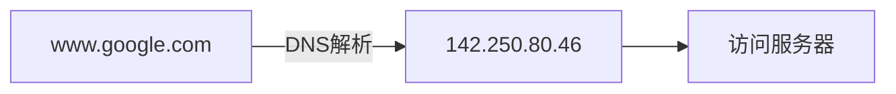
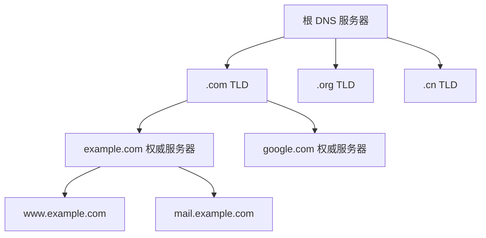
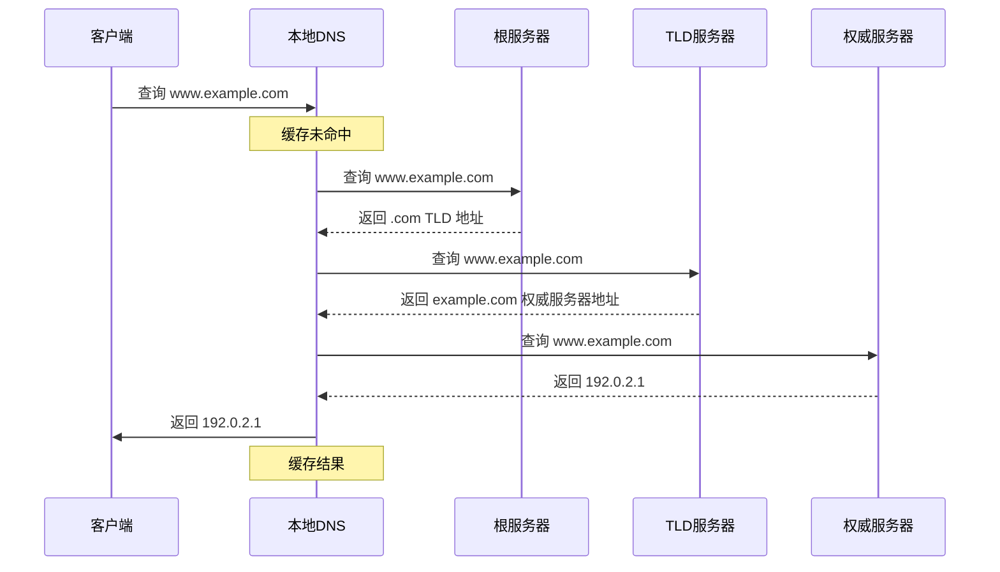
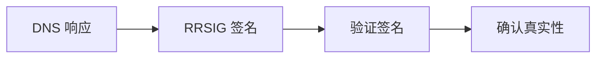

# DNS 域名解析

DNS（Domain Name System）是互联网的电话簿，负责将域名转换为 IP 地址。

## 基本概念

### 为什么需要 DNS？



- IP 地址难以记忆
- 域名更有意义
- 支持负载均衡和故障转移

### 域名结构

```
www.example.com.
└┬┘ └──┬──┘ └┬┘
 │     │     └── 顶级域名 (TLD)
 │     └──────── 二级域名 (SLD)
 └────────────── 子域名/主机名
```

| 层级   | 示例    | 说明            |
| ------ | ------- | --------------- |
| 根域   | .       | DNS 根          |
| 顶级域 | com     | 通用/国家顶级域 |
| 二级域 | example | 注册的域名      |
| 子域   | www     | 具体主机        |

## DNS 层次结构



### 服务器类型

| 类型       | 描述                       |
| ---------- | -------------------------- |
| 根服务器   | 全球 13 组根服务器         |
| TLD 服务器 | 管理顶级域（.com, .cn 等） |
| 权威服务器 | 管理具体域名的 DNS 记录    |
| 本地 DNS   | ISP 提供的递归解析器       |

## 解析过程

### 递归查询 vs 迭代查询



### 解析顺序

1. **浏览器缓存**
2. **操作系统缓存**
3. **hosts 文件**
4. **本地 DNS 服务器**
5. **根 DNS 服务器**
6. **TLD DNS 服务器**
7. **权威 DNS 服务器**

## DNS 记录类型

| 类型  | 名称           | 描述               | 示例                           |
| ----- | -------------- | ------------------ | ------------------------------ |
| A     | Address        | 域名 → IPv4        | example.com → 192.0.2.1        |
| AAAA  | IPv6 Address   | 域名 → IPv6        | example.com → 2001:db8::1      |
| CNAME | Canonical Name | 别名               | www → example.com              |
| MX    | Mail Exchange  | 邮件服务器         | example.com → mail.example.com |
| NS    | Name Server    | 权威 DNS 服务器    | example.com → ns1.example.com  |
| TXT   | Text           | 文本记录           | SPF, DKIM 验证                 |
| SOA   | Start of Auth  | 区域授权起始       | 主 DNS、管理员邮箱、序列号     |
| PTR   | Pointer        | 反向解析 IP → 域名 | 1.2.0.192 → example.com        |
| SRV   | Service        | 服务发现           | \_http.\_tcp.example.com       |

### 记录示例

```dns
; A 记录
example.com.        IN  A       192.0.2.1

; AAAA 记录
example.com.        IN  AAAA    2001:db8::1

; CNAME 记录
www.example.com.    IN  CNAME   example.com.

; MX 记录
example.com.        IN  MX  10  mail1.example.com.
example.com.        IN  MX  20  mail2.example.com.

; NS 记录
example.com.        IN  NS      ns1.example.com.
example.com.        IN  NS      ns2.example.com.

; TXT 记录 (SPF)
example.com.        IN  TXT     "v=spf1 mx -all"
```

## DNS 缓存

### TTL（Time To Live）

```
example.com.    3600    IN    A    192.0.2.1
                └──┘
                TTL = 3600秒
```

| TTL 值      | 说明             |
| ----------- | ---------------- |
| 短 (60s)    | 变更快速生效     |
| 长 (86400s) | 减少查询，更稳定 |

### 查看缓存

```bash
# macOS 清除 DNS 缓存
sudo dscacheutil -flushcache

# Windows 清除 DNS 缓存
ipconfig /flushdns

# Linux 清除 systemd-resolved 缓存
sudo systemd-resolve --flush-caches
```

## DNS 工具

### nslookup

```bash
# 基本查询
$ nslookup example.com
Server:		8.8.8.8
Address:	8.8.8.8#53

Non-authoritative answer:
Name:	example.com
Address: 93.184.216.34

# 指定记录类型
$ nslookup -type=MX example.com
```

### dig

```bash
# 详细查询
$ dig example.com

# 查询特定记录
$ dig example.com MX

# 追踪解析过程
$ dig +trace example.com

# 只显示答案
$ dig +short example.com
```

### host

```bash
$ host example.com
example.com has address 93.184.216.34
example.com has IPv6 address 2606:2800:220:1:248:1893:25c8:1946
```

## DNS 安全

### 常见威胁

| 威胁      | 描述          | 防护措施      |
| --------- | ------------- | ------------- |
| DNS 劫持  | 篡改 DNS 响应 | 使用可信 DNS  |
| DNS 污染  | 注入虚假记录  | DNSSEC, DoH   |
| DDoS 攻击 | 放大攻击      | 速率限制      |
| 缓存投毒  | 毒化 DNS 缓存 | 随机化端口/ID |

### DNSSEC

DNSSEC 通过数字签名验证 DNS 响应的真实性：



### DoH / DoT

| 协议 | 全称           | 端口 | 说明       |
| ---- | -------------- | ---- | ---------- |
| DoH  | DNS over HTTPS | 443  | HTTPS 加密 |
| DoT  | DNS over TLS   | 853  | TLS 加密   |

## 公共 DNS 服务

| 提供商     | 主 DNS       | 备用 DNS     |
| ---------- | ------------ | ------------ |
| Google     | 8.8.8.8      | 8.8.4.4      |
| Cloudflare | 1.1.1.1      | 1.0.0.1      |
| 阿里 DNS   | 223.5.5.5    | 223.6.6.6    |
| 腾讯 DNS   | 119.29.29.29 | 119.28.28.28 |

## 常见问题

### Q: DNS 使用 TCP 还是 UDP？

- **UDP**：常规查询（端口 53）
- **TCP**：响应超过 512 字节、区域传输

### Q: 域名解析慢怎么办？

1. 更换更快的 DNS 服务器
2. 使用本地 DNS 缓存
3. 预加载（`dns-prefetch`）

```html
<link rel="dns-prefetch" href="//example.com" />
```

## 下一步

- 了解 [HTTP 协议](./http)
- 学习 [TLS/SSL](./tls-ssl) 安全传输
