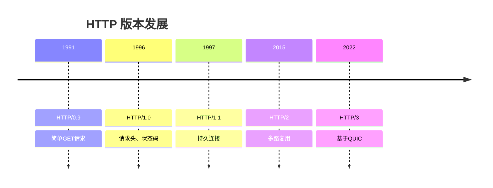
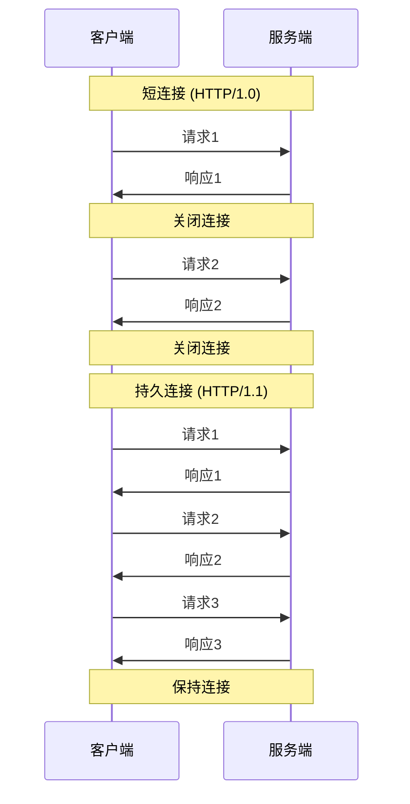
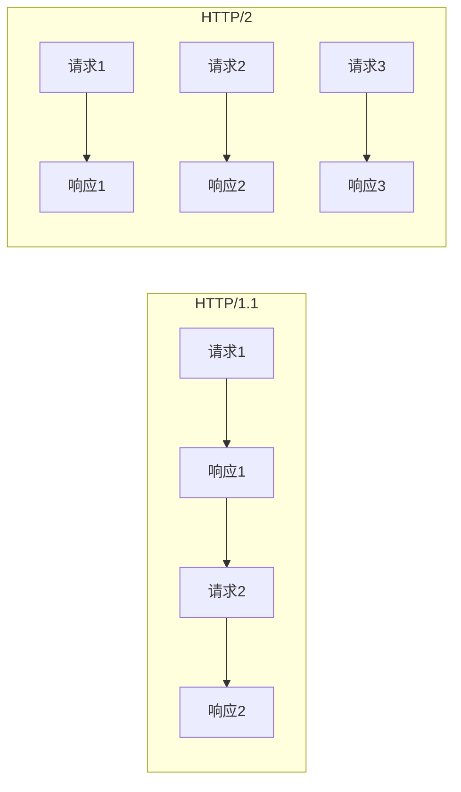
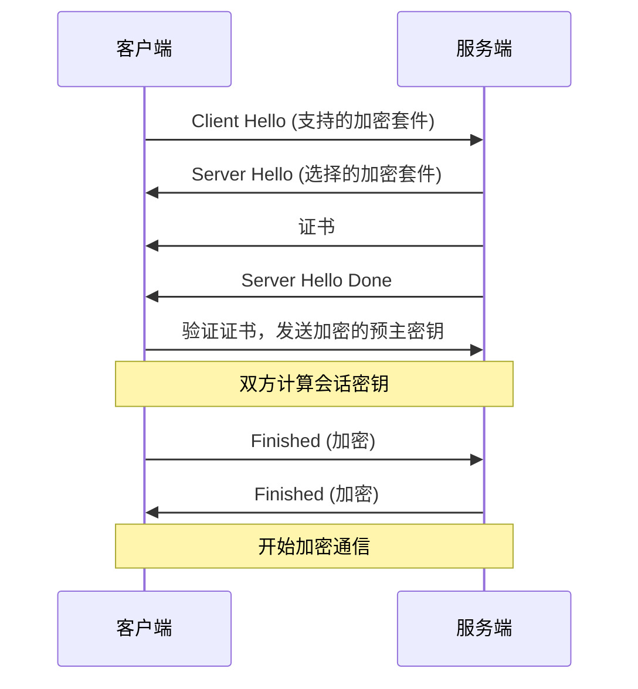
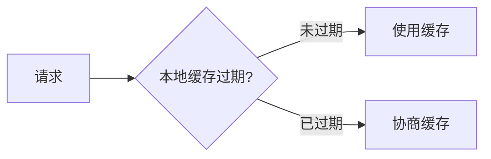

# HTTP 协议详解

HTTP（HyperText Transfer Protocol）是 Web 通信的基础协议。

## HTTP 版本演进



## HTTP 报文结构

### 请求报文

```
GET /index.html HTTP/1.1
Host: www.example.com
User-Agent: Mozilla/5.0
Accept: text/html
Accept-Language: zh-CN
Connection: keep-alive

[请求体]
```

### 响应报文

```
HTTP/1.1 200 OK
Content-Type: text/html; charset=utf-8
Content-Length: 1234
Date: Tue, 17 Dec 2024 12:00:00 GMT
Server: nginx

<!DOCTYPE html>
<html>...
```

## 请求方法

| 方法    | 描述             | 幂等性 | 安全性 |
| ------- | ---------------- | ------ | ------ |
| GET     | 获取资源         | ✅     | ✅     |
| POST    | 创建资源         | ❌     | ❌     |
| PUT     | 更新资源（完整） | ✅     | ❌     |
| PATCH   | 更新资源（部分） | ❌     | ❌     |
| DELETE  | 删除资源         | ✅     | ❌     |
| HEAD    | 获取响应头       | ✅     | ✅     |
| OPTIONS | 获取支持的方法   | ✅     | ✅     |

## 状态码

### 状态码分类

| 范围 | 类别       | 描述                 |
| ---- | ---------- | -------------------- |
| 1xx  | 信息性     | 请求已接收，继续处理 |
| 2xx  | 成功       | 请求成功             |
| 3xx  | 重定向     | 需要进一步操作       |
| 4xx  | 客户端错误 | 请求有误             |
| 5xx  | 服务端错误 | 服务器处理失败       |

### 常见状态码

| 状态码 | 含义                  | 说明               |
| ------ | --------------------- | ------------------ |
| 200    | OK                    | 请求成功           |
| 201    | Created               | 资源创建成功       |
| 204    | No Content            | 成功但无返回内容   |
| 301    | Moved Permanently     | 永久重定向         |
| 302    | Found                 | 临时重定向         |
| 304    | Not Modified          | 资源未修改（缓存） |
| 400    | Bad Request           | 请求语法错误       |
| 401    | Unauthorized          | 未认证             |
| 403    | Forbidden             | 禁止访问           |
| 404    | Not Found             | 资源不存在         |
| 500    | Internal Server Error | 服务器内部错误     |
| 502    | Bad Gateway           | 网关错误           |
| 503    | Service Unavailable   | 服务不可用         |
| 504    | Gateway Timeout       | 网关超时           |

## HTTP/1.1 特性

### 持久连接



### 管道化

允许连续发送多个请求，不必等待响应：

- 优点：减少延迟
- 缺点：队头阻塞（HOL Blocking）

## HTTP/2 特性

### 多路复用



### 核心改进

| 特性       | 描述                 |
| ---------- | -------------------- |
| 二进制分帧 | 将消息分割为更小的帧 |
| 多路复用   | 单连接并行多请求     |
| 头部压缩   | HPACK 算法压缩头部   |
| 服务器推送 | 主动推送资源         |
| 流优先级   | 设置请求优先级       |

## HTTP/3 特性

基于 **QUIC** 协议（UDP），解决 TCP 层面的队头阻塞：

| 特性     | HTTP/2  | HTTP/3     |
| -------- | ------- | ---------- |
| 传输层   | TCP     | QUIC (UDP) |
| 握手延迟 | 1-3 RTT | 0-1 RTT    |
| 队头阻塞 | 有      | 无         |
| 连接迁移 | 不支持  | 支持       |

## HTTPS

HTTPS = HTTP + TLS/SSL

### 握手过程



### HTTPS vs HTTP

| 对比项 | HTTP     | HTTPS          |
| ------ | -------- | -------------- |
| 端口   | 80       | 443            |
| 安全性 | 明文传输 | 加密传输       |
| 证书   | 不需要   | 需要 CA 证书   |
| 性能   | 较快     | 略慢（加解密） |

## 缓存机制

### 强缓存



- **Expires**：绝对过期时间
- **Cache-Control**：相对过期时间
  - `max-age=3600`：缓存 1 小时
  - `no-cache`：需要协商
  - `no-store`：不缓存

### 协商缓存

| 请求头            | 响应头        | 说明         |
| ----------------- | ------------- | ------------ |
| If-Modified-Since | Last-Modified | 基于时间     |
| If-None-Match     | ETag          | 基于内容哈希 |

## Cookie 与 Session

### Cookie

```http
Set-Cookie: sessionId=abc123; Path=/; HttpOnly; Secure; SameSite=Strict
```

| 属性     | 说明          |
| -------- | ------------- |
| HttpOnly | JS 无法访问   |
| Secure   | 仅 HTTPS 传输 |
| SameSite | 防止 CSRF     |

### Session vs Token

| 对比项 | Session      | Token (JWT) |
| ------ | ------------ | ----------- |
| 存储   | 服务端       | 客户端      |
| 扩展性 | 需要共享存储 | 无状态      |
| 安全性 | CSRF 风险    | XSS 风险    |

## 下一步

- 了解 [WebSocket 协议](./websocket)
- 学习 [TLS/SSL](./tls-ssl) 安全机制
