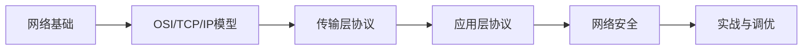
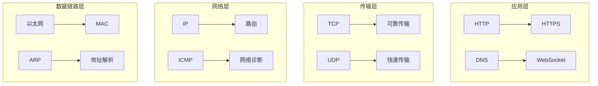

# 🌐 计算机网络

计算机网络是连接世界的基础设施，理解网络原理对于开发者至关重要。本文档系统介绍网络基础知识、协议栈、以及常见网络问题的分析与解决。

## 📚 学习路径

## 🎯 核心内容

### 📖 基础知识

| 主题                            | 描述                           | 难度   |
| ------------------------------- | ------------------------------ | ------ |
| [网络模型](./osi-tcp-ip)        | OSI 七层模型与 TCP/IP 四层模型 | ⭐⭐   |
| [数据链路层](./data-link-layer) | MAC 地址、以太网、ARP 协议     | ⭐⭐   |
| [网络层](./network-layer)       | IP 协议、路由、ICMP            | ⭐⭐⭐ |

### 🔧 传输层协议

| 主题                                | 描述                         | 难度   |
| ----------------------------------- | ---------------------------- | ------ |
| [TCP 协议](./tcp)                   | 三次握手、四次挥手、可靠传输 | ⭐⭐⭐ |
| [UDP 协议](./udp)                   | 无连接传输、应用场景         | ⭐⭐   |
| [Socket 编程](./socket-programming) | 网络编程基础                 | ⭐⭐⭐ |

### 🌐 应用层协议

| 主题                     | 描述             | 难度   |
| ------------------------ | ---------------- | ------ |
| [HTTP/HTTPS](./http)     | Web 通信协议详解 | ⭐⭐⭐ |
| [DNS](./dns)             | 域名解析系统     | ⭐⭐   |
| [WebSocket](./websocket) | 全双工通信协议   | ⭐⭐⭐ |

### 🔒 网络安全

| 主题                   | 描述               | 难度     |
| ---------------------- | ------------------ | -------- |
| [TLS/SSL](./tls-ssl)   | 传输层安全协议     | ⭐⭐⭐   |
| [网络攻防](./security) | 常见攻击与防护措施 | ⭐⭐⭐⭐ |

### 📚 参考指南

| 主题                            | 描述                   |
| ------------------------------- | ---------------------- |
| [快速参考](./quick-reference)   | 协议端口、报文格式速查 |
| [常见问题](./faq)               | 网络问题排查与解决     |
| [面试题](/docs/interview/networking-interview-questions) | 网络相关面试题精选     |

## 💡 为什么学习计算机网络？

- **开发必备**：理解网络通信是后端开发的基础
- **问题排查**：快速定位和解决网络相关问题
- **性能优化**：优化应用的网络传输性能
- **安全意识**：了解网络安全威胁与防护

## 📊 知识体系

---

> 📌 **提示**：建议按照学习路径顺序阅读，从基础概念开始，逐步深入到具体协议和实战应用。
