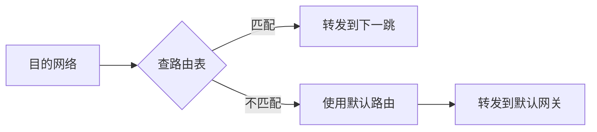
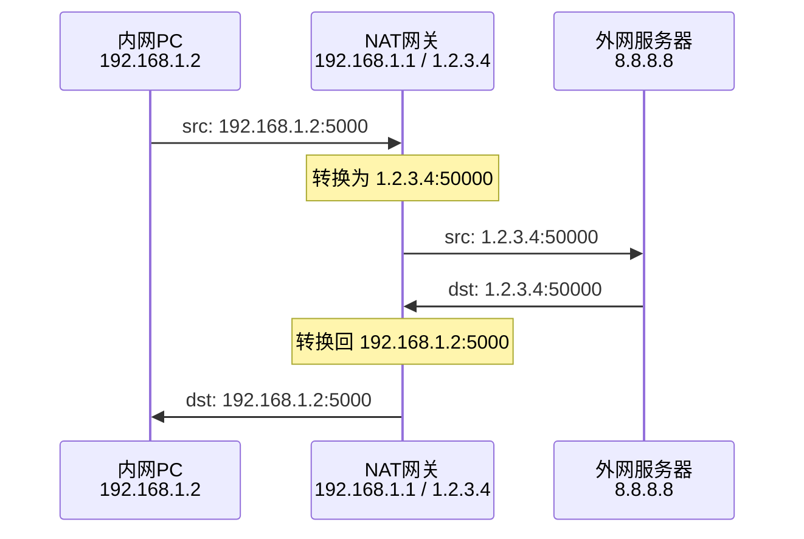

# 网络层

网络层（Network Layer）是 OSI 模型的第三层，负责将数据从源主机传输到目的主机，实现端到端的数据传输。

## 核心功能

- **逻辑寻址**：使用 IP 地址标识网络中的设备
- **路由选择**：确定数据包传输的最佳路径
- **分片重组**：将大数据包分片以适应链路 MTU
- **流量控制**：管理网络拥塞

## IP 协议

IP（Internet Protocol）是网络层的核心协议，定义了数据包的格式和寻址方式。

### IPv4 报文结构

```
 0                   1                   2                   3
 0 1 2 3 4 5 6 7 8 9 0 1 2 3 4 5 6 7 8 9 0 1 2 3 4 5 6 7 8 9 0 1
+-+-+-+-+-+-+-+-+-+-+-+-+-+-+-+-+-+-+-+-+-+-+-+-+-+-+-+-+-+-+-+-+
|Version|  IHL  |Type of Service|          Total Length         |
+-+-+-+-+-+-+-+-+-+-+-+-+-+-+-+-+-+-+-+-+-+-+-+-+-+-+-+-+-+-+-+-+
|         Identification        |Flags|      Fragment Offset    |
+-+-+-+-+-+-+-+-+-+-+-+-+-+-+-+-+-+-+-+-+-+-+-+-+-+-+-+-+-+-+-+-+
|  Time to Live |    Protocol   |         Header Checksum       |
+-+-+-+-+-+-+-+-+-+-+-+-+-+-+-+-+-+-+-+-+-+-+-+-+-+-+-+-+-+-+-+-+
|                       Source Address                          |
+-+-+-+-+-+-+-+-+-+-+-+-+-+-+-+-+-+-+-+-+-+-+-+-+-+-+-+-+-+-+-+-+
|                    Destination Address                        |
+-+-+-+-+-+-+-+-+-+-+-+-+-+-+-+-+-+-+-+-+-+-+-+-+-+-+-+-+-+-+-+-+
|                    Options                    |    Padding    |
+-+-+-+-+-+-+-+-+-+-+-+-+-+-+-+-+-+-+-+-+-+-+-+-+-+-+-+-+-+-+-+-+
```

### 关键字段

| 字段           | 大小   | 描述                      |
| -------------- | ------ | ------------------------- |
| Version        | 4 bit  | IP 版本（4 = IPv4）       |
| IHL            | 4 bit  | 首部长度（单位：4 字节）  |
| TTL            | 8 bit  | 生存时间（跳数限制）      |
| Protocol       | 8 bit  | 上层协议（TCP=6, UDP=17） |
| Source IP      | 32 bit | 源 IP 地址                |
| Destination IP | 32 bit | 目的 IP 地址              |

## IP 地址

### IPv4 地址分类

| 类别 | 首位 | 范围                        | 网络数    | 主机数     |
| ---- | ---- | --------------------------- | --------- | ---------- |
| A    | 0    | 1.0.0.0 - 126.255.255.255   | 126       | 16,777,214 |
| B    | 10   | 128.0.0.0 - 191.255.255.255 | 16,384    | 65,534     |
| C    | 110  | 192.0.0.0 - 223.255.255.255 | 2,097,152 | 254        |
| D    | 1110 | 224.0.0.0 - 239.255.255.255 | -         | 组播地址   |
| E    | 1111 | 240.0.0.0 - 255.255.255.255 | -         | 保留       |

### 私有地址范围

| 类别 | CIDR           | IP 范围                       |
| ---- | -------------- | ----------------------------- |
| A    | 10.0.0.0/8     | 10.0.0.0 - 10.255.255.255     |
| B    | 172.16.0.0/12  | 172.16.0.0 - 172.31.255.255   |
| C    | 192.168.0.0/16 | 192.168.0.0 - 192.168.255.255 |

### 特殊地址

| 地址            | 用途               |
| --------------- | ------------------ |
| 0.0.0.0         | 本机（不确定地址） |
| 127.0.0.1       | 本地回环           |
| 255.255.255.255 | 有限广播           |
| x.x.x.255       | 直接广播           |

## 子网划分

### CIDR 表示法

```
192.168.1.0/24
└────┬────┘ └┬┘
   网络地址  前缀长度

192.168.1.100/24
网络地址: 192.168.1.0
广播地址: 192.168.1.255
可用主机: 192.168.1.1 - 192.168.1.254
```

### 子网掩码计算

| CIDR | 子网掩码        | 可用主机数 |
| ---- | --------------- | ---------- |
| /24  | 255.255.255.0   | 254        |
| /25  | 255.255.255.128 | 126        |
| /26  | 255.255.255.192 | 62         |
| /27  | 255.255.255.224 | 30         |
| /28  | 255.255.255.240 | 14         |
| /29  | 255.255.255.248 | 6          |
| /30  | 255.255.255.252 | 2          |

### 计算示例

```
IP: 192.168.1.130/26

子网掩码: 255.255.255.192 (11111111.11111111.11111111.11000000)
网络地址: 192.168.1.128 (192.168.1.130 AND 255.255.255.192)
广播地址: 192.168.1.191
主机范围: 192.168.1.129 - 192.168.1.190
```

## 路由

路由是选择数据包从源到目的传输路径的过程。

### 路由表



### 路由表示例

```
Destination     Gateway         Genmask         Iface
0.0.0.0         192.168.1.1     0.0.0.0         eth0
192.168.1.0     0.0.0.0         255.255.255.0   eth0
10.0.0.0        192.168.1.2     255.0.0.0       eth0
```

### 路由协议分类

| 类型     | 协议        | 特点           |
| -------- | ----------- | -------------- |
| 静态     | -           | 手动配置       |
| 距离矢量 | RIP, IGRP   | 跳数作为度量   |
| 链路状态 | OSPF, IS-IS | 带宽、延迟度量 |
| 路径矢量 | BGP         | AS 路径策略    |

## ICMP 协议

ICMP（Internet Control Message Protocol）用于在 IP 网络中传递控制信息和错误报告。

### 报文类型

| 类型 | 代码 | 描述                    |
| ---- | ---- | ----------------------- |
| 0    | 0    | Echo Reply              |
| 3    | 0-15 | Destination Unreachable |
| 5    | 0-3  | Redirect                |
| 8    | 0    | Echo Request            |
| 11   | 0-1  | Time Exceeded           |

### 常用工具

```bash
# Ping - 测试连通性
ping 192.168.1.1

# Traceroute - 路径跟踪
traceroute www.google.com

# MTU 发现
ping -M do -s 1472 192.168.1.1
```

## IPv6

IPv6 是下一代 IP 协议，使用 128 位地址。

### 地址格式

```
完整格式: 2001:0db8:0000:0000:0000:0000:1428:57ab
压缩格式: 2001:db8::1428:57ab
```

### IPv6 vs IPv4

| 特性     | IPv4       | IPv6             |
| -------- | ---------- | ---------------- |
| 地址长度 | 32 位      | 128 位           |
| 地址数量 | ~43 亿     | ~3.4×10^38       |
| 地址表示 | 点分十进制 | 冒号分隔十六进制 |
| 首部长度 | 可变       | 固定 40 字节     |
| 广播     | 支持       | 用多播替代       |
| ARP      | 需要       | 用 NDP 替代      |

### 特殊地址

| 地址   | 用途         |
| ------ | ------------ |
| ::1    | 本地回环     |
| ::     | 未指定地址   |
| fe80:: | 链路本地地址 |
| ff00:: | 多播地址     |

## NAT（网络地址转换）

NAT 将私有 IP 地址转换为公网 IP 地址，解决 IPv4 地址不足问题。

### NAT 类型

| 类型     | 描述                   |
| -------- | ---------------------- |
| 静态 NAT | 一对一映射             |
| 动态 NAT | 多对多映射（地址池）   |
| NAPT     | 多对一映射（端口复用） |

### 工作流程



## 下一步

- 深入学习 [TCP 协议](./tcp)
- 了解 [UDP 协议](./udp)
