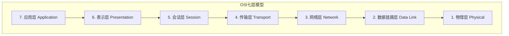
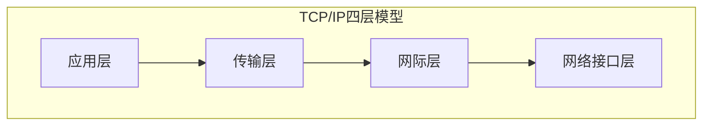

# 网络模型

理解网络模型是学习计算机网络的基础，本文介绍 OSI 七层模型和 TCP/IP 四层模型。

## OSI 七层模型

OSI（Open Systems Interconnection）模型将网络通信分为七个层次：

### 各层功能

| 层级 | 名称       | 功能                   | 协议示例             |
| ---- | ---------- | ---------------------- | -------------------- |
| 7    | 应用层     | 为用户提供网络服务接口 | HTTP, FTP, SMTP, DNS |
| 6    | 表示层     | 数据格式转换、加密解密 | SSL/TLS, JPEG, GIF   |
| 5    | 会话层     | 建立、管理和终止会话   | NetBIOS, RPC         |
| 4    | 传输层     | 端到端可靠传输         | TCP, UDP             |
| 3    | 网络层     | 路由选择和逻辑寻址     | IP, ICMP, ARP        |
| 2    | 数据链路层 | 物理寻址和错误检测     | Ethernet, PPP        |
| 1    | 物理层     | 比特流传输             | RS-232, RJ45         |

## TCP/IP 四层模型

TCP/IP 模型是互联网的实际标准，将网络通信分为四个层次：

### 各层对应关系

| TCP/IP 层  | 对应 OSI 层              | 主要协议             |
| ---------- | ------------------------ | -------------------- |
| 应用层     | 应用层 + 表示层 + 会话层 | HTTP, FTP, DNS, SMTP |
| 传输层     | 传输层                   | TCP, UDP             |
| 网际层     | 网络层                   | IP, ICMP, ARP        |
| 网络接口层 | 数据链路层 + 物理层      | Ethernet, Wi-Fi      |

## 数据封装过程

数据在网络中传输时，经历封装和解封装过程：

### 各层数据单元

| 层级       | 数据单元名称 | 英文            |
| ---------- | ------------ | --------------- |
| 应用层     | 消息/报文    | Message         |
| 传输层     | 段/数据段    | Segment         |
| 网络层     | 数据报/分组  | Packet/Datagram |
| 数据链路层 | 帧           | Frame           |
| 物理层     | 比特         | Bit             |

## 模型对比

### OSI vs TCP/IP

| 特性       | OSI 模型 | TCP/IP 模型 |
| ---------- | -------- | ----------- |
| 层数       | 7 层     | 4 层        |
| 定义时间   | 理论先行 | 实践中产生  |
| 应用范围   | 理论参考 | 互联网标准  |
| 灵活性     | 层次分明 | 更加灵活    |
| 协议独立性 | 是       | 否          |

## 实际应用

在实际工作中，我们更多使用 TCP/IP 模型，但理解 OSI 模型有助于：

1. **问题排查**：按层次分析网络问题
2. **概念理解**：明确各层职责边界
3. **面试准备**：OSI 模型是常见面试题

## 面试常问

:::tip 经典问题
**Q：为什么需要分层？**

A：分层设计的好处：

1. 降低复杂度，各层独立实现
2. 便于标准化，促进互操作性
3. 易于维护和升级
4. 促进模块化开发
   :::

## 下一步

- 深入了解 [TCP 协议](./tcp)
- 学习 [HTTP 协议](./http) 的工作原理
