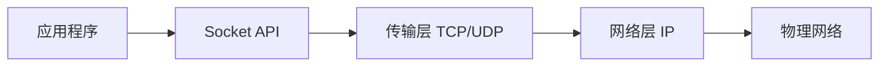
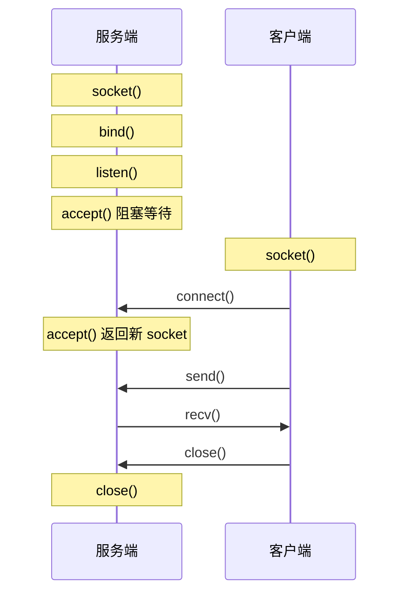
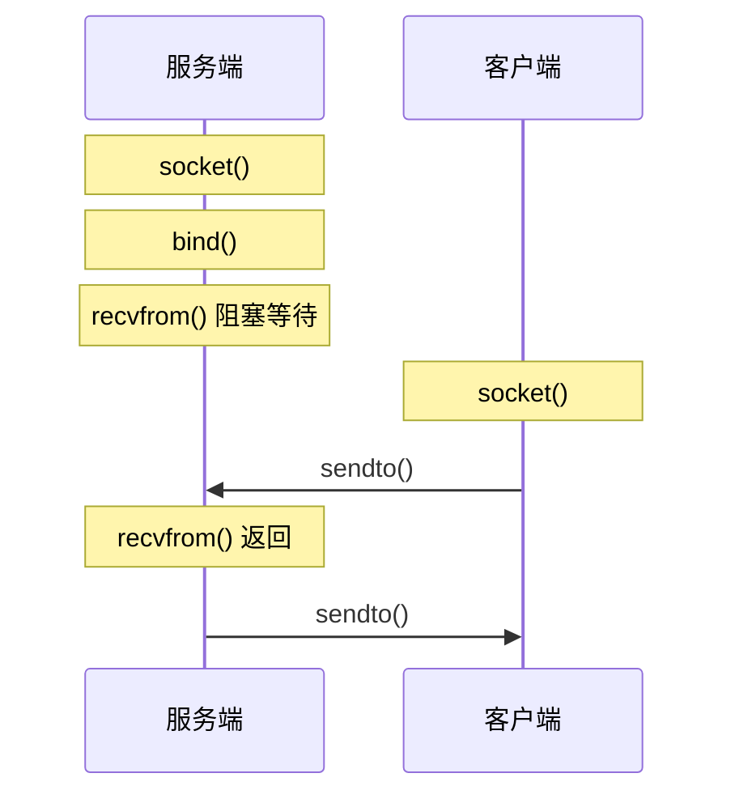
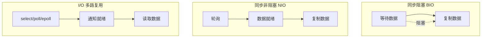
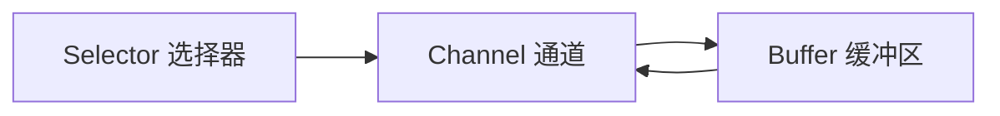
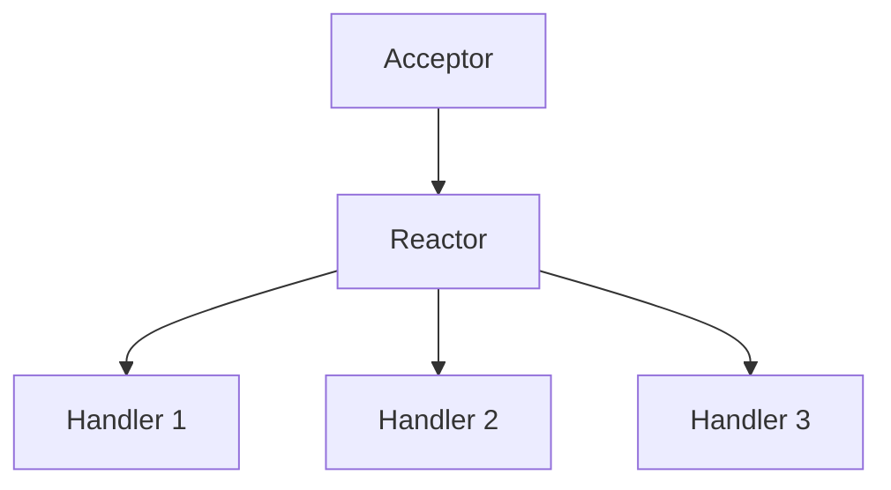

# Socket 编程

Socket（套接字）是网络通信的端点，提供了应用层与传输层之间的接口。

## 基本概念

### 什么是 Socket？



Socket 本质是一个**文件描述符**，通过它可以发送和接收网络数据。

### Socket 五元组

一个网络连接由以下五个元素唯一标识：

```
<协议, 源IP, 源端口, 目的IP, 目的端口>
```

| 元素     | 示例          |
| -------- | ------------- |
| 协议     | TCP           |
| 源 IP    | 192.168.1.100 |
| 源端口   | 52341         |
| 目的 IP  | 142.250.80.46 |
| 目的端口 | 443           |

## TCP Socket

### 通信流程



### Java TCP 服务端

```java
public class TcpServer {
    public static void main(String[] args) throws IOException {
        // 1. 创建 ServerSocket，绑定端口
        ServerSocket serverSocket = new ServerSocket(8080);
        System.out.println("服务器启动，监听端口 8080");

        while (true) {
            // 2. 接受客户端连接（阻塞）
            Socket clientSocket = serverSocket.accept();
            System.out.println("客户端连接: " + clientSocket.getRemoteSocketAddress());

            // 3. 处理请求
            try (BufferedReader in = new BufferedReader(
                     new InputStreamReader(clientSocket.getInputStream()));
                 PrintWriter out = new PrintWriter(
                     clientSocket.getOutputStream(), true)) {

                String line;
                while ((line = in.readLine()) != null) {
                    System.out.println("收到: " + line);
                    out.println("Echo: " + line);
                }
            }

            // 4. 关闭连接
            clientSocket.close();
        }
    }
}
```

### Java TCP 客户端

```java
public class TcpClient {
    public static void main(String[] args) throws IOException {
        // 1. 创建 Socket，连接服务器
        Socket socket = new Socket("localhost", 8080);

        // 2. 发送和接收数据
        try (PrintWriter out = new PrintWriter(socket.getOutputStream(), true);
             BufferedReader in = new BufferedReader(
                 new InputStreamReader(socket.getInputStream()))) {

            out.println("Hello, Server!");
            String response = in.readLine();
            System.out.println("响应: " + response);
        }

        // 3. 关闭连接
        socket.close();
    }
}
```

## UDP Socket

### 通信流程



### Java UDP 服务端

```java
public class UdpServer {
    public static void main(String[] args) throws IOException {
        DatagramSocket socket = new DatagramSocket(9999);
        byte[] buffer = new byte[1024];

        while (true) {
            // 接收数据
            DatagramPacket packet = new DatagramPacket(buffer, buffer.length);
            socket.receive(packet);

            String message = new String(packet.getData(), 0, packet.getLength());
            System.out.println("收到: " + message);

            // 发送响应
            byte[] response = ("Echo: " + message).getBytes();
            DatagramPacket reply = new DatagramPacket(
                response, response.length,
                packet.getAddress(), packet.getPort()
            );
            socket.send(reply);
        }
    }
}
```

### Java UDP 客户端

```java
public class UdpClient {
    public static void main(String[] args) throws IOException {
        DatagramSocket socket = new DatagramSocket();
        InetAddress address = InetAddress.getByName("localhost");

        // 发送数据
        String message = "Hello UDP";
        byte[] data = message.getBytes();
        DatagramPacket packet = new DatagramPacket(data, data.length, address, 9999);
        socket.send(packet);

        // 接收响应
        byte[] buffer = new byte[1024];
        DatagramPacket response = new DatagramPacket(buffer, buffer.length);
        socket.receive(response);

        System.out.println("响应: " + new String(response.getData(), 0, response.getLength()));
        socket.close();
    }
}
```

## I/O 模型

### 五种 I/O 模型



| 模型         | 特点             | 适用场景       |
| ------------ | ---------------- | -------------- |
| 阻塞 I/O     | 简单，但线程阻塞 | 连接数少       |
| 非阻塞 I/O   | 轮询消耗 CPU     | 不推荐单独使用 |
| I/O 多路复用 | 单线程管理多连接 | 高并发服务器   |
| 信号驱动 I/O | 内核通知         | 较少使用       |
| 异步 I/O     | 完全异步         | 高性能服务器   |

### BIO vs NIO

| 对比项   | BIO（阻塞）            | NIO（非阻塞）      |
| -------- | ---------------------- | ------------------ |
| 连接处理 | 一连接一线程           | 一线程处理多连接   |
| 阻塞     | accept/read/write 阻塞 | 非阻塞，可立即返回 |
| 适用场景 | 连接少，短连接         | 高并发，长连接     |
| 框架     | 传统 Socket            | Java NIO, Netty    |

### I/O 多路复用

| 系统调用 | 最大连接数 | 效率 | 特点                 |
| -------- | ---------- | ---- | -------------------- |
| select   | 1024       | O(n) | 跨平台               |
| poll     | 无限制     | O(n) | 无连接数限制         |
| epoll    | 无限制     | O(1) | Linux 专用，性能最好 |
| kqueue   | 无限制     | O(1) | BSD/macOS            |

## Java NIO

### 核心组件



| 组件     | 描述                    |
| -------- | ----------------------- |
| Channel  | 双向数据通道            |
| Buffer   | 数据读写缓冲区          |
| Selector | 监控多个 Channel 的事件 |

### NIO 服务端示例

```java
public class NioServer {
    public static void main(String[] args) throws IOException {
        // 1. 创建 Selector
        Selector selector = Selector.open();

        // 2. 创建 ServerSocketChannel
        ServerSocketChannel serverChannel = ServerSocketChannel.open();
        serverChannel.bind(new InetSocketAddress(8080));
        serverChannel.configureBlocking(false);
        serverChannel.register(selector, SelectionKey.OP_ACCEPT);

        System.out.println("NIO 服务器启动");

        while (true) {
            // 3. 等待事件
            selector.select();
            Set<SelectionKey> keys = selector.selectedKeys();
            Iterator<SelectionKey> iterator = keys.iterator();

            while (iterator.hasNext()) {
                SelectionKey key = iterator.next();
                iterator.remove();

                if (key.isAcceptable()) {
                    // 4. 处理连接
                    ServerSocketChannel server = (ServerSocketChannel) key.channel();
                    SocketChannel client = server.accept();
                    client.configureBlocking(false);
                    client.register(selector, SelectionKey.OP_READ);
                    System.out.println("客户端连接: " + client.getRemoteAddress());

                } else if (key.isReadable()) {
                    // 5. 处理读取
                    SocketChannel client = (SocketChannel) key.channel();
                    ByteBuffer buffer = ByteBuffer.allocate(1024);
                    int bytesRead = client.read(buffer);

                    if (bytesRead > 0) {
                        buffer.flip();
                        String message = new String(buffer.array(), 0, bytesRead);
                        System.out.println("收到: " + message);

                        // 回复
                        buffer.clear();
                        buffer.put(("Echo: " + message).getBytes());
                        buffer.flip();
                        client.write(buffer);
                    } else if (bytesRead == -1) {
                        client.close();
                    }
                }
            }
        }
    }
}
```

## 常见模式

### 线程池处理

```java
ExecutorService executor = Executors.newFixedThreadPool(100);

while (true) {
    Socket client = serverSocket.accept();
    executor.submit(() -> handleClient(client));
}
```

### Reactor 模式



- **单 Reactor 单线程**：简单，适合小规模
- **单 Reactor 多线程**：处理能力增强
- **主从 Reactor**：Netty 采用的模式

## Socket 选项

| 选项         | 描述            |
| ------------ | --------------- |
| SO_REUSEADDR | 允许地址重用    |
| SO_KEEPALIVE | 开启 TCP 保活   |
| SO_RCVBUF    | 接收缓冲区大小  |
| SO_SNDBUF    | 发送缓冲区大小  |
| TCP_NODELAY  | 禁用 Nagle 算法 |
| SO_TIMEOUT   | 读取超时时间    |

```java
socket.setReuseAddress(true);
socket.setKeepAlive(true);
socket.setTcpNoDelay(true);
socket.setSoTimeout(30000);
```

## 下一步

- 学习 [Netty 框架](/docs/netty)
- 了解 [WebSocket 协议](./websocket)
