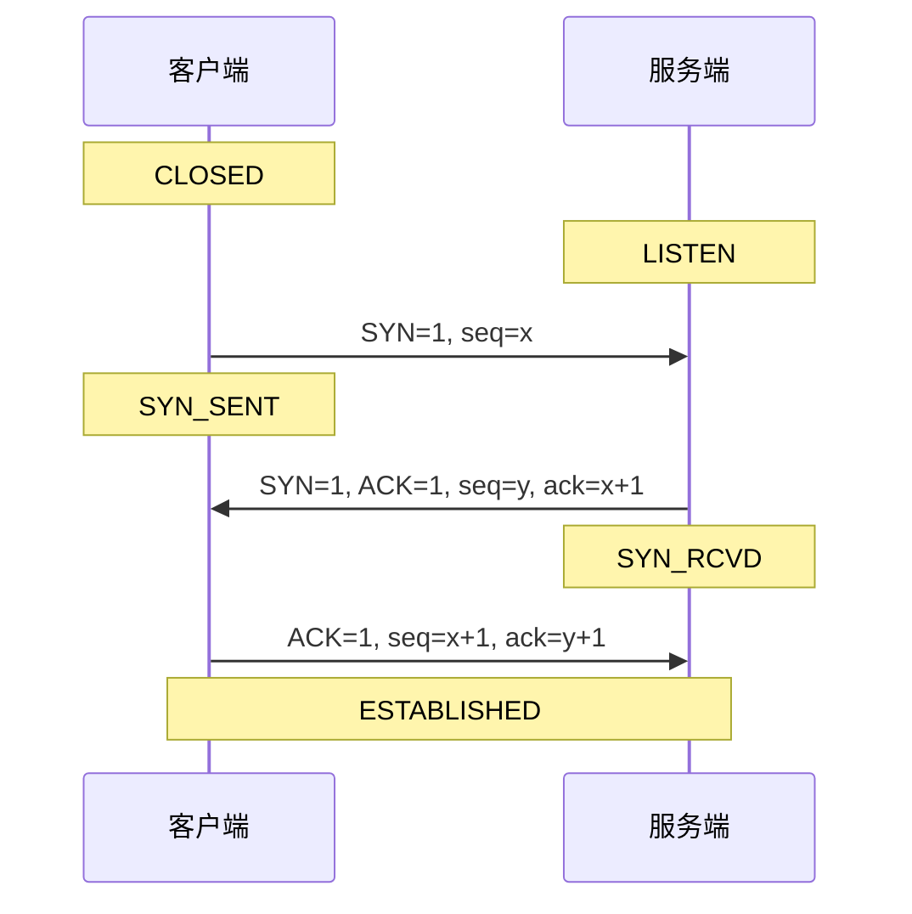
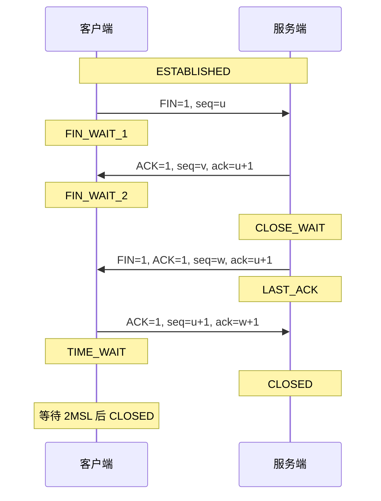
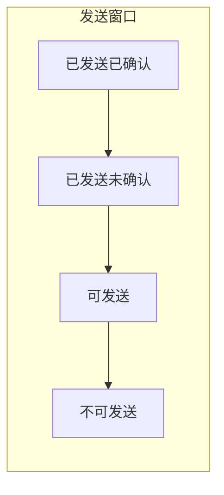
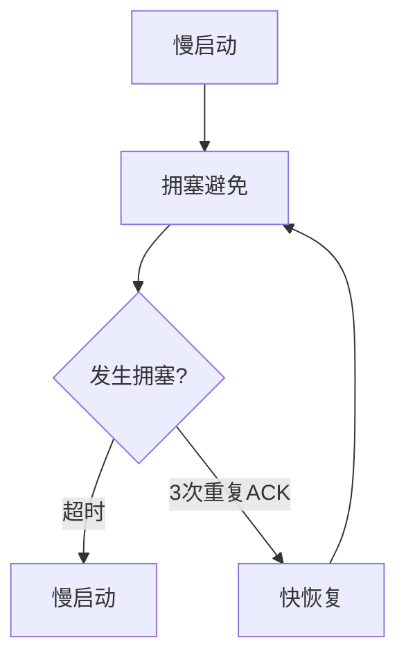
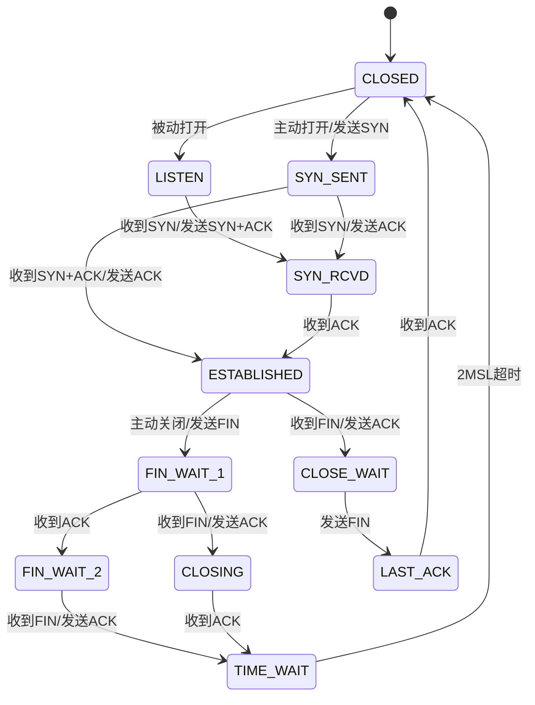

# TCP 协议详解

TCP（Transmission Control Protocol）是面向连接的、可靠的传输层协议。

## 核心特性

- **面向连接**：通信前必须建立连接
- **可靠传输**：保证数据正确、有序到达
- **流量控制**：防止发送方过快
- **拥塞控制**：防止网络过载
- **全双工通信**：双向同时传输

## TCP 报文结构

```
 0                   1                   2                   3
 0 1 2 3 4 5 6 7 8 9 0 1 2 3 4 5 6 7 8 9 0 1 2 3 4 5 6 7 8 9 0 1
+-+-+-+-+-+-+-+-+-+-+-+-+-+-+-+-+-+-+-+-+-+-+-+-+-+-+-+-+-+-+-+-+
|          Source Port          |       Destination Port        |
+-+-+-+-+-+-+-+-+-+-+-+-+-+-+-+-+-+-+-+-+-+-+-+-+-+-+-+-+-+-+-+-+
|                        Sequence Number                        |
+-+-+-+-+-+-+-+-+-+-+-+-+-+-+-+-+-+-+-+-+-+-+-+-+-+-+-+-+-+-+-+-+
|                    Acknowledgment Number                      |
+-+-+-+-+-+-+-+-+-+-+-+-+-+-+-+-+-+-+-+-+-+-+-+-+-+-+-+-+-+-+-+-+
|  Data |       |U|A|P|R|S|F|                                   |
| Offset|  Res  |R|C|S|S|Y|I|            Window                 |
|       |       |G|K|H|T|N|N|                                   |
+-+-+-+-+-+-+-+-+-+-+-+-+-+-+-+-+-+-+-+-+-+-+-+-+-+-+-+-+-+-+-+-+
|           Checksum            |         Urgent Pointer        |
+-+-+-+-+-+-+-+-+-+-+-+-+-+-+-+-+-+-+-+-+-+-+-+-+-+-+-+-+-+-+-+-+
|                    Options                    |    Padding    |
+-+-+-+-+-+-+-+-+-+-+-+-+-+-+-+-+-+-+-+-+-+-+-+-+-+-+-+-+-+-+-+-+
|                             Data                              |
+-+-+-+-+-+-+-+-+-+-+-+-+-+-+-+-+-+-+-+-+-+-+-+-+-+-+-+-+-+-+-+-+
```

### 关键字段

| 字段             | 大小    | 描述       |
| ---------------- | ------- | ---------- |
| Source Port      | 16 bits | 源端口号   |
| Destination Port | 16 bits | 目标端口号 |
| Sequence Number  | 32 bits | 序列号     |
| ACK Number       | 32 bits | 确认号     |
| Flags            | 6 bits  | 控制标志位 |
| Window           | 16 bits | 窗口大小   |

## 三次握手

建立 TCP 连接需要三次握手（Three-way Handshake）：



### 为什么是三次握手？

1. **确认双方收发能力**：

   - 第一次：服务端确认客户端发送能力
   - 第二次：客户端确认服务端收发能力
   - 第三次：服务端确认客户端接收能力

2. **防止历史连接**：避免旧的重复连接请求造成混乱

3. **同步序列号**：双方交换初始序列号（ISN）

## 四次挥手

关闭 TCP 连接需要四次挥手（Four-way Handshake）：



### 为什么是四次挥手？

TCP 是全双工协议，每个方向需要单独关闭：

- **FIN + ACK**：关闭客户端到服务端方向
- **FIN + ACK**：关闭服务端到客户端方向

### TIME_WAIT 状态

- 持续时间：**2MSL**（Maximum Segment Lifetime，通常 60 秒）
- 作用：
  1. 确保最后一个 ACK 能被对端收到
  2. 让旧连接的数据包在网络中消失

## 流量控制

通过**滑动窗口**机制实现流量控制：



- **窗口大小**：接收方通过 Window 字段告知发送方
- **动态调整**：根据接收方缓冲区大小调整

## 拥塞控制

TCP 使用多种算法控制网络拥塞：

### 四种算法



| 算法     | 触发条件        | 行为              |
| -------- | --------------- | ----------------- |
| 慢启动   | 连接建立        | cwnd 指数增长     |
| 拥塞避免 | cwnd ≥ ssthresh | cwnd 线性增长     |
| 快重传   | 3 次重复 ACK    | 立即重传丢失报文  |
| 快恢复   | 快重传后        | ssthresh = cwnd/2 |

## TCP 状态机



## 常见问题

### SYN 攻击

**问题**：攻击者发送大量 SYN 请求但不完成握手，耗尽服务端资源。

**防护措施**：

- SYN Cookie
- 增大半连接队列
- 减小 SYN+ACK 重试次数

### 粘包与拆包

**原因**：TCP 是字节流协议，没有消息边界。

**解决方案**：

- 固定长度
- 特殊分隔符
- 消息头 + 消息体（推荐）

## 下一步

- 了解 [UDP 协议](./udp) 的特点
- 学习 [Socket 编程](./socket-programming) 实践
