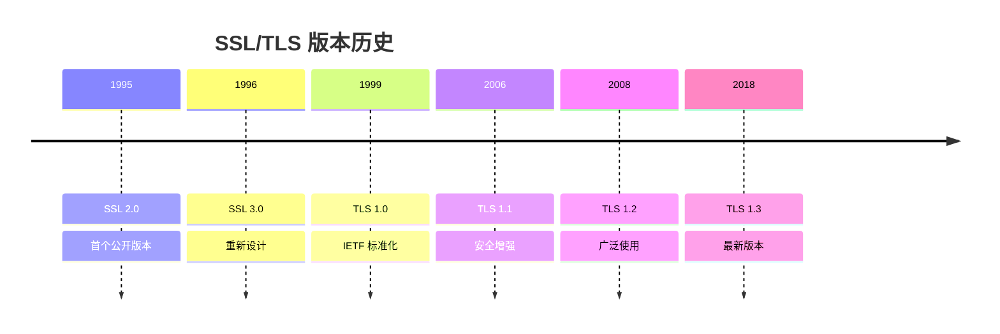
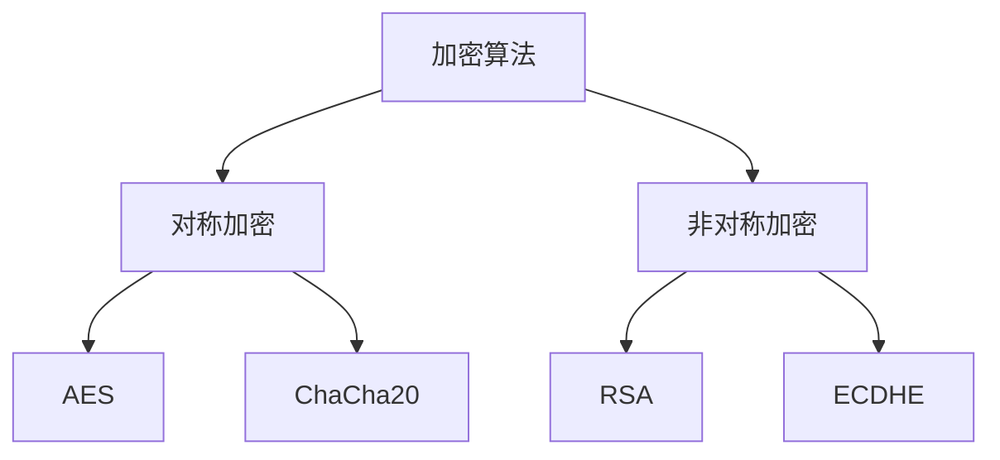
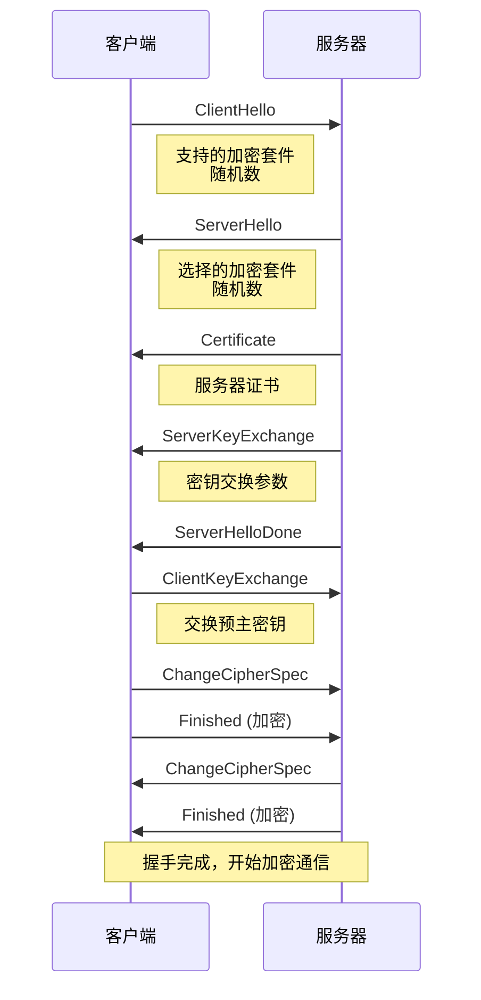
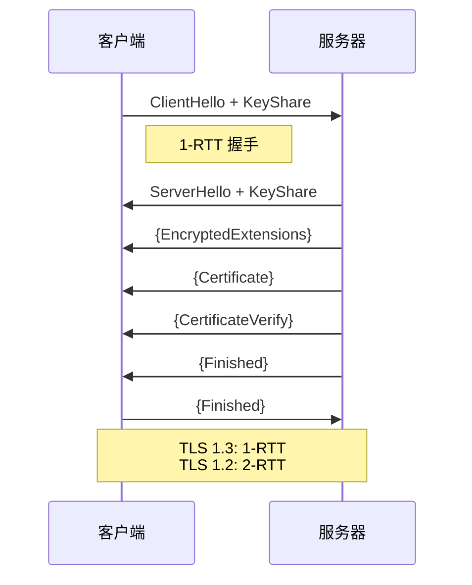
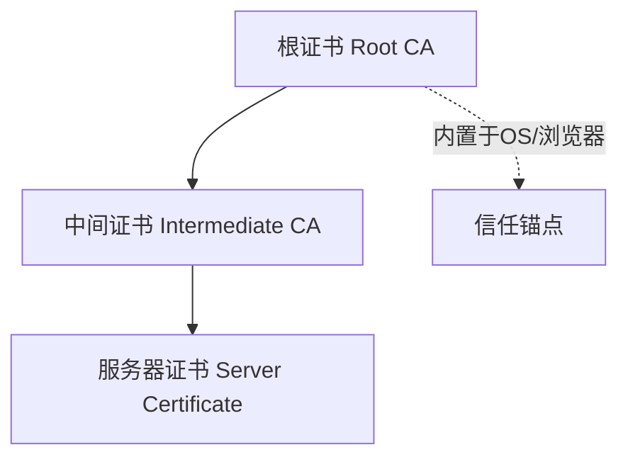

# TLS/SSL 安全协议

TLS（Transport Layer Security）是保护网络通信安全的加密协议，SSL（Secure Sockets Layer）是其前身。

## 版本演进



| 版本    | 状态    | 说明         |
| ------- | ------- | ------------ |
| SSL 2.0 | ❌ 废弃 | 严重安全漏洞 |
| SSL 3.0 | ❌ 废弃 | POODLE 攻击  |
| TLS 1.0 | ⚠️ 弃用 | 不建议使用   |
| TLS 1.1 | ⚠️ 弃用 | 不建议使用   |
| TLS 1.2 | ✅ 推荐 | 当前主流     |
| TLS 1.3 | ✅ 推荐 | 最新最安全   |

## 核心概念

### 安全目标

| 目标     | 描述                   | 实现方式     |
| -------- | ---------------------- | ------------ |
| 机密性   | 数据不被窃听           | 对称加密     |
| 完整性   | 数据不被篡改           | MAC/HMAC     |
| 身份验证 | 确认对方身份           | 数字证书     |
| 前向安全 | 密钥泄露不影响历史数据 | 临时密钥交换 |

### 加密类型



| 类型     | 算法        | 特点           | 用途           |
| -------- | ----------- | -------------- | -------------- |
| 对称加密 | AES-256-GCM | 快速           | 数据加密       |
| 非对称   | RSA-2048    | 安全但慢       | 密钥交换、签名 |
| 非对称   | ECDHE       | 更快、前向安全 | 密钥交换       |

## TLS 握手流程

### TLS 1.2 握手



### TLS 1.3 握手 (更快)



### TLS 1.3 改进

| 改进       | TLS 1.2 | TLS 1.3 |
| ---------- | ------- | ------- |
| 握手时间   | 2-RTT   | 1-RTT   |
| 0-RTT 恢复 | 不支持  | 支持    |
| 加密套件   | 200+ 种 | 5 种    |
| 前向安全   | 可选    | 强制    |

## 数字证书

### 证书结构

```
+------------------------+
|     证书版本 (V3)      |
+------------------------+
|     序列号             |
+------------------------+
|     签名算法           |
+------------------------+
|     颁发者 (Issuer)    |
+------------------------+
|     有效期             |
+------------------------+
|     主体 (Subject)     |
+------------------------+
|     公钥信息           |
+------------------------+
|     扩展字段           |
+------------------------+
|     CA 数字签名        |
+------------------------+
```

### 证书链



### 证书类型

| 类型 | 缩写                    | 验证内容     | 信任度 |
| ---- | ----------------------- | ------------ | ------ |
| DV   | Domain Validation       | 域名所有权   | 低     |
| OV   | Organization Validation | 域名 + 组织  | 中     |
| EV   | Extended Validation     | 完整企业验证 | 高     |

## 加密套件

### 命名规则

```
TLS_ECDHE_RSA_WITH_AES_256_GCM_SHA384
└┬┘ └──┬──┘└─┬─┘     └─────┬────┘└──┬─┘
 │     │     │            │        │
协议  密钥交换 认证       对称加密  MAC算法
```

### 推荐配置

```nginx
# Nginx TLS 配置
ssl_protocols TLSv1.2 TLSv1.3;
ssl_ciphers ECDHE-ECDSA-AES128-GCM-SHA256:ECDHE-RSA-AES128-GCM-SHA256:ECDHE-ECDSA-AES256-GCM-SHA384:ECDHE-RSA-AES256-GCM-SHA384;
ssl_prefer_server_ciphers on;
```

## 证书操作

### 查看证书

```bash
# 查看网站证书
openssl s_client -connect example.com:443

# 查看证书详情
openssl x509 -in certificate.crt -text -noout

# 验证证书链
openssl verify -CAfile ca-bundle.crt certificate.crt
```

### 生成自签名证书

```bash
# 生成私钥
openssl genrsa -out server.key 2048

# 生成 CSR
openssl req -new -key server.key -out server.csr

# 生成自签名证书
openssl x509 -req -days 365 -in server.csr \
    -signkey server.key -out server.crt
```

### Let's Encrypt 免费证书

```bash
# 使用 certbot
sudo certbot --nginx -d example.com

# 自动续期
sudo certbot renew
```

## HTTPS 配置

### Nginx 完整配置

```nginx
server {
    listen 443 ssl http2;
    server_name example.com;

    # 证书配置
    ssl_certificate /etc/ssl/certs/example.com.crt;
    ssl_certificate_key /etc/ssl/private/example.com.key;

    # 协议版本
    ssl_protocols TLSv1.2 TLSv1.3;

    # 加密套件
    ssl_ciphers 'ECDHE-ECDSA-AES128-GCM-SHA256:ECDHE-RSA-AES128-GCM-SHA256';
    ssl_prefer_server_ciphers on;

    # HSTS
    add_header Strict-Transport-Security "max-age=31536000" always;

    # OCSP Stapling
    ssl_stapling on;
    ssl_stapling_verify on;
}

# HTTP 重定向到 HTTPS
server {
    listen 80;
    server_name example.com;
    return 301 https://$server_name$request_uri;
}
```

## 安全最佳实践

### 配置检查

| 检查项   | 建议                    |
| -------- | ----------------------- |
| 协议版本 | 仅启用 TLS 1.2+         |
| 加密套件 | 禁用弱加密（RC4, 3DES） |
| 密钥长度 | RSA ≥ 2048, ECDSA ≥ 256 |
| 证书链   | 完整且有效              |
| HSTS     | 启用                    |

### 测试工具

- [SSL Labs](https://www.ssllabs.com/ssltest/)
- [testssl.sh](https://github.com/drwetter/testssl.sh)

```bash
# 使用 testssl.sh
./testssl.sh example.com
```

## 常见问题

### Q: HTTPS 比 HTTP 慢吗？

TLS 握手增加延迟，但 HTTP/2 和 TLS 1.3 可以弥补：

- TLS 1.3：1-RTT 握手
- 会话恢复：0-RTT
- HTTP/2：多路复用

### Q: 证书过期怎么办？

1. 浏览器显示警告
2. 用户可能无法访问
3. 设置自动续期（Let's Encrypt）

## 下一步

- 了解 [网络安全](./security) 攻防知识
- 学习 [HTTP 协议](./http) HTTPS 部分
