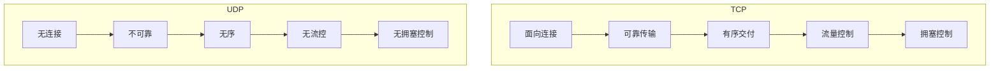
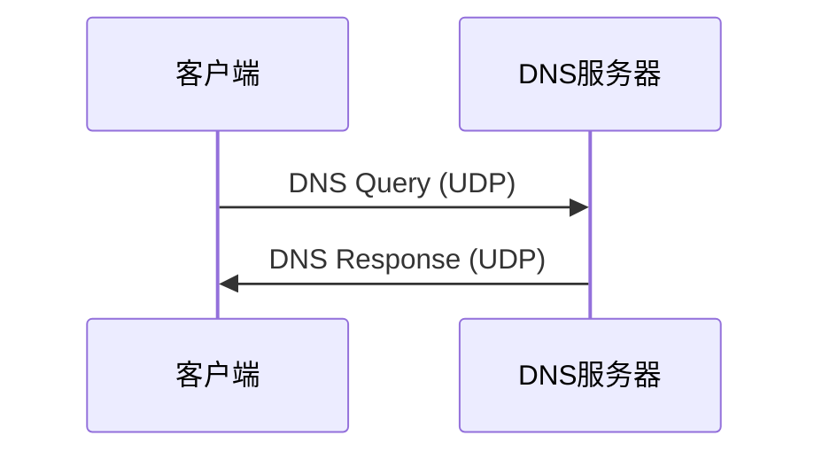
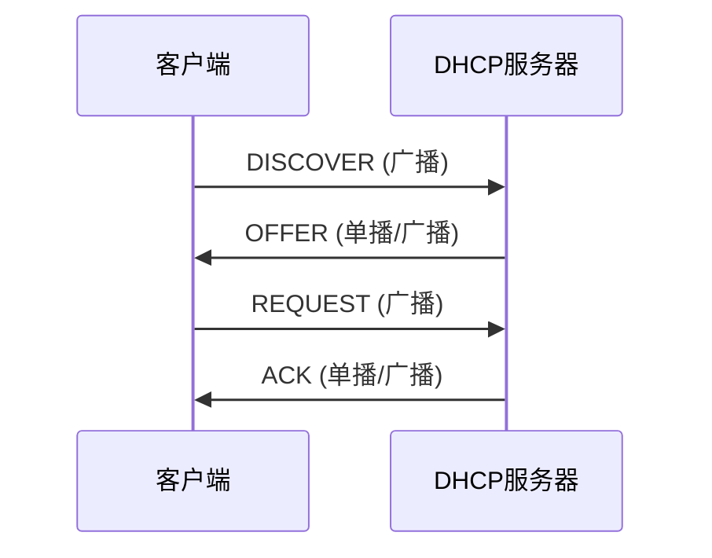
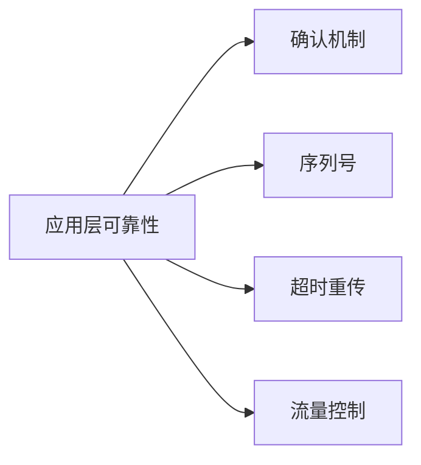

# UDP 协议详解

UDP（User Datagram Protocol）是一种无连接的传输层协议，提供简单、高效的数据传输服务。

## 核心特性

- **无连接**：不需要建立连接，直接发送
- **不可靠**：不保证数据到达和顺序
- **无拥塞控制**：发送速率不受网络拥塞影响
- **支持广播和多播**：一对多通信
- **头部开销小**：仅 8 字节

## UDP 报文结构

```
 0                   1                   2                   3
 0 1 2 3 4 5 6 7 8 9 0 1 2 3 4 5 6 7 8 9 0 1 2 3 4 5 6 7 8 9 0 1
+-+-+-+-+-+-+-+-+-+-+-+-+-+-+-+-+-+-+-+-+-+-+-+-+-+-+-+-+-+-+-+-+
|          Source Port          |       Destination Port        |
+-+-+-+-+-+-+-+-+-+-+-+-+-+-+-+-+-+-+-+-+-+-+-+-+-+-+-+-+-+-+-+-+
|            Length             |           Checksum            |
+-+-+-+-+-+-+-+-+-+-+-+-+-+-+-+-+-+-+-+-+-+-+-+-+-+-+-+-+-+-+-+-+
|                             Data                              |
+-+-+-+-+-+-+-+-+-+-+-+-+-+-+-+-+-+-+-+-+-+-+-+-+-+-+-+-+-+-+-+-+
```

### 字段说明

| 字段             | 大小   | 描述                   |
| ---------------- | ------ | ---------------------- |
| Source Port      | 16 bit | 源端口号               |
| Destination Port | 16 bit | 目的端口号             |
| Length           | 16 bit | 数据报总长度（含头部） |
| Checksum         | 16 bit | 校验和（可选）         |

:::tip
UDP 头部仅 8 字节，而 TCP 头部至少 20 字节。这使得 UDP 更加轻量高效。
:::

## TCP vs UDP



### 详细对比

| 特性      | TCP              | UDP               |
| --------- | ---------------- | ----------------- |
| 连接方式  | 面向连接         | 无连接            |
| 可靠性    | 可靠（确认重传） | 不可靠            |
| 有序性    | 保证顺序         | 不保证            |
| 传输方式  | 字节流           | 数据报            |
| 头部大小  | 20-60 字节       | 8 字节            |
| 传输效率  | 较低             | 较高              |
| 广播/多播 | 不支持           | 支持              |
| 适用场景  | 文件传输、网页   | 视频流、DNS、游戏 |

## 应用场景

### 1. DNS 查询

DNS 通常使用 UDP（端口 53）进行域名解析：



**原因**：

- 查询/响应模式简单
- 数据量小（通常 < 512 字节）
- 需要快速响应
- 丢包可以重试

### 2. 视频流/音频流

实时媒体传输优先选择 UDP：

```
发送端 --UDP--> 接收端
        ↓
    偶尔丢包 → 画面卡顿（可接受）

发送端 --TCP--> 接收端
        ↓
    重传等待 → 延迟累积（不可接受）
```

**原因**：

- 实时性要求高
- 少量丢包不影响体验
- 重传会导致延迟累积

### 3. 在线游戏

游戏状态更新使用 UDP：

| 数据类型 | 协议 | 原因       |
| -------- | ---- | ---------- |
| 位置同步 | UDP  | 实时性优先 |
| 登录认证 | TCP  | 可靠性优先 |
| 聊天消息 | TCP  | 不能丢失   |
| 动作指令 | UDP  | 低延迟     |

### 4. DHCP

动态主机配置使用 UDP（端口 67/68）：



### 5. SNMP

网络管理使用 UDP（端口 161/162）进行设备监控。

## 基于 UDP 的协议

| 协议 | 端口  | 用途            |
| ---- | ----- | --------------- |
| DNS  | 53    | 域名解析        |
| DHCP | 67/68 | 动态 IP 分配    |
| TFTP | 69    | 简单文件传输    |
| SNMP | 161   | 网络管理        |
| NTP  | 123   | 时间同步        |
| RTP  | 动态  | 实时音视频传输  |
| QUIC | 443   | HTTP/3 底层协议 |

## UDP 可靠性增强

虽然 UDP 本身不可靠，但应用层可以实现可靠性机制：

### 常见方案



### 实现示例

| 协议/框架 | 说明                     |
| --------- | ------------------------ |
| QUIC      | Google 开发，HTTP/3 基础 |
| KCP       | 游戏领域常用             |
| UDT       | 高性能数据传输           |
| RUDP      | 可靠 UDP                 |

### QUIC 协议

QUIC 是基于 UDP 的现代传输协议：

| 特性     | TCP + TLS | QUIC     |
| -------- | --------- | -------- |
| 握手延迟 | 2-3 RTT   | 0-1 RTT  |
| 队头阻塞 | 存在      | 无       |
| 连接迁移 | 不支持    | 支持     |
| 加密     | 可选 TLS  | 强制加密 |

## UDP 编程示例

### Java UDP 服务端

```java
DatagramSocket socket = new DatagramSocket(9999);
byte[] buffer = new byte[1024];

while (true) {
    DatagramPacket packet = new DatagramPacket(buffer, buffer.length);
    socket.receive(packet);  // 阻塞等待

    String message = new String(packet.getData(), 0, packet.getLength());
    System.out.println("收到: " + message);

    // 响应
    byte[] response = "ACK".getBytes();
    DatagramPacket reply = new DatagramPacket(
        response, response.length,
        packet.getAddress(), packet.getPort()
    );
    socket.send(reply);
}
```

### Java UDP 客户端

```java
DatagramSocket socket = new DatagramSocket();
InetAddress address = InetAddress.getByName("localhost");

// 发送数据
byte[] data = "Hello UDP".getBytes();
DatagramPacket packet = new DatagramPacket(data, data.length, address, 9999);
socket.send(packet);

// 接收响应
byte[] buffer = new byte[1024];
DatagramPacket response = new DatagramPacket(buffer, buffer.length);
socket.receive(response);

socket.close();
```

## 常见问题

### Q: 何时选择 UDP？

当满足以下条件时考虑 UDP：

1. 实时性要求高
2. 允许少量数据丢失
3. 应用层可以处理可靠性
4. 需要广播/多播

### Q: UDP 数据报最大多大？

理论上限：65535 - 8（UDP 头）- 20（IP 头）= 65507 字节

实际建议：通常限制在 512 字节以内，避免 IP 分片。

## 下一步

- 学习 [Socket 编程](./socket-programming) 实践
- 了解 [DNS 协议](./dns) 工作原理
