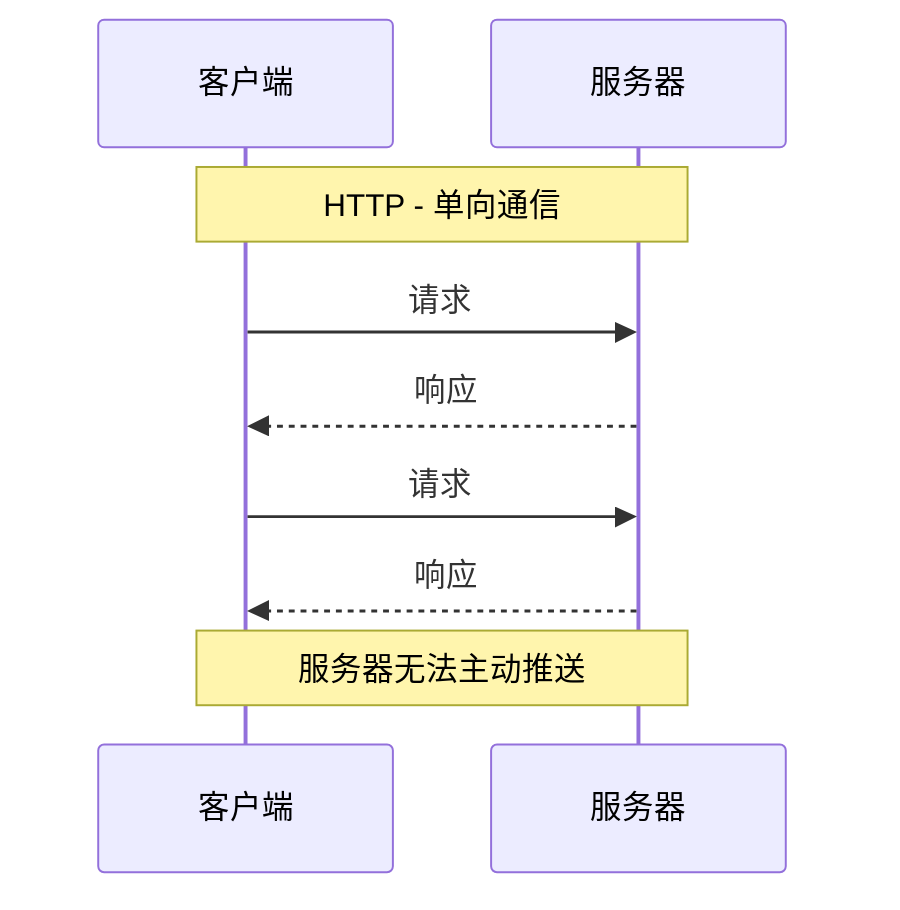
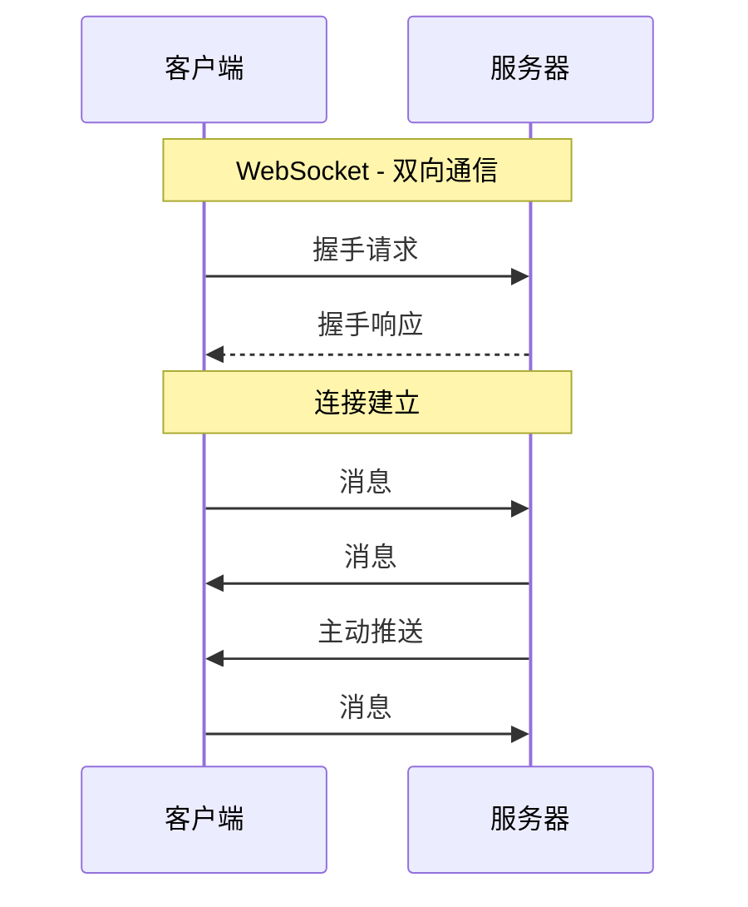
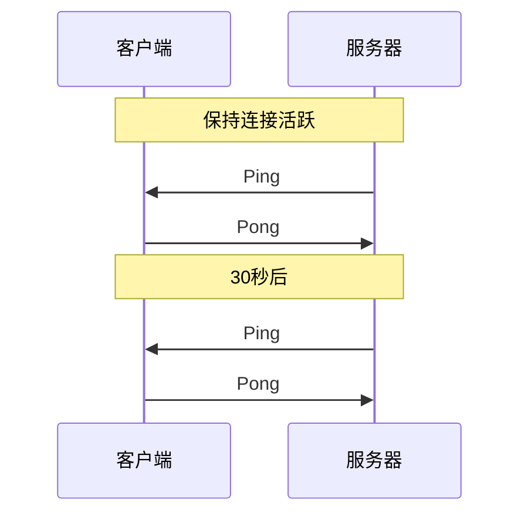

# WebSocket 协议

WebSocket 是一种在单个 TCP 连接上进行全双工通信的协议，实现了服务器与客户端之间的实时双向通信。

## 为什么需要 WebSocket？

### HTTP 的局限性



### WebSocket 优势



| 对比项   | HTTP               | WebSocket      |
| -------- | ------------------ | -------------- |
| 通信方式 | 请求-响应          | 全双工         |
| 连接     | 短连接/长连接      | 持久连接       |
| 开销     | 每次请求都有头部   | 握手后开销小   |
| 实时性   | 轮询/长轮询        | 实时推送       |
| 协议     | http:// / https:// | ws:// / wss:// |

## 握手过程

WebSocket 通过 HTTP Upgrade 机制建立连接。

### 客户端请求

```http
GET /chat HTTP/1.1
Host: server.example.com
Upgrade: websocket
Connection: Upgrade
Sec-WebSocket-Key: dGhlIHNhbXBsZSBub25jZQ==
Sec-WebSocket-Version: 13
Origin: http://example.com
```

### 服务端响应

```http
HTTP/1.1 101 Switching Protocols
Upgrade: websocket
Connection: Upgrade
Sec-WebSocket-Accept: s3pPLMBiTxaQ9kYGzzhZRbK+xOo=
```

### 密钥计算

```
Sec-WebSocket-Accept = Base64(SHA1(Sec-WebSocket-Key + GUID))

其中 GUID = "258EAFA5-E914-47DA-95CA-C5AB0DC85B11"
```

## 数据帧格式

```
 0                   1                   2                   3
 0 1 2 3 4 5 6 7 8 9 0 1 2 3 4 5 6 7 8 9 0 1 2 3 4 5 6 7 8 9 0 1
+-+-+-+-+-------+-+-------------+-------------------------------+
|F|R|R|R| opcode|M| Payload len |    Extended payload length    |
|I|S|S|S|  (4)  |A|     (7)     |             (16/64)           |
|N|V|V|V|       |S|             |   (if payload len==126/127)   |
| |1|2|3|       |K|             |                               |
+-+-+-+-+-------+-+-------------+-------------------------------+
|     Masking-key (if MASK set to 1)                            |
+-------------------------------+-------------------------------+
|                     Payload Data                              |
+---------------------------------------------------------------+
```

### 关键字段

| 字段        | 大小   | 描述                       |
| ----------- | ------ | -------------------------- |
| FIN         | 1 bit  | 是否为消息的最后一帧       |
| opcode      | 4 bit  | 帧类型                     |
| MASK        | 1 bit  | 是否掩码（客户端必须为 1） |
| Payload len | 7 bit  | 数据长度                   |
| Masking-key | 32 bit | 掩码密钥（如果 MASK=1）    |

### Opcode 类型

| Opcode | 描述     |
| ------ | -------- |
| 0x0    | 继续帧   |
| 0x1    | 文本帧   |
| 0x2    | 二进制帧 |
| 0x8    | 关闭连接 |
| 0x9    | Ping     |
| 0xA    | Pong     |

## 心跳机制



## 应用场景

| 场景     | 描述               |
| -------- | ------------------ |
| 即时通讯 | 聊天应用、客服系统 |
| 实时数据 | 股票行情、体育比分 |
| 协作编辑 | 在线文档、白板     |
| 游戏     | 多人在线游戏       |
| 推送通知 | 系统消息、订单状态 |
| 直播互动 | 弹幕、礼物、点赞   |

## 代码示例

### JavaScript 客户端

```javascript
// 创建连接
const ws = new WebSocket("wss://example.com/socket");

// 连接打开
ws.onopen = function (event) {
  console.log("连接已建立");
  ws.send("Hello Server!");
};

// 收到消息
ws.onmessage = function (event) {
  console.log("收到消息:", event.data);
};

// 连接关闭
ws.onclose = function (event) {
  console.log("连接已关闭", event.code, event.reason);
};

// 发生错误
ws.onerror = function (error) {
  console.error("WebSocket 错误:", error);
};

// 发送消息
ws.send("Hello!");
ws.send(JSON.stringify({ type: "message", content: "Hi" }));

// 关闭连接
ws.close(1000, "Normal closure");
```

### Java 服务端 (Spring)

```java
@Configuration
@EnableWebSocket
public class WebSocketConfig implements WebSocketConfigurer {

    @Override
    public void registerWebSocketHandlers(WebSocketHandlerRegistry registry) {
        registry.addHandler(new MyWebSocketHandler(), "/ws")
                .setAllowedOrigins("*");
    }
}

public class MyWebSocketHandler extends TextWebSocketHandler {

    private final Set<WebSocketSession> sessions =
        Collections.synchronizedSet(new HashSet<>());

    @Override
    public void afterConnectionEstablished(WebSocketSession session) {
        sessions.add(session);
        System.out.println("连接建立: " + session.getId());
    }

    @Override
    protected void handleTextMessage(WebSocketSession session,
                                     TextMessage message) throws Exception {
        String payload = message.getPayload();
        System.out.println("收到消息: " + payload);

        // 广播给所有客户端
        for (WebSocketSession s : sessions) {
            if (s.isOpen()) {
                s.sendMessage(new TextMessage("Echo: " + payload));
            }
        }
    }

    @Override
    public void afterConnectionClosed(WebSocketSession session,
                                      CloseStatus status) {
        sessions.remove(session);
        System.out.println("连接关闭: " + session.getId());
    }
}
```

### Netty 服务端

```java
public class WebSocketServerInitializer extends ChannelInitializer<SocketChannel> {

    @Override
    protected void initChannel(SocketChannel ch) {
        ChannelPipeline pipeline = ch.pipeline();
        pipeline.addLast(new HttpServerCodec());
        pipeline.addLast(new HttpObjectAggregator(65536));
        pipeline.addLast(new WebSocketServerProtocolHandler("/ws"));
        pipeline.addLast(new TextWebSocketFrameHandler());
    }
}

public class TextWebSocketFrameHandler
    extends SimpleChannelInboundHandler<TextWebSocketFrame> {

    @Override
    protected void channelRead0(ChannelHandlerContext ctx,
                                TextWebSocketFrame frame) {
        String text = frame.text();
        System.out.println("收到: " + text);
        ctx.channel().writeAndFlush(new TextWebSocketFrame("Echo: " + text));
    }
}
```

## 关闭码

| 状态码 | 描述             |
| ------ | ---------------- |
| 1000   | 正常关闭         |
| 1001   | 端点离开         |
| 1002   | 协议错误         |
| 1003   | 不支持的数据类型 |
| 1006   | 异常关闭         |
| 1007   | 无效的数据       |
| 1008   | 策略违规         |
| 1009   | 消息过大         |
| 1011   | 服务器错误       |

## WebSocket vs 其他方案

| 方案      | 实时性 | 双向 | 开销 | 兼容性 |
| --------- | ------ | ---- | ---- | ------ |
| 轮询      | 低     | 单向 | 高   | 好     |
| 长轮询    | 中     | 单向 | 中   | 好     |
| SSE       | 高     | 单向 | 低   | 较好   |
| WebSocket | 高     | 双向 | 低   | 好     |

## 安全考虑

### wss:// 加密

```javascript
// 不安全
const ws = new WebSocket("ws://example.com/socket");

// 安全（推荐）
const wss = new WebSocket("wss://example.com/socket");
```

### 跨域限制

WebSocket 不受同源策略限制，需要服务端验证 Origin 头部。

### 认证

```javascript
// 方式1: URL 参数
const ws = new WebSocket("wss://example.com/socket?token=xxx");

// 方式2: 首条消息认证
ws.onopen = function () {
  ws.send(JSON.stringify({ type: "auth", token: "xxx" }));
};
```

## 下一步

- 学习 [Socket 编程](./socket-programming)
- 了解 [Netty 框架](/docs/netty/websocket)
