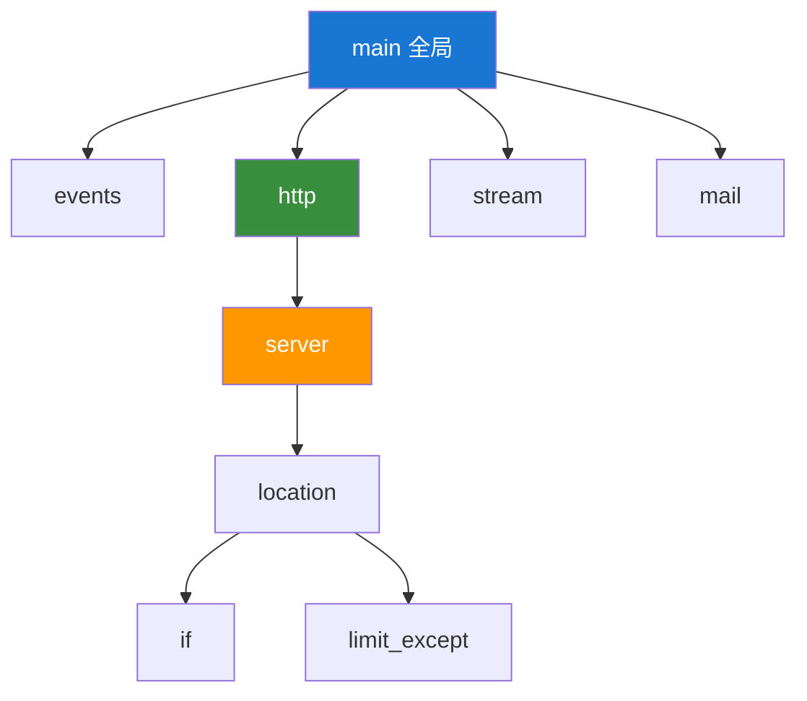

# Nginx 基础配置

## 配置文件结构

Nginx 配置采用分层嵌套结构，由多个上下文（context）组成：

```nginx
# 全局上下文（main context）
user nginx;
worker_processes auto;

events {
    # events 上下文
    worker_connections 1024;
}

http {
    # http 上下文

    server {
        # server 上下文（虚拟主机）

        location / {
            # location 上下文
        }
    }
}

stream {
    # stream 上下文（TCP/UDP 代理）
}
```

## 配置上下文层级



## 全局指令

```nginx
# 运行 Nginx 的用户和组
user nginx nginx;

# 工作进程数，auto 表示自动检测 CPU 核心数
worker_processes auto;

# 单个工作进程可打开的最大文件描述符数
worker_rlimit_nofile 65535;

# 错误日志路径和级别
error_log /var/log/nginx/error.log warn;
# 级别: debug, info, notice, warn, error, crit, alert, emerg

# PID 文件路径
pid /var/run/nginx.pid;

# 加载动态模块
load_module modules/ngx_http_image_filter_module.so;
```

## Events 配置

```nginx
events {
    # 单个工作进程的最大连接数
    worker_connections 10240;

    # 事件驱动模型
    use epoll;  # Linux: epoll, FreeBSD: kqueue, 通用: select/poll

    # 是否一次接受多个连接
    multi_accept on;

    # 互斥锁，用于处理惊群问题
    accept_mutex off;  # 新版本建议关闭
}
```

## HTTP 核心配置

```nginx
http {
    # MIME 类型
    include /etc/nginx/mime.types;
    default_type application/octet-stream;

    # 字符集
    charset utf-8;

    # 日志格式定义
    log_format main '$remote_addr - $remote_user [$time_local] "$request" '
                    '$status $body_bytes_sent "$http_referer" '
                    '"$http_user_agent" "$http_x_forwarded_for"';

    log_format json escape=json '{'
        '"time":"$time_iso8601",'
        '"remote_addr":"$remote_addr",'
        '"request":"$request",'
        '"status":"$status",'
        '"body_bytes_sent":"$body_bytes_sent",'
        '"request_time":"$request_time",'
        '"upstream_response_time":"$upstream_response_time"'
    '}';

    # 访问日志
    access_log /var/log/nginx/access.log main;

    # 文件传输优化
    sendfile on;
    tcp_nopush on;      # 与 sendfile 配合使用
    tcp_nodelay on;     # 禁用 Nagle 算法

    # 连接超时
    keepalive_timeout 65;
    keepalive_requests 1000;

    # 客户端请求限制
    client_max_body_size 100m;
    client_body_timeout 60s;
    client_header_timeout 60s;

    # 哈希表大小
    types_hash_max_size 2048;
    server_names_hash_bucket_size 128;

    # 隐藏版本号
    server_tokens off;

    # 包含其他配置文件
    include /etc/nginx/conf.d/*.conf;
}
```

## Server 配置

```nginx
server {
    # 监听端口
    listen 80;
    listen [::]:80;  # IPv6

    # 服务器名称
    server_name example.com www.example.com;
    # 支持通配符: *.example.com
    # 支持正则: ~^www\d+\.example\.com$

    # 网站根目录
    root /var/www/example;

    # 默认首页
    index index.html index.htm;

    # 日志
    access_log /var/log/nginx/example.access.log main;
    error_log /var/log/nginx/example.error.log warn;

    # 字符集
    charset utf-8;

    # 错误页面
    error_page 404 /404.html;
    error_page 500 502 503 504 /50x.html;

    # Location 配置
    location / {
        try_files $uri $uri/ =404;
    }
}
```

## Location 匹配规则

Location 指令用于匹配请求 URI，按优先级从高到低：

```nginx
# 1. 精确匹配（最高优先级）
location = /exact {
    # 只匹配 /exact
}

# 2. 前缀匹配（优先级最高的前缀）
location ^~ /prefix {
    # 匹配以 /prefix 开头的 URI，不再检查正则
}

# 3. 正则匹配（区分大小写）
location ~ \.php$ {
    # 匹配以 .php 结尾的 URI
}

# 4. 正则匹配（不区分大小写）
location ~* \.(jpg|jpeg|png|gif)$ {
    # 匹配图片文件
}

# 5. 普通前缀匹配
location /images/ {
    # 匹配以 /images/ 开头
}

# 6. 默认匹配（最低优先级）
location / {
    # 匹配所有请求
}
```

### 匹配优先级示例

```nginx
server {
    listen 80;
    server_name example.com;

    # 1. 最高优先级：精确匹配
    location = / {
        return 200 "精确匹配 /";
    }

    # 2. 次高优先级：^~ 前缀
    location ^~ /static/ {
        root /var/www;
    }

    # 3. 正则匹配
    location ~* \.(css|js)$ {
        expires 7d;
    }

    # 4. 普通前缀匹配
    location /api/ {
        proxy_pass http://backend;
    }

    # 5. 默认匹配
    location / {
        try_files $uri $uri/ /index.html;
    }
}
```

## 常用变量

### 请求相关变量

| 变量              | 说明                                |
| ----------------- | ----------------------------------- |
| `$request`        | 完整请求行                          |
| `$request_uri`    | 包含参数的原始 URI                  |
| `$uri`            | 当前 URI（可能被 rewrite 修改）     |
| `$args`           | 查询字符串参数                      |
| `$arg_name`       | 获取指定参数值                      |
| `$request_method` | 请求方法（GET/POST 等）             |
| `$host`           | 请求的主机名                        |
| `$http_header`    | 获取请求头（如 `$http_user_agent`） |
| `$content_type`   | Content-Type 请求头                 |
| `$content_length` | Content-Length 请求头               |

### 客户端相关变量

| 变量                    | 说明          |
| ----------------------- | ------------- |
| `$remote_addr`          | 客户端 IP     |
| `$remote_port`          | 客户端端口    |
| `$remote_user`          | 认证用户名    |
| `$http_x_forwarded_for` | 代理链 IP     |
| `$http_x_real_ip`       | 真实客户端 IP |

### 服务器相关变量

| 变量             | 说明       |
| ---------------- | ---------- |
| `$server_addr`   | 服务器 IP  |
| `$server_port`   | 服务器端口 |
| `$server_name`   | 服务器名称 |
| `$document_root` | 根目录路径 |
| `$nginx_version` | Nginx 版本 |

### 响应相关变量

| 变量                      | 说明         |
| ------------------------- | ------------ |
| `$status`                 | 响应状态码   |
| `$body_bytes_sent`        | 发送的字节数 |
| `$request_time`           | 请求处理时间 |
| `$upstream_response_time` | 上游响应时间 |

## Rewrite 规则

```nginx
# 基本语法
rewrite regex replacement [flag];

# 标志位说明：
# last     - 停止当前 rewrite，重新匹配 location
# break    - 停止所有 rewrite，在当前 location 继续处理
# redirect - 302 临时重定向
# permanent - 301 永久重定向

# 示例
server {
    # 301 永久重定向：非 www 到 www
    if ($host !~* ^www\.) {
        rewrite ^(.*)$ http://www.$host$1 permanent;
    }

    # 重写 URL
    rewrite ^/old-page$ /new-page permanent;

    # 使用正则捕获组
    rewrite ^/user/(\d+)$ /profile?id=$1 last;

    # 移除 .html 后缀
    rewrite ^(.+)\.html$ $1 permanent;
}
```

## Return 指令

```nginx
# 直接返回状态码
return 404;

# 返回状态码和内容
return 200 "OK";

# 重定向
return 301 https://example.com$request_uri;
return 302 /temporary-redirect;

# 常用 HTTP 状态码
# 200 - OK
# 301 - 永久重定向
# 302 - 临时重定向
# 400 - 错误请求
# 401 - 未授权
# 403 - 禁止访问
# 404 - 未找到
# 500 - 服务器内部错误
# 502 - 网关错误
# 503 - 服务不可用
```

## Try_files 指令

```nginx
# 按顺序检查文件是否存在
location / {
    # 尝试：文件 → 目录 → 回退到 index.html（SPA 应用）
    try_files $uri $uri/ /index.html;
}

location /images/ {
    # 不存在则返回 404
    try_files $uri $uri/ =404;
}

location /api/ {
    # 不存在则转发到后端
    try_files $uri @backend;
}

location @backend {
    proxy_pass http://localhost:3000;
}
```

## 条件判断

```nginx
# if 语句（尽量少用，性能影响）
if ($request_method = POST) {
    return 405;
}

if ($http_user_agent ~* "bot|spider") {
    return 403;
}

# 判断文件是否存在
if (-f $request_filename) {
    # 文件存在
}

if (!-f $request_filename) {
    # 文件不存在
}

# 判断目录是否存在
if (-d $request_filename) {
    # 目录存在
}
```

:::caution
`if` 指令在 location 中使用时可能有意想不到的行为，建议优先使用 `try_files` 或 `map` 指令。
:::

## Map 指令

```nginx
http {
    # 根据变量映射生成新变量
    map $uri $new_uri {
        default         $uri;
        /old-path       /new-path;
        ~^/blog/(\d+)$  /article/$1;
    }

    # 根据 User-Agent 判断设备类型
    map $http_user_agent $device {
        default         "desktop";
        ~*mobile        "mobile";
        ~*android       "mobile";
        ~*iphone        "mobile";
        ~*ipad          "tablet";
    }

    server {
        location / {
            # 使用映射的变量
            add_header X-Device $device;
        }
    }
}
```

## Include 指令

```nginx
# 包含单个文件
include /etc/nginx/mime.types;

# 包含目录下所有 .conf 文件
include /etc/nginx/conf.d/*.conf;

# 包含多个目录
include /etc/nginx/sites-enabled/*;

# 模块化配置示例
# /etc/nginx/snippets/ssl-params.conf
ssl_protocols TLSv1.2 TLSv1.3;
ssl_prefer_server_ciphers on;
ssl_ciphers ECDHE-ECDSA-AES128-GCM-SHA256:ECDHE-RSA-AES128-GCM-SHA256;

# 在 server 块中引用
server {
    include /etc/nginx/snippets/ssl-params.conf;
}
```

## 配置最佳实践

1. **模块化配置**：将配置拆分到多个文件
2. **使用 include**：复用公共配置片段
3. **配置版本控制**：使用 Git 管理配置
4. **修改前备份**：`cp nginx.conf nginx.conf.backup`
5. **修改后测试**：`nginx -t` 验证语法
6. **优雅重载**：`nginx -s reload` 不中断服务
