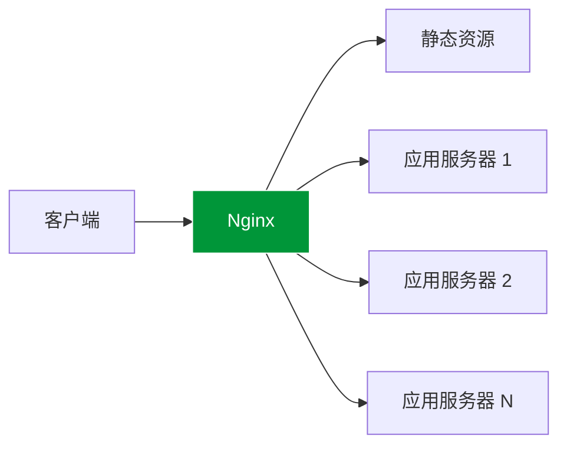
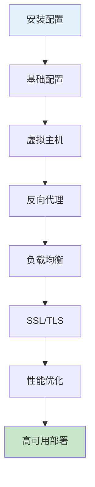

# Nginx 概述

## 什么是 Nginx

Nginx（发音为 "engine-x"）是一个高性能的 HTTP 和反向代理服务器，也是一个 IMAP/POP3/SMTP 代理服务器。由 Igor Sysoev 于 2004 年首次发布，现已成为全球最流行的 Web 服务器之一。

## 核心特性

### 🚀 高性能

- **事件驱动架构**：异步非阻塞处理，支持高并发连接
- **低内存占用**：相比传统服务器，内存使用更加高效
- **高吞吐量**：单机可处理数万并发连接

### 🔄 反向代理

- **负载均衡**：支持多种负载均衡策略（轮询、权重、IP Hash 等）
- **缓存加速**：内置高效的缓存机制
- **健康检查**：自动检测后端服务器状态

### 🛡️ 安全特性

- **SSL/TLS 支持**：完整的 HTTPS 支持
- **访问控制**：IP 黑白名单、限流限速
- **防攻击**：防 DDoS、CC 攻击配置

### 📦 模块化设计

- **核心模块**：HTTP、Mail、Stream
- **第三方模块**：丰富的扩展生态
- **Lua 支持**：通过 OpenResty 实现动态功能

## 应用场景



### 典型用途

| 场景           | 说明                     |
| -------------- | ------------------------ |
| **Web 服务器** | 提供静态文件服务         |
| **反向代理**   | 隐藏后端服务器，统一入口 |
| **负载均衡**   | 分发请求到多台服务器     |
| **API 网关**   | 请求路由、认证、限流     |
| **缓存服务器** | 缓存后端响应，减轻压力   |
| **SSL 终端**   | 统一处理 HTTPS           |

## Nginx vs 其他服务器

| 特性             | Nginx      | Apache    | Caddy     |
| ---------------- | ---------- | --------- | --------- |
| **架构**         | 事件驱动   | 进程/线程 | 事件驱动  |
| **配置语法**     | 自定义语法 | XML 风格  | Caddyfile |
| **性能**         | ⭐⭐⭐⭐⭐ | ⭐⭐⭐    | ⭐⭐⭐⭐  |
| **内存占用**     | 低         | 高        | 中        |
| **学习曲线**     | 中等       | 较陡      | 平缓      |
| **HTTPS 自动化** | 手动配置   | 手动配置  | 自动      |

## 版本选择

### Nginx 开源版

- 免费开源
- 社区支持
- 基础功能完整

### Nginx Plus（商业版）

- 商业支持
- 高级负载均衡
- 主动健康检查
- Session 持久化
- 实时监控仪表板

### OpenResty

- 基于 Nginx
- 集成 LuaJIT
- 适合动态应用
- Kong、APISIX 等网关的基础

## 文档导航

import DocCardList from '@theme/DocCardList';

<DocCardList />

## 快速开始

```bash
# macOS
brew install nginx

# Ubuntu/Debian
sudo apt install nginx

# CentOS/RHEL
sudo yum install nginx

# 启动 Nginx
sudo nginx

# 测试配置
sudo nginx -t

# 重载配置
sudo nginx -s reload
```

## 学习路线



1. **入门阶段**：安装配置 → 基础配置 → 静态文件服务
2. **进阶阶段**：反向代理 → 负载均衡 → SSL 配置
3. **高级阶段**：性能优化 → 缓存策略 → 安全加固
4. **专家阶段**：高可用 → 模块开发 → 架构设计

## 推荐资源

- 📖 [Nginx 官方文档](https://nginx.org/en/docs/)
- 📖 [Nginx 配置生成器](https://www.digitalocean.com/community/tools/nginx)
- 📖 [OpenResty 官网](https://openresty.org/)
