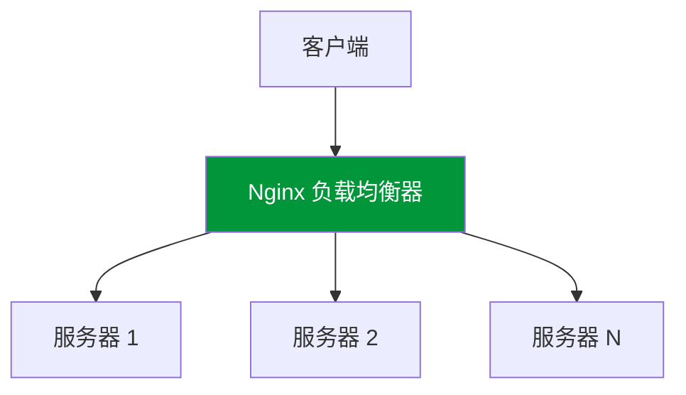
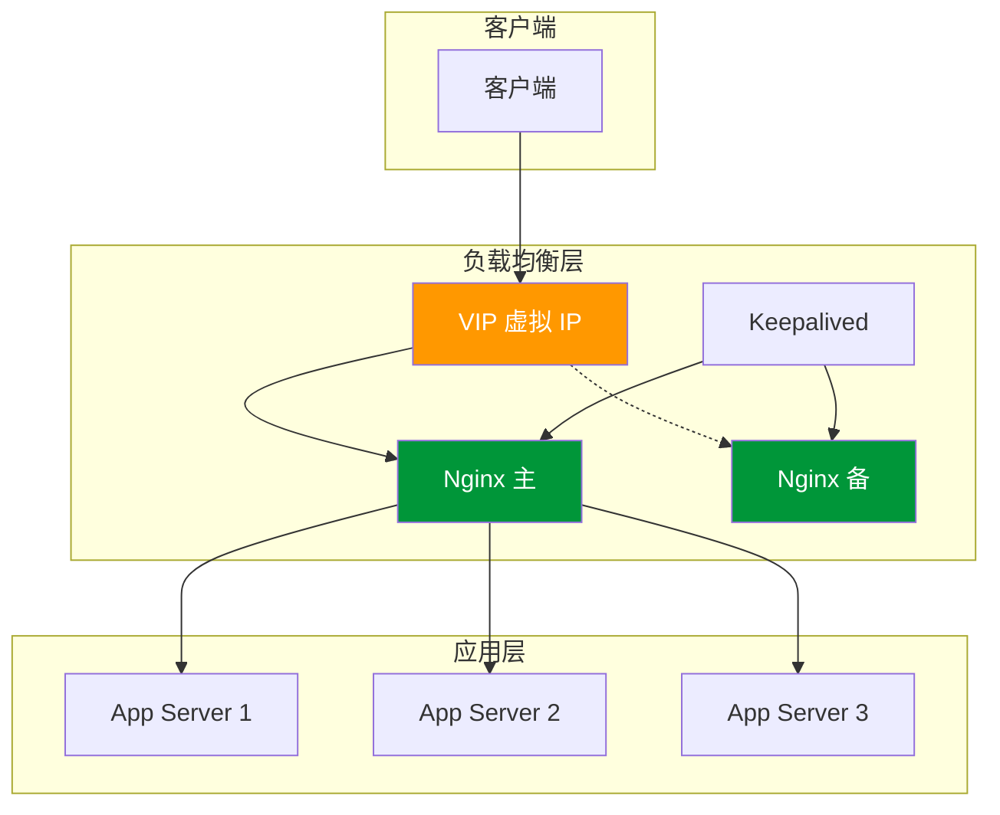

# 负载均衡

## 负载均衡概述



### 为什么需要负载均衡？

- **提高可用性**：单点故障不影响服务
- **提升性能**：多服务器分担压力
- **便于扩展**：可水平扩展后端服务
- **灵活维护**：可逐台更新服务器

## 负载均衡策略对比

| 策略           | 指令                  | 适用场景         | 优点           | 缺点             |
| -------------- | --------------------- | ---------------- | -------------- | ---------------- |
| **轮询**       | 默认                  | 后端性能相近     | 简单公平       | 不考虑服务器负载 |
| **加权轮询**   | `weight=N`            | 后端性能不均     | 可调节分配比例 | 需要手动配置权重 |
| **IP Hash**    | `ip_hash`             | 需要会话保持     | 同 IP 固定后端 | 负载可能不均     |
| **最少连接**   | `least_conn`          | 请求处理时间不均 | 动态负载均衡   | 需维护连接状态   |
| **一致性哈希** | `hash key consistent` | 缓存场景         | 减少缓存失效   | 实现较复杂       |

## 负载均衡策略

### 轮询（默认）

```nginx
upstream backend {
    server 192.168.1.10:8080;
    server 192.168.1.11:8080;
    server 192.168.1.12:8080;
}
```

### 加权轮询

```nginx
upstream backend {
    server 192.168.1.10:8080 weight=5;  # 处理 50% 请求
    server 192.168.1.11:8080 weight=3;  # 处理 30% 请求
    server 192.168.1.12:8080 weight=2;  # 处理 20% 请求
}
```

### IP Hash

```nginx
upstream backend {
    ip_hash;
    server 192.168.1.10:8080;
    server 192.168.1.11:8080;
}
```

### 最少连接

```nginx
upstream backend {
    least_conn;
    server 192.168.1.10:8080;
    server 192.168.1.11:8080;
}
```

### 一致性哈希

```nginx
upstream backend {
    hash $request_uri consistent;
    server 192.168.1.10:8080;
    server 192.168.1.11:8080;
}

# 基于其他 key 的哈希
upstream cache_backend {
    hash $cookie_sessionid consistent;
    server 192.168.1.10:8080;
    server 192.168.1.11:8080;
}
```

## 服务器参数

```nginx
upstream backend {
    server 192.168.1.10:8080 weight=5 max_fails=3 fail_timeout=30s;
    server 192.168.1.11:8080 backup;  # 备用服务器
    server 192.168.1.12:8080 down;    # 标记下线
}
```

| 参数           | 说明                     | 默认值      |
| -------------- | ------------------------ | ----------- |
| `weight`       | 权重                     | 1           |
| `max_fails`    | 最大失败次数             | 1           |
| `fail_timeout` | 失败后暂停时间           | 10s         |
| `backup`       | 备用服务器               | -           |
| `down`         | 标记为下线               | -           |
| `max_conns`    | 最大并发连接数           | 0（无限制） |
| `slow_start`   | 慢启动时间（Nginx Plus） | 0           |

## 健康检查

### 被动健康检查（开源版）

```nginx
upstream backend {
    server 192.168.1.10:8080 max_fails=3 fail_timeout=30s;
    server 192.168.1.11:8080 max_fails=3 fail_timeout=30s;
}

location / {
    proxy_pass http://backend;

    # 定义哪些情况算失败
    proxy_next_upstream error timeout http_500 http_502 http_503;

    # 最大重试次数
    proxy_next_upstream_tries 3;

    # 重试超时
    proxy_next_upstream_timeout 10s;
}
```

### 主动健康检查（Nginx Plus）

```nginx
upstream backend {
    zone backend 64k;
    server 10.0.0.1:8080;
    server 10.0.0.2:8080;
}

server {
    location / {
        proxy_pass http://backend;
        health_check interval=5s fails=3 passes=2;
        health_check uri=/health match=health_ok;
    }
}

match health_ok {
    status 200;
    body ~ "OK";
}
```

## 慢启动（Slow Start）

慢启动可以让新加入或恢复的服务器逐渐接收流量，避免突然大量请求：

```nginx
# Nginx Plus 功能
upstream backend {
    zone backend 64k;
    server 10.0.0.1:8080 slow_start=30s;
    server 10.0.0.2:8080 slow_start=30s;
}
```

## Session 保持

### IP Hash 方式

```nginx
upstream backend {
    ip_hash;
    server 192.168.1.10:8080;
    server 192.168.1.11:8080;
}
```

### Cookie Hash 方式

```nginx
upstream backend {
    hash $cookie_sessionid consistent;
    server 192.168.1.10:8080;
    server 192.168.1.11:8080;
}
```

### Sticky Cookie（Nginx Plus）

```nginx
upstream backend {
    server 192.168.1.10:8080;
    server 192.168.1.11:8080;
    sticky cookie srv_id expires=1h domain=.example.com path=/;
}
```

## 四层负载均衡（TCP/UDP）

```nginx
# 需要 --with-stream 模块
stream {
    upstream mysql_cluster {
        least_conn;
        server 10.0.0.1:3306 weight=5;
        server 10.0.0.2:3306 weight=5;
        server 10.0.0.3:3306 backup;
    }

    server {
        listen 3306;
        proxy_pass mysql_cluster;
        proxy_connect_timeout 1s;
        proxy_timeout 3s;
    }

    # UDP 负载均衡（如 DNS）
    upstream dns_servers {
        server 10.0.0.1:53;
        server 10.0.0.2:53;
    }

    server {
        listen 53 udp;
        proxy_pass dns_servers;
        proxy_responses 1;
    }
}
```

## 高可用架构



### Keepalived 配置示例

```bash
# /etc/keepalived/keepalived.conf (主节点)
vrrp_instance VI_1 {
    state MASTER
    interface eth0
    virtual_router_id 51
    priority 100
    advert_int 1

    authentication {
        auth_type PASS
        auth_pass nginx123
    }

    virtual_ipaddress {
        192.168.1.100
    }

    track_script {
        check_nginx
    }
}

vrrp_script check_nginx {
    script "/usr/bin/pgrep nginx"
    interval 2
    weight -20
}
```

## 连接保持（长连接）

```nginx
upstream backend {
    server 10.0.0.1:8080;
    server 10.0.0.2:8080;
    keepalive 32;           # 保持 32 个空闲连接
    keepalive_requests 100; # 每个连接最多 100 个请求
    keepalive_timeout 60s;  # 空闲超时时间
}

server {
    location / {
        proxy_pass http://backend;
        proxy_http_version 1.1;
        proxy_set_header Connection "";  # 清除 Connection 头
    }
}
```

## 完整配置示例

```nginx
upstream api_servers {
    least_conn;

    # 主服务器
    server 10.0.0.1:8080 weight=5 max_fails=3 fail_timeout=30s;
    server 10.0.0.2:8080 weight=3 max_fails=3 fail_timeout=30s;

    # 备用服务器
    server 10.0.0.3:8080 backup;

    # 长连接配置
    keepalive 32;
}

server {
    listen 80;
    server_name api.example.com;

    # 访问日志
    access_log /var/log/nginx/api.access.log main;

    location / {
        proxy_pass http://api_servers;
        proxy_http_version 1.1;

        # 请求头
        proxy_set_header Host $host;
        proxy_set_header X-Real-IP $remote_addr;
        proxy_set_header X-Forwarded-For $proxy_add_x_forwarded_for;
        proxy_set_header Connection "";

        # 超时设置
        proxy_connect_timeout 5s;
        proxy_send_timeout 60s;
        proxy_read_timeout 60s;

        # 故障转移
        proxy_next_upstream error timeout http_500 http_502 http_503;
        proxy_next_upstream_tries 2;
    }

    # 健康检查端点
    location /upstream_status {
        stub_status;
        allow 127.0.0.1;
        deny all;
    }
}
```

## 监控与调试

```nginx
# 开启 upstream 状态监控
location /upstream_status {
    stub_status on;
    allow 127.0.0.1;
    allow 10.0.0.0/8;
    deny all;
}

# 在响应头中添加后端服务器信息（调试用）
add_header X-Upstream-Addr $upstream_addr;
add_header X-Upstream-Status $upstream_status;
add_header X-Upstream-Response-Time $upstream_response_time;
```
