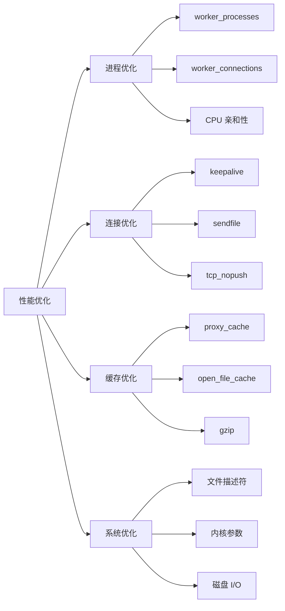
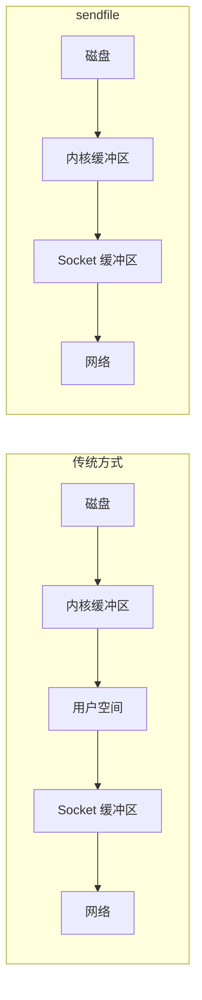

# 性能优化

## 性能优化概述



## Worker 进程优化

```nginx
# 工作进程数（通常设为 CPU 核心数）
worker_processes auto;

# 每个 worker 的最大连接数
worker_connections 10240;

# 文件描述符限制
worker_rlimit_nofile 65535;

events {
    # Linux 使用 epoll
    use epoll;

    # 一次接受多个连接
    multi_accept on;

    # 关闭惊群效应（新版本建议关闭）
    accept_mutex off;
}
```

### CPU 亲和性

```nginx
# 自动绑定 CPU（推荐）
worker_cpu_affinity auto;

# 手动绑定（4 核 CPU）
worker_processes 4;
worker_cpu_affinity 0001 0010 0100 1000;

# 8 核 CPU，每个 worker 绑定 2 个核
worker_processes 4;
worker_cpu_affinity 0011 1100 00110000 11000000;
```

### 进程优先级

```nginx
# 设置 worker 进程优先级（-20 到 20，越小优先级越高）
worker_priority -5;
```

## 连接优化

```nginx
http {
    # 开启长连接
    keepalive_timeout 65;
    keepalive_requests 1000;

    # 文件传输优化
    sendfile on;
    tcp_nopush on;    # 在一个数据包中发送 HTTP 头和文件开头
    tcp_nodelay on;   # 禁用 Nagle 算法，减少延迟

    # 异步 I/O（可选）
    aio on;
    directio 4m;  # 大于 4MB 的文件使用直接 I/O
}
```

### sendfile 说明



## Gzip 压缩

```nginx
gzip on;
gzip_comp_level 5;           # 压缩级别 1-9，推荐 4-6
gzip_min_length 1k;          # 最小压缩文件大小
gzip_vary on;                # 添加 Vary: Accept-Encoding
gzip_proxied any;            # 代理请求也压缩
gzip_disable "msie6";        # 禁用 IE6 压缩

gzip_types
    text/plain
    text/css
    text/javascript
    application/json
    application/javascript
    application/xml
    application/xml+rss
    image/svg+xml;
```

### Brotli 压缩（更高压缩率）

```nginx
# 需要第三方模块
load_module modules/ngx_http_brotli_filter_module.so;
load_module modules/ngx_http_brotli_static_module.so;

brotli on;
brotli_comp_level 6;
brotli_types text/plain text/css application/json application/javascript;
brotli_static on;  # 预压缩
```

## 缓冲区优化

```nginx
# 客户端请求缓冲
client_body_buffer_size 16k;      # POST 请求体缓冲
client_header_buffer_size 1k;      # 请求头缓冲
large_client_header_buffers 4 8k;  # 大请求头缓冲

# 代理缓冲
proxy_buffer_size 4k;              # 响应头缓冲
proxy_buffers 8 32k;               # 响应体缓冲
proxy_busy_buffers_size 64k;       # 忙碌缓冲

# FastCGI 缓冲
fastcgi_buffer_size 4k;
fastcgi_buffers 8 16k;
```

## 静态资源缓存

```nginx
location ~* \.(jpg|jpeg|png|gif|ico|css|js|woff|woff2)$ {
    expires 30d;
    add_header Cache-Control "public, no-transform";
    access_log off;

    # ETag
    etag on;
}
```

## 开启 HTTP/2

```nginx
server {
    listen 443 ssl http2;

    # HTTP/2 服务器推送（可选）
    http2_push_preload on;

    location / {
        add_header Link "</style.css>; rel=preload; as=style";
    }
}
```

## Open File Cache

```nginx
# 缓存打开的文件句柄
open_file_cache max=10000 inactive=20s;
open_file_cache_valid 30s;
open_file_cache_min_uses 2;
open_file_cache_errors on;
```

## Upstream 保持连接

```nginx
upstream backend {
    server 127.0.0.1:8080;
    keepalive 32;           # 保持 32 个空闲连接
    keepalive_requests 100; # 每个连接最多 100 个请求
    keepalive_timeout 60s;  # 空闲超时
}

location / {
    proxy_pass http://backend;
    proxy_http_version 1.1;
    proxy_set_header Connection "";  # 清除 Connection 头
}
```

## 线程池

```nginx
# 配置线程池
thread_pool default threads=32 max_queue=65536;

# 在 location 中使用
location /static/ {
    aio threads=default;
    directio 4m;
}
```

## 系统级优化

### 文件描述符限制

```bash
# /etc/security/limits.conf
nginx soft nofile 65535
nginx hard nofile 65535

# 或 systemd 服务配置
# /etc/systemd/system/nginx.service.d/limits.conf
[Service]
LimitNOFILE=65535
```

### 内核参数优化

```bash
# /etc/sysctl.conf

# 连接队列
net.core.somaxconn = 65535
net.core.netdev_max_backlog = 65535

# TIME_WAIT 优化
net.ipv4.tcp_max_tw_buckets = 5000
net.ipv4.tcp_fin_timeout = 30
net.ipv4.tcp_tw_reuse = 1

# Keepalive
net.ipv4.tcp_keepalive_time = 1200
net.ipv4.tcp_keepalive_intvl = 30
net.ipv4.tcp_keepalive_probes = 3

# 端口范围
net.ipv4.ip_local_port_range = 1024 65535

# TCP 缓冲区
net.core.rmem_max = 16777216
net.core.wmem_max = 16777216
net.ipv4.tcp_rmem = 4096 87380 16777216
net.ipv4.tcp_wmem = 4096 65536 16777216

# 应用配置
sysctl -p
```

## 性能基准测试

### 使用 wrk

```bash
# 安装 wrk
git clone https://github.com/wg/wrk.git
cd wrk && make

# 基本测试
wrk -t12 -c400 -d30s http://localhost/

# 带脚本测试
wrk -t12 -c400 -d30s -s post.lua http://localhost/api/
```

### 使用 ab（Apache Bench）

```bash
# 安装
sudo apt install apache2-utils

# 100 个并发，总共 10000 个请求
ab -n 10000 -c 100 http://localhost/

# 带 POST 数据
ab -n 10000 -c 100 -p data.json -T application/json http://localhost/api/
```

### 使用 siege

```bash
# 安装
sudo apt install siege

# 测试
siege -c 100 -t 30s http://localhost/
```

## 监控指标

```nginx
# 开启状态监控
location /nginx_status {
    stub_status on;
    allow 127.0.0.1;
    deny all;
}
```

访问 `/nginx_status` 查看：

```
Active connections: 291
server accepts handled requests
 16630948 16630948 31070465
Reading: 6 Writing: 179 Waiting: 106
```

| 指标               | 说明                     |
| ------------------ | ------------------------ |
| Active connections | 当前活跃连接数           |
| accepts            | 接受的总连接数           |
| handled            | 处理的总连接数           |
| requests           | 总请求数                 |
| Reading            | 正在读取请求的连接       |
| Writing            | 正在写入响应的连接       |
| Waiting            | 等待中的 Keep-alive 连接 |

## 性能监控工具

### Prometheus + Grafana

```nginx
# 使用 nginx-prometheus-exporter
# docker run -p 9113:9113 nginx/nginx-prometheus-exporter:latest \
#   -nginx.scrape-uri=http://nginx:80/nginx_status
```

### 常用监控命令

```bash
# 查看 Nginx 进程
ps aux | grep nginx

# 查看连接状态
netstat -an | grep :80 | wc -l

# 查看连接详情
ss -s

# 查看打开的文件
lsof -p $(pgrep nginx | head -1) | wc -l

# 实时查看访问日志
tail -f /var/log/nginx/access.log | awk '{print $1}'
```

## 完整优化配置示例

```nginx
worker_processes auto;
worker_rlimit_nofile 65535;
worker_cpu_affinity auto;

events {
    use epoll;
    worker_connections 10240;
    multi_accept on;
}

http {
    # MIME 类型
    include mime.types;
    default_type application/octet-stream;

    # 日志优化
    access_log off;  # 生产环境可考虑关闭或异步
    error_log /var/log/nginx/error.log warn;

    # 传输优化
    sendfile on;
    tcp_nopush on;
    tcp_nodelay on;

    # 连接优化
    keepalive_timeout 65;
    keepalive_requests 1000;

    # 缓冲区优化
    client_body_buffer_size 16k;
    client_header_buffer_size 1k;
    proxy_buffer_size 4k;
    proxy_buffers 8 32k;

    # Gzip 压缩
    gzip on;
    gzip_comp_level 5;
    gzip_min_length 1k;
    gzip_types text/plain text/css application/json application/javascript;

    # 文件缓存
    open_file_cache max=10000 inactive=20s;
    open_file_cache_valid 30s;
    open_file_cache_min_uses 2;

    upstream backend {
        least_conn;
        server 10.0.0.1:8080;
        server 10.0.0.2:8080;
        keepalive 32;
    }

    server {
        listen 80;
        server_name example.com;

        # 静态资源
        location ~* \.(jpg|png|css|js)$ {
            expires 30d;
            access_log off;
        }

        # 代理
        location / {
            proxy_pass http://backend;
            proxy_http_version 1.1;
            proxy_set_header Connection "";
        }

        # 状态监控
        location /nginx_status {
            stub_status on;
            allow 127.0.0.1;
            deny all;
        }
    }
}
```
