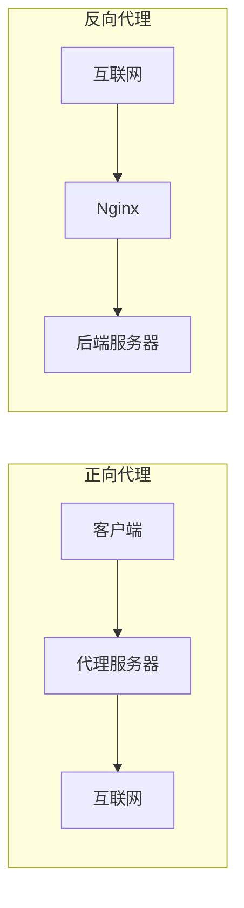
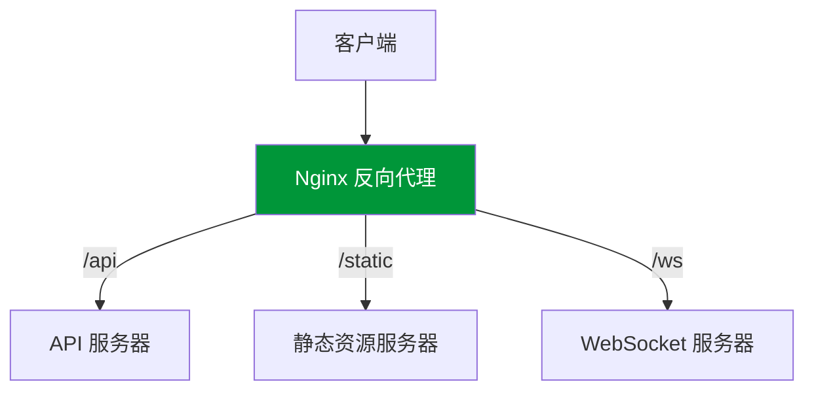

# 反向代理

## 代理概述

### 正向代理 vs 反向代理



| 特性       | 正向代理     | 反向代理           |
| ---------- | ------------ | ------------------ |
| 代理对象   | 客户端       | 服务端             |
| 客户端感知 | 知道代理存在 | 不知道代理存在     |
| 典型用途   | 翻墙、缓存   | 负载均衡、隐藏后端 |
| 配置位置   | 客户端       | 服务端             |

### 反向代理架构



## 基本配置

```nginx
server {
    listen 80;
    server_name api.example.com;

    location / {
        proxy_pass http://localhost:3000;
        proxy_set_header Host $host;
        proxy_set_header X-Real-IP $remote_addr;
        proxy_set_header X-Forwarded-For $proxy_add_x_forwarded_for;
    }
}
```

## Proxy 指令详解

```nginx
location /api/ {
    proxy_pass http://backend:8080/;

    # 请求头设置
    proxy_set_header Host $host;
    proxy_set_header X-Real-IP $remote_addr;
    proxy_set_header X-Forwarded-For $proxy_add_x_forwarded_for;
    proxy_set_header X-Forwarded-Proto $scheme;

    # 超时设置
    proxy_connect_timeout 60s;
    proxy_send_timeout 60s;
    proxy_read_timeout 60s;

    # 缓冲设置
    proxy_buffering on;
    proxy_buffer_size 4k;
    proxy_buffers 8 32k;

    # HTTP 版本
    proxy_http_version 1.1;
}
```

## WebSocket 代理

```nginx
map $http_upgrade $connection_upgrade {
    default upgrade;
    '' close;
}

location /ws/ {
    proxy_pass http://websocket_server;
    proxy_http_version 1.1;
    proxy_set_header Upgrade $http_upgrade;
    proxy_set_header Connection $connection_upgrade;
    proxy_set_header Host $host;
    proxy_set_header X-Real-IP $remote_addr;
    proxy_read_timeout 3600s;  # 长连接保持
    proxy_send_timeout 3600s;
}
```

## gRPC 代理

```nginx
# 需要 Nginx 1.13.10+
upstream grpc_backend {
    server 127.0.0.1:50051;
    keepalive 20;
}

server {
    listen 443 ssl http2;
    server_name grpc.example.com;

    ssl_certificate /path/to/cert.pem;
    ssl_certificate_key /path/to/key.pem;

    location / {
        grpc_pass grpc://grpc_backend;

        # 错误处理
        error_page 502 = /error502grpc;
    }

    location = /error502grpc {
        internal;
        default_type application/grpc;
        add_header grpc-status 14;
        add_header content-length 0;
        return 204;
    }
}

# gRPC-Web 代理
location /grpc-web/ {
    grpc_pass grpc://grpc_backend;

    # 支持 gRPC-Web 协议
    if ($request_method = 'OPTIONS') {
        add_header Access-Control-Allow-Origin '*';
        add_header Access-Control-Allow-Methods 'GET, POST, OPTIONS';
        add_header Access-Control-Allow-Headers 'DNT,X-CustomHeader,Keep-Alive,User-Agent,X-Requested-With,If-Modified-Since,Cache-Control,Content-Type,Content-Transfer-Encoding,Custom-Header-1,X-Accept-Content-Transfer-Encoding,X-Accept-Response-Streaming,X-User-Agent,X-Grpc-Web';
        return 204;
    }
}
```

## Upstream 配置

```nginx
upstream backend {
    server 192.168.1.10:8080;
    server 192.168.1.11:8080;
    keepalive 32;
}

server {
    location / {
        proxy_pass http://backend;
        proxy_http_version 1.1;
        proxy_set_header Connection "";
    }
}
```

## 代理缓存

```nginx
# 定义缓存路径
proxy_cache_path /var/cache/nginx
    levels=1:2
    keys_zone=my_cache:10m
    max_size=1g
    inactive=60m
    use_temp_path=off;

location /api/ {
    proxy_pass http://backend;
    proxy_cache my_cache;

    # 缓存有效期
    proxy_cache_valid 200 10m;
    proxy_cache_valid 404 1m;

    # 缓存 key
    proxy_cache_key $scheme$proxy_host$request_uri;

    # 添加缓存状态头
    add_header X-Cache-Status $upstream_cache_status;

    # 绕过缓存条件
    proxy_cache_bypass $cookie_nocache $arg_nocache;
}
```

## 传递真实 IP

```nginx
# 设置信任的代理
set_real_ip_from 10.0.0.0/8;
set_real_ip_from 172.16.0.0/12;
set_real_ip_from 192.168.0.0/16;

# 从哪个头获取真实 IP
real_ip_header X-Forwarded-For;

# 多层代理时递归查找
real_ip_recursive on;
```

## 多级代理配置

```nginx
# 第一层代理（边缘）
server {
    listen 80;
    server_name edge.example.com;

    location / {
        proxy_pass http://origin.example.com;
        proxy_set_header X-Forwarded-For $proxy_add_x_forwarded_for;
        proxy_set_header X-Real-IP $remote_addr;
        proxy_set_header X-Forwarded-Host $host;
        proxy_set_header X-Forwarded-Proto $scheme;
    }
}

# 第二层代理（源站）
server {
    listen 80;
    server_name origin.example.com;

    # 信任第一层代理
    set_real_ip_from 10.0.0.0/8;
    real_ip_header X-Real-IP;

    location / {
        proxy_pass http://backend;
        proxy_set_header Host $host;
    }
}
```

## 故障转移配置

```nginx
upstream backend {
    server 10.0.0.1:8080 weight=5 max_fails=3 fail_timeout=30s;
    server 10.0.0.2:8080 weight=5 max_fails=3 fail_timeout=30s;
    server 10.0.0.3:8080 backup;  # 备用服务器
}

server {
    location / {
        proxy_pass http://backend;

        # 故障转移条件
        proxy_next_upstream error timeout http_500 http_502 http_503 http_504;

        # 最大重试次数
        proxy_next_upstream_tries 3;

        # 重试超时时间
        proxy_next_upstream_timeout 10s;

        # 连接失败时的响应
        proxy_intercept_errors on;
        error_page 502 503 504 /fallback.html;
    }

    location = /fallback.html {
        root /var/www/error;
        internal;
    }
}
```

## 代理到 Unix Socket

```nginx
upstream php {
    server unix:/var/run/php/php-fpm.sock;
}

location ~ \.php$ {
    fastcgi_pass php;
    fastcgi_param SCRIPT_FILENAME $document_root$fastcgi_script_name;
    include fastcgi_params;
}
```

## 动态后端选择

```nginx
# 根据请求头选择后端
map $http_x_backend $backend_server {
    default backend_a;
    "beta"  backend_b;
}

upstream backend_a {
    server 10.0.0.1:8080;
}

upstream backend_b {
    server 10.0.0.2:8080;
}

server {
    location / {
        proxy_pass http://$backend_server;
    }
}
```

## 完整配置示例

```nginx
upstream api_backend {
    least_conn;
    server 10.0.0.1:8080 weight=5 max_fails=3 fail_timeout=30s;
    server 10.0.0.2:8080 weight=3 max_fails=3 fail_timeout=30s;
    server 10.0.0.3:8080 backup;
    keepalive 32;
}

server {
    listen 80;
    server_name api.example.com;
    return 301 https://$host$request_uri;
}

server {
    listen 443 ssl http2;
    server_name api.example.com;

    ssl_certificate /etc/nginx/ssl/cert.pem;
    ssl_certificate_key /etc/nginx/ssl/key.pem;

    # 安全头
    add_header X-Frame-Options DENY;
    add_header X-Content-Type-Options nosniff;

    location / {
        proxy_pass http://api_backend;
        proxy_http_version 1.1;
        proxy_set_header Host $host;
        proxy_set_header X-Real-IP $remote_addr;
        proxy_set_header X-Forwarded-For $proxy_add_x_forwarded_for;
        proxy_set_header X-Forwarded-Proto $scheme;
        proxy_set_header Connection "";

        proxy_connect_timeout 5s;
        proxy_send_timeout 60s;
        proxy_read_timeout 60s;

        proxy_next_upstream error timeout http_500 http_502 http_503;
        proxy_next_upstream_tries 2;
    }
}
```
