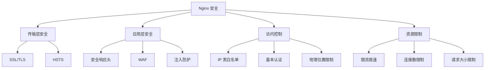

# 安全配置

## 安全概述

Nginx 安全配置涉及多个层面：



## 隐藏版本信息

```nginx
http {
    # 隐藏 Nginx 版本号
    server_tokens off;

    # 修改 Server 响应头（需要第三方模块）
    # more_set_headers "Server: MyServer";
}
```

## 访问控制

### IP 黑白名单

```nginx
# 白名单模式
location /admin/ {
    allow 192.168.1.0/24;
    allow 10.0.0.1;
    deny all;
}

# 黑名单模式
location / {
    deny 192.168.1.100;
    deny 10.0.0.0/8;
    allow all;
}

# 使用 geo 模块进行复杂控制
geo $blocked_ip {
    default 0;
    192.168.1.100 1;
    10.0.0.0/8 1;
}

server {
    if ($blocked_ip) {
        return 403;
    }
}
```

### 基本认证

```nginx
location /protected/ {
    auth_basic "Restricted Area";
    auth_basic_user_file /etc/nginx/.htpasswd;
}
```

生成密码文件：

```bash
# 安装 htpasswd 工具
sudo apt install apache2-utils

# 创建密码文件
sudo htpasswd -c /etc/nginx/.htpasswd username

# 添加更多用户
sudo htpasswd /etc/nginx/.htpasswd another_user
```

### 地理位置限制

```nginx
# 需要 ngx_http_geoip2_module
geoip2 /usr/share/GeoIP/GeoLite2-Country.mmdb {
    $geoip2_country_code country iso_code;
}

map $geoip2_country_code $allowed_country {
    default no;
    CN yes;
    HK yes;
}

server {
    if ($allowed_country = no) {
        return 403;
    }
}
```

## 请求限制

### 限制请求频率

```nginx
http {
    # 定义限制区域：每秒 10 个请求
    limit_req_zone $binary_remote_addr zone=req_limit:10m rate=10r/s;

    # 按 API key 限流
    limit_req_zone $http_x_api_key zone=api_limit:10m rate=100r/s;

    server {
        location /api/ {
            # burst=20: 允许突发 20 个请求
            # nodelay: 不延迟处理突发请求
            limit_req zone=req_limit burst=20 nodelay;

            # 自定义超限响应
            limit_req_status 429;
        }
    }
}
```

### 限制并发连接

```nginx
http {
    limit_conn_zone $binary_remote_addr zone=conn_limit:10m;

    # 按服务器限制总连接数
    limit_conn_zone $server_name zone=server_limit:10m;

    server {
        # 每 IP 最多 10 个连接
        limit_conn conn_limit 10;

        # 服务器总连接数限制
        limit_conn server_limit 1000;

        # 连接超限状态码
        limit_conn_status 503;

        location /download/ {
            # 下载区域每 IP 只允许 1 个连接
            limit_conn conn_limit 1;

            # 限制下载速度
            limit_rate 1m;
            limit_rate_after 10m;
        }
    }
}
```

## DDoS 防护

### 基础防护配置

```nginx
http {
    # 超时设置（快速释放无效连接）
    client_body_timeout 10s;
    client_header_timeout 10s;
    send_timeout 10s;

    # 限制请求大小
    client_max_body_size 10m;
    client_body_buffer_size 128k;

    # 限制请求头大小
    client_header_buffer_size 1k;
    large_client_header_buffers 4 8k;

    # 关闭慢速连接
    reset_timedout_connection on;

    # 限流
    limit_req_zone $binary_remote_addr zone=ddos:10m rate=5r/s;

    server {
        location / {
            limit_req zone=ddos burst=10 nodelay;
        }
    }
}
```

### 防止 Slowloris 攻击

```nginx
# 限制请求头接收时间
client_header_timeout 10s;

# 限制请求体接收时间
client_body_timeout 10s;

# 发送响应超时
send_timeout 10s;

# 快速释放超时连接
reset_timedout_connection on;
```

### 防止 CC 攻击

```nginx
http {
    # 基于 Cookie 的限流
    map $cookie_anti_cc $limit_key {
        default $binary_remote_addr;
        ~.+ "";
    }

    limit_req_zone $limit_key zone=cc_limit:10m rate=30r/m;

    server {
        location / {
            limit_req zone=cc_limit burst=5;

            # 设置 Cookie
            add_header Set-Cookie "anti_cc=1; path=/; max-age=3600";
        }
    }
}
```

## 防止常见攻击

### 安全响应头

```nginx
# 防止点击劫持
add_header X-Frame-Options "SAMEORIGIN" always;

# 防止 XSS
add_header X-XSS-Protection "1; mode=block" always;

# 防止 MIME 类型嗅探
add_header X-Content-Type-Options "nosniff" always;

# 内容安全策略
add_header Content-Security-Policy "default-src 'self'; script-src 'self' 'unsafe-inline'; style-src 'self' 'unsafe-inline'; img-src 'self' data:;" always;

# Referrer 策略
add_header Referrer-Policy "strict-origin-when-cross-origin" always;

# 权限策略
add_header Permissions-Policy "geolocation=(), microphone=(), camera=()" always;
```

### 禁用危险方法

```nginx
if ($request_method !~ ^(GET|POST|HEAD)$) {
    return 405;
}

# 或使用 limit_except
location /api/ {
    limit_except GET POST {
        deny all;
    }
}
```

### 禁止访问敏感文件

```nginx
# 禁止访问隐藏文件
location ~ /\. {
    deny all;
    access_log off;
    log_not_found off;
}

# 禁止访问备份文件
location ~* \.(bak|config|sql|fla|psd|ini|log|sh|inc|swp|dist|old|~)$ {
    deny all;
}

# 禁止访问版本控制目录
location ~ /\.(git|svn|hg) {
    deny all;
}

# 禁止访问敏感目录
location ~* /(uploads|temp|tmp|cache)/.*\.(php|pl|py|jsp|sh|cgi)$ {
    deny all;
}
```

### SQL 注入防护

```nginx
# 简单的 SQL 注入检测
set $block_sql_injections 0;
if ($query_string ~* "union.*select.*\(") { set $block_sql_injections 1; }
if ($query_string ~* "concat.*\(") { set $block_sql_injections 1; }
if ($query_string ~* "select.*from") { set $block_sql_injections 1; }

if ($block_sql_injections = 1) {
    return 403;
}
```

## WAF 配置（ModSecurity）

### 安装 ModSecurity

```bash
# Ubuntu/Debian
sudo apt install libmodsecurity3 libnginx-mod-modsecurity

# 或编译安装
git clone https://github.com/SpiderLabs/ModSecurity-nginx.git
./configure --add-module=/path/to/ModSecurity-nginx ...
```

### 基本配置

```nginx
# 加载模块
load_module modules/ngx_http_modsecurity_module.so;

http {
    modsecurity on;
    modsecurity_rules_file /etc/nginx/modsec/main.conf;

    server {
        location / {
            # 可以在 location 级别开关
            modsecurity on;
        }
    }
}
```

### ModSecurity 规则

```nginx
# /etc/nginx/modsec/main.conf
Include /etc/nginx/modsec/modsecurity.conf
Include /etc/nginx/modsec/crs/crs-setup.conf
Include /etc/nginx/modsec/crs/rules/*.conf

# 自定义规则
SecRule REQUEST_URI "@contains /admin" \
    "id:1001,phase:1,deny,status:403,msg:'Admin access blocked'"
```

## 请求体大小限制

```nginx
client_max_body_size 10m;
client_body_buffer_size 128k;

# 针对上传接口放宽限制
location /upload/ {
    client_max_body_size 100m;
}
```

## 超时设置

```nginx
# 接收请求体超时
client_body_timeout 10s;

# 接收请求头超时
client_header_timeout 10s;

# 发送响应超时
send_timeout 10s;

# Keep-alive 超时
keepalive_timeout 65s;

# 代理超时
proxy_connect_timeout 5s;
proxy_read_timeout 60s;
proxy_send_timeout 60s;
```

## SSL 安全配置

```nginx
ssl_protocols TLSv1.2 TLSv1.3;
ssl_prefer_server_ciphers on;
ssl_ciphers ECDHE-ECDSA-AES128-GCM-SHA256:ECDHE-RSA-AES128-GCM-SHA256;
ssl_session_tickets off;

# HSTS
add_header Strict-Transport-Security "max-age=31536000; includeSubDomains" always;
```

## 安全审计日志

```nginx
# 定义安全日志格式
log_format security escape=json '{'
    '"time":"$time_iso8601",'
    '"remote_addr":"$remote_addr",'
    '"request":"$request",'
    '"status":"$status",'
    '"body_bytes_sent":"$body_bytes_sent",'
    '"http_referer":"$http_referer",'
    '"http_user_agent":"$http_user_agent",'
    '"http_x_forwarded_for":"$http_x_forwarded_for",'
    '"request_body":"$request_body"'
'}';

# 记录所有非 2xx/3xx 响应
map $status $loggable {
    ~^[23] 0;
    default 1;
}

access_log /var/log/nginx/security.log security if=$loggable;
```

## 安全检查清单

| 检查项       | 配置/命令                   | 状态 |
| ------------ | --------------------------- | ---- |
| 隐藏版本号   | `server_tokens off`         | ☐    |
| HTTPS 强制   | 80 端口重定向到 443         | ☐    |
| HSTS 启用    | `Strict-Transport-Security` | ☐    |
| TLS 版本     | 仅 TLSv1.2/1.3              | ☐    |
| 安全响应头   | X-Frame-Options 等          | ☐    |
| 请求限流     | `limit_req` 配置            | ☐    |
| 连接限制     | `limit_conn` 配置           | ☐    |
| 请求大小限制 | `client_max_body_size`      | ☐    |
| 超时设置     | 合理的超时值                | ☐    |
| 敏感文件保护 | 禁止访问 .git 等            | ☐    |
| 日志审计     | 安全日志配置                | ☐    |
| 权限最小化   | nginx 用户权限              | ☐    |

## 完整安全配置示例

```nginx
http {
    # 隐藏版本
    server_tokens off;

    # 限流配置
    limit_req_zone $binary_remote_addr zone=req_limit:10m rate=10r/s;
    limit_conn_zone $binary_remote_addr zone=conn_limit:10m;

    # 超时设置
    client_body_timeout 10s;
    client_header_timeout 10s;
    send_timeout 10s;
    keepalive_timeout 65s;

    server {
        listen 443 ssl http2;
        server_name example.com;

        # SSL 配置
        ssl_protocols TLSv1.2 TLSv1.3;
        ssl_prefer_server_ciphers on;

        # 安全响应头
        add_header X-Frame-Options "SAMEORIGIN" always;
        add_header X-XSS-Protection "1; mode=block" always;
        add_header X-Content-Type-Options "nosniff" always;
        add_header Strict-Transport-Security "max-age=31536000" always;

        # 限流
        limit_req zone=req_limit burst=20 nodelay;
        limit_conn conn_limit 10;

        # 请求限制
        client_max_body_size 10m;

        # 禁用危险方法
        if ($request_method !~ ^(GET|POST|HEAD)$) {
            return 405;
        }

        # 禁止访问敏感文件
        location ~ /\. {
            deny all;
        }

        location / {
            root /var/www/html;
        }
    }
}
```
