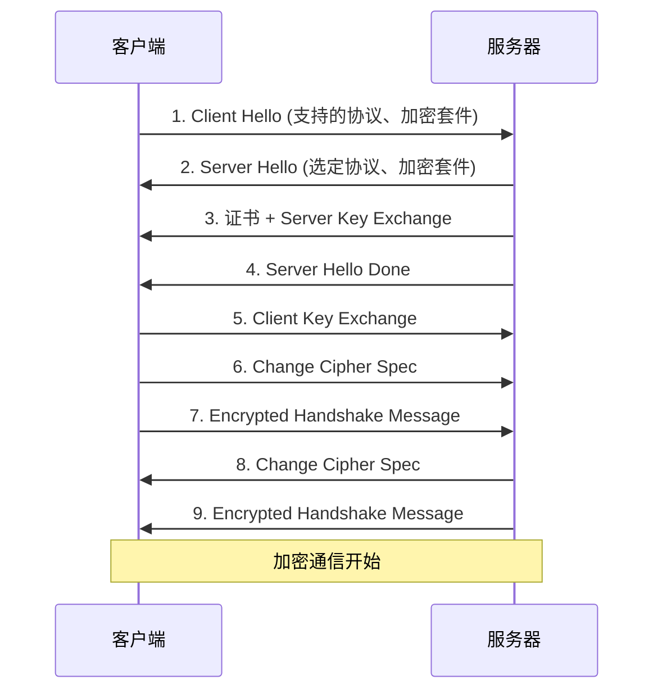

# SSL/TLS 配置

## SSL/TLS 概述

### TLS 握手流程



### 证书类型

| 类型   | 全称                    | 验证内容          | 适用场景   |
| ------ | ----------------------- | ----------------- | ---------- |
| **DV** | Domain Validation       | 仅验证域名所有权  | 个人博客   |
| **OV** | Organization Validation | 验证域名+企业信息 | 企业网站   |
| **EV** | Extended Validation     | 严格验证企业身份  | 金融、电商 |

## 基本 HTTPS 配置

```nginx
server {
    listen 443 ssl http2;
    server_name example.com;

    ssl_certificate /etc/nginx/ssl/example.com.crt;
    ssl_certificate_key /etc/nginx/ssl/example.com.key;

    ssl_protocols TLSv1.2 TLSv1.3;
    ssl_prefer_server_ciphers on;

    root /var/www/html;
}
```

## HTTP 重定向到 HTTPS

```nginx
server {
    listen 80;
    server_name example.com www.example.com;
    return 301 https://$host$request_uri;
}
```

## SSL 优化配置

```nginx
ssl_protocols TLSv1.2 TLSv1.3;
ssl_ciphers ECDHE-ECDSA-AES128-GCM-SHA256:ECDHE-RSA-AES128-GCM-SHA256:ECDHE-ECDSA-AES256-GCM-SHA384:ECDHE-RSA-AES256-GCM-SHA384;
ssl_prefer_server_ciphers on;

# Session 缓存（性能优化）
ssl_session_cache shared:SSL:10m;
ssl_session_timeout 1d;
ssl_session_tickets off;

# OCSP Stapling（加速证书验证）
ssl_stapling on;
ssl_stapling_verify on;
resolver 8.8.8.8 8.8.4.4 valid=300s;
resolver_timeout 5s;

# DH 参数（可选，更安全）
ssl_dhparam /etc/nginx/ssl/dhparam.pem;
```

### 生成 DH 参数

```bash
openssl dhparam -out /etc/nginx/ssl/dhparam.pem 2048
```

## Let's Encrypt 证书

```bash
# 安装 Certbot
sudo apt install certbot python3-certbot-nginx

# 获取证书
sudo certbot --nginx -d example.com -d www.example.com

# 测试自动续期
sudo certbot renew --dry-run

# 查看证书信息
sudo certbot certificates
```

### 自动续期配置

```bash
# /etc/cron.d/certbot
0 0,12 * * * root certbot renew --quiet --post-hook "systemctl reload nginx"
```

## 自签名证书

### 生成自签名证书

```bash
# 生成私钥
openssl genrsa -out server.key 2048

# 生成证书签名请求（CSR）
openssl req -new -key server.key -out server.csr \
    -subj "/C=CN/ST=Beijing/L=Beijing/O=Example/CN=example.com"

# 生成自签名证书（有效期 365 天）
openssl x509 -req -days 365 -in server.csr \
    -signkey server.key -out server.crt

# 一步生成（推荐测试环境）
openssl req -x509 -nodes -days 365 -newkey rsa:2048 \
    -keyout server.key -out server.crt \
    -subj "/C=CN/ST=Beijing/L=Beijing/O=Example/CN=example.com"
```

### 带 SAN 的证书（多域名）

```bash
# 创建配置文件 san.cnf
cat > san.cnf << EOF
[req]
distinguished_name = req_distinguished_name
req_extensions = v3_req
prompt = no

[req_distinguished_name]
C = CN
ST = Beijing
L = Beijing
O = Example
CN = example.com

[v3_req]
basicConstraints = CA:FALSE
keyUsage = nonRepudiation, digitalSignature, keyEncipherment
subjectAltName = @alt_names

[alt_names]
DNS.1 = example.com
DNS.2 = www.example.com
DNS.3 = api.example.com
IP.1 = 192.168.1.100
EOF

# 生成证书
openssl req -x509 -nodes -days 365 -newkey rsa:2048 \
    -keyout server.key -out server.crt \
    -config san.cnf -extensions v3_req
```

## 双向认证（mTLS）

```nginx
server {
    listen 443 ssl http2;
    server_name secure.example.com;

    # 服务器证书
    ssl_certificate /etc/nginx/ssl/server.crt;
    ssl_certificate_key /etc/nginx/ssl/server.key;

    # 客户端证书验证
    ssl_client_certificate /etc/nginx/ssl/ca.crt;
    ssl_verify_client on;  # 强制验证
    # ssl_verify_client optional;  # 可选验证
    ssl_verify_depth 2;

    location / {
        # 获取客户端证书信息
        proxy_set_header X-SSL-Client-Cert $ssl_client_cert;
        proxy_set_header X-SSL-Client-DN $ssl_client_s_dn;
        proxy_set_header X-SSL-Client-Verify $ssl_client_verify;

        proxy_pass http://backend;
    }
}
```

### 生成客户端证书

```bash
# 创建 CA
openssl genrsa -out ca.key 2048
openssl req -new -x509 -days 3650 -key ca.key -out ca.crt \
    -subj "/C=CN/ST=Beijing/O=Example CA/CN=Example CA"

# 创建客户端证书
openssl genrsa -out client.key 2048
openssl req -new -key client.key -out client.csr \
    -subj "/C=CN/ST=Beijing/O=Example/CN=client1"
openssl x509 -req -days 365 -in client.csr \
    -CA ca.crt -CAkey ca.key -CAcreateserial -out client.crt

# 导出 PKCS12 格式（用于浏览器导入）
openssl pkcs12 -export -out client.p12 \
    -inkey client.key -in client.crt -certfile ca.crt
```

## 安全响应头

```nginx
# HSTS 强制 HTTPS
add_header Strict-Transport-Security "max-age=31536000; includeSubDomains; preload" always;

# 防止点击劫持
add_header X-Frame-Options SAMEORIGIN always;

# 防止 XSS
add_header X-XSS-Protection "1; mode=block" always;

# 防止 MIME 类型嗅探
add_header X-Content-Type-Options nosniff always;

# 内容安全策略
add_header Content-Security-Policy "default-src 'self'; script-src 'self' 'unsafe-inline'; style-src 'self' 'unsafe-inline';" always;

# Referrer 策略
add_header Referrer-Policy "strict-origin-when-cross-origin" always;
```

## SSL Labs 评级优化

获得 A+ 评级的配置：

```nginx
server {
    listen 443 ssl http2;
    server_name example.com;

    # 证书
    ssl_certificate /etc/nginx/ssl/fullchain.pem;
    ssl_certificate_key /etc/nginx/ssl/privkey.pem;

    # 协议版本（禁用旧版本）
    ssl_protocols TLSv1.2 TLSv1.3;

    # 加密套件（Mozilla Intermediate 配置）
    ssl_ciphers ECDHE-ECDSA-AES128-GCM-SHA256:ECDHE-RSA-AES128-GCM-SHA256:ECDHE-ECDSA-AES256-GCM-SHA384:ECDHE-RSA-AES256-GCM-SHA384:ECDHE-ECDSA-CHACHA20-POLY1305:ECDHE-RSA-CHACHA20-POLY1305:DHE-RSA-AES128-GCM-SHA256:DHE-RSA-AES256-GCM-SHA384;
    ssl_prefer_server_ciphers off;

    # ECDH 曲线
    ssl_ecdh_curve X25519:prime256v1:secp384r1;

    # Session
    ssl_session_cache shared:SSL:10m;
    ssl_session_timeout 1d;
    ssl_session_tickets off;

    # OCSP Stapling
    ssl_stapling on;
    ssl_stapling_verify on;
    ssl_trusted_certificate /etc/nginx/ssl/chain.pem;
    resolver 8.8.8.8 8.8.4.4 valid=300s;

    # HSTS（A+ 必需）
    add_header Strict-Transport-Security "max-age=63072000; includeSubDomains; preload" always;

    root /var/www/html;
    index index.html;
}
```

## 多域名 SSL 配置

### SNI（Server Name Indication）

```nginx
# 多个虚拟主机使用不同证书
server {
    listen 443 ssl http2;
    server_name site1.example.com;
    ssl_certificate /etc/nginx/ssl/site1.crt;
    ssl_certificate_key /etc/nginx/ssl/site1.key;
}

server {
    listen 443 ssl http2;
    server_name site2.example.com;
    ssl_certificate /etc/nginx/ssl/site2.crt;
    ssl_certificate_key /etc/nginx/ssl/site2.key;
}
```

### 通配符证书

```nginx
server {
    listen 443 ssl http2;
    server_name *.example.com;
    ssl_certificate /etc/nginx/ssl/wildcard.example.com.crt;
    ssl_certificate_key /etc/nginx/ssl/wildcard.example.com.key;
}
```

## 证书链验证

```bash
# 验证证书链完整性
openssl verify -CAfile ca.crt server.crt

# 查看证书信息
openssl x509 -in server.crt -noout -text

# 测试 SSL 连接
openssl s_client -connect example.com:443 -servername example.com

# 查看完整证书链
openssl s_client -connect example.com:443 -showcerts
```

## 完整 HTTPS 配置

```nginx
server {
    listen 80;
    server_name example.com www.example.com;
    return 301 https://example.com$request_uri;
}

server {
    listen 443 ssl http2;
    server_name www.example.com;
    return 301 https://example.com$request_uri;
}

server {
    listen 443 ssl http2;
    server_name example.com;

    # SSL 证书
    ssl_certificate /etc/nginx/ssl/fullchain.pem;
    ssl_certificate_key /etc/nginx/ssl/privkey.pem;

    # SSL 优化
    ssl_protocols TLSv1.2 TLSv1.3;
    ssl_ciphers ECDHE-ECDSA-AES128-GCM-SHA256:ECDHE-RSA-AES128-GCM-SHA256:ECDHE-ECDSA-AES256-GCM-SHA384:ECDHE-RSA-AES256-GCM-SHA384;
    ssl_prefer_server_ciphers off;

    ssl_session_cache shared:SSL:10m;
    ssl_session_timeout 1d;

    ssl_stapling on;
    ssl_stapling_verify on;

    # 安全头
    add_header Strict-Transport-Security "max-age=31536000" always;
    add_header X-Frame-Options SAMEORIGIN always;
    add_header X-Content-Type-Options nosniff always;

    root /var/www/html;
    index index.html;

    location / {
        try_files $uri $uri/ =404;
    }
}
```
