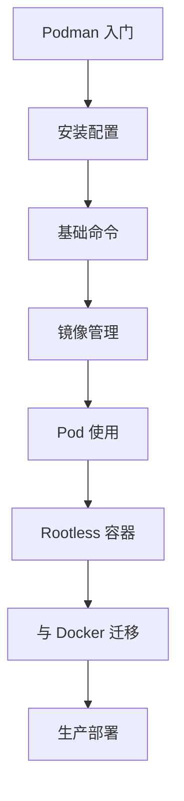

# Podman 无守护进程容器引擎

Podman 是一个开源的、与 Docker 兼容的容器引擎，无需守护进程即可运行容器。

## 什么是 Podman？

Podman（Pod Manager）是 Red Hat 开发的容器管理工具，完全兼容 OCI 标准，可以作为 Docker 的替代品。

### 核心特性

| 特性             | 说明                          |
| ---------------- | ----------------------------- |
| **无守护进程**   | 直接在 Linux 内核上运行容器   |
| **Rootless**     | 支持非 root 用户运行容器      |
| **兼容 Docker**  | 命令行语法与 Docker 基本相同  |
| **Pod 支持**     | 原生支持 Pod 概念（类似 K8s） |
| **Systemd 集成** | 可生成 systemd 服务单元文件   |

## Podman vs Docker

| 特性      | Podman          | Docker        |
| --------- | --------------- | ------------- |
| 守护进程  | 无需            | 需要 dockerd  |
| Root 权限 | 支持 rootless   | 默认需要 root |
| 架构      | 无中心化        | 客户端-服务端 |
| Pod 支持  | 原生支持        | 不支持        |
| 资源占用  | 更低            | 相对较高      |
| 兼容性    | 兼容 Docker CLI | -             |

## 主要组件

- **Podman** - 容器管理命令行工具
- **Buildah** - 专注于构建 OCI 容器镜像
- **Skopeo** - 容器镜像传输和检查工具

## 学习路线

## 文档导航

import DocCardList from '@theme/DocCardList';

<DocCardList />
