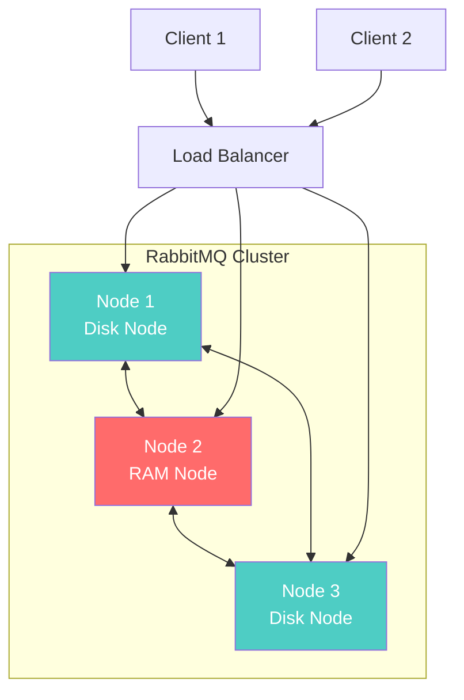

# RabbitMQ 集群管理

本指南介绍 RabbitMQ 集群的搭建、配置和管理。

## 集群概述

### 集群特性

- **高可用性**: 节点故障时自动切换
- **负载均衡**: 请求分发到多个节点
- **扩展性**: 动态添加或移除节点
- **数据复制**: 支持队列镜像

### 集群模式



## 搭建集群

### 1. 准备工作

```bash
# 确保所有节点使用相同的 Erlang Cookie
# 在第一个节点上查看 cookie
cat /var/lib/rabbitmq/.erlang.cookie

# 复制到其他节点
scp /var/lib/rabbitmq/.erlang.cookie user@node2:/var/lib/rabbitmq/
scp /var/lib/rabbitmq/.erlang.cookie user@node3:/var/lib/rabbitmq/

# 设置权限
chmod 400 /var/lib/rabbitmq/.erlang.cookie
chown rabbitmq:rabbitmq /var/lib/rabbitmq/.erlang.cookie
```

### 2. 配置主机名解析

```bash
# /etc/hosts
192.168.1.101 rabbit1
192.168.1.102 rabbit2
192.168.1.103 rabbit3
```

### 3. 加入集群

```bash
# 在 node2 上执行
rabbitmqctl stop_app
rabbitmqctl reset
rabbitmqctl join_cluster rabbit@rabbit1
rabbitmqctl start_app

# 在 node3 上执行相同操作
rabbitmqctl stop_app
rabbitmqctl reset
rabbitmqctl join_cluster rabbit@rabbit1
rabbitmqctl start_app
```

### 4. 验证集群状态

```bash
rabbitmqctl cluster_status
```

## Docker Compose 集群

```yaml
version: "3.8"

services:
  rabbit1:
    image: rabbitmq:3-management
    hostname: rabbit1
    environment:
      RABBITMQ_ERLANG_COOKIE: "secret_cookie"
      RABBITMQ_DEFAULT_USER: admin
      RABBITMQ_DEFAULT_PASS: admin123
    ports:
      - "5672:5672"
      - "15672:15672"
    volumes:
      - rabbit1_data:/var/lib/rabbitmq
    networks:
      - rabbitmq-cluster

  rabbit2:
    image: rabbitmq:3-management
    hostname: rabbit2
    environment:
      RABBITMQ_ERLANG_COOKIE: "secret_cookie"
      RABBITMQ_DEFAULT_USER: admin
      RABBITMQ_DEFAULT_PASS: admin123
    depends_on:
      - rabbit1
    volumes:
      - rabbit2_data:/var/lib/rabbitmq
    networks:
      - rabbitmq-cluster

  rabbit3:
    image: rabbitmq:3-management
    hostname: rabbit3
    environment:
      RABBITMQ_ERLANG_COOKIE: "secret_cookie"
      RABBITMQ_DEFAULT_USER: admin
      RABBITMQ_DEFAULT_PASS: admin123
    depends_on:
      - rabbit1
    volumes:
      - rabbit3_data:/var/lib/rabbitmq
    networks:
      - rabbitmq-cluster

volumes:
  rabbit1_data:
  rabbit2_data:
  rabbit3_data:

networks:
  rabbitmq-cluster:
    driver: bridge
```

## 镜像队列（高可用）

### 配置镜像策略

```bash
# 所有队列镜像到所有节点
rabbitmqctl set_policy ha-all ".*" \
  '{"ha-mode":"all"}' \
  --apply-to queues

# 镜像到 2 个节点
rabbitmqctl set_policy ha-two "^ha\." \
  '{"ha-mode":"exactly","ha-params":2,"ha-sync-mode":"automatic"}' \
  --apply-to queues

# 镜像到指定节点
rabbitmqctl set_policy ha-nodes "^nodes\." \
  '{"ha-mode":"nodes","ha-params":["rabbit@node1","rabbit@node2"]}' \
  --apply-to queues
```

### 镜像参数说明

| 参数                      | 说明               |
| ------------------------- | ------------------ |
| `ha-mode: all`            | 镜像到所有节点     |
| `ha-mode: exactly`        | 镜像到指定数量节点 |
| `ha-mode: nodes`          | 镜像到指定节点列表 |
| `ha-sync-mode: manual`    | 手动同步           |
| `ha-sync-mode: automatic` | 自动同步           |

## Quorum 队列（推荐）

RabbitMQ 3.8+ 推荐使用 Quorum 队列替代镜像队列：

```java
// 声明 Quorum 队列
Map<String, Object> args = new HashMap<>();
args.put("x-queue-type", "quorum");

channel.queueDeclare("quorum-queue", true, false, false, args);
```

### Quorum 队列优势

- 基于 Raft 一致性协议
- 更好的数据安全性
- 更可预测的性能
- 自动故障恢复

## 负载均衡

### HAProxy 配置

```bash
# /etc/haproxy/haproxy.cfg
frontend rabbitmq_frontend
    bind *:5672
    mode tcp
    default_backend rabbitmq_backend

backend rabbitmq_backend
    mode tcp
    balance roundrobin
    server rabbit1 192.168.1.101:5672 check inter 5s rise 2 fall 3
    server rabbit2 192.168.1.102:5672 check inter 5s rise 2 fall 3
    server rabbit3 192.168.1.103:5672 check inter 5s rise 2 fall 3

frontend rabbitmq_management
    bind *:15672
    mode http
    default_backend rabbitmq_management_backend

backend rabbitmq_management_backend
    mode http
    balance roundrobin
    server rabbit1 192.168.1.101:15672 check
    server rabbit2 192.168.1.102:15672 check
    server rabbit3 192.168.1.103:15672 check
```

### Nginx 配置

```nginx
upstream rabbitmq {
    server 192.168.1.101:5672;
    server 192.168.1.102:5672;
    server 192.168.1.103:5672;
}

server {
    listen 5672;
    proxy_pass rabbitmq;
}
```

## 集群管理命令

### 节点管理

```bash
# 查看集群状态
rabbitmqctl cluster_status

# 移除节点
rabbitmqctl forget_cluster_node rabbit@node2

# 更改节点类型
rabbitmqctl change_cluster_node_type disc  # 或 ram

# 停止节点
rabbitmqctl stop_app

# 启动节点
rabbitmqctl start_app
```

### 策略管理

```bash
# 列出所有策略
rabbitmqctl list_policies

# 删除策略
rabbitmqctl clear_policy ha-all

# 查看策略详情
rabbitmqctl list_policies --vhost /
```

## 故障恢复

### 节点故障

```bash
# 1. 检查节点状态
rabbitmqctl cluster_status

# 2. 如果节点无法恢复，从集群中移除
rabbitmqctl forget_cluster_node rabbit@failed_node

# 3. 重新加入集群
rabbitmqctl stop_app
rabbitmqctl reset
rabbitmqctl join_cluster rabbit@healthy_node
rabbitmqctl start_app
```

### 网络分区

```bash
# 配置分区处理策略
# rabbitmq.conf
cluster_partition_handling = autoheal
# 或
cluster_partition_handling = pause_minority
# 或
cluster_partition_handling = pause_if_all_down
```

## 最佳实践

### 1. 节点配置

- 至少使用 3 个节点（奇数个）
- 至少 2 个磁盘节点
- 使用专用网络互联

### 2. 资源规划

```bash
# 建议配置
- CPU: 4+ cores
- RAM: 8+ GB
- Disk: SSD, 100+ GB
- Network: 1Gbps+
```

### 3. 监控告警

```bash
# 监控指标
- 节点状态
- 队列深度
- 消息速率
- 内存使用
- 磁盘空间
```

## 下一步

- 🚀 [性能优化](./performance-optimization.md) - 优化集群性能
- 📊 [监控运维](./monitoring.md) - 监控集群状态
- ✨ [最佳实践](./best-practices.md) - 生产环境建议

## 参考资料

- [RabbitMQ 集群指南](https://www.rabbitmq.com/clustering.html)
- [高可用队列](https://www.rabbitmq.com/ha.html)
- [Quorum 队列](https://www.rabbitmq.com/quorum-queues.html)
