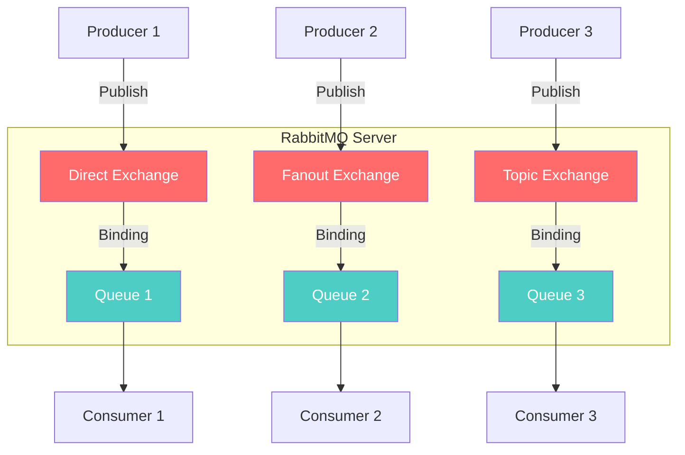
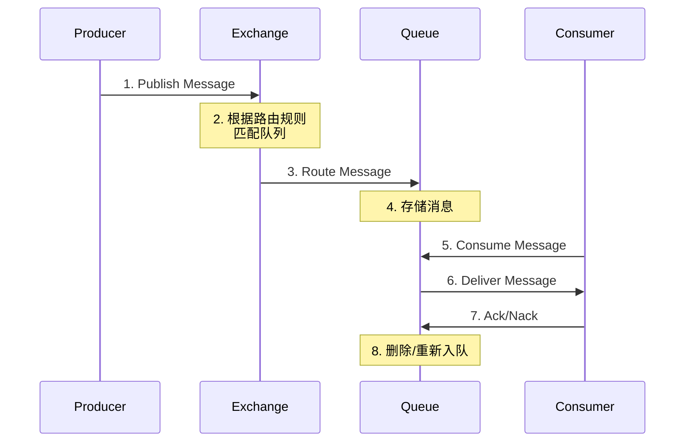

# RabbitMQ 核心概念

## 核心组件概览

RabbitMQ 的消息传递模型由几个核心组件构成,理解这些组件是掌握 RabbitMQ 的关键。



## 1. Connection (连接)

Connection 是应用程序与 RabbitMQ 服务器之间的 TCP 连接。

### 特点

- 基于 TCP 协议
- 长连接,复用性高
- 支持心跳机制
- 可以创建多个 Channel

### 代码示例

```java
ConnectionFactory factory = new ConnectionFactory();
factory.setHost("localhost");
factory.setPort(5672);
factory.setUsername("guest");
factory.setPassword("guest");
factory.setVirtualHost("/");

// 设置连接超时
factory.setConnectionTimeout(30000);

// 设置心跳间隔
factory.setRequestedHeartbeat(60);

// 创建连接
Connection connection = factory.newConnection();
```

### 最佳实践

- 一个应用程序通常只需要一个 Connection
- Connection 是线程安全的
- 使用完毕后记得关闭连接
- 实现连接重连机制

## 2. Channel (通道)

Channel 是在 Connection 内建立的逻辑连接,是进行消息操作的主要接口。

### 特点

- 轻量级,可以创建多个
- 共享一个 TCP 连接
- 不是线程安全的
- 每个线程应该使用独立的 Channel

### 代码示例

```java
// 从连接中创建通道
Channel channel = connection.createChannel();

// 设置通道的 QoS
channel.basicQos(1); // 一次只处理一条消息

// 声明交换机
channel.exchangeDeclare("my_exchange", "direct", true);

// 声明队列
channel.queueDeclare("my_queue", true, false, false, null);

// 绑定队列到交换机
channel.queueBind("my_queue", "my_exchange", "routing_key");
```

### 最佳实践

- 每个线程使用独立的 Channel
- 不要在多个线程间共享 Channel
- 异常发生时,Channel 会被关闭
- 使用 Channel 池管理大量 Channel

## 3. Exchange (交换机)

Exchange 负责接收生产者发送的消息,并根据规则将消息路由到一个或多个队列。

### 交换机类型

#### 3.1 Direct Exchange (直连交换机)

根据路由键精确匹配。

```java
// 声明 Direct 交换机
channel.exchangeDeclare("direct_logs", "direct", true);

// 发送消息到指定路由键
channel.basicPublish("direct_logs", "error", null, message.getBytes());

// 绑定队列
channel.queueBind(queueName, "direct_logs", "error");
```

**使用场景:**

- 日志级别路由(error, warning, info)
- 任务分类处理
- 需要精确匹配的场景

#### 3.2 Fanout Exchange (扇出交换机)

将消息广播到所有绑定的队列,忽略路由键。

```java
// 声明 Fanout 交换机
channel.exchangeDeclare("logs", "fanout", true);

// 发送消息(路由键被忽略)
channel.basicPublish("logs", "", null, message.getBytes());

// 绑定队列
channel.queueBind(queueName, "logs", "");
```

**使用场景:**

- 消息广播
- 实时通知
- 日志收集
- 缓存同步

#### 3.3 Topic Exchange (主题交换机)

根据路由键的模式匹配进行路由。

```java
// 声明 Topic 交换机
channel.exchangeDeclare("topic_logs", "topic", true);

// 发送消息
channel.basicPublish("topic_logs", "kern.critical", null, message.getBytes());

// 绑定队列(使用通配符)
channel.queueBind(queueName, "topic_logs", "kern.*");  // * 匹配一个单词
channel.queueBind(queueName, "topic_logs", "*.critical"); // 匹配所有 critical
channel.queueBind(queueName, "topic_logs", "kern.#");  // # 匹配零个或多个单词
```

**通配符规则:**

- `*` (星号): 匹配一个单词
- `#` (井号): 匹配零个或多个单词

**使用场景:**

- 复杂路由规则
- 多维度消息分类
- 灵活的订阅模式

#### 3.4 Headers Exchange (头交换机)

根据消息头属性进行路由,而不是路由键。

```java
// 声明 Headers 交换机
channel.exchangeDeclare("headers_exchange", "headers", true);

// 设置消息属性
Map<String, Object> headers = new HashMap<>();
headers.put("format", "pdf");
headers.put("type", "report");

AMQP.BasicProperties properties = new AMQP.BasicProperties.Builder()
    .headers(headers)
    .build();

// 发送消息
channel.basicPublish("headers_exchange", "", properties, message.getBytes());

// 绑定队列(x-match: all 表示所有头都要匹配)
Map<String, Object> bindHeaders = new HashMap<>();
bindHeaders.put("x-match", "all");
bindHeaders.put("format", "pdf");
bindHeaders.put("type", "report");

channel.queueBind(queueName, "headers_exchange", "", bindHeaders);
```

**使用场景:**

- 需要基于多个属性路由
- 路由键不够用的场景

## 4. Queue (队列)

Queue 是消息的容器,存储等待被消费的消息。

### 队列属性

```java
/**
 * 声明队列
 * @param queue 队列名称
 * @param durable 持久化(重启后队列依然存在)
 * @param exclusive 排他性(只能被一个连接使用)
 * @param autoDelete 自动删除(没有消费者时自动删除)
 * @param arguments 其他参数
 */
channel.queueDeclare("my_queue",
    true,     // durable
    false,    // exclusive
    false,    // autoDelete
    null);    // arguments
```

### 队列参数

```java
Map<String, Object> args = new HashMap<>();

// 消息 TTL(毫秒)
args.put("x-message-ttl", 60000);

// 队列 TTL(毫秒)
args.put("x-expires", 1800000);

// 队列最大长度
args.put("x-max-length", 1000);

// 队列最大字节数
args.put("x-max-length-bytes", 1048576);

// 死信交换机
args.put("x-dead-letter-exchange", "dlx_exchange");
args.put("x-dead-letter-routing-key", "dead_letter");

// 队列模式(lazy 或 default)
args.put("x-queue-mode", "lazy");

// 最大优先级
args.put("x-max-priority", 10);

channel.queueDeclare("my_queue", true, false, false, args);
```

### 队列类型

#### Classic 队列(经典队列)

默认队列类型,适合大多数场景。

#### Quorum 队列(仲裁队列)

```java
Map<String, Object> args = new HashMap<>();
args.put("x-queue-type", "quorum");

channel.queueDeclare("quorum_queue", true, false, false, args);
```

**特点:**

- 基于 Raft 协议
- 更好的数据安全性
- 适合关键业务
- RabbitMQ 3.8+ 支持

#### Stream 队列(流队列)

```java
Map<String, Object> args = new HashMap<>();
args.put("x-queue-type", "stream");
args.put("x-max-length-bytes", 20000000000L); // 20GB

channel.queueDeclare("stream_queue", true, false, false, args);
```

**特点:**

- 支持消息重复消费
- 适合大数据量场景
- RabbitMQ 3.9+ 支持

## 5. Binding (绑定)

Binding 是交换机和队列之间的关系,定义了消息的路由规则。

### 绑定示例

```java
// 简单绑定
channel.queueBind(queueName, exchangeName, routingKey);

// 带参数的绑定
Map<String, Object> bindArgs = new HashMap<>();
bindArgs.put("x-match", "any");
channel.queueBind(queueName, exchangeName, "", bindArgs);

// 解除绑定
channel.queueUnbind(queueName, exchangeName, routingKey);
```

### 交换机到交换机绑定

```java
// Exchange to Exchange binding
channel.exchangeBind("destination_exchange", "source_exchange", "routing_key");
```

## 6. Message (消息)

Message 由消息体和消息属性组成。

### 消息属性

```java
AMQP.BasicProperties properties = new AMQP.BasicProperties.Builder()
    // 持久化
    .deliveryMode(2)

    // 优先级(0-9)
    .priority(5)

    // 内容类型
    .contentType("application/json")

    // 内容编码
    .contentEncoding("UTF-8")

    // 消息 ID
    .messageId(UUID.randomUUID().toString())

    // 时间戳
    .timestamp(new Date())

    // 过期时间(毫秒)
    .expiration("60000")

    // 相关 ID
    .correlationId("request-123")

    // 回复队列
    .replyTo("reply_queue")

    // 用户 ID
    .userId("admin")

    // 应用 ID
    .appId("my-app")

    // 自定义头
    .headers(Collections.singletonMap("custom-header", "value"))

    .build();

channel.basicPublish(exchangeName, routingKey, properties, messageBody);
```

### 消息确认模式

#### 自动确认

```java
boolean autoAck = true;
channel.basicConsume(queueName, autoAck, deliverCallback, cancelCallback);
```

#### 手动确认

```java
boolean autoAck = false;
DeliverCallback deliverCallback = (consumerTag, delivery) -> {
    try {
        // 处理消息
        processMessage(delivery.getBody());

        // 确认消息
        channel.basicAck(delivery.getEnvelope().getDeliveryTag(), false);
    } catch (Exception e) {
        // 拒绝消息并重新入队
        channel.basicNack(delivery.getEnvelope().getDeliveryTag(), false, true);
    }
};

channel.basicConsume(queueName, autoAck, deliverCallback, cancelCallback);
```

## 7. Virtual Host (虚拟主机)

Virtual Host 是 RabbitMQ 中的逻辑隔离单元,类似于数据库中的命名空间。

### 特点

- 不同的 vhost 之间完全隔离
- 每个 vhost 有自己的交换机、队列和绑定
- 可以为不同的 vhost 设置不同的权限

### 使用示例

```java
ConnectionFactory factory = new ConnectionFactory();
factory.setVirtualHost("/production");  // 设置虚拟主机
```

### 命令行管理

```bash
# 创建虚拟主机
rabbitmqctl add_vhost /my_vhost

# 删除虚拟主机
rabbitmqctl delete_vhost /my_vhost

# 列出所有虚拟主机
rabbitmqctl list_vhosts

# 设置用户权限
rabbitmqctl set_permissions -p /my_vhost username ".*" ".*" ".*"
```

## 消息流程总结



## 下一步学习

- 🚀 [快速开始](./quick-start.md) - 实践这些核心概念
- 💻 [Java 客户端](./java-client.md) - 在代码中应用这些概念
- 🔧 [高级特性](./advanced-features.md) - 学习更多高级功能
- 📊 [最佳实践](./best-practices.md) - 掌握使用技巧

## 参考资源

- [RabbitMQ AMQP 概念](https://www.rabbitmq.com/tutorials/amqp-concepts.html)
- [RabbitMQ 官方教程](https://www.rabbitmq.com/getstarted.html)

---

**💡 提示**: 理解这些核心概念是高效使用 RabbitMQ 的基础,建议通过实际编码加深理解。
