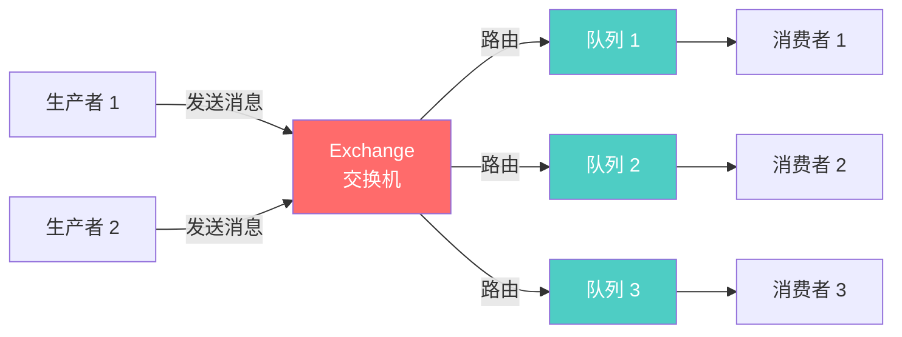

# RabbitMQ 概述

## 什么是 RabbitMQ?

RabbitMQ 是一个开源的消息代理和队列服务器,用于通过消息在分布式系统中传递数据。它基于高级消息队列协议(AMQP)实现,支持多种消息协议,是目前最流行的消息中间件之一。

## 核心特性

### 🚀 **可靠性**

- 消息持久化到磁盘
- 支持消息确认机制
- 提供发布确认功能
- 集群和镜像队列保证高可用

### 💪 **灵活的路由**

- 支持多种交换机类型
- 灵活的消息路由规则
- 支持消息优先级
- 死信队列机制

### 🔒 **集群和高可用**

- 支持集群部署
- 镜像队列实现高可用
- 自动故障转移
- 支持节点动态加入和离开

### 🎯 **多协议支持**

- AMQP 0-9-1
- STOMP
- MQTT
- WebSocket

## 主要使用场景

### 📊 异步处理

将耗时的操作异步化,提高系统响应速度。

```java
// 简单的生产者示例
ConnectionFactory factory = new ConnectionFactory();
factory.setHost("localhost");

try (Connection connection = factory.newConnection();
     Channel channel = connection.createChannel()) {

    String queueName = "task_queue";
    channel.queueDeclare(queueName, true, false, false, null);

    String message = "Hello RabbitMQ!";
    channel.basicPublish("", queueName,
        MessageProperties.PERSISTENT_TEXT_PLAIN,
        message.getBytes("UTF-8"));

    System.out.println(" [x] Sent '" + message + "'");
}
```

### 📈 应用解耦

通过消息队列解耦系统组件,降低系统复杂度。

### 🔄 流量削峰

在高并发场景下,使用消息队列缓冲请求,保护后端服务。

### 💾 消息通知

实现系统间的事件通知和消息广播。

### 🔗 分布式事务

配合消息确认机制实现最终一致性。

## RabbitMQ 核心概念

### Producer (生产者)

- 发送消息的应用程序
- 连接到 RabbitMQ 服务器
- 将消息发送到交换机

### Exchange (交换机)

- 接收生产者发送的消息
- 根据路由规则将消息路由到队列
- 支持多种类型:Direct、Fanout、Topic、Headers

### Queue (队列)

- 存储消息的缓冲区
- 消息的最终目的地
- 可以被多个消费者共享

### Binding (绑定)

- 交换机和队列之间的关系
- 定义消息的路由规则
- 可以设置路由键(Routing Key)

### Consumer (消费者)

- 接收消息的应用程序
- 订阅一个或多个队列
- 处理接收到的消息

## 架构优势



### ✅ 解耦性

生产者和消费者通过队列进行通信,互不影响。

### ✅ 可靠性

支持消息持久化、确认机制和镜像队列。

### ✅ 扩展性

可以轻松添加新的生产者和消费者。

### ✅ 灵活性

支持多种交换机类型和路由模式。

## 交换机类型

### Direct Exchange (直连交换机)

根据完全匹配的路由键将消息路由到队列。

### Fanout Exchange (扇出交换机)

将消息广播到所有绑定的队列,忽略路由键。

### Topic Exchange (主题交换机)

根据路由键的模式匹配将消息路由到队列。

### Headers Exchange (头交换机)

根据消息头属性进行路由,而不是路由键。

## 版本特性

### RabbitMQ 3.x

- 改进的性能和内存管理
- 更好的集群支持
- Quorum 队列(仲裁队列)
- Stream 流式队列支持
- OAuth 2.0 支持

## 适用场景

✅ **适合使用 RabbitMQ 的场景:**

- 需要可靠的消息传递
- 复杂的路由需求
- 需要消息优先级
- 需要延迟队列
- 微服务之间的异步通信
- 任务队列和工作流

❌ **不适合使用 RabbitMQ 的场景:**

- 需要超高吞吐量(考虑使用 Kafka)
- 简单的发布订阅(Redis Pub/Sub 可能更简单)
- 实时流处理(Kafka Streams 更合适)
- 数据持久化存储需求高

## 与其他消息队列的对比

| 特性         | RabbitMQ | Kafka    | RocketMQ |
| ------------ | -------- | -------- | -------- |
| **协议**     | AMQP     | 自定义   | 自定义   |
| **吞吐量**   | 中等     | 非常高   | 高       |
| **延迟**     | 微秒级   | 毫秒级   | 毫秒级   |
| **可靠性**   | 高       | 高       | 高       |
| **路由功能** | 非常强   | 较弱     | 中等     |
| **消息回溯** | 不支持   | 支持     | 支持     |
| **学习曲线** | 中等     | 陡峭     | 中等     |
| **使用场景** | 任务队列 | 日志收集 | 电商交易 |

## 下一步

- 📖 [RabbitMQ 简介](/docs/rabbitmq/introduction) - 深入了解 RabbitMQ 的基本概念
- 🚀 [快速开始](/docs/rabbitmq/quick-start) - 快速搭建 RabbitMQ 环境
- 🎯 [核心概念](/docs/rabbitmq/core-concepts) - 理解 RabbitMQ 的核心组件
- 💻 [交换机详解](/docs/rabbitmq/exchanges) - 学习不同类型的交换机
- 📊 [队列管理](/docs/rabbitmq/queues) - 掌握队列的配置和管理

## 参考资源

- [RabbitMQ 官方文档](https://www.rabbitmq.com/documentation.html)
- [RabbitMQ 教程](https://www.rabbitmq.com/getstarted.html)
- [AMQP 0-9-1 协议规范](https://www.rabbitmq.com/amqp-0-9-1-reference.html)

---

**💡 提示:** 建议从 [快速开始](/docs/rabbitmq/quick-start) 章节开始,通过实际操作来学习 RabbitMQ。
