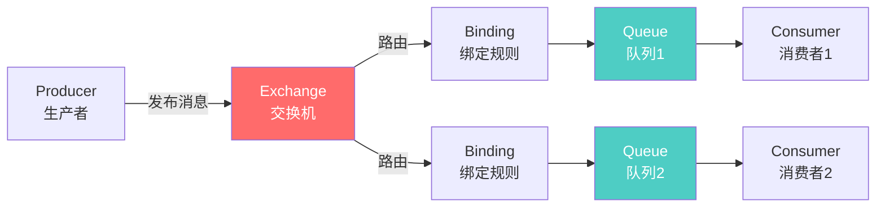

# RabbitMQ 简介

## RabbitMQ 是什么?

RabbitMQ 是一个功能强大的开源消息代理软件,最初起源于金融系统,用于在分布式系统中传递和存储消息。它实现了高级消息队列协议(AMQP),并提供了可靠、灵活的消息传递机制。

## 历史背景

- **2007 年**: Rabbit Technologies 公司开发了 RabbitMQ
- **2010 年**: 被 SpringSource 收购
- **2013 年**: 被 Pivotal 收购
- **2019 年**: VMware 收购 Pivotal,成为 VMware Tanzu 的一部分
- **现在**: 继续作为开源项目活跃发展

## 核心优势

### 1. 开源且活跃

- 完全开源,基于 Mozilla Public License
- 拥有活跃的社区支持
- 持续更新和改进
- 丰富的文档和教程

### 2. 跨平台支持

```bash
# Linux 安装
sudo apt-get install rabbitmq-server

# macOS 安装
brew install rabbitmq

# Docker 部署
docker run -d --name rabbitmq -p 5672:5672 -p 15672:15672 rabbitmq:3-management
```

### 3. 多语言客户端

RabbitMQ 支持多种编程语言的客户端库:

- Java / Spring AMQP
- Python / Pika
- .NET / RabbitMQ.Client
- Node.js / amqplib
- Go / amqp091-go
- PHP / php-amqplib
- Ruby / Bunny

### 4. 丰富的插件系统

```bash
# 启用管理插件
rabbitmq-plugins enable rabbitmq_management

# 启用延迟消息插件
rabbitmq-plugins enable rabbitmq_delayed_message_exchange

# 启用 MQTT 插件
rabbitmq-plugins enable rabbitmq_mqtt

# 启用 STOMP 插件
rabbitmq-plugins enable rabbitmq_stomp
```

## AMQP 协议简介

### 什么是 AMQP?

AMQP (Advanced Message Queuing Protocol) 是一个提供统一消息服务的应用层标准协议。

**核心特点:**

- 二进制协议,性能高效
- 支持消息确认和事务
- 定义了消息的格式和传递规则
- 平台和语言无关

### AMQP 模型



## RabbitMQ 工作原理

### 1. 消息生产

```java
// 创建连接工厂
ConnectionFactory factory = new ConnectionFactory();
factory.setHost("localhost");
factory.setPort(5672);
factory.setUsername("guest");
factory.setPassword("guest");

// 创建连接
Connection connection = factory.newConnection();

// 创建通道
Channel channel = connection.createChannel();

// 声明交换机
channel.exchangeDeclare("logs", "fanout");

// 发布消息
String message = "Hello RabbitMQ!";
channel.basicPublish("logs", "", null, message.getBytes());
```

### 2. 消息路由

交换机根据类型和路由键将消息路由到相应的队列:

- **Direct**: 精确匹配路由键
- **Fanout**: 广播到所有队列
- **Topic**: 模式匹配路由键
- **Headers**: 根据消息头匹配

### 3. 消息消费

```java
// 声明队列
String queueName = channel.queueDeclare().getQueue();

// 绑定队列到交换机
channel.queueBind(queueName, "logs", "");

// 创建消费者
DeliverCallback deliverCallback = (consumerTag, delivery) -> {
    String message = new String(delivery.getBody(), "UTF-8");
    System.out.println(" [x] Received '" + message + "'");
};

// 开始消费
channel.basicConsume(queueName, true, deliverCallback, consumerTag -> { });
```

## 消息可靠性保证

### 1. 消息持久化

```java
// 声明持久化队列
boolean durable = true;
channel.queueDeclare("task_queue", durable, false, false, null);

// 发送持久化消息
channel.basicPublish("", "task_queue",
    MessageProperties.PERSISTENT_TEXT_PLAIN,
    message.getBytes());
```

### 2. 消息确认

```java
// 手动确认消息
boolean autoAck = false;
channel.basicConsume(queueName, autoAck, deliverCallback, consumerTag -> { });

// 在消息处理完成后确认
channel.basicAck(delivery.getEnvelope().getDeliveryTag(), false);
```

### 3. 发布者确认

```java
// 启用发布者确认
channel.confirmSelect();

// 发送消息
channel.basicPublish("", "task_queue", null, message.getBytes());

// 等待确认
channel.waitForConfirmsOrDie(5000);
```

## 管理界面

RabbitMQ 提供了强大的 Web 管理界面:

- **访问地址**: `http://localhost:15672`
- **默认用户**: guest
- **默认密码**: guest

**主要功能:**

- 📊 监控集群状态
- 📈 查看队列和交换机
- 👥 管理用户和权限
- 🔍 追踪消息流向
- ⚙️ 配置参数调整

## 性能特点

### 吞吐量

- 单机可达 **20,000-50,000** 条消息/秒
- 集群模式可进一步提升性能
- 受硬件和网络影响

### 延迟

- 消息传递延迟通常在 **微秒到毫秒** 级别
- 适合对延迟敏感的应用
- 比 Kafka 延迟更低

### 并发

- 支持数万个并发连接
- 每个连接可以有多个通道
- 通道是轻量级的,共享 TCP 连接

## 使用建议

### ✅ 推荐使用场景

1. **任务队列**: 将耗时任务异步处理
2. **工作队列**: 在多个工作者之间分配任务
3. **发布/订阅**: 将消息广播给多个消费者
4. **路由**: 根据条件将消息路由到不同队列
5. **RPC**: 实现远程过程调用

### ⚠️ 注意事项

1. **避免消息堆积**: 及时消费消息,避免内存溢出
2. **合理设置 TTL**: 为消息和队列设置生存时间
3. **监控资源使用**: 定期检查内存、磁盘和连接数
4. **备份配置**: 定期备份队列和交换机定义
5. **版本兼容性**: 注意客户端和服务端版本兼容

## 与 Kafka 的区别

| 特性         | RabbitMQ      | Kafka            |
| ------------ | ------------- | ---------------- |
| **设计目标** | 消息代理      | 分布式日志       |
| **消息模型** | 推送模式      | 拉取模式         |
| **消息顺序** | 队列内有序    | 分区内有序       |
| **消息路由** | 灵活强大      | 简单             |
| **消息回溯** | 不支持        | 支持             |
| **性能**     | 中等          | 极高             |
| **延迟**     | 更低          | 稍高             |
| **适用场景** | 任务队列、RPC | 日志收集、流处理 |

## 下一步学习

- 🎯 [核心概念](./core-concepts.md) - 深入理解交换机、队列、绑定等概念
- 🚀 [快速开始](./quick-start.md) - 动手实践 RabbitMQ
- 💻 [Java 客户端](./java-client.md) - 在 Java 应用中使用 RabbitMQ
- 🔧 [高级配置](./advanced-config.md) - 优化和配置 RabbitMQ

## 参考资源

- [RabbitMQ 官方文档](https://www.rabbitmq.com/documentation.html)
- [RabbitMQ 教程](https://www.rabbitmq.com/getstarted.html)
- [AMQP 0-9-1 完整规范](https://www.rabbitmq.com/amqp-0-9-1-reference.html)
- [RabbitMQ GitHub](https://github.com/rabbitmq)

---

**💡 提示**: RabbitMQ 的强大之处在于其灵活的路由能力和多种交换机类型,建议重点学习这部分内容。
