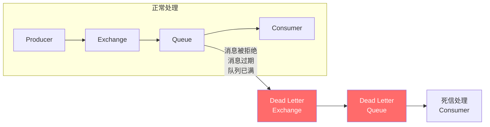

# RabbitMQ 消息类型详解

## 概述

RabbitMQ 支持多种消息类型和处理模式，本文将详细介绍各种消息类型的使用场景和实现方式。

## 普通消息

### 基本消息发送

```java
// 简单消息发送
channel.basicPublish(exchangeName, routingKey, null, message.getBytes());
```

### 持久化消息

```java
// 持久化消息，确保 RabbitMQ 重启后消息不丢失
channel.basicPublish(exchangeName, routingKey,
    MessageProperties.PERSISTENT_TEXT_PLAIN,
    message.getBytes());
```

### 消息属性设置

```java
AMQP.BasicProperties properties = new AMQP.BasicProperties.Builder()
    .deliveryMode(2)                    // 持久化
    .contentType("application/json")    // 内容类型
    .contentEncoding("UTF-8")           // 编码
    .messageId(UUID.randomUUID().toString())  // 消息ID
    .timestamp(new Date())              // 时间戳
    .expiration("60000")                // 过期时间(ms)
    .priority(5)                        // 优先级(0-9)
    .correlationId("request-123")       // 关联ID
    .replyTo("reply_queue")             // 回复队列
    .build();

channel.basicPublish(exchangeName, routingKey, properties, message.getBytes());
```

## 延迟消息

RabbitMQ 本身不直接支持延迟消息，但可以通过以下方式实现。

### 方案一：TTL + 死信队列


```java
// 1. 声明死信交换机（目标交换机）
channel.exchangeDeclare("target_exchange", "direct", true);
channel.queueDeclare("target_queue", true, false, false, null);
channel.queueBind("target_queue", "target_exchange", "");

// 2. 声明延迟队列（设置 TTL 和死信路由）
Map<String, Object> args = new HashMap<>();
args.put("x-message-ttl", 60000);  // 消息 TTL: 60 秒
args.put("x-dead-letter-exchange", "target_exchange");  // 死信交换机
args.put("x-dead-letter-routing-key", "");  // 死信路由键

channel.queueDeclare("delay_queue", true, false, false, args);
channel.exchangeDeclare("delay_exchange", "direct", true);
channel.queueBind("delay_queue", "delay_exchange", "delay");

// 3. 发送延迟消息
channel.basicPublish("delay_exchange", "delay", null, message.getBytes());
// 消息将在 60 秒后被投递到 target_queue
```

### 方案二：消息级别 TTL

```java
// 每条消息设置不同的过期时间
AMQP.BasicProperties properties = new AMQP.BasicProperties.Builder()
    .expiration("30000")  // 30 秒后过期
    .build();

channel.basicPublish("delay_exchange", "delay", properties, message.getBytes());
```

:::warning 注意
消息级别 TTL 的问题：RabbitMQ 只会检查队列头部的消息是否过期。如果队列头部消息的 TTL 较长，后面的短 TTL 消息也不会被及时处理。
:::

### 方案三：延迟消息插件（推荐）

```bash
# 安装延迟消息插件
rabbitmq-plugins enable rabbitmq_delayed_message_exchange
```

```java
// 声明延迟交换机
Map<String, Object> args = new HashMap<>();
args.put("x-delayed-type", "direct");

channel.exchangeDeclare("delayed_exchange", "x-delayed-message", true, false, args);
channel.queueDeclare("delayed_queue", true, false, false, null);
channel.queueBind("delayed_queue", "delayed_exchange", "delayed");

// 发送延迟消息
Map<String, Object> headers = new HashMap<>();
headers.put("x-delay", 60000);  // 延迟 60 秒

AMQP.BasicProperties properties = new AMQP.BasicProperties.Builder()
    .headers(headers)
    .build();

channel.basicPublish("delayed_exchange", "delayed", properties, message.getBytes());
```

## 优先级消息

RabbitMQ 支持消息优先级，优先级高的消息会被优先消费。

### 配置优先级队列

```java
// 声明支持优先级的队列（最大优先级为 10）
Map<String, Object> args = new HashMap<>();
args.put("x-max-priority", 10);

channel.queueDeclare("priority_queue", true, false, false, args);
```

### 发送优先级消息

```java
// 发送高优先级消息
AMQP.BasicProperties highPriority = new AMQP.BasicProperties.Builder()
    .priority(9)
    .build();
channel.basicPublish("", "priority_queue", highPriority, "High priority".getBytes());

// 发送低优先级消息
AMQP.BasicProperties lowPriority = new AMQP.BasicProperties.Builder()
    .priority(1)
    .build();
channel.basicPublish("", "priority_queue", lowPriority, "Low priority".getBytes());
```

:::tip 提示

- 优先级范围：0-255，但建议使用 1-10
- 优先级队列会增加内存和 CPU 开销
- 只有在消息积压时优先级才会生效
  :::

## 死信队列（DLX）

死信队列用于处理无法被正常消费的消息。

### 消息成为死信的情况

1. **消息被拒绝**：`basicNack` 或 `basicReject` 且 `requeue=false`
2. **消息过期**：TTL 超时
3. **队列满了**：超过 `x-max-length` 或 `x-max-length-bytes`



### 配置死信队列

```java
// 1. 声明死信交换机和队列
channel.exchangeDeclare("dlx_exchange", "direct", true);
channel.queueDeclare("dlx_queue", true, false, false, null);
channel.queueBind("dlx_queue", "dlx_exchange", "dlx_routing_key");

// 2. 声明业务队列，配置死信
Map<String, Object> args = new HashMap<>();
args.put("x-dead-letter-exchange", "dlx_exchange");
args.put("x-dead-letter-routing-key", "dlx_routing_key");
args.put("x-message-ttl", 60000);   // 可选：消息 TTL
args.put("x-max-length", 1000);     // 可选：队列最大长度

channel.queueDeclare("business_queue", true, false, false, args);
```

### 死信消息处理

```java
// 消费死信队列
DeliverCallback dlxCallback = (consumerTag, delivery) -> {
    String message = new String(delivery.getBody());
    Map<String, Object> headers = delivery.getProperties().getHeaders();

    // 获取死信原因
    List<Map<String, Object>> xDeathList =
        (List<Map<String, Object>>) headers.get("x-death");

    if (xDeathList != null && !xDeathList.isEmpty()) {
        Map<String, Object> xDeath = xDeathList.get(0);
        String reason = (String) xDeath.get("reason");
        String originalQueue = (String) xDeath.get("queue");

        System.out.println("死信原因: " + reason);
        System.out.println("原队列: " + originalQueue);
    }

    // 处理死信消息（如记录日志、发送告警等）
    handleDeadLetter(message);

    channel.basicAck(delivery.getEnvelope().getDeliveryTag(), false);
};

channel.basicConsume("dlx_queue", false, dlxCallback, consumerTag -> {});
```

## 消息确认模式

### 生产者确认

#### 同步确认

```java
// 启用确认模式
channel.confirmSelect();

// 发送消息
channel.basicPublish("", "queue", null, message.getBytes());

// 等待确认
if (channel.waitForConfirms(5000)) {
    System.out.println("消息发送成功");
} else {
    System.out.println("消息发送失败");
}
```

#### 批量确认

```java
channel.confirmSelect();

for (int i = 0; i < 100; i++) {
    channel.basicPublish("", "queue", null, ("Message " + i).getBytes());
}

// 批量等待确认
channel.waitForConfirmsOrDie(10000);
```

#### 异步确认（推荐）

```java
ConcurrentSkipListMap<Long, String> outstandingConfirms = new ConcurrentSkipListMap<>();

channel.confirmSelect();

// 添加确认监听器
channel.addConfirmListener(
    // 确认成功
    (sequenceNumber, multiple) -> {
        if (multiple) {
            outstandingConfirms.headMap(sequenceNumber + 1).clear();
        } else {
            outstandingConfirms.remove(sequenceNumber);
        }
    },
    // 确认失败
    (sequenceNumber, multiple) -> {
        String message = outstandingConfirms.get(sequenceNumber);
        System.err.println("消息发送失败: " + message);
        // 重新发送或记录日志
    }
);

// 发送消息
for (String message : messages) {
    long sequenceNumber = channel.getNextPublishSeqNo();
    outstandingConfirms.put(sequenceNumber, message);
    channel.basicPublish("", "queue", null, message.getBytes());
}
```

### 消费者确认

```java
// 手动确认模式
boolean autoAck = false;

DeliverCallback deliverCallback = (consumerTag, delivery) -> {
    try {
        processMessage(delivery.getBody());

        // 确认单条消息
        channel.basicAck(delivery.getEnvelope().getDeliveryTag(), false);

    } catch (RecoverableException e) {
        // 可恢复异常：重新入队
        channel.basicNack(delivery.getEnvelope().getDeliveryTag(), false, true);

    } catch (UnrecoverableException e) {
        // 不可恢复异常：发送到死信队列
        channel.basicNack(delivery.getEnvelope().getDeliveryTag(), false, false);
    }
};

channel.basicConsume("queue", autoAck, deliverCallback, consumerTag -> {});
```

## 消息幂等性

### 问题场景

- 网络抖动导致消息重复发送
- 消费者处理成功但确认失败，消息重新投递
- 生产者重试导致重复消息

### 解决方案

#### 数据库唯一约束

```java
@Transactional
public void processMessage(String messageId, String content) {
    // 使用消息ID作为唯一键
    if (messageRepository.existsByMessageId(messageId)) {
        log.info("消息已处理，跳过: {}", messageId);
        return;
    }

    // 处理业务逻辑
    doBusinessLogic(content);

    // 记录已处理的消息
    messageRepository.save(new ProcessedMessage(messageId));
}
```

#### Redis 去重

```java
public boolean processMessage(String messageId, String content) {
    String key = "processed_msg:" + messageId;

    // 尝试设置标记，24小时过期
    Boolean isNew = redisTemplate.opsForValue()
        .setIfAbsent(key, "1", Duration.ofHours(24));

    if (Boolean.FALSE.equals(isNew)) {
        log.info("消息已处理，跳过: {}", messageId);
        return false;
    }

    try {
        doBusinessLogic(content);
        return true;
    } catch (Exception e) {
        // 处理失败，删除标记允许重试
        redisTemplate.delete(key);
        throw e;
    }
}
```

#### Spring Boot 实现

```java
@RabbitListener(queues = "order_queue")
public void handleOrder(Message message, Channel channel) throws IOException {
    String messageId = message.getMessageProperties().getMessageId();

    try {
        if (idempotencyService.checkAndMark(messageId)) {
            // 处理业务
            orderService.processOrder(message.getBody());
        }

        channel.basicAck(message.getMessageProperties().getDeliveryTag(), false);

    } catch (Exception e) {
        channel.basicNack(message.getMessageProperties().getDeliveryTag(), false, true);
    }
}
```

## 最佳实践

### 消息类型选择

| 场景         | 推荐方案              |
| ------------ | --------------------- |
| 普通异步任务 | 持久化消息 + 手动确认 |
| 定时任务     | 延迟消息插件          |
| 紧急通知     | 优先级消息            |
| 异常处理     | 死信队列              |
| 幂等性要求   | Redis/数据库去重      |

### 消息格式建议

```json
{
  "messageId": "uuid",
  "messageType": "ORDER_CREATED",
  "timestamp": "2024-01-01T00:00:00Z",
  "version": "1.0",
  "payload": {
    "orderId": "123456",
    "userId": "user001"
  },
  "metadata": {
    "source": "order-service",
    "traceId": "trace-123"
  }
}
```

## 参考资料

- [RabbitMQ 官方文档 - Publisher Confirms](https://www.rabbitmq.com/confirms.html)
- [RabbitMQ 官方文档 - Dead Letter Exchanges](https://www.rabbitmq.com/dlx.html)
- [RabbitMQ 延迟消息插件](https://github.com/rabbitmq/rabbitmq-delayed-message-exchange)
