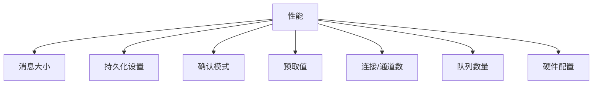

# RabbitMQ 性能优化

本指南介绍 RabbitMQ 的性能优化策略和最佳实践。

## 性能影响因素

### 关键指标

- **吞吐量**: 每秒消息处理数
- **延迟**: 消息从发送到接收的时间
- **资源使用**: CPU、内存、磁盘、网络

### 影响因素



## 生产者优化

### 1. 批量发送

```java
// 批量发送消息
channel.confirmSelect();

List<String> messages = getMessages();
for (String msg : messages) {
    channel.basicPublish("", "queue", null, msg.getBytes());
}

// 等待所有确认
channel.waitForConfirmsOrDie(10000);
```

### 2. 异步确认

```java
channel.confirmSelect();

ConcurrentNavigableMap<Long, String> outstandingConfirms = new ConcurrentSkipListMap<>();

channel.addConfirmListener(
    (sequenceNumber, multiple) -> {
        if (multiple) {
            outstandingConfirms.headMap(sequenceNumber, true).clear();
        } else {
            outstandingConfirms.remove(sequenceNumber);
        }
    },
    (sequenceNumber, multiple) -> {
        // 处理 nack
    }
);

// 发送消息
for (String msg : messages) {
    outstandingConfirms.put(channel.getNextPublishSeqNo(), msg);
    channel.basicPublish("", "queue", null, msg.getBytes());
}
```

### 3. 通道复用

```java
// 使用 ThreadLocal 复用通道
private static final ThreadLocal<Channel> channelHolder = new ThreadLocal<>();

public Channel getChannel() throws IOException {
    Channel channel = channelHolder.get();
    if (channel == null || !channel.isOpen()) {
        channel = connection.createChannel();
        channelHolder.set(channel);
    }
    return channel;
}
```

## 消费者优化

### 1. 预取值设置

```java
// 根据处理时间调整预取值
// 处理快 -> 较大预取值
channel.basicQos(100);

// 处理慢 -> 较小预取值
channel.basicQos(1);
```

### 2. 并发消费

```java
// 多个消费者并发消费
int consumerCount = 10;
ExecutorService executor = Executors.newFixedThreadPool(consumerCount);

for (int i = 0; i < consumerCount; i++) {
    executor.submit(() -> {
        try {
            Channel channel = connection.createChannel();
            channel.basicQos(10);
            channel.basicConsume("queue", false, deliverCallback, cancelCallback);
        } catch (IOException e) {
            e.printStackTrace();
        }
    });
}
```

### 3. 批量确认

```java
private int unackedCount = 0;
private final int BATCH_SIZE = 50;

DeliverCallback callback = (consumerTag, delivery) -> {
    processMessage(delivery);
    unackedCount++;

    if (unackedCount >= BATCH_SIZE) {
        channel.basicAck(delivery.getEnvelope().getDeliveryTag(), true);
        unackedCount = 0;
    }
};
```

## 队列优化

### 1. Lazy Queue

适用于大量消息堆积的场景：

```java
Map<String, Object> args = new HashMap<>();
args.put("x-queue-mode", "lazy");

channel.queueDeclare("lazy-queue", true, false, false, args);
```

### 2. Quorum Queue

适用于高可靠性场景：

```java
Map<String, Object> args = new HashMap<>();
args.put("x-queue-type", "quorum");

channel.queueDeclare("quorum-queue", true, false, false, args);
```

### 3. Stream Queue

适用于高吞吐量场景：

```java
Map<String, Object> args = new HashMap<>();
args.put("x-queue-type", "stream");
args.put("x-max-length-bytes", 5000000000L); // 5GB

channel.queueDeclare("stream-queue", true, false, false, args);
```

### 4. 消息 TTL

```java
Map<String, Object> args = new HashMap<>();
args.put("x-message-ttl", 60000); // 60 秒

channel.queueDeclare("ttl-queue", true, false, false, args);
```

### 5. 队列长度限制

```java
Map<String, Object> args = new HashMap<>();
args.put("x-max-length", 10000);        // 最大消息数
args.put("x-overflow", "reject-publish"); // 溢出策略

channel.queueDeclare("limited-queue", true, false, false, args);
```

## 服务器配置优化

### rabbitmq.conf

```ini
# 内存限制
vm_memory_high_watermark.relative = 0.6
vm_memory_high_watermark_paging_ratio = 0.5

# 磁盘限制
disk_free_limit.relative = 2.0

# 网络优化
tcp_listen_options.backlog = 4096
tcp_listen_options.nodelay = true
tcp_listen_options.sndbuf = 196608
tcp_listen_options.recbuf = 196608

# 连接限制
channel_max = 2047
heartbeat = 60

# 队列优化
queue_index_embed_msgs_below = 4096

# 集群优化
cluster_partition_handling = autoheal
```

### 系统级优化

```bash
# /etc/sysctl.conf
# 网络优化
net.core.somaxconn = 65535
net.core.netdev_max_backlog = 65535
net.ipv4.tcp_max_syn_backlog = 65535
net.ipv4.tcp_fin_timeout = 10
net.ipv4.tcp_tw_reuse = 1

# 文件句柄
fs.file-max = 1000000

# /etc/security/limits.conf
rabbitmq soft nofile 65535
rabbitmq hard nofile 65535
```

## 消息设计优化

### 1. 消息大小

```java
// 小消息（推荐）
String message = "{\"orderId\":\"12345\",\"status\":\"created\"}";

// 大消息（使用引用）
String message = "{\"orderId\":\"12345\",\"dataUrl\":\"s3://bucket/data.json\"}";
```

### 2. 消息压缩

```java
// 压缩消息
byte[] compressed = compress(message.getBytes());

AMQP.BasicProperties props = new AMQP.BasicProperties.Builder()
    .contentEncoding("gzip")
    .build();

channel.basicPublish("", "queue", props, compressed);
```

### 3. 序列化选择

```java
// JSON（可读性好）
ObjectMapper mapper = new ObjectMapper();
byte[] json = mapper.writeValueAsBytes(order);

// Protobuf（性能好）
byte[] protobuf = order.toByteArray();

// MessagePack（平衡）
MessagePack msgpack = new MessagePack();
byte[] packed = msgpack.write(order);
```

## 监控与调优

### 关键指标监控

```bash
# 队列深度
rabbitmqctl list_queues name messages

# 消息速率
rabbitmqctl list_queues name messages_ready messages_unacknowledged

# 内存使用
rabbitmqctl status | grep memory

# 连接数
rabbitmqctl list_connections
```

### 性能测试

```bash
# 使用 PerfTest 工具
rabbitmq-perf-test \
  --uri amqp://localhost \
  --producers 5 \
  --consumers 5 \
  --rate 10000 \
  --size 1024 \
  --autoack \
  --confirm 100
```

## 性能对比

| 配置        | 吞吐量 (msg/s) | 延迟 |
| ----------- | -------------- | ---- |
| 自动确认    | 50,000+        | 最低 |
| 手动确认    | 30,000+        | 低   |
| 持久化消息  | 20,000+        | 中   |
| 镜像队列    | 10,000+        | 较高 |
| Quorum 队列 | 15,000+        | 中   |

## 最佳实践总结

### ✅ 推荐做法

1. 使用异步发布确认
2. 根据业务调整预取值
3. 使用 Lazy Queue 处理大量消息
4. 合理设置消息 TTL
5. 监控关键指标

### ❌ 避免做法

1. 每条消息单独确认
2. 频繁创建/关闭连接
3. 消息过大（>10MB）
4. 队列过多（>1000）
5. 忽略内存告警

## 下一步

- 📊 [监控运维](/docs/rabbitmq/monitoring) - 监控 RabbitMQ
- ✨ [最佳实践](/docs/rabbitmq/best-practices) - 生产环境建议
- ❓ [常见问题](/docs/rabbitmq/faq) - 性能相关 FAQ

## 参考资料

- [RabbitMQ 性能调优](https://www.rabbitmq.com/production-checklist.html)
- [PerfTest 工具](https://rabbitmq.github.io/rabbitmq-perf-test/stable/htmlsingle/)
