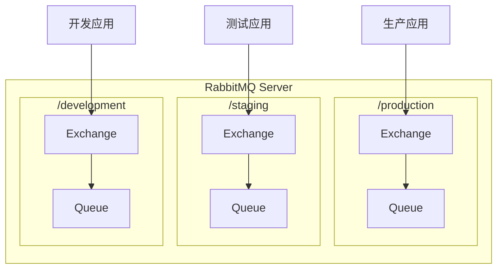

# RabbitMQ 安全配置

## 概述

RabbitMQ 提供了多种安全机制来保护消息系统，包括用户认证、权限控制、SSL/TLS 加密和网络安全等。

## 用户管理

### 用户操作

```bash
# 添加用户
rabbitmqctl add_user myuser mypassword

# 删除用户
rabbitmqctl delete_user myuser

# 修改密码
rabbitmqctl change_password myuser newpassword

# 列出所有用户
rabbitmqctl list_users

# 清除密码（禁止该用户登录）
rabbitmqctl clear_password myuser
```

### 用户标签（角色）

```bash
# 设置用户标签
rabbitmqctl set_user_tags myuser administrator

# 可用标签
# - administrator: 管理员，完全访问权限
# - monitoring: 监控用户，只读访问
# - policymaker: 策略管理员
# - management: 管理界面访问
# - (无标签): 普通用户

# 设置多个标签
rabbitmqctl set_user_tags myuser administrator monitoring
```

### 默认用户

:::warning 生产环境安全
默认的 `guest` 用户只能从 localhost 访问。在生产环境中，应该：

1. 创建新的管理员用户
2. 删除或禁用 guest 用户
   :::

```bash
# 创建管理员
rabbitmqctl add_user admin SecurePassword123!
rabbitmqctl set_user_tags admin administrator
rabbitmqctl set_permissions -p / admin ".*" ".*" ".*"

# 删除 guest 用户
rabbitmqctl delete_user guest
```

## Virtual Host（虚拟主机）

### 虚拟主机管理

```bash
# 创建虚拟主机
rabbitmqctl add_vhost /production
rabbitmqctl add_vhost /staging
rabbitmqctl add_vhost /development

# 删除虚拟主机
rabbitmqctl delete_vhost /test

# 列出所有虚拟主机
rabbitmqctl list_vhosts

# 查看虚拟主机详细信息
rabbitmqctl list_vhosts name tracing
```

### 虚拟主机隔离



## 权限控制

### 权限设置

```bash
# 设置权限
# 格式: rabbitmqctl set_permissions -p <vhost> <user> <configure> <write> <read>
# configure: 创建/删除资源的权限
# write: 发布消息的权限
# read: 消费消息的权限

# 完全权限
rabbitmqctl set_permissions -p / myuser ".*" ".*" ".*"

# 只读权限
rabbitmqctl set_permissions -p / reader "" "" ".*"

# 只写权限
rabbitmqctl set_permissions -p / writer "" ".*" ""

# 特定队列权限
rabbitmqctl set_permissions -p / app_user "^app\." "^app\." "^app\."
```

### 权限查看

```bash
# 查看用户权限
rabbitmqctl list_user_permissions myuser

# 查看虚拟主机权限
rabbitmqctl list_permissions -p /production

# 清除用户权限
rabbitmqctl clear_permissions -p / myuser
```

### Topic 权限

```bash
# 设置 Topic 交换机权限
rabbitmqctl set_topic_permissions -p / myuser "amq.topic" "^order\." "^order\."

# 列出 Topic 权限
rabbitmqctl list_topic_permissions

# 清除 Topic 权限
rabbitmqctl clear_topic_permissions -p / myuser
```

## SSL/TLS 配置

### 生成证书

```bash
# 创建 CA
mkdir -p /etc/rabbitmq/ssl
cd /etc/rabbitmq/ssl

# 生成 CA 私钥
openssl genrsa -out ca_key.pem 2048

# 生成 CA 证书
openssl req -new -x509 -days 365 -key ca_key.pem -out ca_cert.pem \
  -subj "/CN=RabbitMQ-CA"

# 生成服务器私钥
openssl genrsa -out server_key.pem 2048

# 生成服务器证书请求
openssl req -new -key server_key.pem -out server_req.pem \
  -subj "/CN=rabbitmq.example.com"

# 签发服务器证书
openssl x509 -req -days 365 -in server_req.pem \
  -CA ca_cert.pem -CAkey ca_key.pem -CAcreateserial \
  -out server_cert.pem
```

### 服务端配置

```ini
# /etc/rabbitmq/rabbitmq.conf

# 监听端口
listeners.tcp.default = 5672
listeners.ssl.default = 5671

# SSL 证书配置
ssl_options.cacertfile = /etc/rabbitmq/ssl/ca_cert.pem
ssl_options.certfile   = /etc/rabbitmq/ssl/server_cert.pem
ssl_options.keyfile    = /etc/rabbitmq/ssl/server_key.pem

# 验证客户端证书
ssl_options.verify     = verify_peer
ssl_options.fail_if_no_peer_cert = true

# TLS 版本
ssl_options.versions.1 = tlsv1.2
ssl_options.versions.2 = tlsv1.3

# 管理界面 SSL
management.ssl.port        = 15671
management.ssl.cacertfile  = /etc/rabbitmq/ssl/ca_cert.pem
management.ssl.certfile    = /etc/rabbitmq/ssl/server_cert.pem
management.ssl.keyfile     = /etc/rabbitmq/ssl/server_key.pem
```

### Java 客户端配置

```java
ConnectionFactory factory = new ConnectionFactory();
factory.setHost("rabbitmq.example.com");
factory.setPort(5671);
factory.useSslProtocol();

// 使用自定义证书
KeyStore keyStore = KeyStore.getInstance("PKCS12");
keyStore.load(new FileInputStream("client.p12"), "password".toCharArray());

KeyManagerFactory kmf = KeyManagerFactory.getInstance("SunX509");
kmf.init(keyStore, "password".toCharArray());

TrustManagerFactory tmf = TrustManagerFactory.getInstance("SunX509");
KeyStore trustStore = KeyStore.getInstance("JKS");
trustStore.load(new FileInputStream("truststore.jks"), "password".toCharArray());
tmf.init(trustStore);

SSLContext sslContext = SSLContext.getInstance("TLSv1.2");
sslContext.init(kmf.getKeyManagers(), tmf.getTrustManagers(), null);

factory.useSslProtocol(sslContext);
```

### Spring Boot SSL 配置

```yaml
spring:
  rabbitmq:
    host: rabbitmq.example.com
    port: 5671
    ssl:
      enabled: true
      key-store: classpath:client.p12
      key-store-password: password
      key-store-type: PKCS12
      trust-store: classpath:truststore.jks
      trust-store-password: password
      trust-store-type: JKS
      algorithm: TLSv1.2
```

## 认证机制

### 默认认证（PLAIN）

使用用户名密码认证，这是最常用的方式。

### LDAP 认证

```ini
# rabbitmq.conf
auth_backends.1 = ldap

auth_ldap.servers.1 = ldap.example.com
auth_ldap.port = 389
auth_ldap.timeout = 10000

auth_ldap.user_dn_pattern = cn=${username},ou=users,dc=example,dc=com
auth_ldap.dn_lookup_base = ou=users,dc=example,dc=com
auth_ldap.dn_lookup_attribute = cn

# 虚拟主机映射
auth_ldap.vhost_access_query.1.match = .*
auth_ldap.vhost_access_query.1.attribute = memberOf
auth_ldap.vhost_access_query.1.value = cn=rabbitmq-users,ou=groups,dc=example,dc=com
```

### OAuth 2.0 认证

```ini
# rabbitmq.conf
auth_backends.1 = rabbit_auth_backend_oauth2
auth_backends.2 = rabbit_auth_backend_internal

auth_oauth2.resource_server_id = rabbitmq
auth_oauth2.issuer = https://auth.example.com/oauth2/token
auth_oauth2.https.cacertfile = /etc/rabbitmq/ssl/ca_cert.pem
```

## 网络安全

### 防火墙配置

```bash
# 允许 AMQP 端口
sudo ufw allow 5672/tcp

# 允许 SSL AMQP 端口
sudo ufw allow 5671/tcp

# 允许管理界面（仅内网）
sudo ufw allow from 10.0.0.0/8 to any port 15672

# 集群端口（仅节点间）
sudo ufw allow from 10.0.0.1 to any port 4369
sudo ufw allow from 10.0.0.1 to any port 25672
```

### 限制监听地址

```ini
# rabbitmq.conf

# 仅监听本地
listeners.tcp.local = 127.0.0.1:5672

# 监听特定接口
listeners.tcp.private = 10.0.0.1:5672

# 管理界面仅本地
management.tcp.ip = 127.0.0.1
management.tcp.port = 15672
```

### 连接限制

```ini
# rabbitmq.conf

# 最大连接数
connection_max = 10000

# 每个通道最大消息数
channel_max = 2047

# 帧大小限制
frame_max = 131072

# 心跳超时
heartbeat = 60
```

## 安全策略

### 资源限制策略

```bash
# 设置用户内存限制
rabbitmqctl set_user_limits myuser '{"max-connections":100}'

# 设置虚拟主机资源限制
rabbitmqctl set_vhost_limits /production '{"max-connections":500,"max-queues":1000}'

# 查看限制
rabbitmqctl list_user_limits
rabbitmqctl list_vhost_limits
```

### 队列策略

```bash
# 设置策略
rabbitmqctl set_policy -p /production ha-policy ".*" \
  '{"ha-mode":"all","ha-sync-mode":"automatic"}' \
  --priority 1 --apply-to queues
```

## 审计日志

### 启用审计

```ini
# rabbitmq.conf

# 日志级别
log.file.level = info

# 连接日志
log.connection.level = info

# 通道日志
log.channel.level = warning
```

### 日志查看

```bash
# 查看日志位置
rabbitmqctl eval 'rabbit_misc:log_path().'

# 实时查看日志
tail -f /var/log/rabbitmq/rabbit@hostname.log
```

## 安全检查清单

### 生产环境必须

- [ ] 删除或禁用 guest 用户
- [ ] 创建专用管理员账户
- [ ] 启用 SSL/TLS 加密
- [ ] 配置防火墙规则
- [ ] 设置合理的权限策略
- [ ] 限制管理界面访问

### 建议配置

- [ ] 启用 LDAP/OAuth 认证
- [ ] 配置资源限制
- [ ] 启用审计日志
- [ ] 定期更换密码
- [ ] 定期审查权限

## 参考资料

- [RabbitMQ 访问控制](https://www.rabbitmq.com/access-control.html)
- [RabbitMQ TLS 支持](https://www.rabbitmq.com/ssl.html)
- [RabbitMQ LDAP 认证](https://www.rabbitmq.com/ldap.html)
