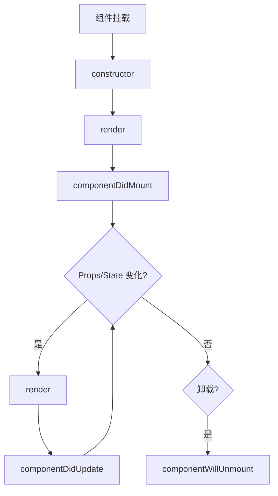

# React 组件基础

> [!TIP]
> 组件是 React 的核心概念，让你可以将 UI 拆分为独立、可复用的部分。

## 📚 什么是组件？

组件是 React 应用的构建块，类似于 JavaScript 函数，接收输入（props）并返回 React 元素。

### 组件的特点

- **独立性** - 每个组件管理自己的状态和逻辑
- **可复用** - 同一个组件可以在多个地方使用
- **可组合** - 组件可以包含其他组件

## 🎯 函数组件

### 基础语法

```jsx
// 最简单的函数组件
function Welcome() {
  return <h1>Hello, React!</h1>;
}

// 箭头函数形式
const Welcome = () => {
  return <h1>Hello, React!</h1>;
};

// 简写形式（单个表达式）
const Welcome = () => <h1>Hello, React!</h1>;
```

### 带 Props 的组件

```jsx
function Greeting({ name, age }) {
  return (
    <div>
      <h1>Hello, {name}!</h1>
      <p>You are {age} years old.</p>
    </div>
  );
}

// 使用
<Greeting name="Alice" age={25} />;
```

### 默认 Props

```jsx
function Button({ text = "Click Me", variant = "primary" }) {
  return <button className={variant}>{text}</button>;
}

// 不传 text 和 variant 时使用默认值
<Button />
// 传入自定义值
<Button text="Submit" variant="secondary" />
```

## 📦 类组件

> [!NOTE]
> 类组件是 React 早期的组件形式，现代 React 推荐使用函数组件 + Hooks。

### 基础语法

```jsx
import React, { Component } from "react";

class Welcome extends Component {
  render() {
    return <h1>Hello, {this.props.name}!</h1>;
  }
}
```

### 带状态的类组件

```jsx
class Counter extends Component {
  constructor(props) {
    super(props);
    this.state = {
      count: 0,
    };
  }

  increment = () => {
    this.setState({ count: this.state.count + 1 });
  };

  render() {
    return (
      <div>
        <p>Count: {this.state.count}</p>
        <button onClick={this.increment}>+1</button>
      </div>
    );
  }
}
```

## 🆚 函数组件 vs 类组件

| 特性           | 函数组件       | 类组件       |
| -------------- | -------------- | ------------ |
| **语法**       | 简洁           | 复杂         |
| **状态管理**   | useState Hook  | this.state   |
| **生命周期**   | useEffect Hook | 生命周期方法 |
| **this 绑定**  | 无需关心       | 需要绑定     |
| **性能**       | 略好           | 稍差         |
| **可读性**     | 更好           | 较差         |
| **React 推荐** | ✅ 推荐        | ⚠️ 维护模式  |

**推荐使用函数组件！** 除非维护旧代码，否则不建议使用类组件。

## 🧩 组件组合

### 包含关系

组件可以包含其他组件：

```jsx
function App() {
  return (
    <div>
      <Header />
      <Main />
      <Footer />
    </div>
  );
}

function Header() {
  return (
    <header>
      <h1>My Website</h1>
    </header>
  );
}

function Main() {
  return (
    <main>
      <Article />
      <Sidebar />
    </main>
  );
}

function Footer() {
  return (
    <footer>
      <p>© 2024</p>
    </footer>
  );
}
```

### Children Props

使用 `children` 实现容器组件：

```jsx
function Card({ children, title }) {
  return (
    <div className="card">
      <h2>{title}</h2>
      <div className="card-content">{children}</div>
    </div>
  );
}

// 使用
function App() {
  return (
    <Card title="Welcome">
      <p>This is the card content.</p>
      <button>Learn More</button>
    </Card>
  );
}
```

### 特殊化

通用组件可以派生出特殊组件：

```jsx
// 通用对话框
function Dialog({ title, message, children }) {
  return (
    <div className="dialog">
      <h1>{title}</h1>
      <p>{message}</p>
      {children}
    </div>
  );
}

// 特殊化：欢迎对话框
function WelcomeDialog() {
  return (
    <Dialog title="Welcome" message="Thank you for visiting!">
      <button>Get Started</button>
    </Dialog>
  );
}
```

## 📤 组件导出和导入

### 默认导出

```jsx
// Button.jsx
export default function Button() {
  return <button>Click Me</button>;
}

// App.jsx
import Button from "./Button";
```

### 命名导出

```jsx
// Components.jsx
export function Button() {
  return <button>Click</button>;
}

export function Input() {
  return <input />;
}

// App.jsx
import { Button, Input } from "./Components";
```

### 混合导出

```jsx
// Components.jsx
export function Button() {
  /* ... */
}
export function Input() {
  /* ... */
}

export default function Card() {
  /* ... */
}

// App.jsx
import Card, { Button, Input } from "./Components";
```

## 🎨 组件最佳实践

### 1. 单一职责原则

```jsx
// ✗ 不好 - 组件做了太多事情
function UserCard({ user }) {
  return (
    <div>
      
      <h2>{user.name}</h2>
      <p>{user.email}</p>
      <button onClick={() => fetch("/api/follow")}>Follow</button>
      <button onClick={() => fetch("/api/message")}>Message</button>
    </div>
  );
}

// ✓ 好 - 拆分成小组件
function UserCard({ user }) {
  return (
    <div>
      <UserAvatar src={user.avatar} />
      <UserInfo name={user.name} email={user.email} />
      <UserActions userId={user.id} />
    </div>
  );
}
```

### 2. 提取可复用组件

```jsx
// 可复用的按钮组件
function Button({ children, variant = 'primary', onClick }) {
  return (
    <button
      className={`btn btn-${variant}`}
      onClick={onClick}
    >
      {children}
    </button>
  );
}

// 在多处使用
<Button variant="primary">Save</Button>
<Button variant="danger">Delete</Button>
<Button variant="secondary">Cancel</Button>
```

### 3. Props 解构

```jsx
// ✗ 不推荐
function Welcome(props) {
  return <h1>Hello, {props.name}!</h1>;
}

// ✓ 推荐 - 使用解构
function Welcome({ name, age, email }) {
  return (
    <div>
      <h1>Hello, {name}!</h1>
      <p>Age: {age}</p>
      <p>Email: {email}</p>
    </div>
  );
}
```

### 4. 避免嵌套过深

```jsx
// ✗ 不好 - 嵌套太深
function App() {
  return (
    <div>
      <header>
        <nav>
          <ul>
            <li>
              <a href="/">Home</a>
            </li>
          </ul>
        </nav>
      </header>
    </div>
  );
}

// ✓ 好 - 拆分组件
function App() {
  return (
    <div>
      <Header />
    </div>
  );
}

function Header() {
  return (
    <header>
      <Navigation />
    </header>
  );
}
```

## 🔄 组件生命周期（类组件）

虽然推荐使用函数组件，但了解类组件生命周期有助于理解 React 工作原理。

### 生命周期图



### 主要生命周期方法

```jsx
class Example extends Component {
  // 1. 挂载阶段
  constructor(props) {
    super(props);
    this.state = { count: 0 };
  }

  componentDidMount() {
    // 组件挂载后调用（类似 useEffect([])）
    console.log("Component mounted");
  }

  // 2. 更新阶段
  componentDidUpdate(prevProps, prevState) {
    // 组件更新后调用
    if (prevState.count !== this.state.count) {
      console.log("Count changed");
    }
  }

  // 3. 卸载阶段
  componentWillUnmount() {
    // 组件卸载前调用（清理工作）
    console.log("Component will unmount");
  }

  render() {
    return <div>{this.state.count}</div>;
  }
}
```

## 📖 实用示例

### 用户卡片组件

```jsx
function UserCard({ user }) {
  const { name, email, avatar, role } = user;

  return (
    <div className="user-card">
      
      <div className="user-info">
        <h3>{name}</h3>
        <p className="email">{email}</p>
        <span className="role">{role}</span>
      </div>
    </div>
  );
}

// 使用
const user = {
  name: "Alice",
  email: "alice@example.com",
  avatar: "/avatars/alice.jpg",
  role: "Developer",
};

<UserCard user={user} />;
```

### 产品列表组件

```jsx
function ProductList({ products }) {
  return (
    <div className="product-list">
      {products.map((product) => (
        <ProductCard key={product.id} product={product} />
      ))}
    </div>
  );
}

function ProductCard({ product }) {
  return (
    <div className="product-card">
      
      <h3>{product.name}</h3>
      <p className="price">${product.price}</p>
      <button>Add to Cart</button>
    </div>
  );
}
```

---

**下一步**: 学习 [JSX 语法](/docs/react/jsx-syntax) 深入了解如何编写组件，或查看 [Props 和 State](/docs/react/props-and-state) 了解组件数据管理。
