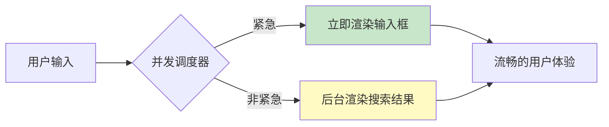

# React 并发渲染

> [!TIP]
> 并发渲染是 React 18+ 的核心特性，让 React 能够同时准备多个 UI 版本，提供更流畅的用户体验。React 19 进一步增强了这些能力。

## 🧠 什么是并发渲染？

传统的 React 渲染是**同步**的：一旦开始渲染，必须完成整个组件树才能响应用户交互。

并发渲染允许 React：

- **中断渲染**：暂停正在进行的渲染，处理更紧急的更新
- **优先级调度**：区分紧急更新（如输入）和非紧急更新（如搜索结果）
- **后台准备**：在不阻塞主线程的情况下准备新的 UI



## ⚡ useTransition

`useTransition` 让你可以将某些状态更新标记为"非紧急"，让 UI 保持响应。

### 基础用法

```jsx
import { useState, useTransition } from "react";

function SearchPage() {
  const [query, setQuery] = useState("");
  const [results, setResults] = useState([]);
  const [isPending, startTransition] = useTransition();

  function handleChange(e) {
    const value = e.target.value;

    // 紧急更新：立即更新输入框
    setQuery(value);

    // 非紧急更新：可以被中断
    startTransition(() => {
      const filtered = filterHugeList(value);
      setResults(filtered);
    });
  }

  return (
    <div>
      <input value={query} onChange={handleChange} />

      {isPending && <div className="spinner">搜索中...</div>}

      <ul style={{ opacity: isPending ? 0.7 : 1 }}>
        {results.map((item) => (
          <li key={item.id}>{item.name}</li>
        ))}
      </ul>
    </div>
  );
}
```

### 路由切换示例

```jsx
import { useTransition } from "react";

function TabContainer() {
  const [tab, setTab] = useState("home");
  const [isPending, startTransition] = useTransition();

  function selectTab(nextTab) {
    startTransition(() => {
      setTab(nextTab);
    });
  }

  return (
    <div>
      <nav>
        <button
          onClick={() => selectTab("home")}
          className={tab === "home" ? "active" : ""}
        >
          首页
        </button>
        <button
          onClick={() => selectTab("posts")}
          className={tab === "posts" ? "active" : ""}
        >
          文章 {isPending && "..."}
        </button>
        <button
          onClick={() => selectTab("settings")}
          className={tab === "settings" ? "active" : ""}
        >
          设置
        </button>
      </nav>

      <div style={{ opacity: isPending ? 0.8 : 1 }}>
        {tab === "home" && <HomeTab />}
        {tab === "posts" && <PostsTab />}
        {tab === "settings" && <SettingsTab />}
      </div>
    </div>
  );
}
```

## 🔄 useDeferredValue

`useDeferredValue` 让你延迟更新 UI 的某个部分，优先显示其他内容。

### 基础用法

```jsx
import { useState, useDeferredValue, useMemo } from "react";

function SearchResults({ query }) {
  // 延迟的查询值
  const deferredQuery = useDeferredValue(query);

  // 使用延迟值计算结果
  const results = useMemo(() => {
    return searchDatabase(deferredQuery);
  }, [deferredQuery]);

  // 检测是否正在使用旧值
  const isStale = query !== deferredQuery;

  return (
    <div style={{ opacity: isStale ? 0.7 : 1 }}>
      {results.map((item) => (
        <div key={item.id}>{item.title}</div>
      ))}
    </div>
  );
}

function App() {
  const [query, setQuery] = useState("");

  return (
    <div>
      <input
        value={query}
        onChange={(e) => setQuery(e.target.value)}
        placeholder="搜索..."
      />
      <SearchResults query={query} />
    </div>
  );
}
```

### 大列表渲染优化

```jsx
function SlowList({ text }) {
  const deferredText = useDeferredValue(text);
  const isStale = text !== deferredText;

  // 假设这是一个非常耗时的渲染
  const items = useMemo(() => {
    const result = [];
    for (let i = 0; i < 10000; i++) {
      result.push(
        <div key={i} style={{ opacity: isStale ? 0.5 : 1 }}>
          Item {i}: {deferredText}
        </div>
      );
    }
    return result;
  }, [deferredText, isStale]);

  return <div>{items}</div>;
}
```

## 🆔 useId

`useId` 生成唯一的 ID，在服务端和客户端保持一致，解决 SSR 水合问题。

### 基础用法

```jsx
import { useId } from "react";

function FormField({ label }) {
  const id = useId();

  return (
    <div>
      <label htmlFor={id}>{label}</label>
      <input id={id} type="text" />
    </div>
  );
}

// 多个相关 ID
function PasswordField() {
  const id = useId();

  return (
    <div>
      <label htmlFor={`${id}-password`}>密码</label>
      <input
        id={`${id}-password`}
        type="password"
        aria-describedby={`${id}-hint`}
      />
      <p id={`${id}-hint`}>密码至少 8 个字符</p>
    </div>
  );
}
```

### 可访问性组件

```jsx
function Tooltip({ content, children }) {
  const id = useId();
  const [isOpen, setIsOpen] = useState(false);

  return (
    <div>
      <button
        aria-describedby={isOpen ? id : undefined}
        onMouseEnter={() => setIsOpen(true)}
        onMouseLeave={() => setIsOpen(false)}
      >
        {children}
      </button>
      {isOpen && (
        <div id={id} role="tooltip">
          {content}
        </div>
      )}
    </div>
  );
}
```

## 🎯 useTransition vs useDeferredValue

| 特性         | useTransition                  | useDeferredValue     |
| ------------ | ------------------------------ | -------------------- |
| **用途**     | 标记状态更新为非紧急           | 延迟显示值的变化     |
| **控制**     | 手动包裹 setState              | 自动延迟值           |
| **适用场景** | 控制何时触发更新               | 延迟渲染开销大的组件 |
| **返回值**   | `[isPending, startTransition]` | `deferredValue`      |

### 选择指南

```jsx
// ✅ 使用 useTransition：当你控制状态更新
function SearchWithTransition() {
  const [query, setQuery] = useState("");
  const [isPending, startTransition] = useTransition();

  const handleChange = (e) => {
    startTransition(() => {
      setQuery(e.target.value);
    });
  };

  return <input onChange={handleChange} />;
}

// ✅ 使用 useDeferredValue：当值来自 props 或外部
function SearchResults({ query }) {
  // query 来自父组件
  const deferredQuery = useDeferredValue(query);
  // ...
}
```

## 🚀 与 Suspense 配合

并发特性与 Suspense 完美配合：

```jsx
import { Suspense, useState, useTransition } from "react";

function App() {
  const [tab, setTab] = useState("home");
  const [isPending, startTransition] = useTransition();

  function selectTab(nextTab) {
    startTransition(() => {
      setTab(nextTab);
    });
  }

  return (
    <div>
      <TabButtons onSelect={selectTab} isPending={isPending} />

      <Suspense fallback={<Spinner />}>
        {tab === "home" && <HomeContent />}
        {tab === "posts" && <PostsContent />}
        {tab === "comments" && <CommentsContent />}
      </Suspense>
    </div>
  );
}
```

## 💡 最佳实践

### 1. 不要过度使用

```jsx
// ✗ 不需要：简单的状态更新
startTransition(() => {
  setCount(count + 1); // 这已经很快了
});

// ✓ 需要：昂贵的计算或大量渲染
startTransition(() => {
  setSearchResults(filterThousandsOfItems(query));
});
```

### 2. 保持 UI 响应

```jsx
// ✓ 输入框始终响应
function Search() {
  const [input, setInput] = useState("");
  const [query, setQuery] = useState("");
  const [isPending, startTransition] = useTransition();

  const handleChange = (e) => {
    setInput(e.target.value); // 立即更新输入

    startTransition(() => {
      setQuery(e.target.value); // 延迟触发搜索
    });
  };

  return (
    <div>
      <input value={input} onChange={handleChange} />
      <Results query={query} isPending={isPending} />
    </div>
  );
}
```

### 3. 提供视觉反馈

```jsx
<div
  style={{
    opacity: isPending ? 0.7 : 1,
    transition: "opacity 0.2s",
  }}
>
  {/* 内容 */}
</div>
```

## 🔗 相关资源

- [React 19 新特性](/docs/react/react19-features)
- [Suspense 与 use() 数据获取](/docs/react/suspense-data-fetching)
- [性能优化](/docs/react/performance-optimization)
- [Hooks 详解](/docs/react/hooks)

---

**下一步**：了解 [React 19 新特性](/docs/react/react19-features) 中的更多并发能力，或学习 [性能优化](/docs/react/performance-optimization) 提升应用性能。
