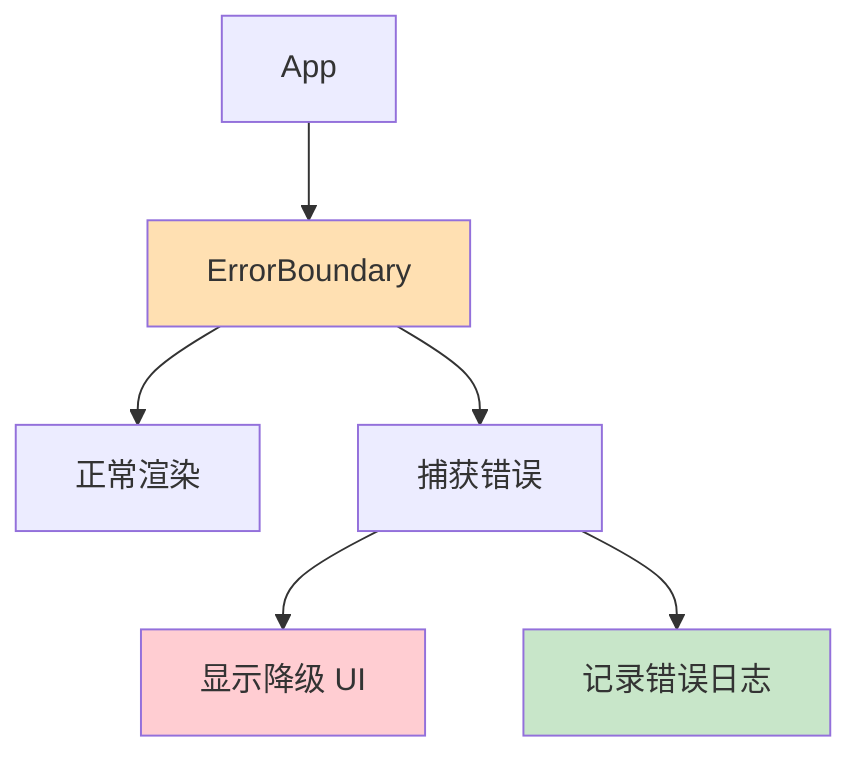

# 错误边界（Error Boundaries）

> [!TIP]
> 错误边界是 React 组件，用于捕获子组件树中的 JavaScript 错误，记录错误并显示备用 UI。这是构建健壮应用的重要特性。

## 📚 什么是错误边界？

错误边界是一种特殊的 React 组件，可以捕获发生在其子组件树任何位置的 JavaScript 错误，并记录这些错误，同时展示降级 UI。

### 错误边界的作用



## 🛠️ 创建错误边界

> [!WARNING]
> 错误边界**必须**是类组件，目前还没有 Hook 形式的错误边界。

### 基础实现

```jsx
import React from "react";

class ErrorBoundary extends React.Component {
  constructor(props) {
    super(props);
    this.state = { hasError: false, error: null };
  }

  // 捕获错误，更新状态
  static getDerivedStateFromError(error) {
    return { hasError: true, error };
  }

  // 记录错误信息
  componentDidCatch(error, errorInfo) {
    console.error("Error caught by boundary:", error, errorInfo);
    // 可以发送到错误报告服务
    // logErrorToService(error, errorInfo);
  }

  render() {
    if (this.state.hasError) {
      return (
        <div style={{ padding: "20px", border: "1px solid red" }}>
          <h2>⚠️ 出错了</h2>
          <p>抱歉，应用遇到了一个错误。</p>
          <details>
            <summary>错误详情</summary>
            <pre>{this.state.error?.toString()}</pre>
          </details>
          <button onClick={() => this.setState({ hasError: false })}>
            重试
          </button>
        </div>
      );
    }

    return this.props.children;
  }
}

export default ErrorBoundary;
```

### 使用错误边界

```jsx
function App() {
  return (
    <ErrorBoundary>
      <Header />
      <MainContent />
      <Footer />
    </ErrorBoundary>
  );
}
```

## 🎯 完整的错误边界组件

### 功能丰富的实现

```jsx
class ErrorBoundary extends React.Component {
  constructor(props) {
    super(props);
    this.state = {
      hasError: false,
      error: null,
      errorInfo: null,
      errorCount: 0,
    };
  }

  static getDerivedStateFromError(error) {
    return { hasError: true, error };
  }

  componentDidCatch(error, errorInfo) {
    const { errorCount } = this.state;

    this.setState({
      errorInfo,
      errorCount: errorCount + 1,
    });

    // 记录到监控服务
    this.logError(error, errorInfo);
  }

  logError = (error, errorInfo) => {
    // 发送到 Sentry、LogRocket 等服务
    console.error("Error:", error);
    console.error("Error Info:", errorInfo);

    // 示例：发送到服务器
    /*
    fetch('/api/log-error', {
      method: 'POST',
      headers: { 'Content-Type': 'application/json' },
      body: JSON.stringify({
        error: error.toString(),
        errorInfo: errorInfo.componentStack,
        timestamp: new Date().toISOString(),
      }),
    });
    */
  };

  handleReset = () => {
    this.setState({
      hasError: false,
      error: null,
      errorInfo: null,
    });
  };

  render() {
    const { hasError, error, errorInfo, errorCount } = this.state;
    const { fallback, children } = this.props;

    if (hasError) {
      // 使用自定义降级 UI
      if (fallback) {
        return fallback(error, this.handleReset);
      }

      // 默认降级 UI
      return (
        <div className="error-boundary">
          <div className="error-content">
            <h1>😢 出错了</h1>
            <p>应用遇到了一个意外错误。</p>

            {errorCount > 3 && (
              <div className="error-warning">
                <p>⚠️ 检测到多次错误，可能需要刷新页面。</p>
              </div>
            )}

            {process.env.NODE_ENV === "development" && (
              <details className="error-details">
                <summary>查看错误详情</summary>
                <pre>{error?.toString()}</pre>
                <pre>{errorInfo?.componentStack}</pre>
              </details>
            )}

            <div className="error-actions">
              <button onClick={this.handleReset}>重试</button>
              <button onClick={() => window.location.reload()}>刷新页面</button>
            </div>
          </div>
        </div>
      );
    }

    return children;
  }
}
```

### 使用自定义降级 UI

```jsx
function App() {
  return (
    <ErrorBoundary
      fallback={(error, reset) => (
        <div className="custom-error">
          <h2>自定义错误页面</h2>
          <p>{error.message}</p>
          <button onClick={reset}>重试</button>
        </div>
      )}
    >
      <MyApp />
    </ErrorBoundary>
  );
}
```

## 🔍 错误边界的限制

错误边界**无法**捕获以下错误：

### 1. 事件处理器中的错误

```jsx
// ❌ 错误边界无法捕获
function MyComponent() {
  const handleClick = () => {
    throw new Error("事件处理器错误");
  };

  return <button onClick={handleClick}>点击</button>;
}

// ✅ 需要手动 try-catch
function MyComponent() {
  const handleClick = () => {
    try {
      throw new Error("事件处理器错误");
    } catch (error) {
      console.error(error);
      // 处理错误
    }
  };

  return <button onClick={handleClick}>点击</button>;
}
```

### 2. 异步代码错误

```jsx
// ❌ 错误边界无法捕获
useEffect(() => {
  setTimeout(() => {
    throw new Error("异步错误");
  }, 1000);
}, []);

// ✅ 使用 try-catch 或 Promise.catch
useEffect(() => {
  const fetchData = async () => {
    try {
      const data = await fetch("/api/data");
      // 处理数据
    } catch (error) {
      console.error(error);
      // 处理错误
    }
  };

  fetchData();
}, []);
```

### 3. 服务端渲染错误

```jsx
// SSR 时需要特殊处理
// 错误边界主要用于客户端
```

### 4. 错误边界自身的错误

```jsx
// 错误边界自己抛出的错误会向上传播
// 需要在更上层再包裹一个错误边界
```

## 🎨 错误边界的层次化使用

### 粒度化的错误处理

```jsx
function App() {
  return (
    <div className="app">
      {/* 顶层错误边界 */}
      <ErrorBoundary fallback={<GlobalErrorPage />}>
        <Header /> {/* Header 的错误不影响整个应用 */}
        {/* 局部错误边界 */}
        <ErrorBoundary fallback={<SidebarError />}>
          <Sidebar />
        </ErrorBoundary>
        {/* 主内容区错误边界 */}
        <ErrorBoundary fallback={<ContentError />}>
          <MainContent />
        </ErrorBoundary>
        <Footer />
      </ErrorBoundary>
    </div>
  );
}
```

### 不同区域的降级策略

```jsx
function Dashboard() {
  return (
    <div className="dashboard">
      {/* 关键功能：显示完整错误 */}
      <ErrorBoundary
        fallback={(error, reset) => (
          <div className="critical-error">
            <h2>核心功能出错</h2>
            <p>{error.message}</p>
            <button onClick={reset}>重试</button>
          </div>
        )}
      >
        <CriticalWidget />
      </ErrorBoundary>

      {/* 非关键功能：简单提示 */}
      <ErrorBoundary
        fallback={() => (
          <div className="minor-error">
            <p>此部分暂时不可用</p>
          </div>
        )}
      >
        <OptionalWidget />
      </ErrorBoundary>
    </div>
  );
}
```

## 🔧 与异步错误处理结合

### 自定义 Hook 处理异步错误

```jsx
function useAsyncError() {
  const [, setError] = useState();

  return useCallback((error) => {
    setError(() => {
      throw error; // 触发错误边界
    });
  }, []);
}

// 使用
function MyComponent() {
  const throwError = useAsyncError();

  useEffect(() => {
    const fetchData = async () => {
      try {
        const res = await fetch("/api/data");
        if (!res.ok) throw new Error("请求失败");
        const data = await res.json();
        // 处理数据
      } catch (error) {
        throwError(error); // 抛给错误边界处理
      }
    };

    fetchData();
  }, [throwError]);

  return <div>内容</div>;
}
```

## 📊 与 React Query 集成

```jsx
import { QueryErrorResetBoundary } from "@tanstack/react-query";

function App() {
  return (
    <QueryErrorResetBoundary>
      {({ reset }) => (
        <ErrorBoundary
          onReset={reset}
          fallback={(error, resetError) => (
            <div>
              <p>查询出错: {error.message}</p>
              <button onClick={resetError}>重试</button>
            </div>
          )}
        >
          <DataComponent />
        </ErrorBoundary>
      )}
    </QueryErrorResetBoundary>
  );
}
```

## 💡 最佳实践

### 1. 合理的错误边界粒度

```jsx
// ✓ 好：分层次的错误边界
function App() {
  return (
    <ErrorBoundary>
      {" "}
      {/* 全局错误 */}
      <Layout>
        <ErrorBoundary>
          {" "}
          {/* 页面级错误 */}
          <Page>
            <ErrorBoundary>
              {" "}
              {/* 组件级错误 */}
              <ComplexWidget />
            </ErrorBoundary>
          </Page>
        </ErrorBoundary>
      </Layout>
    </ErrorBoundary>
  );
}

// ✗ 不好：所有组件用一个错误边界
<ErrorBoundary>
  <Component1 />
  <Component2 />
  <Component3 />
</ErrorBoundary>;
```

### 2. 开发和生产环境不同处理

```jsx
class ErrorBoundary extends React.Component {
  render() {
    if (this.state.hasError) {
      if (process.env.NODE_ENV === "development") {
        // 开发环境：显示详细错误信息
        return (
          <div>
            <h2>开发模式 - 错误详情</h2>
            <pre>{this.state.error.stack}</pre>
            <pre>{this.state.errorInfo.componentStack}</pre>
          </div>
        );
      } else {
        // 生产环境：用户友好的提示
        return (
          <div>
            <h2>抱歉，出现了错误</h2>
            <p>我们已记录此问题，请稍后重试。</p>
            <button onClick={() => (window.location.href = "/")}>
              返回首页
            </button>
          </div>
        );
      }
    }

    return this.props.children;
  }
}
```

### 3. 错误上报

```jsx
componentDidCatch(error, errorInfo) {
  // 上报到错误监控服务
  if (window.Sentry) {
    window.Sentry.captureException(error, {
      contexts: {
        react: {
          componentStack: errorInfo.componentStack,
        },
      },
    });
  }

  // 或使用其他服务
  logErrorToService({
    error: error.toString(),
    stack: error.stack,
    componentStack: errorInfo.componentStack,
    userAgent: navigator.userAgent,
    timestamp: new Date().toISOString(),
  });
}
```

### 4. 提供重试机制

```jsx
class ErrorBoundary extends React.Component {
  state = { hasError: false, retryCount: 0 };

  static getDerivedStateFromError(error) {
    return { hasError: true };
  }

  handleRetry = () => {
    this.setState((prev) => ({
      hasError: false,
      retryCount: prev.retryCount + 1,
    }));
  };

  render() {
    if (this.state.hasError) {
      return (
        <div>
          <h2>出错了</h2>
          {this.state.retryCount < 3 ? (
            <button onClick={this.handleRetry}>
              重试 ({this.state.retryCount}/3)
            </button>
          ) : (
            <p>多次重试失败，请刷新页面或联系客服。</p>
          )}
        </div>
      );
    }

    return this.props.children;
  }
}
```

## 🚀 React 19 的改进

React 19 对错误处理做了一些改进：

```jsx
// React 19: 更好的错误恢复
function App() {
  return (
    <ErrorBoundary
      fallback={<ErrorUI />}
      onError={(error, errorInfo) => {
        // 新的 onError 回调
        logError(error, errorInfo);
      }}
    >
      <MyApp />
    </ErrorBoundary>
  );
}
```

---

**下一步**：学习 [组件组合模式](/docs/react/composition-patterns) 掌握高级组件设计，或查看 [性能优化](/docs/react/performance-optimization) 提升应用性能。
