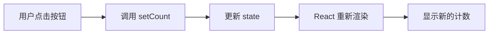

# React 快速开始

> [!TIP]
> 本章节将帮助您创建第一个 React 应用，理解 React 的基本概念。

## 🚀 创建第一个 React 应用

### 使用 Vite（推荐）

Vite 是现代化的前端构建工具，启动速度快，开发体验好。

```bash
# 创建项目
npm create vite@latest my-react-app -- --template react
cd my-react-app

# 安装依赖
npm install

# 启动开发服务器
npm run dev
```

访问 `http://localhost:5173` 查看应用！

### 项目结构

```
my-react-app/
├── node_modules/
├── public/
│   └── vite.svg
├── src/
│   ├── App.css
│   ├── App.jsx          # 主组件
│   ├── index.css
│   └── main.jsx         # 入口文件
├── index.html
├── package.json
└── vite.config.js
```

## 📝 第一个组件

让我们创建一个简单的 Hello World 组件：

```jsx
// src/App.jsx
function App() {
  return (
    <div className="App">
      <h1>Hello, React 19!</h1>
      <p>欢迎来到 React 的世界</p>
    </div>
  );
}

export default App;
```

### 代码解析

1. **函数组件**: `App` 是一个返回 JSX 的函数
2. **JSX**: 看起来像 HTML，实际是 JavaScript
3. **export default**: 导出组件供其他文件使用

## 🎨 添加样式

### 方式一：CSS 文件

```css
/* src/App.css */
.App {
  text-align: center;
  padding: 2rem;
}

h1 {
  color: #61dafb;
  font-size: 2.5rem;
}
```

```jsx
import "./App.css";

function App() {
  return <div className="App">...</div>;
}
```

### 方式二：内联样式

```jsx
function App() {
  const styles = {
    container: {
      textAlign: "center",
      padding: "2rem",
    },
    title: {
      color: "#61dafb",
      fontSize: "2.5rem",
    },
  };

  return (
    <div style={styles.container}>
      <h1 style={styles.title}>Hello, React!</h1>
    </div>
  );
}
```

## 🧩 创建第一个交互

### 计数器示例

```jsx
import { useState } from "react";

function Counter() {
  // 使用 useState Hook 管理状态
  const [count, setCount] = useState(0);

  return (
    <div>
      <h2>计数器: {count}</h2>
      <button onClick={() => setCount(count + 1)}>点击 +1</button>
      <button onClick={() => setCount(count - 1)}>点击 -1</button>
      <button onClick={() => setCount(0)}>重置</button>
    </div>
  );
}

export default Counter;
```

**工作原理：**



### 使用组件

```jsx
// src/App.jsx
import Counter from "./Counter";

function App() {
  return (
    <div className="App">
      <h1>我的第一个 React 应用</h1>
      <Counter />
    </div>
  );
}
```

## 📦 实用示例：待办事项

```jsx
import { useState } from "react";

function TodoApp() {
  const [todos, setTodos] = useState([]);
  const [input, setInput] = useState("");

  const addTodo = () => {
    if (input.trim()) {
      setTodos([...todos, { id: Date.now(), text: input, done: false }]);
      setInput("");
    }
  };

  const toggleTodo = (id) => {
    setTodos(
      todos.map((todo) =>
        todo.id === id ? { ...todo, done: !todo.done } : todo
      )
    );
  };

  const deleteTodo = (id) => {
    setTodos(todos.filter((todo) => todo.id !== id));
  };

  return (
    <div>
      <h2>📝 待办事项</h2>

      {/* 输入框 */}
      <div>
        <input
          value={input}
          onChange={(e) => setInput(e.target.value)}
          onKeyPress={(e) => e.key === "Enter" && addTodo()}
          placeholder="输入待办事项..."
        />
        <button onClick={addTodo}>添加</button>
      </div>

      {/* 待办列表 */}
      <ul>
        {todos.map((todo) => (
          <li key={todo.id}>
            <input
              type="checkbox"
              checked={todo.done}
              onChange={() => toggleTodo(todo.id)}
            />
            <span
              style={{
                textDecoration: todo.done ? "line-through" : "none",
              }}
            >
              {todo.text}
            </span>
            <button onClick={() => deleteTodo(todo.id)}>删除</button>
          </li>
        ))}
      </ul>

      {/* 统计 */}
      <p>
        总计: {todos.length} | 已完成: {todos.filter((t) => t.done).length}
      </p>
    </div>
  );
}

export default TodoApp;
```

## 🔧 开发工具

### React Developer Tools

安装浏览器扩展：

- [Chrome](https://chrome.google.com/webstore/detail/react-developer-tools/fmkadmapgofadopljbjfkapdkoienihi)
- [Firefox](https://addons.mozilla.org/en-US/firefox/addon/react-devtools/)

功能：

- 检查组件树
- 查看 Props 和 State
- 性能分析

### VS Code 插件推荐

- **ES7+ React/Redux/React-Native snippets** - 代码片段
- **Simple React Snippets** - 简单的 React 片段
- **Prettier** - 代码格式化
- **ESLint** - 代码检查

## 📚 常用代码片段

### 快速创建组件

```jsx
// 函数组件（推荐）
const MyComponent = () => {
  return <div>My Component</div>;
};

// 带 Props 的组件
const Greeting = ({ name }) => {
  return <h1>Hello, {name}!</h1>;
};

// 使用
<Greeting name="张三" />;
```

### 处理事件

```jsx
function EventExample() {
  const handleClick = () => {
    alert("按钮被点击了！");
  };

  const handleSubmit = (e) => {
    e.preventDefault(); // 阻止默认行为
    console.log("表单提交");
  };

  return (
    <div>
      <button onClick={handleClick}>点击我</button>
      <form onSubmit={handleSubmit}>
        <button type="submit">提交</button>
      </form>
    </div>
  );
}
```

### 条件渲染

```jsx
function ConditionalRender({ isLoggedIn }) {
  return <div>{isLoggedIn ? <h1>欢迎回来！</h1> : <h1>请先登录</h1>}</div>;
}
```

### 列表渲染

```jsx
function UserList() {
  const users = [
    { id: 1, name: "张三" },
    { id: 2, name: "李四" },
    { id: 3, name: "王五" },
  ];

  return (
    <ul>
      {users.map((user) => (
        <li key={user.id}>{user.name}</li>
      ))}
    </ul>
  );
}
```

## ⚡ 快捷键和技巧

### Vite 开发服务器命令

- `npm run dev` - 启动开发服务器
- `npm run build` - 构建生产版本
- `npm run preview` - 预览生产构建

### 快速重载

保存文件后，Vite 会自动热重载（HMR），无需刷新浏览器！

## 🎯 下一步

学习完快速开始后，建议按以下顺序继续学习：

1. [Hooks 详解](/docs/react/hooks) - 深入理解 React Hooks
2. [React 19 新特性](/docs/react/react19-features) - 探索最新特性
3. [面试题精选](/docs/interview/react-interview-questions) - React 面试准备

## 🆘 常见问题

### npm start 失败

```bash
# 清除node_modules重新安装
rm -rf node_modules package-lock.json
npm install
```

### 端口被占用

```bash
# macOS/Linux
lsof -ti:3000 | xargs kill -9

# Windows
netstat -ano | findstr :3000
taskkill /PID [PID号] /F
```

---

**恭喜！** 您已经创建了第一个 React 应用！继续学习 [Hooks 详解](/docs/react/hooks) 或探索 [React 19 新特性](/docs/react/react19-features)。
