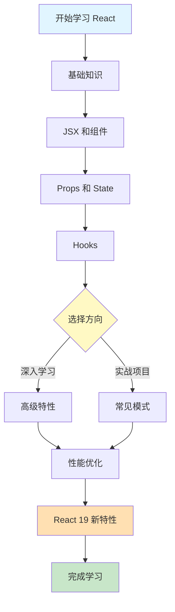

# React 19 开发指南

> [!TIP] > **React 19 最新版本**: React 19 是 React 的最新主要版本，引入了许多强大的新特性，如 Server Components、Actions、新的 Hooks 等。本指南将帮助您全面掌握 React 19 开发。

欢迎来到 React 19 完整学习指南！本指南涵盖从基础到高级的所有 React 开发知识。

## 📚 学习路径



## 🚀 快速开始

### React 是什么？

React 是一个用于构建用户界面的 JavaScript 库：

- **声明式**: 以声明式编写 UI，React 自动更新 DOM
- **组件化**: 构建封装、可复用的组件
- **一次学习，随处编写**: 可用于 Web、移动端、桌面应用

### React 19 核心特性

1. **Server Components** - 在服务器端渲染组件
2. **Actions** - 简化表单和数据变更
3. **useOptimistic** - 乐观更新 UI
4. **useFormStatus** - 表单状态管理
5. **use() Hook** - 读取 Promise 和 Context 的新方式

## 📖 文档结构

### 🔰 基础部分

- **[快速开始](/docs/react/getting-started)** - 创建第一个 React 应用
- **Hooks 详解** - useState、useEffect、自定义 Hooks（参见下方）

### 🎓 核心特性

- **[Hooks 详解](/docs/react/hooks)** - useState、useEffect、自定义 Hooks、React 19 新 Hooks

### 🚀 React 19 新特性

- **[React 19 新特性](/docs/react/react19-features)** - Server Components、Actions、新 Hooks 详解

### 💡 实战部分

- **[面试题精选](/docs/react/interview-questions)** - React 面试题库

## 🎯 学习建议

### 初学者路径（1-2 周）

1. ✅ 理解组件和 JSX
2. ✅ 掌握 Props 和 State
3. ✅ 学习常用 Hooks（useState、useEffect）
4. ✅ 完成简单项目（Todo List、计数器）

### 进阶开发者路径（2-4 周）

1. ✅ 深入 Hooks 机制
2. ✅ 掌握 Context API
3. ✅ 学习 React Router
4. ✅ 理解性能优化
5. ✅ 完成中型项目（博客、电商）

### 高级开发者路径（1-2 个月）

1. ✅ Server Components
2. ✅ 并发渲染
3. ✅ SSR/SSG
4. ✅ 架构设计
5. ✅ 完成大型项目

## 💻 环境准备

### 系统要求

- Node.js 18+
- npm 或 pnpm
- 现代浏览器

### 创建 React 项目

**使用 Vite（推荐）：**

```bash
npm create vite@latest my-react-app -- --template react
cd my-react-app
npm install
npm run dev
```

**使用 Create React App：**

```bash
npx create-react-app my-app
cd my-app
npm start
```

**使用 Next.js（推荐用于生产）：**

```bash
npx create-next-app@latest my-next-app
cd my-next-app
npm run dev
```

## 📊 React 生态系统

### 核心库

| 库                  | 用途     | 推荐度     |
| ------------------- | -------- | ---------- |
| **React Router**    | 路由管理 | ⭐⭐⭐⭐⭐ |
| **React Query**     | 数据获取 | ⭐⭐⭐⭐⭐ |
| **Zustand/Redux**   | 状态管理 | ⭐⭐⭐⭐   |
| **React Hook Form** | 表单处理 | ⭐⭐⭐⭐⭐ |
| **Framer Motion**   | 动画     | ⭐⭐⭐⭐   |

### 框架选择

- **Next.js** - 全栈 React 框架（SSR、SSG、API Routes）
- **Remix** - 以 Web 标准为中心的全栈框架
- **Gatsby** - 静态站点生成器
- **Expo** - React Native 开发框架

## 🔗 相关资源

### 官方资源

- [React 官方文档](https://react.dev/)
- [React GitHub](https://github.com/facebook/react)
- [React Blog](https://react.dev/blog)

### 学习资源

- [React 设计模式](/docs/java-design-patterns) - 可借鉴的设计思想
- [TypeScript](/docs/docs) - React + TypeScript 最佳组合

## 🎓 学习目标

完成本指南后，您将能够：

- ✅ 使用 React 构建现代化 Web 应用
- ✅ 理解并运用 React 核心概念
- ✅ 掌握 Hooks 和组件设计模式
- ✅ 优化应用性能
- ✅ 使用 React 19 最新特性
- ✅ 遵循 React 最佳实践

---

**准备好了吗？** 让我们从 [快速开始](/docs/react/getting-started) 开始您的 React 学习之旅！

## 📝 更新日志

- **2025-12**: 创建 React 19 完整学习指南
- **React 19 特性**: Server Components, Actions, 新 Hooks
