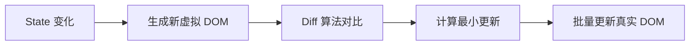

# React 面试题精选

> [!TIP]
> 本文精选了 40+ 道 React 常见面试题，涵盖基础、Hooks、性能优化、React 19 等核心知识点。

## 🎯 基础知识

### 1. 什么是 React？有什么优势？

**答案要点：**

**React 定义：**

- 用于构建用户界面的 JavaScript 库
- 由 Facebook 开发和维护
- 专注于视图层（MVC 中的 V）

**核心优势：**

1. **声明式** - 描述 UI 应该是什么样，React 自动更新
2. **组件化** - 构建可复用的 UI 组件
3. **虚拟 DOM** - 提高性能
4. **单向数据流** - 数据流向清晰
5. **丰富生态** - 大量第三方库和工具

**示例对比：**

```jsx
// 命令式（原生 DOM）
const div = document.createElement("div");
div.innerHTML = "Hello";
document.body.appendChild(div);

// 声明式（React）
function App() {
  return <div>Hello</div>;
}
```

---

### 2. JSX 是什么？为什么使用 JSX？

**答案要点：**

**JSX 定义：**

- JavaScript XML，JavaScript 的语法扩展
- 可以在 JavaScript 中写类似 HTML 的代码
- 会被编译成 `React.createElement()` 调用

**为什么使用：**

- 更直观地描述 UI 结构
- 可以在模板中使用 JavaScript 表达式
- 更好的开发体验和错误提示

**编译过程：**

```jsx
// JSX
const element = <h1 className="greeting">Hello, world!</h1>;

// 编译后
const element = React.createElement(
  "h1",
  { className: "greeting" },
  "Hello, world!"
);
```

---

### 3. 虚拟 DOM 是什么？有什么优势？

**答案要点：**

**虚拟 DOM：**

- JavaScript 对象表示的 DOM 树
- React 在内存中维护虚拟 DOM
- 通过 Diff 算法找出变化，最小化真实 DOM 操作

**工作流程：**



**优势：**

1. **性能优化** - 减少 DOM 操作
2. **跨平台** - 可以渲染到非浏览器环境
3. **更好的开发体验** - 声明式编程

---

### 4. 组件和元素的区别？

**答案要点：**

| 特性   | 元素                | 组件               |
| ------ | ------------------- | ------------------ |
| 定义   | 描述 DOM 节点的对象 | 返回元素的函数或类 |
| 可复用 | ❌                  | ✅                 |
| 有状态 | ❌                  | ✅ (可以有)        |
| 示例   | `<div>Hello</div>`  | `<Welcome />`      |

**示例：**

```jsx
// 元素 - 不可复用
const element = <h1>Hello</h1>;

// 组件 - 可复用
function Welcome(props) {
  return <h1>Hello, {props.name}</h1>;
}

// 使用
<Welcome name="Alice" />
<Welcome name="Bob" />
```

---

## 🎯 组件和 Props

### 5. 函数组件和类组件的区别？

**答案要点：**

**函数组件（推荐）：**

```jsx
function Welcome(props) {
  return <h1>Hello, {props.name}</h1>;
}
```

**类组件：**

```jsx
class Welcome extends React.Component {
  render() {
    return <h1>Hello, {this.props.name}</h1>;
  }
}
```

**对比：**
| 特性 | 函数组件 | 类组件 |
|-----|---------|--------|
| 语法 | 简洁 | 复杂 |
| this | 无需关心 | 需要绑定 |
| 性能 | 略好 | 稍差 |
| Hooks | ✅ 支持 | ❌ 不支持 |
| 推荐度 | ⭐⭐⭐⭐⭐ | ⭐⭐ |

---

### 6. Props 和 State 的区别？

**答案要点：**

| 特性     | Props      | State        |
| -------- | ---------- | ------------ |
| 数据来源 | 父组件传入 | 组件内部管理 |
| 可修改   | ❌ 只读    | ✅ 可修改    |
| 触发渲染 | ✅         | ✅           |
| 使用场景 | 组件通信   | 组件内部状态 |

**示例：**

```jsx
// Props - 父传子
function Parent() {
  return <Child name="Alice" />; // Props
}

function Child({ name }) {
  return <p>Hello, {name}</p>;
}

// State - 组件内部状态
function Counter() {
  const [count, setCount] = useState(0); // State
  return <button onClick={() => setCount(count + 1)}>{count}</button>;
}
```

---

### 7. 如何实现组件通信？

**答案要点：**

**1. 父 → 子：Props**

```jsx
function Parent() {
  return <Child message="Hello" />;
}

function Child({ message }) {
  return <div>{message}</div>;
}
```

**2. 子 → 父：回调函数**

```jsx
function Parent() {
  const handleData = (data) => console.log(data);
  return <Child onData={handleData} />;
}

function Child({ onData }) {
  return <button onClick={() => onData("Hello")}>Send</button>;
}
```

**3. 跨层级：Context**

```jsx
const ThemeContext = React.createContext();

function App() {
  return (
    <ThemeContext.Provider value="dark">
      <Toolbar />
    </ThemeContext.Provider>
  );
}

function Toolbar() {
  const theme = useContext(ThemeContext);
  return <div>Theme: {theme}</div>;
}
```

**4. 全局状态：Redux/Zustand**

---

## 🎯 Hooks

### 8. 为什么引入 Hooks？解决了什么问题？

**答案要点：**

**Hooks 之前的问题：**

1. **逻辑复用困难** - HOC 和 Render Props 复杂
2. **this 绑定混乱** - 类组件需要绑定 this
3. **生命周期复杂** - 逻辑分散在不同生命周期

**Hooks 的优势：**

```jsx
// ✗ 类组件 - 逻辑分散
class Example extends React.Component {
  componentDidMount() {
    document.title = this.state.count;
  }
  componentDidUpdate() {
    document.title = this.state.count;
  }
}

// ✓ Hooks - 逻辑集中
function Example() {
  const [count, setCount] = useState(0);

  useEffect(() => {
    document.title = count;
  }, [count]);
}
```

---

### 9. useState 和 useReducer 的区别？何时使用？

**答案要点：**

**useState：** 简单状态

```jsx
const [count, setCount] = useState(0);
```

**useReducer：** 复杂状态逻辑

```jsx
const [state, dispatch] = useReducer(reducer, initialState);
```

**使用场景：**

- **useState**: 独立的简单状态（计数器、开关）
- **useReducer**: 复杂状态逻辑、多个子值、状态间有关联

**示例：**

```jsx
// 适合 useReducer - 状态复杂
const initialState = {
  items: [],
  filter: "all",
  sortBy: "date",
};

function reducer(state, action) {
  switch (action.type) {
    case "ADD_ITEM":
      return { ...state, items: [...state.items, action.payload] };
    case "SET_FILTER":
      return { ...state, filter: action.payload };
    default:
      return state;
  }
}
```

---

### 10. useEffect 的执行时机？如何模拟生命周期？

**答案要点：**

**执行时机：**

- 默认在每次渲染后执行
- 可通过依赖数组控制

**模拟生命周期：**

```jsx
function Component() {
  // componentDidMount
  useEffect(() => {
    console.log("mounted");
  }, []);

  // componentDidUpdate
  useEffect(() => {
    console.log("updated");
  }); // 无依赖数组

  // componentWillUnmount
  useEffect(() => {
    return () => console.log("unmounted");
  }, []);

  // 监听特定 prop/state
  useEffect(() => {
    console.log("prop changed");
  }, [prop]);
}
```

---

### 11. useMemo 和 useCallback 的区别？

**答案要点：**

| Hook        | 缓存内容 | 返回值 |
| ----------- | -------- | ------ |
| useMemo     | 计算结果 | 值     |
| useCallback | 函数     | 函数   |

**useMemo：**缓存计算结果

```jsx
const expensiveValue = useMemo(() => {
  return computeExpensiveValue(a, b);
}, [a, b]);
```

**useCallback：** 缓存函数

```jsx
const memoizedCallback = useCallback(() => {
  doSomething(a, b);
}, [a, b]);

// useCallback(fn, deps) 等价于：
useMemo(() => fn, deps);
```

**使用场景：**

- `useMemo`: 缓存计算结果，避免重复计算
- `useCallback`: 缓存函数，传给子组件避免重新渲染

---

## 🎯 性能优化

### 12. React 如何优化性能？

**答案要点：**

**1. 使用 React.memo**

```jsx
const MemoChild = React.memo(function Child({ count }) {
  console.log("Child rendered");
  return <div>{count}</div>;
});
```

**2. 使用 useMemo/useCallback**

```jsx
const memoizedValue = useMemo(() => heavyComputation(a), [a]);
const memoizedFunc = useCallback(() => handleClick, []);
```

**3. 代码分割**

```jsx
const LazyComponent = React.lazy(() => import("./LazyComponent"));

function App() {
  return (
    <Suspense fallback={<div>Loading...</div>}>
      <LazyComponent />
    </Suspense>
  );
}
```

**4. 虚拟列表**

```jsx
import { FixedSizeList } from "react-window";

<FixedSizeList height={600} itemCount={1000} itemSize={35}>
  {Row}
</FixedSizeList>;
```

**5. 避免内联对象/函数**

```jsx
// ✗ 每次渲染创建新对象
<Child style={{ color: "red" }} />;

// ✓ 提取到外部
const style = { color: "red" };
<Child style={style} />;
```

---

### 13. key 的作用是什么？为什么不能用 index？

**答案要点：**

**key 的作用：**

- 帮助 React 识别列表元素的变化
- 提高 Diff 算法效率
- 避免不必要的重新渲染

**为什么不用 index：**

```jsx
// ✗ 使用 index - 列表顺序变化时会出问题
{
  items.map((item, index) => <li key={index}>{item}</li>);
}

// ✓ 使用唯一ID
{
  items.map((item) => <li key={item.id}>{item.name}</li>);
}
```

**问题示例：**

```jsx
// 初始列表
[
  { id: 1, name: "A" },
  { id: 2, name: "B" },
][
  // 删除第一项后
  { id: 2, name: "B" }
];

// 用 index 作 key：React 认为第一项变了，第二项消失
// 用 id 作 key：React 知道第一项被删除
```

---

## 🎯 React 19 新特性

### 14. React 19 有哪些重要新特性？

**答案要点：**

**核心新特性：**

**1. Server Components**

```jsx
// 服务器端渲染
async function UserList() {
  const users = await db.users.findMany();
  return (
    <ul>
      {users.map((u) => (
        <li>{u.name}</li>
      ))}
    </ul>
  );
}
```

**2. Actions**

```jsx
function Form() {
  async function createTodo(formData) {
    "use server";
    await db.todos.create({ title: formData.get("title") });
  }

  return (
    <form action={createTodo}>
      <input name="title" />
      <button>Add</button>
    </form>
  );
}
```

**3. use() Hook**

```jsx
function Profile({ userPromise }) {
  const user = use(userPromise); // 直接读取 Promise
  return <div>{user.name}</div>;
}
```

**4. useOptimistic**

```jsx
const [optimisticState, addOptimistic] = useOptimistic(state);
```

**5. Ref 作为 prop（不再需要 forwardRef）**

---

## 📌 总结与建议

### 高频考点

1. **基础概念** - 虚拟 DOM、JSX、组件
2. **Hooks** - useState、useEffect、useMemo/useCallback
3. **性能优化** - memo、key、代码分割
4. **组件通信** - Props、Context、状态管理
5. **React 19** - Server Components、Actions

### 学习建议

- 理解原理 > 记忆 API
- 动手实践 > 纸上谈兵
- 阅读源码 > 文档浏览
- 项目应用 > 孤立学习

### 相关资源

- [React 开发指南](./index.md)
- [Hooks 详解](./hooks)
- [React 19 新特性](./react19-features)
- [性能优化](./performance)
- [最佳实践](./best-practices)

---

**持续更新中...** 欢迎反馈和补充！
