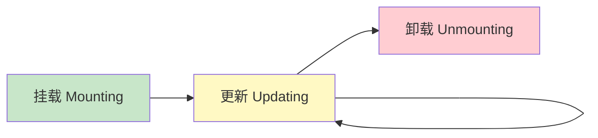
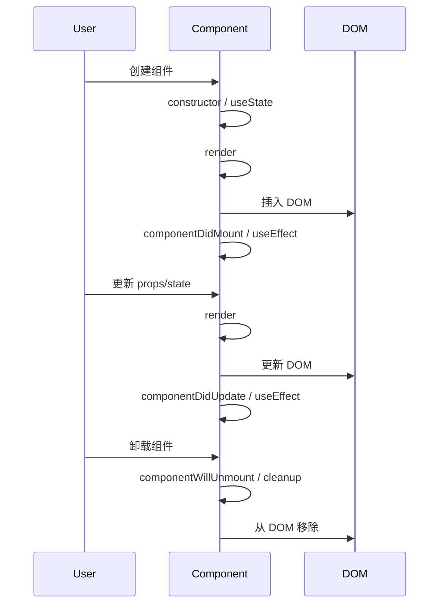

# React 组件生命周期

> [!TIP]
> 理解组件生命周期对于掌握 React 的运行机制至关重要。本文涵盖类组件生命周期和函数组件中的等效实现。

## 📚 生命周期概述

React 组件的生命周期可以分为三个主要阶段：



## 🔄 类组件生命周期

### 挂载阶段（Mounting）

组件被创建并插入到 DOM 中时调用：

```jsx
class MyComponent extends React.Component {
  // 1. 构造函数
  constructor(props) {
    super(props);
    this.state = { count: 0 };
    console.log("1. constructor");
  }

  // 2. 渲染前的静态方法（少用）
  static getDerivedStateFromProps(props, state) {
    console.log("2. getDerivedStateFromProps");
    return null; // 返回对象更新 state，返回 null 不更新
  }

  // 3. 渲染
  render() {
    console.log("3. render");
    return <div>Count: {this.state.count}</div>;
  }

  // 4. 挂载完成
  componentDidMount() {
    console.log("4. componentDidMount");
    // 适合：API 调用、订阅、DOM 操作
    fetch("/api/data")
      .then((res) => res.json())
      .then((data) => this.setState({ data }));
  }
}
```

**执行顺序**：

1. `constructor()`
2. `static getDerivedStateFromProps()`
3. `render()`
4. `componentDidMount()`

### 更新阶段（Updating）

当组件的 props 或 state 发生变化时：

```jsx
class MyComponent extends React.Component {
  // 1. props 变化触发
  static getDerivedStateFromProps(props, state) {
    console.log("1. getDerivedStateFromProps");
    return null;
  }

  // 2. 是否需要更新（性能优化）
  shouldComponentUpdate(nextProps, nextState) {
    console.log("2. shouldComponentUpdate");
    // 返回 false 可阻止更新
    return nextState.count !== this.state.count;
  }

  // 3. 渲染
  render() {
    console.log("3. render");
    return <div>Count: {this.state.count}</div>;
  }

  // 4. 更新前快照（少用）
  getSnapshotBeforeUpdate(prevProps, prevState) {
    console.log("4. getSnapshotBeforeUpdate");
    // 返回值传给 componentDidUpdate
    return null;
  }

  // 5. 更新完成
  componentDidUpdate(prevProps, prevState, snapshot) {
    console.log("5. componentDidUpdate");
    // 适合：响应 props 变化、DOM 操作
    if (prevProps.userId !== this.props.userId) {
      this.fetchUserData(this.props.userId);
    }
  }
}
```

**执行顺序**：

1. `static getDerivedStateFromProps()`
2. `shouldComponentUpdate()`
3. `render()`
4. `getSnapshotBeforeUpdate()`
5. `componentDidUpdate()`

### 卸载阶段（Unmounting）

组件从 DOM 中移除时：

```jsx
class MyComponent extends React.Component {
  componentWillUnmount() {
    console.log("componentWillUnmount");
    // 清理工作：取消订阅、清除定时器、取消网络请求
    clearInterval(this.timer);
    this.subscription.unsubscribe();
  }

  render() {
    return <div>Component</div>;
  }
}
```

### 完整示例

```jsx
class LifecycleDemo extends React.Component {
  constructor(props) {
    super(props);
    this.state = { count: 0, data: null };
    this.timer = null;
  }

  componentDidMount() {
    // 挂载后：获取数据、启动定时器
    this.fetchData();
    this.timer = setInterval(() => {
      this.setState((prev) => ({ count: prev.count + 1 }));
    }, 1000);
  }

  shouldComponentUpdate(nextProps, nextState) {
    // 性能优化：count 变化才更新
    return nextState.count !== this.state.count;
  }

  componentDidUpdate(prevProps, prevState) {
    // 响应变化
    if (prevState.count !== this.state.count) {
      console.log("Count changed:", this.state.count);
    }
  }

  componentWillUnmount() {
    // 清理定时器
    clearInterval(this.timer);
  }

  fetchData() {
    fetch("/api/data")
      .then((res) => res.json())
      .then((data) => this.setState({ data }));
  }

  render() {
    return (
      <div>
        <h2>Count: {this.state.count}</h2>
        {this.state.data && <p>Data: {this.state.data}</p>}
      </div>
    );
  }
}
```

## ⚛️ 函数组件生命周期（Hooks）

### useEffect 对应关系

```jsx
import { useState, useEffect } from "react";

function MyComponent() {
  const [count, setCount] = useState(0);
  const [data, setData] = useState(null);

  // ✅ componentDidMount + componentDidUpdate
  useEffect(() => {
    console.log("每次渲染后执行");
  });

  // ✅ componentDidMount（挂载时执行一次）
  useEffect(() => {
    console.log("组件挂载");
    fetchData();
  }, []); // 空依赖数组

  // ✅ componentDidUpdate（count 变化时执行）
  useEffect(() => {
    console.log("Count changed:", count);
  }, [count]); // 依赖 count

  // ✅ componentWillUnmount（卸载时清理）
  useEffect(() => {
    const timer = setInterval(() => {
      setCount((c) => c + 1);
    }, 1000);

    return () => {
      console.log("组件卸载，清理定时器");
      clearInterval(timer);
    };
  }, []);

  function fetchData() {
    fetch("/api/data")
      .then((res) => res.json())
      .then((data) => setData(data));
  }

  return (
    <div>
      <h2>Count: {count}</h2>
      {data && <p>Data: {data}</p>}
    </div>
  );
}
```

### 生命周期对照表

| 类组件                       | 函数组件（Hooks）                          |
| ---------------------------- | ------------------------------------------ |
| `constructor()`              | `useState()` 初始化                        |
| `componentDidMount()`        | `useEffect(() => {}, [])`                  |
| `componentDidUpdate()`       | `useEffect(() => {}, [deps])`              |
| `componentWillUnmount()`     | `useEffect(() => { return () => {} }, [])` |
| `shouldComponentUpdate()`    | `React.memo()`                             |
| `getDerivedStateFromProps()` | 直接在渲染时计算                           |
| `getSnapshotBeforeUpdate()`  | 无对应（少用）                             |
| `componentDidCatch()`        | 无对应（需要类组件）                       |

## 🎯 常见使用场景

### 1. 数据获取

```jsx
function UserProfile({ userId }) {
  const [user, setUser] = useState(null);
  const [loading, setLoading] = useState(true);

  useEffect(() => {
    let cancelled = false;

    async function fetchUser() {
      setLoading(true);
      try {
        const res = await fetch(`/api/users/${userId}`);
        const data = await res.json();

        // 避免组件卸载后设置状态
        if (!cancelled) {
          setUser(data);
        }
      } catch (error) {
        console.error(error);
      } finally {
        if (!cancelled) {
          setLoading(false);
        }
      }
    }

    fetchUser();

    // 清理函数：组件卸载或 userId 变化时取消请求
    return () => {
      cancelled = true;
    };
  }, [userId]);

  if (loading) return <div>Loading...</div>;
  if (!user) return <div>User not found</div>;

  return <div>{user.name}</div>;
}
```

### 2. 订阅和事件监听

```jsx
function WindowSize() {
  const [size, setSize] = useState({
    width: window.innerWidth,
    height: window.innerHeight,
  });

  useEffect(() => {
    function handleResize() {
      setSize({
        width: window.innerWidth,
        height: window.innerHeight,
      });
    }

    // 订阅事件
    window.addEventListener("resize", handleResize);

    // 清理：移除事件监听
    return () => {
      window.removeEventListener("resize", handleResize);
    };
  }, []); // 空依赖：只在挂载和卸载时执行

  return (
    <div>
      Window size: {size.width} x {size.height}
    </div>
  );
}
```

### 3. 定时器

```jsx
function Timer() {
  const [seconds, setSeconds] = useState(0);
  const [isRunning, setIsRunning] = useState(false);

  useEffect(() => {
    if (!isRunning) return;

    const interval = setInterval(() => {
      setSeconds((s) => s + 1);
    }, 1000);

    // 清理：组件卸载或 isRunning 变化时清除定时器
    return () => clearInterval(interval);
  }, [isRunning]);

  return (
    <div>
      <p>Seconds: {seconds}</p>
      <button onClick={() => setIsRunning(!isRunning)}>
        {isRunning ? "Pause" : "Start"}
      </button>
      <button onClick={() => setSeconds(0)}>Reset</button>
    </div>
  );
}
```

### 4. WebSocket 连接

```jsx
function ChatRoom({ roomId }) {
  const [messages, setMessages] = useState([]);

  useEffect(() => {
    const socket = new WebSocket(`ws://api.example.com/rooms/${roomId}`);

    socket.onopen = () => {
      console.log("WebSocket connected");
    };

    socket.onmessage = (event) => {
      const message = JSON.parse(event.data);
      setMessages((prev) => [...prev, message]);
    };

    socket.onerror = (error) => {
      console.error("WebSocket error:", error);
    };

    // 清理：关闭连接
    return () => {
      socket.close();
    };
  }, [roomId]);

  return (
    <div>
      {messages.map((msg) => (
        <div key={msg.id}>{msg.text}</div>
      ))}
    </div>
  );
}
```

## 💡 最佳实践

### 1. 避免在 useEffect 中使用过时的值

```jsx
// ✗ 错误：count 可能是旧值
function Counter() {
  const [count, setCount] = useState(0);

  useEffect(() => {
    const timer = setInterval(() => {
      setCount(count + 1); // count 始终是 0
    }, 1000);
    return () => clearInterval(timer);
  }, []); // 缺少依赖

  return <div>{count}</div>;
}

// ✓ 正确：使用函数式更新
function Counter() {
  const [count, setCount] = useState(0);

  useEffect(() => {
    const timer = setInterval(() => {
      setCount((c) => c + 1); // 使用最新值
    }, 1000);
    return () => clearInterval(timer);
  }, []);

  return <div>{count}</div>;
}
```

### 2. 正确设置依赖数组

```jsx
// ✗ 错误：缺少依赖
function UserData({ userId }) {
  const [user, setUser] = useState(null);

  useEffect(() => {
    fetchUser(userId);
  }, []); // 缺少 userId

  return <div>{user?.name}</div>;
}

// ✓ 正确：包含所有依赖
function UserData({ userId }) {
  const [user, setUser] = useState(null);

  useEffect(() => {
    fetchUser(userId);
  }, [userId]); // 包含 userId

  return <div>{user?.name}</div>;
}
```

### 3. 清理副作用

```jsx
// ✓ 总是清理副作用
function Component() {
  useEffect(() => {
    // 订阅
    const subscription = subscribe();

    // 清理
    return () => subscription.unsubscribe();
  }, []);

  useEffect(() => {
    // 定时器
    const timer = setTimeout(() => {}, 1000);

    // 清理
    return () => clearTimeout(timer);
  }, []);

  useEffect(() => {
    // 事件监听
    const handler = () => {};
    window.addEventListener("resize", handler);

    // 清理
    return () => window.removeEventListener("resize", handler);
  }, []);
}
```

### 4. 拆分多个 useEffect

```jsx
// ✗ 不好：所有副作用混在一起
useEffect(() => {
  fetchUserData();
  subscribeToUpdates();
  startTimer();

  return () => {
    unsubscribe();
    clearTimer();
  };
}, [userId, interval]);

// ✓ 好：按职责拆分
useEffect(() => {
  fetchUserData();
}, [userId]);

useEffect(() => {
  const sub = subscribeToUpdates();
  return () => sub.unsubscribe();
}, [userId]);

useEffect(() => {
  const timer = startTimer();
  return () => clearInterval(timer);
}, [interval]);
```

## 🚨 常见错误

### 1. 无限循环

```jsx
// ✗ 错误：导致无限循环
function Component() {
  const [count, setCount] = useState(0);

  useEffect(() => {
    setCount(count + 1); // 每次更新都触发 effect
  }); // 没有依赖数组

  return <div>{count}</div>;
}

// ✓ 正确：添加依赖数组
useEffect(() => {
  // 只在挂载时执行
}, []);
```

### 2. 忘记清理

```jsx
// ✗ 错误：内存泄漏
function Component() {
  useEffect(() => {
    const timer = setInterval(() => {
      console.log("tick");
    }, 1000);
    // 忘记清理
  }, []);
}

// ✓ 正确：清理定时器
function Component() {
  useEffect(() => {
    const timer = setInterval(() => {
      console.log("tick");
    }, 1000);

    return () => clearInterval(timer);
  }, []);
}
```

### 3. 组件卸载后更新状态

```jsx
// ✗ 错误：可能在卸载后设置状态
function Component({ id }) {
  const [data, setData] = useState(null);

  useEffect(() => {
    async function fetchData() {
      const res = await fetch(`/api/${id}`);
      const json = await res.json();
      setData(json); // 组件可能已卸载
    }
    fetchData();
  }, [id]);
}

// ✓ 正确：使用清理标志
function Component({ id }) {
  const [data, setData] = useState(null);

  useEffect(() => {
    let cancelled = false;

    async function fetchData() {
      const res = await fetch(`/api/${id}`);
      const json = await res.json();
      if (!cancelled) {
        setData(json);
      }
    }

    fetchData();

    return () => {
      cancelled = true;
    };
  }, [id]);
}
```

## 📊 生命周期可视化



---

**下一步**：查看 [Hooks 详解](./hooks) 深入学习函数组件，或学习 [错误边界](./error-boundaries) 处理组件错误。
