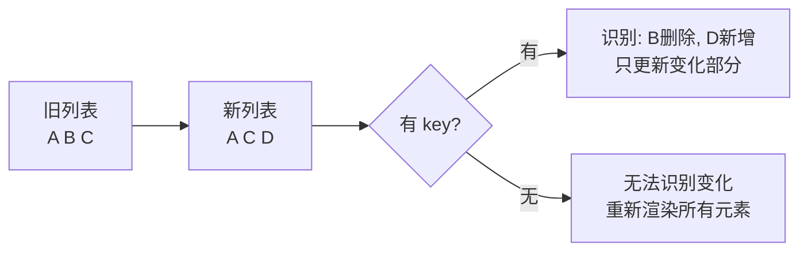

# 列表和 Keys

> [!TIP]
> 渲染列表是 React 中最常见的操作之一，正确使用 key 可以提高性能并避免 bug。

## 📚 基础列表渲染

### 使用 map()

```jsx
function NumberList() {
  const numbers = [1, 2, 3, 4, 5];

  return (
    <ul>
      {numbers.map((number) => (
        <li key={number}>{number}</li>
      ))}
    </ul>
  );
}
```

### 渲染组件列表

```jsx
function UserList({ users }) {
  return (
    <div>
      {users.map((user) => (
        <UserCard key={user.id} user={user} />
      ))}
    </div>
  );
}

function UserCard({ user }) {
  return (
    <div className="user-card">
      <h3>{user.name}</h3>
      <p>{user.email}</p>
    </div>
  );
}
```

## 🔑 Keys 的作用

### 为什么需要 key

Keys 帮助 React 识别哪些元素改变了（添加、删除、修改），从而提高渲染效率。



### Key 的规则

```jsx
// ✓ 正确 - 使用唯一 ID
{
  items.map((item) => <li key={item.id}>{item.name}</li>);
}

// ✗ 错误 - 使用 index（不稳定）
{
  items.map((item, index) => <li key={index}>{item.name}</li>);
}

// ✗ 错误 - 没有 key
{
  items.map((item) => (
    <li>{item.name}</li> // Warning!
  ));
}
```

## ⚠️ 为什么不用 index 作为 key

### 问题演示

```jsx
// ❌ 使用 index 的问题
function TodoList() {
  const [todos, setTodos] = useState([
    { id: 1, text: "Learn React" },
    { id: 2, text: "Build App" },
    { id: 3, text: "Deploy" },
  ]);

  // 删除第一项
  const deleteFirst = () => {
    setTodos(todos.slice(1));
  };

  return (
    <ul>
      {/* ✗ 使用 index - React 认为第一项内容变了 */}
      {todos.map((todo, index) => (
        <li key={index}>
          <input type="checkbox" />
          {todo.text}
        </li>
      ))}
    </ul>
  );
}
```

**问题说明：**

- 删除第一项后，原来的第二项变成第一项
- 但 key 仍然是 0，React 认为这是同一个元素，只是内容变了
- 导致 checkbox 的选中状态可能错位

### 正确做法

```jsx
// ✓ 使用唯一 ID
{
  todos.map((todo) => (
    <li key={todo.id}>
      <input type="checkbox" />
      {todo.text}
    </li>
  ));
}
```

### 何时可以使用 index

```jsx
// ✓ 可以使用 index 的场景：
// 1. 列表是静态的，不会改变
const languages = ["JavaScript", "Python", "Java"];
<ul>
  {languages.map((lang, index) => (
    <li key={index}>{lang}</li>
  ))}
</ul>;

// 2. 列表项没有 ID 且仅用于展示
const colors = ["red", "blue", "green"];
<div>
  {colors.map((color, index) => (
    <div key={index} style={{ background: color }} />
  ))}
</div>;
```

## 🎯 实用模式

### 带状态的列表项

```jsx
function TodoList() {
  const [todos, setTodos] = useState([
    { id: 1, text: "Learn React", done: false },
    { id: 2, text: "Build App", done: false },
  ]);

  const toggleTodo = (id) => {
    setTodos(
      todos.map((todo) =>
        todo.id === id ? { ...todo, done: !todo.done } : todo
      )
    );
  };

  return (
    <ul>
      {todos.map((todo) => (
        <li key={todo.id}>
          <input
            type="checkbox"
            checked={todo.done}
            onChange={() => toggleTodo(todo.id)}
          />
          <span
            style={{
              textDecoration: todo.done ? "line-through" : "none",
            }}
          >
            {todo.text}
          </span>
        </li>
      ))}
    </ul>
  );
}
```

### 嵌套列表

```jsx
function CategoryList({ categories }) {
  return (
    <div>
      {categories.map((category) => (
        <div key={category.id}>
          <h2>{category.name}</h2>
          <ul>
            {category.items.map((item) => (
              <li key={item.id}>{item.name}</li>
            ))}
          </ul>
        </div>
      ))}
    </div>
  );
}
```

### 条件列表项

```jsx
function ProductList({ products, showOutOfStock }) {
  return (
    <div>
      {products
        .filter((product) => showOutOfStock || product.inStock)
        .map((product) => (
          <ProductCard key={product.id} product={product} />
        ))}
    </div>
  );
}
```

## 🔧 生成唯一 Key

### 使用现有 ID

```jsx
// ✓ 最佳 - 使用数据库 ID
{
  users.map((user) => <UserCard key={user.id} user={user} />);
}
```

### 临时生成 ID

```jsx
import { nanoid } from "nanoid";

function TodoList() {
  const [todos, setTodos] = useState([]);

  const addTodo = (text) => {
    setTodos([
      ...todos,
      { id: nanoid(), text, done: false }, // 生成唯一 ID
    ]);
  };

  return (
    <ul>
      {todos.map((todo) => (
        <li key={todo.id}>{todo.text}</li>
      ))}
    </ul>
  );
}
```

### 组合 Key

```jsx
// 当单个字段不唯一时，组合多个字段
{
  items.map((item) => (
    <div key={`${item.category}-${item.id}`}>{item.name}</div>
  ));
}
```

## 📖 复杂示例

### 可排序列表

```jsx
function SortableList() {
  const [items, setItems] = useState([
    { id: 1, name: "Apple", price: 1.99 },
    { id: 2, name: "Banana", price: 0.99 },
    { id: 3, name: "Cherry", price: 2.99 },
  ]);
  const [sortBy, setSortBy] = useState("name");

  const sortedItems = [...items].sort((a, b) => {
    if (sortBy === "name") {
      return a.name.localeCompare(b.name);
    }
    return a.price - b.price;
  });

  return (
    <div>
      <select onChange={(e) => setSortBy(e.target.value)}>
        <option value="name">Sort by Name</option>
        <option value="price">Sort by Price</option>
      </select>

      <ul>
        {sortedItems.map((item) => (
          <li key={item.id}>
            {item.name} - ${item.price}
          </li>
        ))}
      </ul>
    </div>
  );
}
```

### 分页列表

```jsx
function PaginatedList({ items, itemsPerPage = 10 }) {
  const [currentPage, setCurrentPage] = useState(1);

  const totalPages = Math.ceil(items.length / itemsPerPage);
  const startIndex = (currentPage - 1) * itemsPerPage;
  const endIndex = startIndex + itemsPerPage;
  const currentItems = items.slice(startIndex, endIndex);

  return (
    <div>
      <ul>
        {currentItems.map((item) => (
          <li key={item.id}>{item.name}</li>
        ))}
      </ul>

      <div className="pagination">
        <button
          disabled={currentPage === 1}
          onClick={() => setCurrentPage(currentPage - 1)}
        >
          Previous
        </button>

        <span>
          Page {currentPage} of {totalPages}
        </span>

        <button
          disabled={currentPage === totalPages}
          onClick={() => setCurrentPage(currentPage + 1)}
        >
          Next
        </button>
      </div>
    </div>
  );
}
```

### 搜索过滤列表

```jsx
function SearchableList({ items }) {
  const [query, setQuery] = useState("");

  const filteredItems = items.filter((item) =>
    item.name.toLowerCase().includes(query.toLowerCase())
  );

  return (
    <div>
      <input
        type="search"
        value={query}
        onChange={(e) => setQuery(e.target.value)}
        placeholder="Search..."
      />

      {filteredItems.length === 0 ? (
        <p>No results found for "{query}"</p>
      ) : (
        <ul>
          {filteredItems.map((item) => (
            <li key={item.id}>{item.name}</li>
          ))}
        </ul>
      )}
    </div>
  );
}
```

### 分组列表

```jsx
function GroupedList({ items }) {
  // 按类别分组
  const grouped = items.reduce((acc, item) => {
    const category = item.category;
    if (!acc[category]) {
      acc[category] = [];
    }
    acc[category].push(item);
    return acc;
  }, {});

  return (
    <div>
      {Object.entries(grouped).map(([category, categoryItems]) => (
        <div key={category}>
          <h2>{category}</h2>
          <ul>
            {categoryItems.map((item) => (
              <li key={item.id}>{item.name}</li>
            ))}
          </ul>
        </div>
      ))}
    </div>
  );
}
```

## 💡 性能优化

### 使用 React.memo

```jsx
const TodoItem = React.memo(({ todo, onToggle, onDelete }) => {
  console.log("Rendering:", todo.id);

  return (
    <li>
      <input
        type="checkbox"
        checked={todo.done}
        onChange={() => onToggle(todo.id)}
      />
      {todo.text}
      <button onClick={() => onDelete(todo.id)}>Delete</button>
    </li>
  );
});

function TodoList({ todos }) {
  return (
    <ul>
      {todos.map((todo) => (
        <TodoItem
          key={todo.id}
          todo={todo}
          onToggle={handleToggle}
          onDelete={handleDelete}
        />
      ))}
    </ul>
  );
}
```

### 虚拟化长列表

```jsx
import { FixedSizeList } from "react-window";

function VirtualList({ items }) {
  const Row = ({ index, style }) => (
    <div style={style}>{items[index].name}</div>
  );

  return (
    <FixedSizeList
      height={400}
      itemCount={items.length}
      itemSize={35}
      width="100%"
    >
      {Row}
    </FixedSizeList>
  );
}
```

---

**下一步**: 学习 [Context API](/docs/react/context) 了解跨组件状态管理，或查看 [性能优化](/docs/react/performance-optimization) 提升应用性能。
