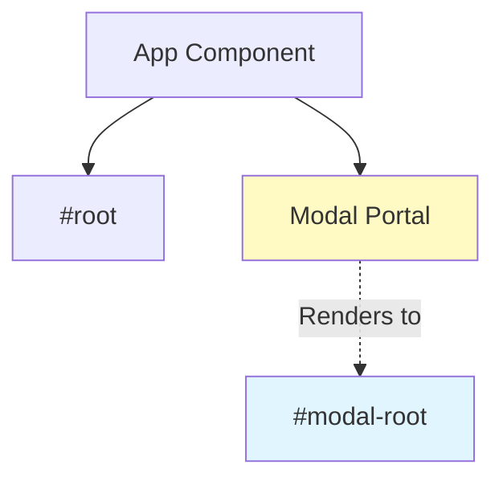

# React Portals

> [!TIP]
> Portals 允许你将子组件渲染到父组件 DOM 层次结构之外的 DOM 节点中，常用于模态框、弹出菜单、提示框等场景。

## 🎯 什么是 Portal？

Portal 提供了一种将子节点渲染到存在于父组件以外的 DOM 节点的方案。



## 📦 基础用法

```jsx
import { createPortal } from "react-dom";

function Modal({ children, isOpen }) {
  if (!isOpen) return null;

  return createPortal(
    <div className="modal-overlay">
      <div className="modal-content">{children}</div>
    </div>,
    document.getElementById("modal-root")
  );
}

// 使用
function App() {
  const [showModal, setShowModal] = useState(false);

  return (
    <div>
      <button onClick={() => setShowModal(true)}>打开模态框</button>
      <Modal isOpen={showModal}>
        <h2>模态框标题</h2>
        <p>模态框内容</p>
        <button onClick={() => setShowModal(false)}>关闭</button>
      </Modal>
    </div>
  );
}
```

### HTML 结构

```html
<body>
  <div id="root">
    <!-- React 应用 -->
  </div>
  <div id="modal-root">
    <!-- Portal 内容渲染到这里 -->
  </div>
</body>
```

## 🎨 完整模态框组件

```jsx
import { createPortal } from "react-dom";
import { useEffect, useRef } from "react";

function Modal({ isOpen, onClose, title, children }) {
  const overlayRef = useRef(null);

  // ESC 键关闭
  useEffect(() => {
    const handleEsc = (e) => {
      if (e.key === "Escape") onClose();
    };

    if (isOpen) {
      document.addEventListener("keydown", handleEsc);
      document.body.style.overflow = "hidden"; // 禁止背景滚动
    }

    return () => {
      document.removeEventListener("keydown", handleEsc);
      document.body.style.overflow = "";
    };
  }, [isOpen, onClose]);

  // 点击遮罩关闭
  const handleOverlayClick = (e) => {
    if (e.target === overlayRef.current) {
      onClose();
    }
  };

  if (!isOpen) return null;

  return createPortal(
    <div
      ref={overlayRef}
      onClick={handleOverlayClick}
      className="modal-overlay"
      style={{
        position: "fixed",
        inset: 0,
        backgroundColor: "rgba(0, 0, 0, 0.5)",
        display: "flex",
        alignItems: "center",
        justifyContent: "center",
        zIndex: 1000,
      }}
    >
      <div
        className="modal-content"
        role="dialog"
        aria-modal="true"
        aria-labelledby="modal-title"
        style={{
          background: "white",
          borderRadius: "8px",
          padding: "24px",
          maxWidth: "500px",
          width: "90%",
        }}
      >
        <header style={{ display: "flex", justifyContent: "space-between" }}>
          <h2 id="modal-title">{title}</h2>
          <button onClick={onClose} aria-label="关闭">
            ×
          </button>
        </header>
        <div>{children}</div>
      </div>
    </div>,
    document.getElementById("modal-root")
  );
}
```

## 📌 下拉菜单 / Tooltip

Portal 也适用于需要脱离父容器定位的元素：

```jsx
function Tooltip({ children, content, position = "top" }) {
  const [isVisible, setIsVisible] = useState(false);
  const [coords, setCoords] = useState({ top: 0, left: 0 });
  const triggerRef = useRef(null);

  const showTooltip = () => {
    const rect = triggerRef.current.getBoundingClientRect();
    setCoords({
      top: position === "top" ? rect.top - 8 : rect.bottom + 8,
      left: rect.left + rect.width / 2,
    });
    setIsVisible(true);
  };

  return (
    <>
      <span
        ref={triggerRef}
        onMouseEnter={showTooltip}
        onMouseLeave={() => setIsVisible(false)}
      >
        {children}
      </span>

      {isVisible &&
        createPortal(
          <div
            style={{
              position: "fixed",
              top: coords.top,
              left: coords.left,
              transform: "translateX(-50%)",
              background: "#333",
              color: "white",
              padding: "4px 8px",
              borderRadius: "4px",
              fontSize: "12px",
              zIndex: 9999,
            }}
          >
            {content}
          </div>,
          document.body
        )}
    </>
  );
}

// 使用
<Tooltip content="这是一个提示">
  <button>悬停查看</button>
</Tooltip>;
```

## 🔄 事件冒泡

> [!IMPORTANT]
> 即使 Portal 将 DOM 渲染到其他位置，**React 事件仍然按照组件树冒泡**，而非 DOM 树。

```jsx
function Parent() {
  const handleClick = () => {
    console.log("Parent clicked!"); // 会触发！
  };

  return (
    <div onClick={handleClick}>
      <Modal isOpen={true}>
        <button>点击我</button> {/* 点击会冒泡到 Parent */}
      </Modal>
    </div>
  );
}
```

### 阻止冒泡

```jsx
function Modal({ children }) {
  const handleClick = (e) => {
    e.stopPropagation(); // 阻止冒泡到父组件
  };

  return createPortal(
    <div onClick={handleClick}>{children}</div>,
    document.getElementById("modal-root")
  );
}
```

## 💡 最佳实践

### 1. 确保挂载点存在

```jsx
function Modal({ isOpen, children }) {
  const [mounted, setMounted] = useState(false);

  useEffect(() => {
    setMounted(true);
  }, []);

  if (!mounted || !isOpen) return null;

  const modalRoot = document.getElementById("modal-root");
  if (!modalRoot) return null;

  return createPortal(children, modalRoot);
}
```

### 2. 使用 Context 传递数据

```jsx
const ModalContext = createContext();

function ModalProvider({ children }) {
  const [modals, setModals] = useState([]);

  const openModal = (content) => {
    setModals((prev) => [...prev, { id: Date.now(), content }]);
  };

  const closeModal = (id) => {
    setModals((prev) => prev.filter((m) => m.id !== id));
  };

  return (
    <ModalContext.Provider value={{ openModal, closeModal }}>
      {children}
      {modals.map((modal) =>
        createPortal(
          <div key={modal.id}>{modal.content}</div>,
          document.getElementById("modal-root")
        )
      )}
    </ModalContext.Provider>
  );
}
```

### 3. 焦点管理

```jsx
function Modal({ isOpen, onClose, children }) {
  const firstFocusableRef = useRef(null);

  useEffect(() => {
    if (isOpen && firstFocusableRef.current) {
      firstFocusableRef.current.focus();
    }
  }, [isOpen]);

  // ... 其余实现
}
```

## 🔗 相关资源

- [Refs 和 DOM](/docs/react/refs-dom)
- [可访问性](/docs/react/accessibility)
- [组件组合模式](/docs/react/composition-patterns)

---

**下一步**：学习 [可访问性](/docs/react/accessibility) 确保 Portal 组件对所有用户友好。
