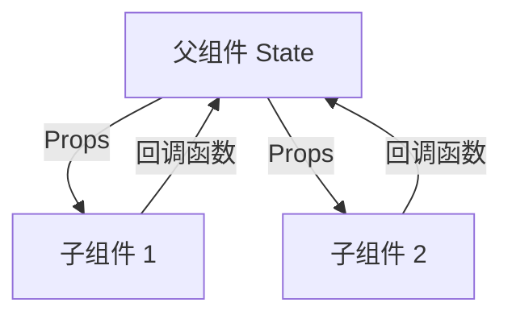

# Props 和 State

> [!TIP]
> Props 和 State 是 React 组件的两种数据来源，理解它们的区别是掌握 React 的关键。

## 📦 Props（属性）

Props 是从父组件传递给子组件的数据，类似于函数参数。

### Props 基础

```jsx
// 父组件传递 props
function App() {
  return <Welcome name="Alice" age={25} />;
}

// 子组件接收 props
function Welcome(props) {
  return (
    <div>
      <h1>Hello, {props.name}!</h1>
      <p>Age: {props.age}</p>
    </div>
  );
}

// 使用解构（推荐）
function Welcome({ name, age }) {
  return (
    <div>
      <h1>Hello, {name}!</h1>
      <p>Age: {age}</p>
    </div>
  );
}
```

### Props 类型

```jsx
function UserCard({ user, isActive, onEdit, children }) {
  return (
    <div className={isActive ? "active" : ""}>
      {/* 对象 */}
      <h2>{user.name}</h2>
      <p>{user.email}</p>

      {/* 布尔值 */}
      {isActive && <span>✓ Active</span>}

      {/* 函数 */}
      <button onClick={onEdit}>Edit</button>

      {/* children */}
      <div>{children}</div>
    </div>
  );
}

// 使用
<UserCard
  user={{ name: "Alice", email: "alice@example.com" }}
  isActive={true}
  onEdit={() => console.log("Edit")}
>
  <p>Additional content</p>
</UserCard>;
```

### 默认 Props

```jsx
function Button({ text = 'Click Me', variant = 'primary', onClick }) {
  return (
    <button className={`btn btn-${variant}`} onClick={onClick}>
      {text}
    </button>
  );
}

// 不传值时使用默认值
<Button />  // text="Click Me", variant="primary"
<Button text="Submit" variant="success" />
```

### Props 验证（TypeScript）

```tsx
interface UserProps {
  name: string;
  age: number;
  email?: string; // 可选
}

function User({ name, age, email }: UserProps) {
  return (
    <div>
      <h2>{name}</h2>
      <p>Age: {age}</p>
      {email && <p>Email: {email}</p>}
    </div>
  );
}
```

### Props 只读规则

```jsx
function Component({ count }) {
  // ✗ 错误 - 不能修改 props
  count = count + 1; // 报错！

  // ✗ 错误 - 不能修改对象 props 的属性
  props.user.name = "New Name"; // 不要这样做！

  // ✓ 正确 - 使用 state 管理需要变化的数据
  const [localCount, setLocalCount] = useState(count);
}
```

## 🔄 State（状态）

State 是组件内部管理的数据，可以变化并触发重新渲染。

### useState 基础

```jsx
import { useState } from "react";

function Counter() {
  // 声明 state
  const [count, setCount] = useState(0);

  return (
    <div>
      <p>Count: {count}</p>
      <button onClick={() => setCount(count + 1)}>+1</button>
      <button onClick={() => setCount(count - 1)}>-1</button>
      <button onClick={() => setCount(0)}>Reset</button>
    </div>
  );
}
```

### 多个 State

```jsx
function Form() {
  const [name, setName] = useState("");
  const [email, setEmail] = useState("");
  const [age, setAge] = useState(0);

  return (
    <form>
      <input
        value={name}
        onChange={(e) => setName(e.target.value)}
        placeholder="Name"
      />
      <input
        value={email}
        onChange={(e) => setEmail(e.target.value)}
        placeholder="Email"
      />
      <input
        type="number"
        value={age}
        onChange={(e) => setAge(Number(e.target.value))}
        placeholder="Age"
      />
    </form>
  );
}
```

### 对象 State

```jsx
function UserForm() {
  const [user, setUser] = useState({
    name: "",
    email: "",
    age: 0,
  });

  const handleChange = (e) => {
    setUser({
      ...user, // 保留其他字段
      [e.target.name]: e.target.value,
    });
  };

  return (
    <form>
      <input name="name" value={user.name} onChange={handleChange} />
      <input name="email" value={user.email} onChange={handleChange} />
      <input
        name="age"
        type="number"
        value={user.age}
        onChange={handleChange}
      />
    </form>
  );
}
```

### 数组 State

```jsx
function TodoList() {
  const [todos, setTodos] = useState([]);

  // 添加
  const addTodo = (text) => {
    setTodos([...todos, { id: Date.now(), text }]);
  };

  // 删除
  const deleteTodo = (id) => {
    setTodos(todos.filter((todo) => todo.id !== id));
  };

  // 更新
  const updateTodo = (id, newText) => {
    setTodos(
      todos.map((todo) => (todo.id === id ? { ...todo, text: newText } : todo))
    );
  };

  return (
    <ul>
      {todos.map((todo) => (
        <li key={todo.id}>
          {todo.text}
          <button onClick={() => deleteTodo(todo.id)}>Delete</button>
        </li>
      ))}
    </ul>
  );
}
```

### 函数式更新

```jsx
function Counter() {
  const [count, setCount] = useState(0);

  const increment = () => {
    // ✗ 可能出错 - 基于旧值
    setCount(count + 1);
    setCount(count + 1); // 只会 +1，不会 +2

    // ✓ 正确 - 使用函数式更新
    setCount((prev) => prev + 1);
    setCount((prev) => prev + 1); // 会 +2
  };

  return <button onClick={increment}>Count: {count}</button>;
}
```

## 🆚 Props vs State

| 特性         | Props       | State        |
| ------------ | ----------- | ------------ |
| **数据来源** | 父组件传入  | 组件内部创建 |
| **可修改**   | ❌ 只读     | ✅ 可修改    |
| **触发渲染** | ✅ 变化触发 | ✅ 变化触发  |
| **使用场景** | 组件通信    | 组件内部状态 |
| **初始值**   | 父组件决定  | 组件自己决定 |

### 使用场景对比

```jsx
// Props - 从父组件接收数据
function UserProfile({ user }) {
  return <div>{user.name}</div>;
}

// State - 组件内部状态
function ToggleButton() {
  const [isOn, setIsOn] = useState(false);

  return <button onClick={() => setIsOn(!isOn)}>{isOn ? "ON" : "OFF"}</button>;
}

// 结合使用
function EditableUser({ initialUser }) {
  // Props 作为 State 初始值
  const [user, setUser] = useState(initialUser);

  return (
    <input
      value={user.name}
      onChange={(e) => setUser({ ...user, name: e.target.value })}
    />
  );
}
```

## 📤 状态提升

当多个组件需要共享状态时，将状态提升到最近的共同父组件。

```jsx
function Parent() {
  // 状态提升到父组件
  const [temperature, setTemperature] = useState(0);

  return (
    <div>
      <TemperatureInput value={temperature} onChange={setTemperature} />
      <BoilingVerdict celsius={temperature} />
    </div>
  );
}

function TemperatureInput({ value, onChange }) {
  return (
    <input
      type="number"
      value={value}
      onChange={(e) => onChange(Number(e.target.value))}
    />
  );
}

function BoilingVerdict({ celsius }) {
  if (celsius >= 100) {
    return <p>Water will boil! 🔥</p>;
  }
  return <p>Water won't boil. ❄️</p>;
}
```

## 🎯 数据流向

### 单向数据流



```jsx
function Parent() {
  const [data, setData] = useState("");

  return (
    <div>
      {/* 父 → 子：通过 Props */}
      <Child data={data} onUpdate={setData} />
    </div>
  );
}

function Child({ data, onUpdate }) {
  return (
    <div>
      <p>Data: {data}</p>
      {/* 子 → 父：通过回调函数 */}
      <button onClick={() => onUpdate("New Data")}>Update Parent</button>
    </div>
  );
}
```

## 💡 最佳实践

### 1. 选择 Props 还是 State

```jsx
// ✓ 使用 Props - 数据来自外部
function UserAvatar({ src, alt }) {
  return ;
}

// ✓ 使用 State - 组件内部管理
function ToggleSwitch() {
  const [isOn, setIsOn] = useState(false);
  return <button onClick={() => setIsOn(!isOn)}>{isOn ? "开" : "关"}</button>;
}
```

### 2. 避免 Props 冗余

```jsx
// ✗ 不好 - Props 只用于初始值
function Component({ initialCount }) {
  const [count, setCount] = useState(initialCount);
  // initialCount 变化不会更新 count
}

// ✓ 好 - 使用 useEffect 同步
function Component({ initialCount }) {
  const [count, setCount] = useState(initialCount);

  useEffect(() => {
    setCount(initialCount);
  }, [initialCount]);
}

// ✓ 更好 - 直接使用 Props
function Component({ initialCount, onCountChange }) {
  return <input value={initialCount} onChange={onCountChange} />;
}
```

### 3. State 结构设计

```jsx
// ✗ 不好 - 扁平化过度
const [firstName, setFirstName] = useState("");
const [lastName, setLastName] = useState("");
const [age, setAge] = useState(0);
const [email, setEmail] = useState("");
const [phone, setPhone] = useState("");

// ✓ 好 - 合理分组
const [user, setUser] = useState({
  firstName: "",
  lastName: "",
  age: 0,
  contact: {
    email: "",
    phone: "",
  },
});

// ✓ 也可以 - 按逻辑分组
const [personalInfo, setPersonalInfo] = useState({
  firstName: "",
  lastName: "",
  age: 0,
});
const [contactInfo, setContactInfo] = useState({
  email: "",
  phone: "",
});
```

### 4. 避免派生状态

```jsx
// ✗ 不好 - 派生状态
function Component({ items }) {
  const [itemCount, setItemCount] = useState(items.length);
  // items 变化时 itemCount 不会自动更新
}

// ✓ 好 - 直接计算
function Component({ items }) {
  const itemCount = items.length; // 每次渲染都计算
  // 或使用 useMemo 优化
  const itemCount = useMemo(() => items.length, [items]);
}
```

## 📖 实用示例

### 购物车组件

```jsx
function ShoppingCart() {
  const [items, setItems] = useState([]);

  const addItem = (product) => {
    setItems([...items, { ...product, quantity: 1 }]);
  };

  const removeItem = (id) => {
    setItems(items.filter((item) => item.id !== id));
  };

  const updateQuantity = (id, quantity) => {
    setItems(
      items.map((item) => (item.id === id ? { ...item, quantity } : item))
    );
  };

  const total = items.reduce(
    (sum, item) => sum + item.price * item.quantity,
    0
  );

  return (
    <div>
      <h2>Shopping Cart</h2>
      {items.map((item) => (
        <CartItem
          key={item.id}
          item={item}
          onRemove={removeItem}
          onUpdateQuantity={updateQuantity}
        />
      ))}
      <p>Total: ${total.toFixed(2)}</p>
    </div>
  );
}

function CartItem({ item, onRemove, onUpdateQuantity }) {
  return (
    <div>
      <span>{item.name}</span>
      <input
        type="number"
        value={item.quantity}
        onChange={(e) => onUpdateQuantity(item.id, Number(e.target.value))}
      />
      <span>${(item.price * item.quantity).toFixed(2)}</span>
      <button onClick={() => onRemove(item.id)}>Remove</button>
    </div>
  );
}
```

---

**下一步**: 学习 [事件处理](/docs/react/event-handling) 了解用户交互，或查看 [Hooks 详解](/docs/react/hooks) 深入理解状态管理。
