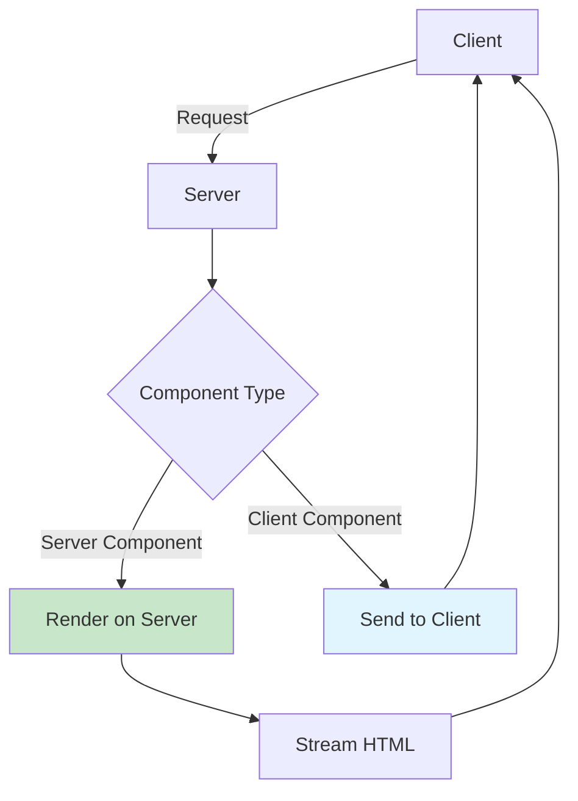

# React 19 新特性

> [!TIP]
> React 19 是一个重大版本更新，引入了 Server Components、Actions、新的 Hooks 等革命性特性，让 React 开发更加高效和强大。

## 🚀 主要新特性概览

### 特性列表

| 特性                        | 说明                    | 稳定性  |
| --------------------------- | ----------------------- | ------- |
| **React Server Components** | 服务器端组件渲染        | ✅ 稳定 |
| **Actions**                 | 简化表单和数据变更      | ✅ 稳定 |
| **use() Hook**              | 读取 Promise 和 Context | ✅ 稳定 |
| **useFormStatus**           | 表单状态管理            | ✅ 稳定 |
| **useFormState**            | 表单状态和 Actions      | ✅ 稳定 |
| **useOptimistic**           | 乐观 UI 更新            | ✅ 稳定 |
| **Document Metadata**       | 文档元数据支持          | ✅ 稳定 |
| **Asset Loading**           | 资源加载优化            | ✅ 稳定 |

## 🌐 Server Components

### 什么是 Server Components？

Server Components 在服务器端渲染，可以直接访问数据库、文件系统等后端资源。

**架构图：**



### 示例：数据库查询

```jsx
// app/users/page.jsx (Server Component)
import { db } from "@/lib/database";

export default async function UsersPage() {
  // ✅ 直接在组件中访问数据库
  const users = await db.query("SELECT * FROM users");

  return (
    <div>
      <h1>用户列表</h1>
      <ul>
        {users.map((user) => (
          <li key={user.id}>{user.name}</li>
        ))}
      </ul>
    </div>
  );
}
```

### 客户端组件标记

```jsx
"use client"; // 标记为客户端组件

import { useState } from "react";

export default function Counter() {
  const [count, setCount] = useState(0);

  return <button onClick={() => setCount(count + 1)}>Count: {count}</button>;
}
```

### 混合使用

```jsx
// ServerComponent.jsx (Server Component)
import ClientCounter from "./ClientCounter";

export default async function Page() {
  const data = await fetchData();

  return (
    <div>
      <h1>Server Data: {data}</h1>
      {/* 嵌入客户端组件 */}
      <ClientCounter />
    </div>
  );
}
```

## ⚡ Actions

### 什么是 Actions？

Actions 简化了表单处理和数据变更操作，自动处理 pending 状态、错误和重新验证。

### 表单 Action

```jsx
// app/todos/page.jsx
export default function TodoPage() {
  async function createTodo(formData) {
    "use server"; // Server Action

    const title = formData.get("title");
    await db.todos.create({ title });

    // 自动重新验证
    revalidatePath("/todos");
  }

  return (
    <form action={createTodo}>
      <input name="title" required />
      <button type="submit">添加待办</button>
    </form>
  );
}
```

### 使用 useFormStatus

```jsx
"use client";

import { useFormStatus } from "react-dom";

function SubmitButton() {
  const { pending } = useFormStatus();

  return (
    <button type="submit" disabled={pending}>
      {pending ? "Adding..." : "Add Todo"}
    </button>
  );
}

export default function TodoForm({ createTodo }) {
  return (
    <form action={createTodo}>
      <input name="title" />
      <SubmitButton />
    </form>
  );
}
```

### 使用 useFormState

```jsx
"use client";

import { useFormState } from "react-dom";

function ContactForm() {
  async function submitForm(prevState, formData) {
    "use server";

    const email = formData.get("email");

    if (!email.includes("@")) {
      return { error: "无效的邮箱地址" };
    }

    await sendEmail(email);
    return { success: "已发送！" };
  }

  const [state, formAction] = useFormState(submitForm, {});

  return (
    <form action={formAction}>
      <input name="email" type="email" />
      <button type="submit">发送</button>
      {state.error && <p style={{ color: "red" }}>{state.error}</p>}
      {state.success && <p style={{ color: "green" }}>{state.success}</p>}
    </form>
  );
}
```

## 🎣 use() Hook

### 读取 Promise

```jsx
import { use, Suspense } from "react";

function UserProfile({ userPromise }) {
  const user = use(userPromise); // 直接读取 Promise

  return (
    <div>
      <h2>{user.name}</h2>
      <p>{user.email}</p>
    </div>
  );
}

function App() {
  const userPromise = fetch("/api/user").then((res) => res.json());

  return (
    <Suspense fallback={<div>Loading...</div>}>
      <UserProfile userPromise={userPromise} />
    </Suspense>
  );
}
```

### 读取 Context

```jsx
import { use } from "react";
import { ThemeContext } from "./ThemeContext";

function ThemedButton() {
  const theme = use(ThemeContext); // 可在条件语句中使用！

  if (theme === "dark") {
    return <button className="dark-button">Dark</button>;
  }

  return <button className="light-button">Light</button>;
}
```

### 条件使用（与传统 Hooks 的区别）

```jsx
function Component({ condition }) {
  // ✅ use() 可以在条件语句中使用
  if (condition) {
    const data = use(dataPromise);
    return <div>{data}</div>;
  }

  // ✗ 传统 Hooks 不能在条件语句中
  // if (condition) {
  //   const [state, setState] = useState(0); // 错误！
  // }

  return null;
}
```

## ⚡ useOptimistic - 乐观更新

### 基本用法

```jsx
"use client";

import { useOptimistic, useState } from "react";

function TodoList() {
  const [todos, setTodos] = useState([]);
  const [optimisticTodos, addOptimisticTodo] = useOptimistic(
    todos,
    (state, newTodo) => [...state, { ...newTodo, pending: true }]
  );

  async function addTodo(formData) {
    const title = formData.get("title");
    const newTodo = { id: Date.now(), title };

    // 立即显示（乐观更新）
    addOptimisticTodo(newTodo);

    // 后台保存
    const savedTodo = await saveTodoToServer(newTodo);
    setTodos((prev) => [...prev, savedTodo]);
  }

  return (
    <div>
      <form action={addTodo}>
        <input name="title" />
        <button>Add</button>
      </form>

      <ul>
        {optimisticTodos.map((todo) => (
          <li key={todo.id} style={{ opacity: todo.pending ? 0.5 : 1 }}>
            {todo.title}
            {todo.pending && " (Saving...)"}
          </li>
        ))}
      </ul>
    </div>
  );
}
```

### 点赞功能示例

```jsx
function LikeButton({ postId, initialLikes }) {
  const [likes, setLikes] = useState(initialLikes);
  const [optimisticLikes, addOptimisticLike] = useOptimistic(
    likes,
    (state) => state + 1
  );

  async function handleLike() {
    // 立即显示 +1
    addOptimisticLike();

    try {
      const newLikes = await likePost(postId);
      setLikes(newLikes);
    } catch (error) {
      // 失败时会自动回滚
      console.error("Like failed:", error);
    }
  }

  return <button onClick={handleLike}>❤️ {optimisticLikes}</button>;
}
```

## 📄 Document Metadata

### 直接在组件中设置元数据

```jsx
function BlogPost({ post }) {
  return (
    <>
      {/* 🆕 可以直接在组件中设置 title */}
      <title>{post.title} - My Blog</title>
      <meta name="description" content={post.excerpt} />
      <meta property="og:title" content={post.title} />
      <meta property="og:image" content={post.image} />

      <article>
        <h1>{post.title}</h1>
        <p>{post.content}</p>
      </article>
    </>
  );
}
```

### Next.js 中的 Metadata API

```jsx
// app/blog/[id]/page.jsx
export async function generateMetadata({ params }) {
  const post = await getPost(params.id);

  return {
    title: post.title,
    description: post.excerpt,
    openGraph: {
      images: [post.image],
    },
  };
}

export default function BlogPost({ params }) {
  // ...
}
```

## 🎨 Asset Loading

### 预加载资源

```jsx
import { preload, preloadModule } from "react-dom";

function App() {
  // 预加载图片
  preload("/hero-image.jpg", { as: "image" });

  // 预加载脚本
  preloadModule("/analytics.js");

  return <div>...</div>;
}
```

### 预连接

```jsx
import { preconnect, prefetchDNS } from "react-dom";

function MyApp() {
  // DNS 预解析
  prefetchDNS("https://api.example.com");

  // 预连接
  preconnect("https://cdn.example.com");

  return <div>...</div>;
}
```

## 🎯 Ref 作为 Props

### 不再需要 forwardRef

```jsx
// ✗ React 18 - 需要 forwardRef
const Input = forwardRef((props, ref) => {
  return <input ref={ref} {...props} />;
});

// ✅ React 19 - ref 就是普通 prop
function Input({ ref, ...props }) {
  return <input ref={ref} {...props} />;
}

// 使用
function App() {
  const inputRef = useRef(null);
  return <Input ref={inputRef} placeholder="Enter text" />;
}
```

## 🔧 改进的错误处理

### Error Boundary 增强

```jsx
class ErrorBoundary extends React.Component {
  state = { hasError: false, error: null };

  static getDerivedStateFromError(error) {
    return { hasError: true, error };
  }

  componentDidCatch(error, errorInfo) {
    // 🆕 更详细的错误信息
    console.log("Error:", error);
    console.log("Error Info:", errorInfo);
    console.log("Component Stack:", errorInfo.componentStack);
  }

  render() {
    if (this.state.hasError) {
      return (
        <div>
          <h1>Something went wrong</h1>
          <details>
            <summary>Error details</summary>
            <pre>{this.state.error?.message}</pre>
          </details>
        </div>
      );
    }

    return this.props.children;
  }
}
```

## 📊 特性对比

### React 18 vs React 19

| 特性              | React 18 | React 19    |
| ----------------- | -------- | ----------- |
| Server Components | 实验性   | ✅ 稳定     |
| Actions           | ❌       | ✅ 新增     |
| use() Hook        | ❌       | ✅ 新增     |
| useOptimistic     | ❌       | ✅ 新增     |
| forwardRef        | 必需     | ✅ 不再需要 |
| Document Metadata | 需要库   | ✅ 原生支持 |

## 🚀 迁移指南

### 从 React 18 升级

```bash
# 升级依赖
npm install react@19 react-dom@19

# 如使用 Next.js
npm install next@15
```

### 代码更新

```jsx
// 1. 移除 forwardRef
// Before
const Input = forwardRef((props, ref) => <input ref={ref} {...props} />);

// After
const Input = ({ ref, ...props }) => <input ref={ref} {...props} />;

// 2. 使用新的 Hooks
import { use, useOptimistic, useFormStatus } from "react";

// 3. 采用 Server Components（可选）
// 在文件顶部添加 'use server' 或'use client'
```

## 💡 最佳实践

### 1. 合理使用 Server Components

```jsx
// ✅ Server Component - 数据获取
async function ProductList() {
  const products = await db.products.findMany();
  return <List items={products} />;
}

// ✅ Client Component - 交互
("use client");
function SearchBar() {
  const [query, setQuery] = useState("");
  return <input value={query} onChange={(e) => setQuery(e.target.value)} />;
}
```

### 2. 优先使用 Actions

```jsx
// ✅ 推荐：使用 Actions
function Form() {
  async function handleSubmit(formData) {
    "use server";
    await saveData(formData);
  }

  return <form action={handleSubmit}>...</form>;
}

// ✗ 不推荐：手动处理
function Form() {
  const [pending, setPending] = useState(false);

  const handleSubmit = async (e) => {
    e.preventDefault();
    setPending(true);
    await saveData();
    setPending(false);
  };

  return <form onSubmit={handleSubmit}>...</form>;
}
```

## 🔗 相关资源

- [React 19 官方文档](https://react.dev/blog/2024/04/25/react-19)
- [Hooks 详解](./hooks)
- [面试题精选](./interview-questions)
- [快速开始](./getting-started)

---

**恭喜！** 您已了解 React 19 的核心新特性。尝试在项目中应用这些特性，体验现代 React 开发的强大能力！
