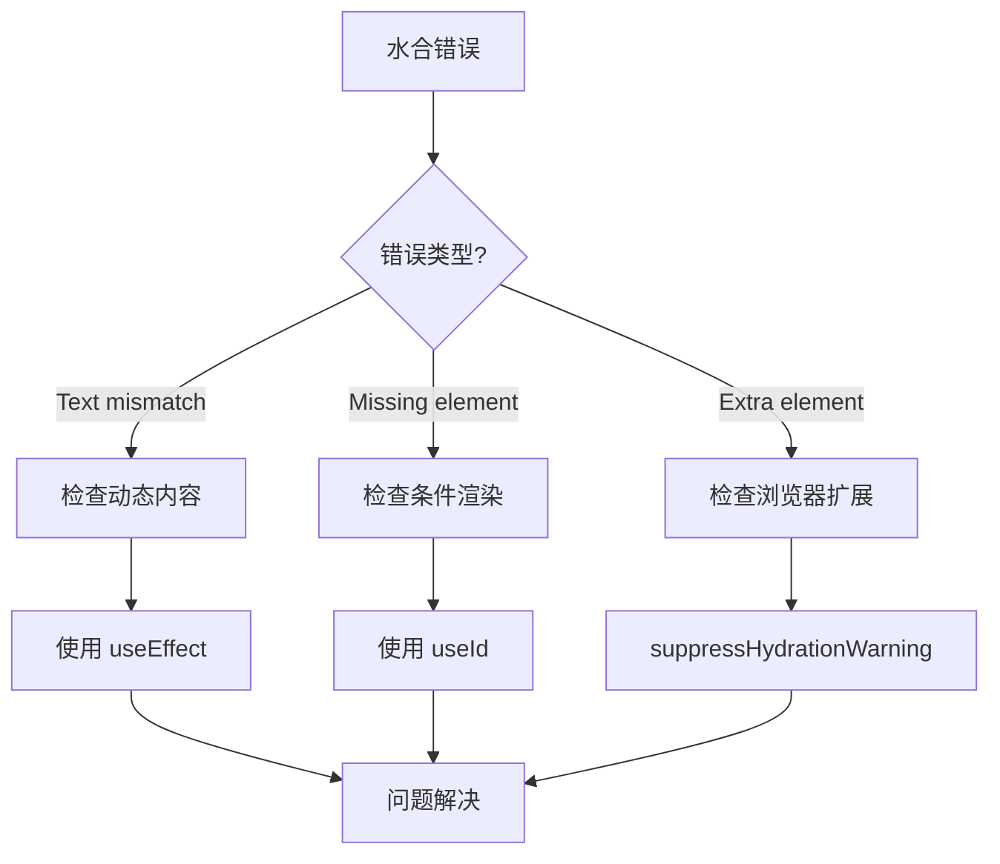

# 服务端渲染与 Next.js

> [!TIP]
> Next.js 是 React 的全栈框架，支持 SSR、SSG、ISR 等多种渲染方式。

## 📦 安装 Next.js

```bash
npx create-next-app@latest my-app
cd my-app
npm run dev
```

## 🎯 核心概念

### 1. 文件系统路由

```
app/
├── page.tsx          # /
├── about/
│   └── page.tsx      # /about
├── blog/
│   ├── page.tsx      # /blog
│   └── [id]/
│       └── page.tsx  # /blog/:id
```

### 2. 服务端组件（默认）

```tsx
// app/page.tsx - 服务端组件
async function HomePage() {
  const data = await fetch("https://api.example.com/data");
  const posts = await data.json();

  return (
    <div>
      <h1>Posts</h1>
      {posts.map((post) => (
        <div key={post.id}>{post.title}</div>
      ))}
    </div>
  );
}
```

### 3. 客户端组件

```tsx
"use client"; // 标记为客户端组件

import { useState } from "react";

export function Counter() {
  const [count, setCount] = useState(0);

  return <button onClick={() => setCount(count + 1)}>Count: {count}</button>;
}
```

## 🔄 数据获取

### SSG（静态生成）

```tsx
// 构建时获取数据
export async function generateStaticParams() {
  const posts = await fetch("https://...").then((r) => r.json());
  return posts.map((post) => ({ id: post.id.toString() }));
}

async function Post({ params }: { params: { id: string } }) {
  const post = await fetch(`https://.../${params.id}`).then((r) => r.json());
  return <div>{post.title}</div>;
}
```

### SSR（服务端渲染）

```tsx
// 每次请求时获取数据
async function DynamicPage() {
  const data = await fetch("https://...", { cache: "no-store" });
  return <div>{data.title}</div>;
}
```

### ISR（增量静态再生）

```tsx
async function PostsPage() {
  const data = await fetch("https://...", {
    next: { revalidate: 3600 }, // 1小时后重新验证
  });
  return <div>...</div>;
}
```

## 🚀 API 路由

```ts
// app/api/hello/route.ts
export async function GET(request: Request) {
  return Response.json({ message: "Hello" });
}

export async function POST(request: Request) {
  const body = await request.json();
  return Response.json({ received: body });
}
```

## 🛡️ 中间件

```ts
// middleware.ts (项目根目录)
import { NextResponse } from "next/server";
import type { NextRequest } from "next/server";

export function middleware(request: NextRequest) {
  // 检查认证
  const token = request.cookies.get("token");

  if (!token && request.nextUrl.pathname.startsWith("/dashboard")) {
    return NextResponse.redirect(new URL("/login", request.url));
  }

  // 添加自定义 Header
  const response = NextResponse.next();
  response.headers.set("x-custom-header", "my-value");

  return response;
}

// 配置匹配的路径
export const config = {
  matcher: ["/dashboard/:path*", "/api/:path*"],
};
```

### 中间件常见用例

```ts
// 国际化重定向
export function middleware(request: NextRequest) {
  const locale = request.headers.get("accept-language")?.split(",")[0] || "en";

  if (!request.nextUrl.pathname.startsWith(`/${locale}`)) {
    return NextResponse.redirect(
      new URL(`/${locale}${request.nextUrl.pathname}`, request.url)
    );
  }
}

// Rate Limiting
const rateLimit = new Map();

export function middleware(request: NextRequest) {
  const ip = request.ip ?? "127.0.0.1";
  const count = rateLimit.get(ip) || 0;

  if (count > 100) {
    return new NextResponse("Too Many Requests", { status: 429 });
  }

  rateLimit.set(ip, count + 1);
  setTimeout(() => rateLimit.delete(ip), 60000);

  return NextResponse.next();
}
```

## 📦 数据缓存策略

### fetch 缓存

```tsx
// 默认：缓存请求
const data = await fetch("https://api.example.com/posts");

// 不缓存
const data = await fetch("https://api.example.com/posts", {
  cache: "no-store",
});

// 按时间重新验证
const data = await fetch("https://api.example.com/posts", {
  next: { revalidate: 3600 }, // 1小时
});

// 按标签重新验证
const data = await fetch("https://api.example.com/posts", {
  next: { tags: ["posts"] },
});

// 手动重新验证
import { revalidateTag, revalidatePath } from "next/cache";
revalidateTag("posts");
revalidatePath("/blog");
```

### React cache

```tsx
import { cache } from "react";

// 在同一请求中去重
const getUser = cache(async (id: string) => {
  const user = await db.user.findUnique({ where: { id } });
  return user;
});

// 多个组件调用只执行一次查询
async function UserProfile({ userId }) {
  const user = await getUser(userId);
  return <div>{user.name}</div>;
}

async function UserPosts({ userId }) {
  const user = await getUser(userId); // 使用缓存结果
  return <Posts authorId={user.id} />;
}
```

## 🖼️ 图片和字体优化

### 图片优化

```tsx
import Image from "next/image";

function Avatar() {
  return (
    <Image
      src="/avatar.jpg"
      alt="用户头像"
      width={100}
      height={100}
      priority // 预加载关键图片
      placeholder="blur" // 模糊占位符
      blurDataURL="..." // 模糊图片 base64
    />
  );
}

// 响应式图片
function HeroImage() {
  return (
    <Image
      src="/hero.jpg"
      alt="Hero"
      fill // 填充父容器
      sizes="(max-width: 768px) 100vw, 50vw"
      style={{ objectFit: "cover" }}
    />
  );
}
```

### 字体优化

```tsx
// app/layout.tsx
import { Inter, Noto_Sans_SC } from "next/font/google";

const inter = Inter({
  subsets: ["latin"],
  display: "swap",
  variable: "--font-inter",
});

const notoSansSC = Noto_Sans_SC({
  subsets: ["latin"],
  weight: ["400", "500", "700"],
  variable: "--font-noto",
});

export default function RootLayout({ children }) {
  return (
    <html lang="zh" className={`${inter.variable} ${notoSansSC.variable}`}>
      <body>{children}</body>
    </html>
  );
}
```

## 🎨 Loading 和 Error UI

### Loading 状态

```tsx
// app/dashboard/loading.tsx
export default function Loading() {
  return (
    <div className="loading-container">
      <div className="spinner" />
      <p>加载中...</p>
    </div>
  );
}

// 骨架屏
export default function Loading() {
  return (
    <div className="skeleton">
      <div className="skeleton-header" />
      <div className="skeleton-content">
        {[1, 2, 3].map((i) => (
          <div key={i} className="skeleton-item" />
        ))}
      </div>
    </div>
  );
}
```

### Error 处理

```tsx
// app/dashboard/error.tsx
"use client";

export default function Error({
  error,
  reset,
}: {
  error: Error & { digest?: string };
  reset: () => void;
}) {
  return (
    <div className="error-container">
      <h2>出错了！</h2>
      <p>{error.message}</p>
      <button onClick={reset}>重试</button>
    </div>
  );
}
```

### Not Found

```tsx
// app/not-found.tsx
import Link from "next/link";

export default function NotFound() {
  return (
    <div className="not-found">
      <h2>页面未找到</h2>
      <p>您访问的页面不存在</p>
      <Link href="/">返回首页</Link>
    </div>
  );
}

// 手动触发 404
import { notFound } from "next/navigation";

async function PostPage({ params }) {
  const post = await getPost(params.id);
  if (!post) notFound();
  return <Article post={post} />;
}
```

## 🔀 高级路由模式

### 并行路由 (Parallel Routes)

```
app/
├── layout.tsx
├── page.tsx
├── @dashboard/
│   └── page.tsx
└── @analytics/
    └── page.tsx
```

```tsx
// app/layout.tsx
export default function Layout({
  children,
  dashboard,
  analytics,
}: {
  children: React.ReactNode;
  dashboard: React.ReactNode;
  analytics: React.ReactNode;
}) {
  return (
    <div>
      {children}
      <div className="panels">
        {dashboard}
        {analytics}
      </div>
    </div>
  );
}
```

### 拦截路由 (Intercepting Routes)

```
app/
├── feed/
│   └── page.tsx
├── photo/
│   └── [id]/
│       └── page.tsx
└── @modal/
    └── (.)photo/
        └── [id]/
            └── page.tsx   # 在模态框中显示
```

### 路由组

```
app/
├── (marketing)/           # 不影响 URL
│   ├── about/
│   │   └── page.tsx      # /about
│   └── contact/
│       └── page.tsx      # /contact
└── (shop)/
    ├── products/
    │   └── page.tsx      # /products
    └── cart/
        └── page.tsx      # /cart
```

## 🚀 部署

### Vercel（推荐）

```bash
# 安装 Vercel CLI
npm i -g vercel

# 部署
vercel

# 部署到生产环境
vercel --prod
```

### Docker

```dockerfile
# Dockerfile
FROM node:18-alpine AS base

FROM base AS deps
WORKDIR /app
COPY package*.json ./
RUN npm ci

FROM base AS builder
WORKDIR /app
COPY --from=deps /app/node_modules ./node_modules
COPY . .
RUN npm run build

FROM base AS runner
WORKDIR /app
ENV NODE_ENV production
COPY --from=builder /app/public ./public
COPY --from=builder /app/.next/standalone ./
COPY --from=builder /app/.next/static ./.next/static

EXPOSE 3000
CMD ["node", "server.js"]
```

```js
// next.config.js
module.exports = {
  output: "standalone", // 启用独立输出
};
```

### 静态导出

```js
// next.config.js
module.exports = {
  output: "export", // 静态 HTML 导出
};
```

```bash
npm run build   # 生成 out/ 目录
```

## 💡 最佳实践

| 场景          | 推荐方案         |
| ------------- | ---------------- |
| 内容网站/博客 | SSG + ISR        |
| 电商产品页    | SSG + ISR        |
| 用户仪表盘    | SSR 或客户端渲染 |
| 实时数据      | 客户端渲染 + SWR |
| 需要 SEO      | SSR 或 SSG       |

## 🔧 水合问题排查

### 什么是水合错误？

水合（Hydration）是指 React 将服务端渲染的 HTML 与客户端 JavaScript 连接起来的过程。当服务端和客户端渲染结果不一致时，会出现水合错误。

```
Warning: Text content did not match. Server: "服务端" Client: "客户端"
```

### 常见水合错误及解决方案

#### 1. 使用浏览器专有 API

```jsx
// ❌ 错误：服务端没有 window
function BadComponent() {
  const width = window.innerWidth; // 服务端报错
  return <div>Width: {width}</div>;
}

// ✅ 正确：使用 useEffect
function GoodComponent() {
  const [width, setWidth] = useState(0);

  useEffect(() => {
    setWidth(window.innerWidth);
  }, []);

  return <div>Width: {width}</div>;
}
```

#### 2. 使用当前时间/日期

```jsx
// ❌ 错误：服务端和客户端时间不同
function BadDate() {
  return <div>{new Date().toLocaleString()}</div>; // 水合不匹配
}

// ✅ 正确：客户端渲染日期
function GoodDate() {
  const [date, setDate] = useState(null);

  useEffect(() => {
    setDate(new Date().toLocaleString());
  }, []);

  return <div>{date ?? "加载中..."}</div>;
}
```

#### 3. 随机数/ID

```jsx
// ❌ 错误：每次渲染结果不同
function BadRandom() {
  const id = Math.random().toString(36); // 服务端和客户端不同
  return <div id={id}>...</div>;
}

// ✅ 正确：使用 useId
function GoodId() {
  const id = useId();
  return <div id={id}>...</div>;
}
```

#### 4. localStorage/sessionStorage

```jsx
// ❌ 错误：服务端没有 localStorage
function BadStorage() {
  const theme = localStorage.getItem("theme"); // 服务端报错
  return <div className={theme}>...</div>;
}

// ✅ 正确：客户端检测
function GoodStorage() {
  const [theme, setTheme] = useState("light");

  useEffect(() => {
    const saved = localStorage.getItem("theme");
    if (saved) setTheme(saved);
  }, []);

  return <div className={theme}>...</div>;
}
```

#### 5. 浏览器扩展注入内容

React 19 已改进处理，但仍建议：

```jsx
// 使用 suppressHydrationWarning 忽略特定元素
<time dateTime={date} suppressHydrationWarning>
  {formattedDate}
</time>
```

### 调试技巧

#### 1. 定位问题组件

```jsx
// 临时添加 suppressHydrationWarning 逐个排查
<div suppressHydrationWarning>
  <PossiblyProblematicComponent />
</div>
```

#### 2. 使用客户端组件

```tsx
"use client"; // 跳过服务端渲染

function ClientOnlyComponent() {
  // 只在客户端运行
}
```

#### 3. 动态导入禁用 SSR

```jsx
import dynamic from "next/dynamic";

const NoSSRComponent = dynamic(() => import("./Component"), {
  ssr: false,
});
```

### 完整排查流程



---

**了解更多**：查看 [Next.js 官方文档](https://nextjs.org/docs) | [React Router](/docs/react/react-router) | [严格模式](/docs/react/strict-mode)
