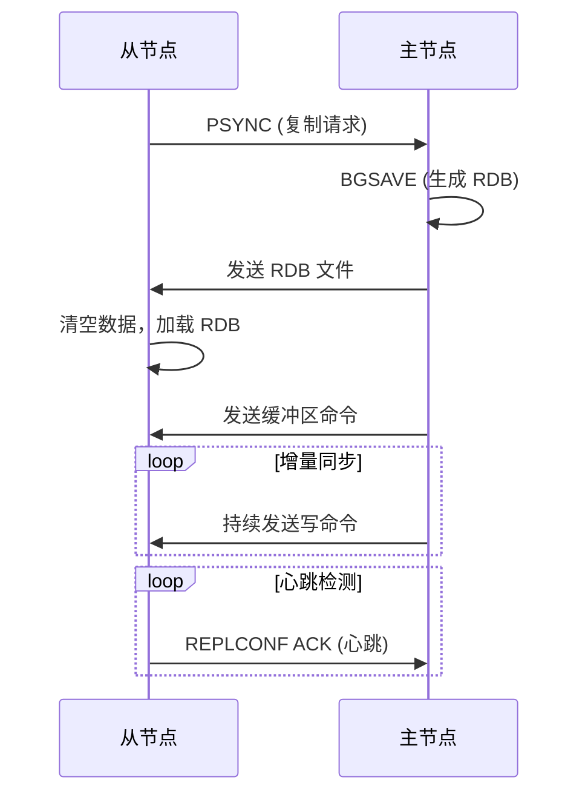

# Redis 主从复制

主从复制是 Redis 高可用架构的基础，通过将数据从一个 Redis 服务器（主节点 Master）复制到多个 Redis 服务器（从节点 Slave），实现数据冗余、读写分离和故障恢复。

## 主从复制原理

### 复制流程

1. **建立连接** - 从节点向主节点发送 `PSYNC` 命令
2. **全量同步** - 主节点进行 RDB 快照，发送给从节点
3. **增量同步** - 主节点将写命令发送给从节点
4. **心跳检测** - 从节点定期向主节点发送心跳

### 详细过程



## 配置主从复制

### 方式一：配置文件

在从节点的 `redis.conf` 中配置：

```conf
# 指定主节点地址和端口
replicaof 192.168.1.100 6379

# 如果主节点设置了密码
masterauth mypassword

# 从节点是否只读（推荐）
replica-read-only yes

# 复制超时时间
repl-timeout 60

# 禁用 TCP_NODELAY（提高复制性能）
repl-disable-tcp-nodelay no
```

### 方式二：命令行

在从节点执行命令：

```bash
# 设置主节点
REPLICAOF 192.168.1.100 6379

# 如果主节点有密码
CONFIG SET masterauth mypassword

# 取消复制（变为主节点）
REPLICAOF NO ONE
```

### 验证主从状态

**主节点**：

```bash
# 查看复制信息
INFO replication

# 输出示例
role:master
connected_slaves:2
slave0:ip=192.168.1.101,port=6379,state=online,offset=123456
slave1:ip=192.168.1.102,port=6379,state=online,offset=123456
```

**从节点**：

```bash
INFO replication

# 输出示例
role:slave
master_host:192.168.1.100
master_port:6379
master_link_status:up
slave_read_only:1
```

## 复制模式

### 全量复制

从节点首次连接主节点，或长时间断开重连后，需要全量复制。

**过程**：

1. 从节点发送 `PSYNC ? -1`
2. 主节点执行 `BGSAVE` 生成 RDB
3. 主节点发送 RDB 文件给从节点
4. 从节点清空旧数据，加载 RDB
5. 主节点发送缓冲区命令

**开销**：

- 主节点：fork 子进程、磁盘 I/O、网络 I/O
- 从节点：清空数据、加载 RDB

### 部分复制

从节点短暂断开重连后，只需同步断开期间的增量数据。

**过程**：

1. 从节点发送 `PSYNC <runid> <offset>`
2. 主节点判断 offset 是否在复制积压缓冲区内
3. 如果在，发送增量数据；否则进行全量复制

**复制积压缓冲区**：

```conf
# 默认 1MB，建议根据网络情况调整
repl-backlog-size 1mb

# 主节点在多长时间没有从节点后释放缓冲区
repl-backlog-ttl 3600
```

### 无盘复制

主节点直接将 RDB 数据流发送给从节点，不写入磁盘。

```conf
# 开启无盘复制
repl-diskless-sync yes

# 延迟时间（等待更多从节点）
repl-diskless-sync-delay 5
```

**优点**：

- 减少磁盘 I/O
- 适合磁盘性能差的场景

**缺点**：

- 主节点内存占用高
- fork 开销依然存在

## 读写分离

主从复制的典型应用是实现读写分离，主节点处理写请求，从节点处理读请求。

### 架构

```
               +----------+
               |  Client  |
               +----------+
                     |
         +-----------+------------+
         |                        |
    +----------+            +----------+
    |  Master  | ---------> |  Slave1  |
    | (Write)  | ---------> |  Slave2  |
    +----------+            +----------+
                              (Read)
```

### 实现方式

#### 1. 应用层路由

在应用代码中区分读写操作：

```java
public class RedisService {
    private Jedis master;  // 主节点
    private List<Jedis> slaves;  // 从节点列表

    // 写操作
    public void set(String key, String value) {
        master.set(key, value);
    }

    // 读操作（随机选择从节点）
    public String get(String key) {
        Jedis slave = slaves.get(random.nextInt(slaves.size()));
        return slave.get(key);
    }
}
```

#### 2. 使用 Redis Sentinel

Sentinel 自动管理主从切换，客户端通过 Sentinel 获取主从节点信息。

#### 3. 使用中间件

使用 Twemproxy、Codis 等中间件实现读写分离。

### 注意事项

#### 1. 主从延迟

主从复制是异步的，存在数据延迟。

**监控延迟**：

```bash
# 从节点执行
INFO replication

# 查看 master_repl_offset 和 slave_repl_offset 差值
```

**解决方案**：

- 对实时性要求高的读操作，从主节点读取
- 使用 `WAIT` 命令等待从节点同步

```bash
# 写入数据后，等待至少 2 个从节点同步，超时 1000ms
SET key value
WAIT 2 1000
```

#### 2. 数据不一致

从节点数据可能落后于主节点，读到旧数据。

**解决方案**：

- 业务层容忍短暂不一致
- 关键数据从主节点读取
- 使用版本号或时间戳校验数据

#### 3. 从节点只读

默认情况下从节点是只读的，避免数据不一致：

```conf
replica-read-only yes
```

## 主从切换

### 手动切换

1. **提升从节点为主节点**：

```bash
# 在从节点执行
REPLICAOF NO ONE
```

2. **其他从节点指向新主节点**：

```bash
# 在其他从节点执行
REPLICAOF 192.168.1.101 6379
```

3. **应用更新配置**：

更新应用配置，指向新的主节点。

### 自动切换

使用 Redis Sentinel 或 Redis Cluster 实现自动故障转移。

## 常见问题

### 1. 复制风暴

多个从节点同时向主节点请求全量复制，导致主节点压力过大。

**解决方案**：

- 使用级联复制（从节点的从节点）
- 分批启动从节点
- 使用无盘复制减少磁盘 I/O

### 2. 复制超时

网络不稳定或主节点压力大，导致复制超时。

**解决方案**：

```conf
# 增加超时时间
repl-timeout 60

# 增加复制积压缓冲区
repl-backlog-size 10mb
```

### 3. 主节点宕机

主节点宕机后，需要手动或自动切换。

**解决方案**：

- 使用 Redis Sentinel 自动故障转移
- 配置主节点持久化，避免数据丢失

### 4. 从节点过多

从节点过多会增加主节点的复制开销。

**解决方案**：

- 使用级联复制
- 限制从节点数量（一般不超过 5 个）

## 级联复制

从节点也可以有自己的从节点，形成级联复制。

```
Master
  |
Slave1
  |
Slave2
  |
Slave3
```

**配置**：

```bash
# Slave2 复制 Slave1
REPLICAOF 192.168.1.101 6379
```

**优点**：

- 减少主节点复制开销
- 适合大量从节点场景

**缺点**：

- 增加复制延迟
- 中间节点故障影响下游节点

## 最佳实践

### 1. 配置持久化

主节点至少开启一种持久化方式，避免重启后数据丢失：

```conf
# 主节点
appendonly yes
appendfsync everysec
```

### 2. 从节点只读

避免从节点写入导致数据不一致：

```conf
replica-read-only yes
```

### 3. 合理配置复制参数

```conf
# 复制超时
repl-timeout 60

# 复制积压缓冲区（根据网络情况调整）
repl-backlog-size 10mb

# 禁用 TCP_NODELAY（减少网络延迟）
repl-disable-tcp-nodelay no
```

### 4. 监控复制状态

定期检查复制状态：

```bash
# 主节点
INFO replication

# 从节点
INFO replication
```

**关键指标**：

- `master_link_status` - 主从连接状态
- `master_last_io_seconds_ago` - 最后一次同步时间
- `master_repl_offset` - 主节点复制偏移量
- `slave_repl_offset` - 从节点复制偏移量

### 5. 使用 Sentinel 或 Cluster

生产环境推荐使用 Redis Sentinel 或 Redis Cluster 实现高可用。

## 小结

Redis 主从复制是实现高可用的基础：

- **数据冗余** - 多个副本，提高数据安全性
- **读写分离** - 主节点写，从节点读，提高性能
- **故障恢复** - 主节点故障可提升从节点

主从复制的关键点：

- 理解全量复制和部分复制
- 合理配置复制参数
- 注意主从延迟和数据一致性
- 生产环境使用 Sentinel 或 Cluster 自动故障转移
