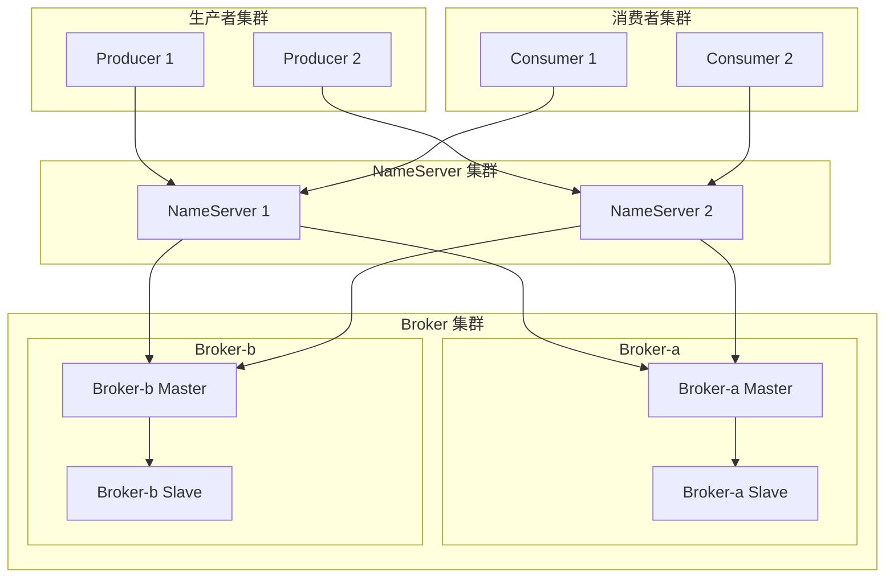

# RocketMQ 集群管理

本文档介绍 RocketMQ 集群的架构设计、部署方案和日常管理操作。

## 集群架构

### 整体架构



### 组件职责

| 组件          | 职责           | 特点                                       |
| ------------- | -------------- | ------------------------------------------ |
| NameServer    | 路由注册与发现 | 无状态，可水平扩展                         |
| Broker Master | 消息读写       | 接收生产者消息，提供消费者消息             |
| Broker Slave  | 消息备份       | 从 Master 同步数据，可提供读服务           |
| Producer      | 消息生产       | 从 NameServer 获取路由，发送消息到 Broker  |
| Consumer      | 消息消费       | 从 NameServer 获取路由，从 Broker 拉取消息 |

## 部署模式

### 1. 单 Master 模式

**适用场景：** 开发测试环境

```
NameServer × 1
Broker-Master × 1
```

**风险：** Master 宕机，服务不可用

### 2. 多 Master 模式

**适用场景：** 对消息丢失有容忍度的场景

```
NameServer × 2
Broker-a-Master
Broker-b-Master
```

**特点：**

- 单个 Master 宕机，未消费消息不可恢复
- 简单高效

### 3. 多 Master 多 Slave（异步复制）

**适用场景：** 一般生产环境

```
NameServer × 2
Broker-a-Master ──async──> Broker-a-Slave
Broker-b-Master ──async──> Broker-b-Slave
```

**特点：**

- Master 宕机，可能丢失少量消息
- 性能较高

### 4. 多 Master 多 Slave（同步复制）

**适用场景：** 金融等高可靠场景

```
NameServer × 2
Broker-a-Master ──sync──> Broker-a-Slave
Broker-b-Master ──sync──> Broker-b-Slave
```

**特点：**

- Master 宕机，消息不丢失
- 性能略低

### 5. Dledger 自动选主模式

**适用场景：** 高可用生产环境（推荐）

```
NameServer × 3
Dledger Group (3个节点，自动选主)
  ├── Broker-a-0
  ├── Broker-a-1
  └── Broker-a-2
```

**特点：**

- 自动故障转移
- 基于 Raft 协议
- Master 宕机自动选举新 Master

## 主从架构配置

### Master 配置

```properties
# broker-a-master.conf
brokerClusterName=DefaultCluster
brokerName=broker-a
brokerId=0
namesrvAddr=192.168.1.1:9876;192.168.1.2:9876
storePathRootDir=/data/rocketmq/store
storePathCommitLog=/data/rocketmq/store/commitlog

# 监听端口
listenPort=10911

# 同步复制（高可靠）
brokerRole=SYNC_MASTER

# 异步刷盘
flushDiskType=ASYNC_FLUSH

# 消息存储保留时间（小时）
fileReservedTime=72

# 删除过期文件时间
deleteWhen=04
```

### Slave 配置

```properties
# broker-a-slave.conf
brokerClusterName=DefaultCluster
brokerName=broker-a
brokerId=1
namesrvAddr=192.168.1.1:9876;192.168.1.2:9876
storePathRootDir=/data/rocketmq/store
storePathCommitLog=/data/rocketmq/store/commitlog

# 监听端口
listenPort=10911

# Slave 角色
brokerRole=SLAVE

# 异步刷盘
flushDiskType=ASYNC_FLUSH
```

### 启动顺序

```bash
# 1. 启动所有 NameServer
nohup sh bin/mqnamesrv &

# 2. 启动 Master Broker
nohup sh bin/mqbroker -c conf/broker-a-master.conf &

# 3. 启动 Slave Broker
nohup sh bin/mqbroker -c conf/broker-a-slave.conf &
```

## Dledger 模式配置

### 配置文件

```properties
# broker-a-0.conf
brokerClusterName=DledgerCluster
brokerName=broker-a
brokerId=-1
namesrvAddr=192.168.1.1:9876;192.168.1.2:9876

# 开启 Dledger 模式
enableDLegerCommitLog=true

# Dledger Group 名称
dLegerGroup=broker-a

# 集群节点
dLegerPeers=n0-192.168.1.10:40911;n1-192.168.1.11:40911;n2-192.168.1.12:40911

# 当前节点 ID
dLegerSelfId=n0

# 监听端口
listenPort=10911
```

### 启动 Dledger 集群

```bash
# 在三个节点上分别启动
nohup sh bin/mqbroker -c conf/broker-a-0.conf &
nohup sh bin/mqbroker -c conf/broker-a-1.conf &
nohup sh bin/mqbroker -c conf/broker-a-2.conf &
```

## 集群管理命令

### 查看集群状态

```bash
# 查看集群列表
sh bin/mqadmin clusterList -n localhost:9876

# 输出示例
Cluster Name     Broker Name     Broker Addr:Port      Version
DefaultCluster   broker-a        192.168.1.10:10911    V5_1_4
DefaultCluster   broker-a        192.168.1.11:10911    V5_1_4
DefaultCluster   broker-b        192.168.1.12:10911    V5_1_4
```

### Broker 管理

```bash
# 查看 Broker 状态
sh bin/mqadmin brokerStatus -n localhost:9876 -b 192.168.1.10:10911

# 查看 Broker 配置
sh bin/mqadmin getBrokerConfig -n localhost:9876 -b 192.168.1.10:10911

# 更新 Broker 配置（运行时）
sh bin/mqadmin updateBrokerConfig -n localhost:9876 -b 192.168.1.10:10911 \
    -k sendMessageThreadPoolNums -v 16
```

### Topic 管理

```bash
# 创建 Topic
sh bin/mqadmin updateTopic -n localhost:9876 -c DefaultCluster -t OrderTopic \
    -r 8 -w 8

# 查看 Topic 列表
sh bin/mqadmin topicList -n localhost:9876

# 查看 Topic 路由
sh bin/mqadmin topicRoute -n localhost:9876 -t OrderTopic

# 查看 Topic 状态
sh bin/mqadmin topicStatus -n localhost:9876 -t OrderTopic

# 删除 Topic
sh bin/mqadmin deleteTopic -n localhost:9876 -c DefaultCluster -t OrderTopic
```

### 消费者组管理

```bash
# 查看消费进度
sh bin/mqadmin consumerProgress -n localhost:9876 -g ConsumerGroup

# 查看消费者连接
sh bin/mqadmin consumerConnection -n localhost:9876 -g ConsumerGroup

# 重置消费位点
sh bin/mqadmin resetOffsetByTime -n localhost:9876 \
    -g ConsumerGroup -t OrderTopic -s now

# 删除消费者组
sh bin/mqadmin deleteSubGroup -n localhost:9876 -c DefaultCluster -g ConsumerGroup
```

### 消息管理

```bash
# 按 MsgId 查询
sh bin/mqadmin queryMsgById -n localhost:9876 -i <msgId>

# 按 Key 查询
sh bin/mqadmin queryMsgByKey -n localhost:9876 -t OrderTopic -k ORDER_123

# 按时间查询
sh bin/mqadmin queryMsgByOffset -n localhost:9876 -t OrderTopic -q 0 -o 100
```

## 扩缩容操作

### 增加 Broker 节点

```bash
# 1. 准备新 Broker 配置
# broker-c-master.conf
brokerClusterName=DefaultCluster
brokerName=broker-c
brokerId=0
namesrvAddr=192.168.1.1:9876;192.168.1.2:9876

# 2. 启动新 Broker
nohup sh bin/mqbroker -c conf/broker-c-master.conf &

# 3. 扩展 Topic（将新 Broker 加入 Topic）
sh bin/mqadmin updateTopic -n localhost:9876 -c DefaultCluster -t OrderTopic \
    -r 12 -w 12

# 4. 等待负载均衡完成
# 消费者会自动重新分配 Queue
```

### 缩减 Broker 节点

```bash
# 1. 禁止写入（仅允许读取）
sh bin/mqadmin updateBrokerConfig -n localhost:9876 -b 192.168.1.12:10911 \
    -k brokerPermission -v 4

# 2. 等待该 Broker 上的消息被消费完
sh bin/mqadmin topicStatus -n localhost:9876 -t OrderTopic

# 3. 停止 Broker
sh bin/mqshutdown broker

# 4. 更新 Topic（减少 Queue 数量）
sh bin/mqadmin updateTopic -n localhost:9876 -c DefaultCluster -t OrderTopic \
    -r 8 -w 8
```

### 增加 Queue 数量

```bash
# 仅增加写队列（预热）
sh bin/mqadmin updateTopic -n localhost:9876 -t OrderTopic -r 8 -w 16

# 确认无问题后增加读队列
sh bin/mqadmin updateTopic -n localhost:9876 -t OrderTopic -r 16 -w 16
```

## 故障处理

### Master 宕机处理

**主从模式：**

1. Slave 自动切换为可读（消费者可继续消费）
2. 生产者切换到其他 Master
3. 恢复原 Master 或手动切换

**Dledger 模式：**

1. 自动触发选举
2. 新 Leader 自动接管
3. 无需人工干预

### Slave 宕机处理

1. 不影响正常读写
2. 数据复制暂停
3. 及时恢复 Slave

### NameServer 宕机处理

1. 客户端会自动切换到其他 NameServer
2. 只影响新建连接的路由获取
3. 已连接的客户端不受影响

### 消息堆积处理

```bash
# 1. 查看堆积情况
sh bin/mqadmin consumerProgress -n localhost:9876 -g ConsumerGroup

# 2. 临时增加 Queue
sh bin/mqadmin updateTopic -n localhost:9876 -t OrderTopic -r 16 -w 16

# 3. 增加消费者实例
# 部署更多消费者应用

# 4. 跳过堆积消息（谨慎使用）
sh bin/mqadmin resetOffsetByTime -n localhost:9876 \
    -g ConsumerGroup -t OrderTopic -s now
```

## 数据迁移

### Topic 数据迁移

```bash
# 1. 创建新 Topic
sh bin/mqadmin updateTopic -n localhost:9876 -c NewCluster -t NewTopic

# 2. 消费者双订阅
consumer.subscribe("OldTopic", "*");
consumer.subscribe("NewTopic", "*");

# 3. 生产者切换到新 Topic
producer.send(new Message("NewTopic", body));

# 4. 等待旧 Topic 消息消费完毕

# 5. 删除旧 Topic
sh bin/mqadmin deleteTopic -n localhost:9876 -c OldCluster -t OldTopic
```

## 下一步

- ⚡ [性能优化](/docs/rocketmq/performance-optimization) - 提升集群性能
- 📊 [监控运维](/docs/rocketmq/monitoring) - 建设监控体系
- ✅ [最佳实践](/docs/rocketmq/best-practices) - 生产环境实践

## 参考资料

- [RocketMQ 部署文档](https://rocketmq.apache.org/docs/deploymentOperations/)
- [Dledger 快速开始](https://rocketmq.apache.org/docs/dleger/quick-start/)
