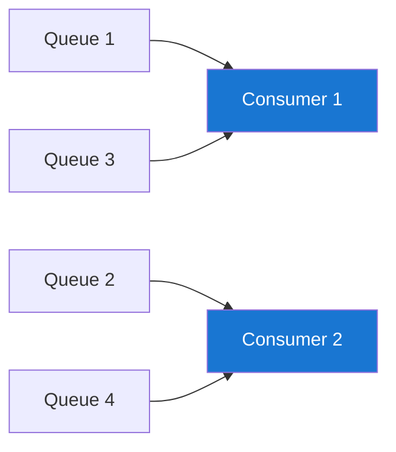
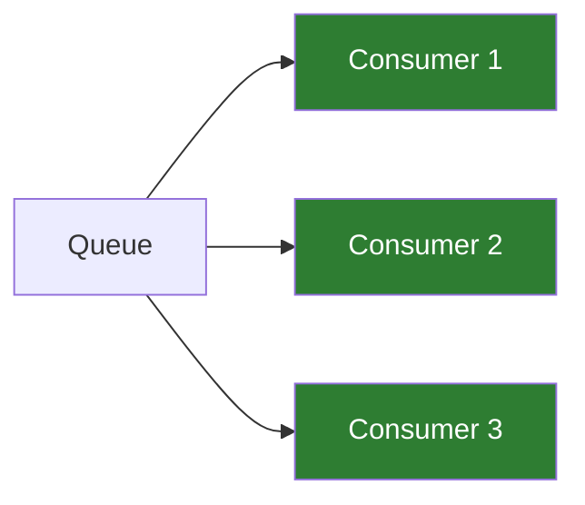

# RocketMQ 消费者详解

## 消费者概述

RocketMQ Consumer 负责从 Broker 拉取消息并进行处理。支持 Push 和 Pull 两种消费模式，以及集群消费和广播消费两种消费方式。

## 消费者类型

| 类型        | 类名                      | 特点                  |
| ----------- | ------------------------- | --------------------- |
| Push 消费者 | `DefaultMQPushConsumer`   | Broker 推送，实时性好 |
| Pull 消费者 | `DefaultLitePullConsumer` | 主动拉取，控制力强    |

## Push 消费者

### 基本使用

```java
DefaultMQPushConsumer consumer = new DefaultMQPushConsumer("ConsumerGroup");
consumer.setNamesrvAddr("localhost:9876");

// 订阅 Topic
consumer.subscribe("TopicTest", "*");

// 注册消息监听器
consumer.registerMessageListener((MessageListenerConcurrently) (msgs, context) -> {
    for (MessageExt msg : msgs) {
        System.out.printf("收到消息: %s%n", new String(msg.getBody()));
    }
    return ConsumeConcurrentlyStatus.CONSUME_SUCCESS;
});

consumer.start();
```

### 配置参数

```java
// 消费线程数
consumer.setConsumeThreadMin(20);
consumer.setConsumeThreadMax(64);

// 每次拉取消息数量
consumer.setPullBatchSize(32);

// 消费超时时间（分钟）
consumer.setConsumeTimeout(15);

// 消费失败重试次数
consumer.setMaxReconsumeTimes(16);

// 消费起始位置
consumer.setConsumeFromWhere(ConsumeFromWhere.CONSUME_FROM_LAST_OFFSET);
```

### 消费起始位置

| 配置                        | 说明                   |
| --------------------------- | ---------------------- |
| `CONSUME_FROM_LAST_OFFSET`  | 从最新位置开始（默认） |
| `CONSUME_FROM_FIRST_OFFSET` | 从最早位置开始         |
| `CONSUME_FROM_TIMESTAMP`    | 从指定时间开始         |

```java
// 从头消费
consumer.setConsumeFromWhere(ConsumeFromWhere.CONSUME_FROM_FIRST_OFFSET);

// 从指定时间消费
consumer.setConsumeFromWhere(ConsumeFromWhere.CONSUME_FROM_TIMESTAMP);
consumer.setConsumeTimestamp("20240101120000");
```

## 消费模式

### 集群消费（默认）

一条消息只被消费组中的一个消费者消费。

```java
consumer.setMessageModel(MessageModel.CLUSTERING);
```



### 广播消费

一条消息被消费组中的所有消费者消费。

```java
consumer.setMessageModel(MessageModel.BROADCASTING);
```



### 对比

| 特性     | 集群消费    | 广播消费           |
| -------- | ----------- | ------------------ |
| 消息分发 | 负载均衡    | 全量投递           |
| 消费进度 | Broker 保存 | 消费者本地保存     |
| 消费失败 | 支持重试    | 不支持重试         |
| 使用场景 | 业务处理    | 缓存同步、配置下发 |

## 并发消费 vs 顺序消费

### 并发消费

```java
consumer.registerMessageListener((MessageListenerConcurrently) (msgs, context) -> {
    for (MessageExt msg : msgs) {
        try {
            processMessage(msg);
        } catch (Exception e) {
            // 消费失败，稍后重试
            return ConsumeConcurrentlyStatus.RECONSUME_LATER;
        }
    }
    return ConsumeConcurrentlyStatus.CONSUME_SUCCESS;
});
```

### 顺序消费

```java
consumer.registerMessageListener((MessageListenerOrderly) (msgs, context) -> {
    for (MessageExt msg : msgs) {
        try {
            processMessage(msg);
        } catch (Exception e) {
            // 暂停当前队列消费
            context.setSuspendCurrentQueueTimeMillis(1000);
            return ConsumeOrderlyStatus.SUSPEND_CURRENT_QUEUE_A_MOMENT;
        }
    }
    return ConsumeOrderlyStatus.SUCCESS;
});
```

### 对比

| 特性     | 并发消费 | 顺序消费           |
| -------- | -------- | ------------------ |
| 消费顺序 | 无序     | 队列内有序         |
| 性能     | 高       | 较低               |
| 锁机制   | 无锁     | 队列锁             |
| 使用场景 | 一般消息 | 订单流程、状态变更 |

## Pull 消费者

### 基本使用

```java
DefaultLitePullConsumer consumer = new DefaultLitePullConsumer("ConsumerGroup");
consumer.setNamesrvAddr("localhost:9876");
consumer.subscribe("TopicTest", "*");
consumer.start();

try {
    while (true) {
        List<MessageExt> msgs = consumer.poll(3000);
        for (MessageExt msg : msgs) {
            System.out.printf("收到消息: %s%n", new String(msg.getBody()));
        }
    }
} finally {
    consumer.shutdown();
}
```

### 手动提交 Offset

```java
consumer.setAutoCommit(false);

while (true) {
    List<MessageExt> msgs = consumer.poll(3000);

    // 处理消息
    for (MessageExt msg : msgs) {
        processMessage(msg);
    }

    // 手动提交
    consumer.commitSync();
}
```

### 指定分区消费

```java
DefaultLitePullConsumer consumer = new DefaultLitePullConsumer("ConsumerGroup");
consumer.start();

// 获取 Topic 的所有 Queue
Collection<MessageQueue> queues = consumer.fetchMessageQueues("TopicTest");

// 指定消费某些 Queue
List<MessageQueue> targetQueues = queues.stream()
    .filter(q -> q.getQueueId() % 2 == 0)
    .collect(Collectors.toList());

consumer.assign(targetQueues);

// 开始拉取
while (true) {
    List<MessageExt> msgs = consumer.poll(3000);
    // 处理消息
}
```

## 消息过滤

### Tag 过滤

```java
// 订阅所有 Tag
consumer.subscribe("TopicTest", "*");

// 订阅单个 Tag
consumer.subscribe("TopicTest", "TagA");

// 订阅多个 Tag
consumer.subscribe("TopicTest", "TagA || TagB || TagC");
```

### SQL92 过滤

```java
// 需要 Broker 开启 SQL 过滤功能
// broker.conf: enablePropertyFilter=true

consumer.subscribe("TopicTest",
    MessageSelector.bySql("age >= 18 AND name = 'zhangsan'"));
```

**支持的语法：**

| 运算符      | 示例                                    |
| ----------- | --------------------------------------- |
| 数值比较    | `age > 18`                              |
| 字符串相等  | `name = 'zhangsan'`                     |
| IS NULL     | `name IS NULL`                          |
| IS NOT NULL | `name IS NOT NULL`                      |
| BETWEEN     | `age BETWEEN 18 AND 30`                 |
| IN          | `status IN ('paid', 'shipped')`         |
| AND         | `age > 18 AND gender = 'male'`          |
| OR          | `status = 'paid' OR status = 'shipped'` |

## 消费重试

### 重试机制

消费失败后，消息会进入重试队列 `%RETRY%ConsumerGroup`。

```java
consumer.registerMessageListener((MessageListenerConcurrently) (msgs, context) -> {
    for (MessageExt msg : msgs) {
        int reconsumeTimes = msg.getReconsumeTimes();
        System.out.println("重试次数: " + reconsumeTimes);

        if (reconsumeTimes >= 3) {
            // 多次重试失败，记录日志或人工处理
            logFailedMessage(msg);
            return ConsumeConcurrentlyStatus.CONSUME_SUCCESS;
        }

        try {
            processMessage(msg);
        } catch (Exception e) {
            // 返回 RECONSUME_LATER 触发重试
            return ConsumeConcurrentlyStatus.RECONSUME_LATER;
        }
    }
    return ConsumeConcurrentlyStatus.CONSUME_SUCCESS;
});
```

### 重试间隔

| 重试次数 | 延迟时间 | 重试次数 | 延迟时间 |
| -------- | -------- | -------- | -------- |
| 1        | 10s      | 9        | 7min     |
| 2        | 30s      | 10       | 8min     |
| 3        | 1min     | 11       | 9min     |
| 4        | 2min     | 12       | 10min    |
| 5        | 3min     | 13       | 20min    |
| 6        | 4min     | 14       | 30min    |
| 7        | 5min     | 15       | 1h       |
| 8        | 6min     | 16       | 2h       |

### 配置最大重试次数

```java
consumer.setMaxReconsumeTimes(10);
```

## 死信队列

超过最大重试次数的消息会进入死信队列 `%DLQ%ConsumerGroup`。

### 消费死信队列

```java
DefaultMQPushConsumer dlqConsumer = new DefaultMQPushConsumer("DLQConsumerGroup");
dlqConsumer.setNamesrvAddr("localhost:9876");

// 订阅死信队列
dlqConsumer.subscribe("%DLQ%ConsumerGroup", "*");

dlqConsumer.registerMessageListener((MessageListenerConcurrently) (msgs, context) -> {
    for (MessageExt msg : msgs) {
        // 记录到数据库或发送告警
        handleDeadLetter(msg);
    }
    return ConsumeConcurrentlyStatus.CONSUME_SUCCESS;
});

dlqConsumer.start();
```

## 消费进度管理

### 查看消费进度

```bash
# 命令行查看
sh bin/mqadmin consumerProgress -n localhost:9876 -g ConsumerGroup
```

### 重置消费进度

```java
// 代码方式重置
consumer.resetOffsetByTimestamp(MessageModel.CLUSTERING,
    "TopicTest", "ConsumerGroup",
    System.currentTimeMillis() - 3600 * 1000);
```

```bash
# 命令行方式重置
sh bin/mqadmin resetOffsetByTime -n localhost:9876 \
    -g ConsumerGroup -t TopicTest -s now
```

## 负载均衡策略

### 配置负载均衡

```java
// 平均分配（默认）
consumer.setAllocateMessageQueueStrategy(new AllocateMessageQueueAveragely());

// 轮询分配
consumer.setAllocateMessageQueueStrategy(new AllocateMessageQueueAveragelyByCircle());

// 一致性哈希
consumer.setAllocateMessageQueueStrategy(new AllocateMessageQueueConsistentHash());

// 机房优先
consumer.setAllocateMessageQueueStrategy(new AllocateMessageQueueByMachineRoom());
```

### 分配示例

假设 8 个 Queue，3 个消费者：

```
平均分配:
  Consumer 1: Queue 0, 1, 2
  Consumer 2: Queue 3, 4, 5
  Consumer 3: Queue 6, 7

轮询分配:
  Consumer 1: Queue 0, 3, 6
  Consumer 2: Queue 1, 4, 7
  Consumer 3: Queue 2, 5
```

## 最佳实践

### 1. 幂等消费

```java
consumer.registerMessageListener((MessageListenerConcurrently) (msgs, context) -> {
    for (MessageExt msg : msgs) {
        String msgId = msg.getMsgId();
        String keys = msg.getKeys();

        // 使用消息 Key 或 MsgId 判断是否重复
        if (isProcessed(keys)) {
            continue;
        }

        try {
            processMessage(msg);
            markAsProcessed(keys);
        } catch (Exception e) {
            return ConsumeConcurrentlyStatus.RECONSUME_LATER;
        }
    }
    return ConsumeConcurrentlyStatus.CONSUME_SUCCESS;
});
```

### 2. 消费超时处理

```java
// 设置消费超时时间（分钟）
consumer.setConsumeTimeout(30);
```

### 3. 批量消费

```java
// 设置每次消费的消息数量
consumer.setConsumeMessageBatchMaxSize(10);

consumer.registerMessageListener((MessageListenerConcurrently) (msgs, context) -> {
    System.out.println("本次消费消息数: " + msgs.size());

    // 批量处理
    batchProcess(msgs);

    return ConsumeConcurrentlyStatus.CONSUME_SUCCESS;
});
```

### 4. 正确关闭消费者

```java
Runtime.getRuntime().addShutdownHook(new Thread(() -> {
    consumer.shutdown();
    System.out.println("消费者已关闭");
}));
```

## 下一步

- 💻 [生产者详解](./producer.md) - 学习消息发送
- 🔄 [消息类型](./message-types.md) - 了解各种消息类型
- 📋 [快速参考](./quick-reference.md) - 常用 API 速查

## 参考资料

- [RocketMQ Consumer 官方文档](https://rocketmq.apache.org/docs/consumer/)
- [RocketMQ 最佳实践](https://rocketmq.apache.org/docs/bestPractice/)
