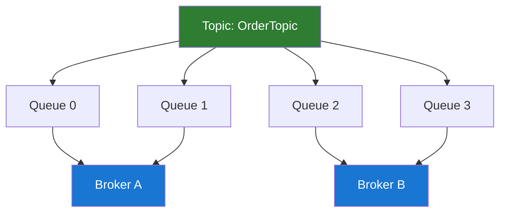
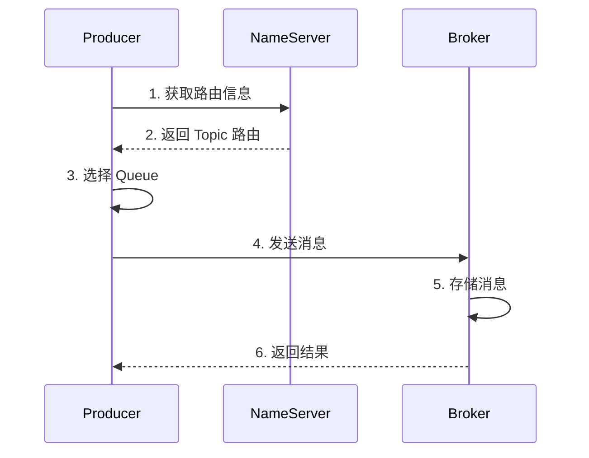

# RocketMQ 核心概念

## Topic（主题）

Topic 是消息的逻辑分类，是消息发布和订阅的最小单位。

### Topic 特性

- 一个 Topic 可以有多个 Producer 发送消息
- 一个 Topic 可以有多个 Consumer Group 订阅
- 一个 Topic 下可以有多个 Message Queue

```java
// 创建 Topic（管理命令）
sh mqadmin updateTopic -n localhost:9876 -b localhost:10911 -t TopicTest

// 删除 Topic
sh mqadmin deleteTopic -n localhost:9876 -c DefaultCluster -t TopicTest
```

### Topic 设计原则

| 原则     | 说明                   |
| -------- | ---------------------- |
| 业务隔离 | 不同业务使用不同 Topic |
| 粒度适中 | 不要太粗也不要太细     |
| 命名规范 | 建议使用下划线分隔     |

## Message Queue（消息队列）

Message Queue 是 Topic 的物理分区，用于实现消息的并行处理。

### Queue 分布



### Queue 数量配置

```java
// 创建 Topic 时指定 Queue 数量
sh mqadmin updateTopic -n localhost:9876 -b localhost:10911 \
    -t TopicTest -r 8 -w 8

// -r: 读队列数量
// -w: 写队列数量
```

**建议：** Queue 数量 = Consumer 实例数量的整数倍

## Producer（生产者）

Producer 负责将消息发送到 Broker。

### Producer Group

生产者组是一类 Producer 的集合，特点：

- 同一组 Producer 发送同类消息
- 事务消息需要使用同一个 Producer Group

```java
DefaultMQProducer producer = new DefaultMQProducer("ProducerGroup_Order");
producer.setNamesrvAddr("localhost:9876");
producer.start();
```

### 发送消息流程



### 消息发送策略

```java
// 自定义 Queue 选择器
producer.send(msg, new MessageQueueSelector() {
    @Override
    public MessageQueue select(List<MessageQueue> mqs, Message msg, Object arg) {
        // 根据业务逻辑选择 Queue
        Integer orderId = (Integer) arg;
        int index = orderId % mqs.size();
        return mqs.get(index);
    }
}, orderId);
```

## Consumer（消费者）

Consumer 负责从 Broker 拉取消息并进行处理。

### Consumer Group

消费者组特点：

- 同一组 Consumer 消费同一类消息
- 支持集群消费和广播消费
- 消费进度以组为单位管理

```java
DefaultMQPushConsumer consumer = new DefaultMQPushConsumer("ConsumerGroup_Order");
consumer.setNamesrvAddr("localhost:9876");
consumer.subscribe("TopicTest", "*");
consumer.start();
```

### 消费模式对比

| 模式     | 集群消费           | 广播消费         |
| -------- | ------------------ | ---------------- |
| 消息分发 | 一条消息只消费一次 | 每个消费者都消费 |
| 消费进度 | Broker 端保存      | 消费者端保存     |
| 使用场景 | 负载均衡           | 全量推送         |

### Push vs Pull

| 特性     | Push 模式 | Pull 模式      |
| -------- | --------- | -------------- |
| 实时性   | 高        | 取决于拉取频率 |
| 控制力   | 低        | 高             |
| 复杂度   | 简单      | 复杂           |
| 适用场景 | 一般业务  | 需要精细控制   |

## Message（消息）

消息是 RocketMQ 的最小传输单元。

### 消息结构

```java
public class Message {
    private String topic;        // 主题
    private int flag;           // 消息标志
    private Map<String, String> properties;  // 扩展属性
    private byte[] body;        // 消息体
    private String transactionId;  // 事务ID
}
```

### 消息属性

| 属性           | 说明     | 示例                |
| -------------- | -------- | ------------------- |
| Topic          | 消息主题 | OrderTopic          |
| Tag            | 消息标签 | create, pay, cancel |
| Keys           | 消息键   | 用于查询            |
| DelayTimeLevel | 延迟级别 | 1-18                |
| Body           | 消息体   | JSON/Protobuf       |

```java
Message msg = new Message();
msg.setTopic("OrderTopic");
msg.setTags("create");
msg.setKeys("ORDER_" + orderId);
msg.setBody(JSON.toJSONBytes(order));
```

## Offset（消费位点）

Offset 记录了消费者消费到的位置。

### Offset 类型

| 类型         | 说明             | 存储位置          |
| ------------ | ---------------- | ----------------- |
| CommitOffset | 已提交的消费位点 | Broker/消费者本地 |
| MaxOffset    | Queue 最大位点   | Broker            |
| MinOffset    | Queue 最小位点   | Broker            |

### Offset 管理

```java
// 从头开始消费
consumer.setConsumeFromWhere(ConsumeFromWhere.CONSUME_FROM_FIRST_OFFSET);

// 从最新位置消费
consumer.setConsumeFromWhere(ConsumeFromWhere.CONSUME_FROM_LAST_OFFSET);

// 从指定时间开始消费
consumer.setConsumeFromWhere(ConsumeFromWhere.CONSUME_FROM_TIMESTAMP);
consumer.setConsumeTimestamp("20240101120000");
```

## Tag（标签）

Tag 是消息的二级分类，用于消息过滤。

### Tag 使用

```java
// 发送带 Tag 的消息
Message msg = new Message("OrderTopic", "TagA", body);

// 订阅单个 Tag
consumer.subscribe("OrderTopic", "TagA");

// 订阅多个 Tag
consumer.subscribe("OrderTopic", "TagA || TagB || TagC");

// 订阅所有 Tag
consumer.subscribe("OrderTopic", "*");
```

### Topic vs Tag 选择

| 场景               | 建议           |
| ------------------ | -------------- |
| 业务完全不同       | 使用不同 Topic |
| 同一业务的不同类型 | 使用不同 Tag   |
| 需要隔离的数据     | 使用不同 Topic |
| 仅需过滤的数据     | 使用不同 Tag   |

## Consumer Group 负载均衡

### 负载均衡策略

| 策略       | 说明               | 类名                                  |
| ---------- | ------------------ | ------------------------------------- |
| 平均分配   | 默认策略           | AllocateMessageQueueAveragely         |
| 轮询分配   | 按消费者轮询       | AllocateMessageQueueAveragelyByCircle |
| 指定机房   | 优先消费本机房消息 | AllocateMessageQueueByMachineRoom     |
| 一致性哈希 | 减少重新分配       | AllocateMessageQueueConsistentHash    |

```java
// 设置负载均衡策略
consumer.setAllocateMessageQueueStrategy(
    new AllocateMessageQueueAveragely()
);
```

### 负载均衡示例

假设有 8 个 Queue，3 个消费者：

```
平均分配：
  Consumer 1: Queue 0, 1, 2
  Consumer 2: Queue 3, 4, 5
  Consumer 3: Queue 6, 7
```

## 重试机制

### 发送重试

```java
// 设置发送重试次数
producer.setRetryTimesWhenSendFailed(3);        // 同步发送
producer.setRetryTimesWhenSendAsyncFailed(3);   // 异步发送

// 发送超时
producer.setSendMsgTimeout(3000);
```

### 消费重试

RocketMQ 会自动重试消费失败的消息：

| 重试次数 | 延迟时间 |
| -------- | -------- |
| 1        | 10s      |
| 2        | 30s      |
| 3        | 1min     |
| 4        | 2min     |
| 5        | 3min     |
| ...      | ...      |
| 16       | 2h       |

```java
// 设置最大重试次数
consumer.setMaxReconsumeTimes(16);

// 消费失败，进入重试队列
return ConsumeConcurrentlyStatus.RECONSUME_LATER;
```

### 死信队列

多次重试失败后，消息进入死信队列 `%DLQ%ConsumerGroup`

```java
// 订阅死信队列
consumer.subscribe("%DLQ%ConsumerGroup", "*");
```

## 下一步

- 🚀 [快速开始](./quick-start.md) - 搭建开发环境
- 💻 [生产者详解](./producer.md) - 深入学习消息发送
- 📊 [消费者详解](./consumer.md) - 深入学习消息消费
- 🔄 [消息类型](./message-types.md) - 各种消息类型详解

---

**💡 提示：** 理解这些核心概念是使用 RocketMQ 的基础，建议结合实践加深理解。
