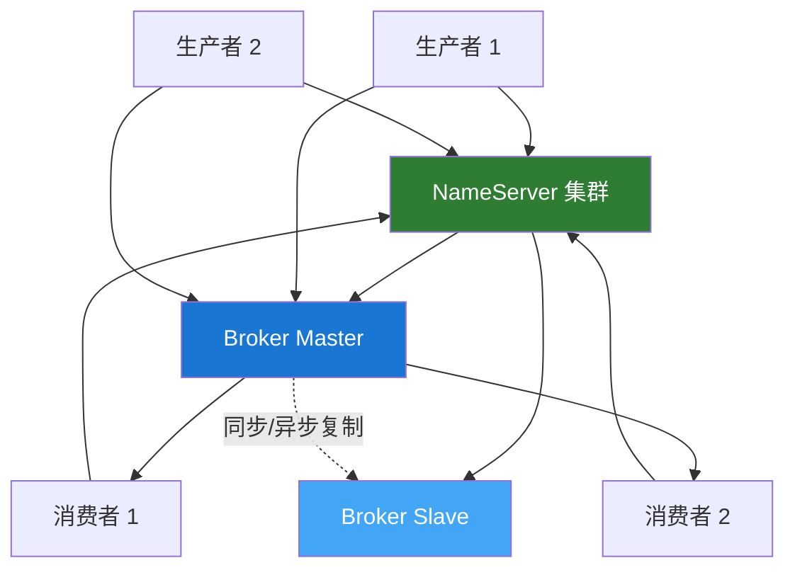

# Apache RocketMQ 概述

## 什么是 RocketMQ？

Apache RocketMQ 是一个分布式消息中间件，最初由阿里巴巴开发并捐赠给 Apache 基金会。它具有低延迟、高吞吐量、高可用性和高可靠性的特点，广泛应用于电商、金融、物流等领域。

## 核心特性

### 🚀 **高性能**

- 单机支持亿级消息堆积
- 毫秒级消息投递延迟
- 支持万级 Topic

### 💪 **高可用性**

- 支持主从同步复制
- 支持 Dledger 高可用模式
- 故障自动切换

### 🔒 **可靠性保证**

- 同步/异步刷盘
- 同步/异步复制
- 支持事务消息

### 🎯 **丰富的消息类型**

- 普通消息
- 顺序消息
- 延迟消息
- 事务消息
- 批量消息

## 核心概念

### Producer（生产者）

消息发布者，负责生产消息并发送到 Broker。

```java
// 同步发送示例
DefaultMQProducer producer = new DefaultMQProducer("ProducerGroup");
producer.setNamesrvAddr("localhost:9876");
producer.start();

Message msg = new Message("TopicTest", "TagA", "Hello RocketMQ".getBytes());
SendResult result = producer.send(msg);
System.out.println("发送结果: " + result);
```

### Consumer（消费者）

消息订阅者，负责从 Broker 拉取消息并进行消费处理。

```java
// Push 消费者示例
DefaultMQPushConsumer consumer = new DefaultMQPushConsumer("ConsumerGroup");
consumer.setNamesrvAddr("localhost:9876");
consumer.subscribe("TopicTest", "*");

consumer.registerMessageListener((MessageListenerConcurrently) (msgs, context) -> {
    for (MessageExt msg : msgs) {
        System.out.println("收到消息: " + new String(msg.getBody()));
    }
    return ConsumeConcurrentlyStatus.CONSUME_SUCCESS;
});

consumer.start();
```

### Broker（消息服务器）

- 负责消息的存储和转发
- 支持主从架构
- 提供消息查询功能

### NameServer（名称服务）

- 无状态的路由信息服务
- 提供 Broker 注册与发现
- 轻量级，可集群部署

### Topic（主题）

- 消息的逻辑分类
- 一个 Topic 可以有多个 Queue
- 支持多个生产者和消费者

### Message Queue（消息队列）

- Topic 的物理分区
- 保证队列内消息有序
- 支持并行消费

## 架构图



## 消息类型

### 1. 普通消息

最基本的消息类型，无特殊处理逻辑。

### 2. 顺序消息

保证消息按照发送顺序被消费。

```java
// 发送顺序消息
SendResult result = producer.send(msg, (mqs, message, arg) -> {
    int index = Math.abs(arg.hashCode()) % mqs.size();
    return mqs.get(index);
}, orderId);
```

### 3. 延迟消息

消息发送后不立即投递，而是延迟一定时间后才投递。

```java
// 延迟级别：1s 5s 10s 30s 1m 2m 3m 4m 5m 6m 7m 8m 9m 10m 20m 30m 1h 2h
msg.setDelayTimeLevel(3); // 延迟 10 秒
```

### 4. 事务消息

支持分布式事务，保证本地事务与消息发送的一致性。

```java
TransactionMQProducer producer = new TransactionMQProducer("TransactionGroup");
producer.setTransactionListener(new TransactionListener() {
    @Override
    public LocalTransactionState executeLocalTransaction(Message msg, Object arg) {
        // 执行本地事务
        return LocalTransactionState.COMMIT_MESSAGE;
    }

    @Override
    public LocalTransactionState checkLocalTransaction(MessageExt msg) {
        // 事务回查
        return LocalTransactionState.COMMIT_MESSAGE;
    }
});
```

### 5. 批量消息

支持批量发送消息，提高发送效率。

```java
List<Message> messages = new ArrayList<>();
messages.add(new Message("TopicTest", "TagA", "Message 1".getBytes()));
messages.add(new Message("TopicTest", "TagA", "Message 2".getBytes()));
SendResult result = producer.send(messages);
```

## RocketMQ vs Kafka

| 特性           | RocketMQ       | Kafka            |
| -------------- | -------------- | ---------------- |
| **开发语言**   | Java           | Scala/Java       |
| **消息顺序**   | 支持严格顺序   | 分区内有序       |
| **事务消息**   | 原生支持       | 0.11+ 支持       |
| **延迟消息**   | 原生支持       | 需自己实现       |
| **消息回溯**   | 支持时间回溯   | 支持 Offset 回溯 |
| **消息过滤**   | Tag/SQL92 过滤 | 不支持           |
| **消息查询**   | 支持           | 不支持           |
| **管理控制台** | 内置           | 需第三方工具     |

## 适用场景

✅ **适合使用 RocketMQ 的场景：**

- 电商交易系统
- 金融支付系统
- 物流订单系统
- 需要事务消息的场景
- 需要延迟消息的场景
- 需要消息轨迹追踪的场景

❌ **不太适合的场景：**

- 大数据日志采集（推荐 Kafka）
- 极端高吞吐场景（推荐 Kafka）

## Spring Boot 集成

```xml
<!-- Maven 依赖 -->
<dependency>
    <groupId>org.apache.rocketmq</groupId>
    <artifactId>rocketmq-spring-boot-starter</artifactId>
    <version>2.2.3</version>
</dependency>
```

```java
// 生产者
@Service
public class MessageProducer {
    @Autowired
    private RocketMQTemplate rocketMQTemplate;

    public void send(String message) {
        rocketMQTemplate.convertAndSend("TopicTest", message);
    }
}

// 消费者
@Service
@RocketMQMessageListener(topic = "TopicTest", consumerGroup = "ConsumerGroup")
public class MessageConsumer implements RocketMQListener<String> {
    @Override
    public void onMessage(String message) {
        System.out.println("收到消息: " + message);
    }
}
```

## 下一步

- 📖 [RocketMQ 简介](./introduction.md) - 深入了解 RocketMQ 的基本概念
- 🚀 [快速开始](./quick-start.md) - 快速搭建 RocketMQ 环境
- 🎯 [核心概念](./core-concepts.md) - 理解 RocketMQ 的核心组件
- 💻 [生产者详解](./producer.md) - 学习如何发送消息
- 📊 [消费者详解](./consumer.md) - 学习如何消费消息
- 🔄 [消息类型](./message-types.md) - 各种消息类型详解

## 参考资源

- [Apache RocketMQ 官方文档](https://rocketmq.apache.org/docs/)
- [RocketMQ GitHub](https://github.com/apache/rocketmq)
- [RocketMQ Spring 项目](https://github.com/apache/rocketmq-spring)

---

**💡 提示：** 建议从 [快速开始](./quick-start.md) 章节开始，通过实际操作来学习 RocketMQ。
