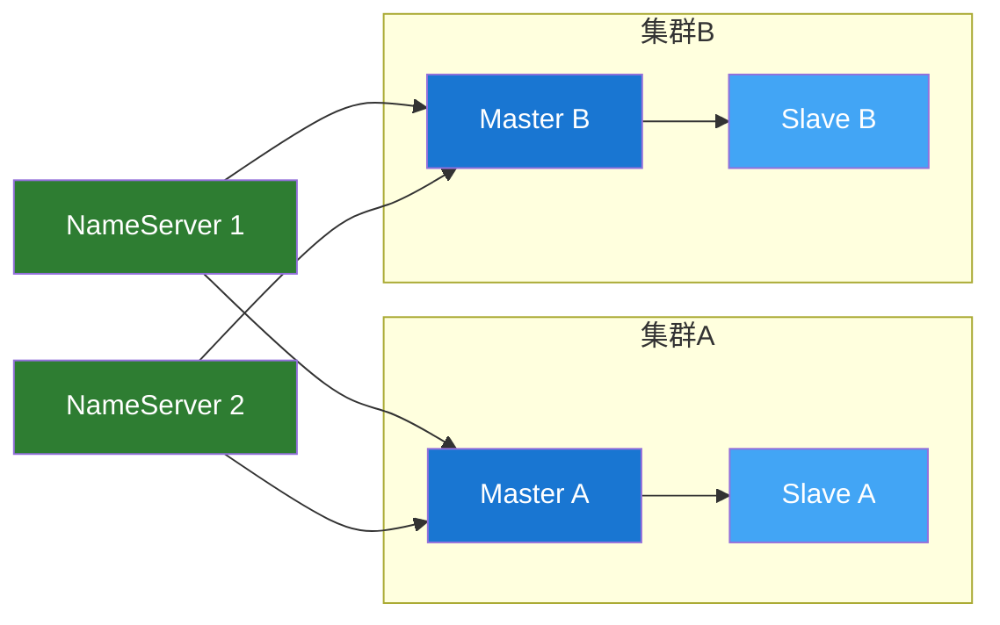

# RocketMQ 简介

## 发展历史

RocketMQ 诞生于阿里巴巴，经历了多年双十一的考验。

### 发展历程

- **2012 年** - 阿里巴巴内部开源项目 MetaQ 启动
- **2016 年** - 更名为 RocketMQ 并捐赠给 Apache 基金会
- **2017 年** - 成为 Apache 顶级项目
- **2022 年** - RocketMQ 5.0 发布，支持云原生

## 核心设计理念

### 1. 高可用架构

RocketMQ 采用主从同步复制的架构，确保消息不丢失。



### 2. 消息存储模型

RocketMQ 使用 **CommitLog + ConsumeQueue** 的存储模型：

- **CommitLog**：所有消息的物理存储文件，顺序写入
- **ConsumeQueue**：消息的逻辑队列，存储消息在 CommitLog 中的位置

```
CommitLog
├── 00000000000000000000  (1GB)
├── 00000000001073741824  (1GB)
└── ...

ConsumeQueue
├── TopicA
│   ├── 0  (队列0)
│   ├── 1  (队列1)
│   └── ...
└── TopicB
    └── ...
```

### 3. 消息刷盘机制

| 刷盘方式     | 特点                      | 适用场景             |
| ------------ | ------------------------- | -------------------- |
| **同步刷盘** | 消息写入磁盘后返回 ACK    | 对可靠性要求高的场景 |
| **异步刷盘** | 消息写入 PageCache 即返回 | 对性能要求高的场景   |

```java
// Broker 配置
flushDiskType = SYNC_FLUSH  // 同步刷盘
flushDiskType = ASYNC_FLUSH // 异步刷盘
```

### 4. 消息复制机制

| 复制方式     | 特点                 | 适用场景         |
| ------------ | -------------------- | ---------------- |
| **同步复制** | 主从都写入成功才返回 | 对可靠性要求极高 |
| **异步复制** | 主写入成功即返回     | 兼顾性能与可靠性 |

## 核心组件详解

### NameServer

NameServer 是一个轻量级的注册中心，主要功能：

- **Broker 管理**：接收 Broker 注册，维护 Broker 列表
- **路由管理**：提供 Topic 路由信息查询
- **心跳检测**：检测 Broker 存活状态

```java
// NameServer 启动
NamesrvStartup.main(args);

// 配置多个 NameServer（建议至少2个）
namesrvAddr = "192.168.1.1:9876;192.168.1.2:9876"
```

**特点：**

- 无状态，可水平扩展
- 节点之间不通信
- 简单高效

### Broker

Broker 是消息存储和转发的核心组件：

- **消息存储**：将消息持久化到磁盘
- **消息投递**：将消息推送给消费者
- **消息查询**：支持按 MessageId 或 Key 查询

```
Broker 架构
├── Remoting Module       // 网络通信层
├── Client Manager        // 生产者/消费者管理
├── Store Service         // 消息存储服务
│   ├── CommitLog        // 物理存储
│   ├── ConsumeQueue     // 逻辑队列
│   └── IndexFile        // 消息索引
├── HA Service           // 主从同步
└── Index Service        // 消息索引服务
```

### Producer

RocketMQ 支持多种发送模式：

| 发送模式 | 说明             | 返回值     |
| -------- | ---------------- | ---------- |
| 同步发送 | 等待服务器响应   | SendResult |
| 异步发送 | 回调方式接收响应 | void       |
| 单向发送 | 不等待响应       | void       |

```java
// 同步发送
SendResult result = producer.send(msg);

// 异步发送
producer.send(msg, new SendCallback() {
    @Override
    public void onSuccess(SendResult result) {
        System.out.println("发送成功");
    }

    @Override
    public void onException(Throwable e) {
        System.out.println("发送失败");
    }
});

// 单向发送
producer.sendOneway(msg);
```

### Consumer

RocketMQ 支持两种消费模式：

| 消费模式  | 说明            | 特点               |
| --------- | --------------- | ------------------ |
| Push 模式 | Broker 主动推送 | 实时性好，使用简单 |
| Pull 模式 | 消费者主动拉取  | 可控性强，灵活     |

**消费模式：**

- **集群消费**：一条消息只被消费组中的一个消费者消费
- **广播消费**：一条消息被消费组中的所有消费者消费

```java
// 集群消费（默认）
consumer.setMessageModel(MessageModel.CLUSTERING);

// 广播消费
consumer.setMessageModel(MessageModel.BROADCASTING);
```

## 消息可靠性保障

### 发送端可靠性

1. **重试机制**：发送失败自动重试
2. **故障转移**：自动切换到其他 Broker

```java
// 重试次数配置
producer.setRetryTimesWhenSendFailed(3);
producer.setRetryTimesWhenSendAsyncFailed(3);
```

### 存储端可靠性

1. **刷盘机制**：同步刷盘保证消息不丢
2. **主从复制**：同步复制保证消息不丢
3. **多份存储**：Slave 备份

### 消费端可靠性

1. **ACK 机制**：消费成功才更新 offset
2. **重试机制**：消费失败自动重试
3. **死信队列**：多次失败进入死信队列

```java
// 消费失败重试
return ConsumeConcurrentlyStatus.RECONSUME_LATER;

// 消费成功
return ConsumeConcurrentlyStatus.CONSUME_SUCCESS;
```

## 消息过滤

### Tag 过滤

```java
// 生产者设置 Tag
Message msg = new Message("TopicTest", "TagA", body);

// 消费者订阅 Tag
consumer.subscribe("TopicTest", "TagA || TagB");
```

### SQL92 过滤

```java
// 生产者设置属性
msg.putUserProperty("age", "18");
msg.putUserProperty("name", "张三");

// 消费者使用 SQL 过滤
consumer.subscribe("TopicTest",
    MessageSelector.bySql("age > 16 AND name = '张三'"));
```

## 下一步

- 🚀 [快速开始](./quick-start.md) - 搭建 RocketMQ 环境
- 🎯 [核心概念](./core-concepts.md) - 深入理解核心组件
- 💻 [生产者详解](./producer.md) - 掌握消息发送
- 📊 [消费者详解](./consumer.md) - 掌握消息消费

---

**💡 提示：** 理解 RocketMQ 的存储模型对于性能调优非常重要。
